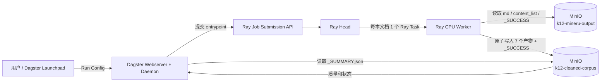
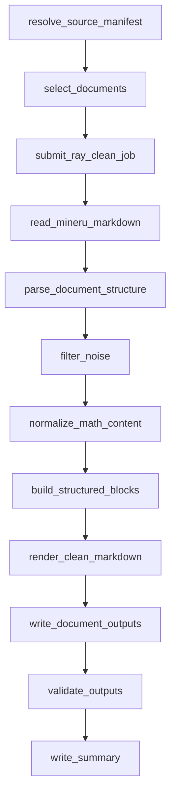
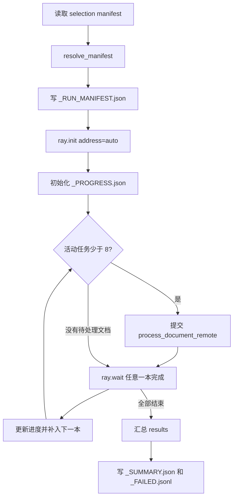
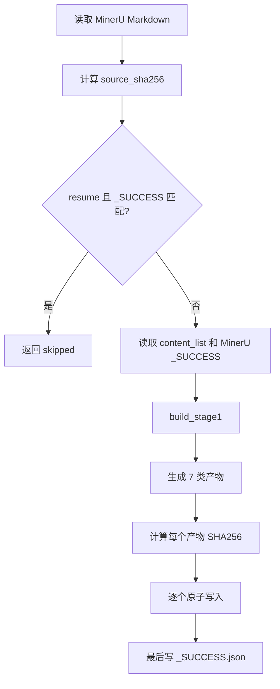
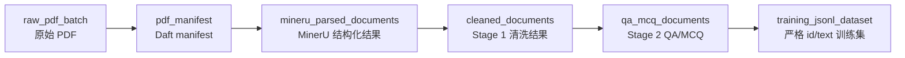
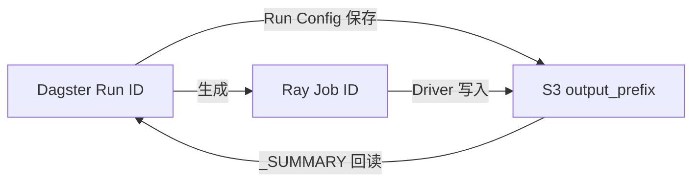

# K12 数据生产管线演示与代码讲解

> 本文以 `cleanjopbstage1_10` 的一次真实成功运行为主线，解释一个任务如何进入 K12 数据生产管线，Dagster Job、Global Asset Lineage、Ray、CPU Worker、MinIO、数据合同和恢复机制分别做什么，以及现场演示时应该如何讲解。

## 1. 文档定位

本文适合以下场景：

- 向项目成员演示现有 K12 数据生产系统；
- 解释 Dagster、Ray、MinIO 和数据处理代码之间的职责边界；
- 说明一个新的批次或文档如何成为管线任务；
- 区分 Dagster Job Graph 与 Global Asset Lineage；
- 根据 Run ID、Ray Job ID、S3 输出和 `_SUCCESS.json` 排查问题；
- 为 Stage 2 QA/MCQ 或完整 PDF -> MinerU -> Cleaning -> QA 链路提供统一理解基础。

本文的主示例是 2026-09-14 实际执行的纯 CPU Stage 1 smoke：

| 项目 | 实际值 |
|---|---|
| Dagster Job | `cleanjopbstage1_10` |
| Dagster Run ID | `34ab2361-4a73-4d97-9d28-fe5af5415288` |
| 最终状态 | `SUCCESS` |
| 输入 | `s3://k12-mineru-output/full-output/mineru34-hybrid-a3-full-20260722T104600Z` |
| 输出 | `s3://k12-cleaned-corpus/stage1/platform-smoke/cpu-reusable-run-20260914T071348Z` |
| 文档数 | 10 |
| Ray 文档并发 | 8 |
| NPU | 不申请、不使用 |
| Ray 实际处理时间 | 4.115 秒 |
| Dagster Run 墙钟 | 约 45.2 秒 |
| 成功/失败 | 10/0 |

## 2. 先用一句话解释这条管线

`cleanjopbstage1_10` 并不重新解析 PDF。它先验证一批已经由 MinerU 成功解析的文档，从固定 manifest 选择 10 本教材，通过 Dagster 向 Ray 提交一个 Stage 1 清洗任务；Ray 在 CPU Worker 上并行读取每本教材的 MinerU Markdown 和结构化 JSON，执行确定性清洗，将 `blocks.jsonl`、`clean.md`、习题、图片清单、隔离数据和质量报告原子写回 MinIO，最后由 Dagster读取 `_SUMMARY.json` 决定整个 Run 成功或失败。

## 3. 系统全景



这张图里有两个平面：

1. 控制平面：用户、Dagster、Ray Job Submission API、Ray Head。
2. 数据平面：Ray CPU Worker 直接读写 MinIO。

一个很重要的设计是：Dagster 和 Ray Head 不搬运整本教材正文。Dagster 传递配置，Ray Head 调度任务，真正的数据读取、清洗和写回发生在 CPU Worker。这样可以避免大文件经过编排服务中转。

## 4. 各组件到底负责什么

### 4.1 Dagster

Dagster 是编排与审计入口，负责：

- 在 UI 中注册 Job、Asset、Asset Check 和 Sensor；
- 从 Launchpad 接收运行参数；
- 在执行前验证输入前缀和 MinerU 批次状态；
- 生成 Ray entrypoint 和唯一 Ray Job ID；
- 通过 Ray Dashboard 的 Job Submission API 提交任务；
- 等待 Ray Job 进入终态；
- 读取 MinIO 中的 `_SUMMARY.json`；
- 将输入数量、输出位置、保留块数、隔离块数等写入 Dagster metadata；
- 把执行历史保存为 Dagster Run。

Dagster 不是本任务的数据计算引擎。它不逐行清洗 Markdown，也不直接启动 10 个本地 Python 进程。

### 4.2 Ray Head

Ray Head 负责：

- 接受 Dagster 提交的 Python entrypoint；
- 建立本次 Ray Job 的运行时环境；
- 运行 Stage 1 Driver；
- 维护 Ray Task 队列和资源调度；
- 把每本文档任务分发到具备 CPU 的 Worker；
- 汇总任务引用和结果。

Ray Head 在这条 Stage 1 链路中不应执行普通清洗 Task。实际计算资源由 CPU Worker 提供。

### 4.3 Ray CPU Worker

CPU Worker 是 Stage 1 的实际执行节点。当前一本文档对应一次：

```python
@ray.remote(num_cpus=1, max_retries=1)
def process_document_remote(...):
    return process_document(...)
```

因此：

- 每个活动文档占用一个 Ray CPU；
- `max_document_inflight=8` 最多同时挂起 8 本；
- 当前集群提供 8 个可用 Ray CPU，所以本轮最多 8 本并行；
- 某一本失败不会阻止其他已经提交的文档完成；
- `max_retries=1` 提供一次 Ray Task 级重试。

### 4.4 MinIO / S3 数据湖

MinIO 是阶段之间的数据合同和恢复边界：

- `k12-mineru-output` 保存 MinerU 解析结果；
- `k12-cleaned-corpus` 保存 Stage 1 和 Stage 2 结果；
- manifest 决定哪些文档进入任务；
- `_PROGRESS.json` 保存批次进度；
- 单文档 `_SUCCESS.json` 是完成和恢复依据；
- `_SUMMARY.json` 是 Dagster 判断批次结果的依据。

### 4.5 Daft

Daft 主要用于上游 PDF 数据湖扫描和 manifest 构建：

```text
原始 PDF 对象
  -> Daft 扫描 bucket/key/etag/size
  -> 稳定 manifest
  -> Ray 只接收小型任务描述
```

在本次 `cleanjopbstage1_10` 中，输入已经是 MinerU 成功产物，且测试文档由固定 JSON manifest 指定，所以 Stage 1 Driver 使用 `resolve_manifest()` 解析现有对象，不需要重新使用 Daft 扫描全部原始 PDF。也就是说，Daft 是全局链路的重要上游组件，但不是这次 Stage 1 smoke 的运行时计算步骤。

### 4.6 KubeRay / Kubernetes

KubeRay 负责把 Ray 集群变成 Kubernetes 资源：

- Ray Head Pod 常驻；
- CPU Worker Group 提供 Stage 1 计算资源；
- MinerU 和 Qwen NPU Worker 可以初始为 0，按 Job 生命周期扩容；
- Service 暴露 Ray Dashboard/Job Submission API；
- Secret 给 Dagster 和 Worker 注入 S3 凭据；
- RBAC 约束生命周期 Job 可读取或扩缩哪些资源。

本次任务只使用现有 Ray Head 与 CPU Worker，不会拉起 MinerU 或 Qwen NPU Worker。

## 5. 一个任务是怎样进入管线的

“进入管线”不是把一份 PDF 上传到 Dagster，而是满足以下五层合同。

### 5.1 第一层：数据对象存在

对于本示例，文档必须已经存在于 MinerU 成功输出前缀，并至少包含：

```text
<source_prefix>/<document_id>/
├── *.md
├── *_content_list.json
├── *_middle.json
└── _SUCCESS.json
```

可选产物包括：

```text
*_content_list_v2.json
*_model.json
images.tar.zst
```

Stage 1 不接受只有 Markdown、没有 MinerU `_SUCCESS.json` 的不完整文档。

### 5.2 第二层：上游批次通过完整性检查

`resolve_source_manifest` 首先读取：

```text
s3://k12-mineru-output/<source_prefix>/_SUMMARY.json
```

代码要求：

```python
if summary.get("status") != "success" or summary.get("failed_count") != 0:
    raise RuntimeError("MinerU source is not complete")
```

这是一道 fail-closed 门：上游批次不完整时，下游不会悄悄处理一个残缺集合。

### 5.3 第三层：文档进入 selection manifest

10 本演示不是临时取列表中的前 10 本，而是使用固定 manifest：

```text
s3://k12-cleaned-corpus/cpu-smoke/manifests/stage1_test_10.json
```

其核心结构是：

```json
{
  "documents": [
    {
      "document_id": "pdf-0007de8572f8fa6b2f70",
      "category": "..."
    }
  ]
}
```

固定 manifest 有三个价值：

- 每次演示处理同一批教材，结果可比较；
- 不受 S3 对象新增和排序变化影响；
- 可以有意识地覆盖公式、图片、表格、OCR 异常等不同教材类型。

### 5.4 第四层：Launchpad 参数形成一次 Run

本次等价配置为：

```yaml
ops:
  resolve_source_manifest:
    config:
      source_bucket: k12-mineru-output
      source_prefix: full-output/mineru34-hybrid-a3-full-20260722T104600Z
      output_bucket: k12-cleaned-corpus
      output_prefix: stage1/platform-smoke/cpu-reusable-run-20260914T071348Z
      selection_manifest_key: cpu-smoke/manifests/stage1_test_10.json
      count: 10
      resume: true
      cpu_workers: 8
      max_document_inflight: 8
      stage1_version: stage1-v1.0.2
      automated_validation: false
      dry_run: false
```

点击 Launch 后，Dagster 创建全局唯一 Run ID。Run ID 负责回答“谁在什么时候以什么配置运行了这个 Job”。

注意：当前代码里 `cpu_workers` 是展示/配置字段，Stage 1 Driver 的实际活动任务上限由 `max_document_inflight` 和 Ray 集群可用 CPU 共同决定。演示时不要把 `cpu_workers=8` 解释成 Driver 会主动创建一个独立的 8 线程池。

### 5.5 第五层：Dagster 把配置编译成 Ray entrypoint

`stage1_entrypoint()` 将状态转换为命令：

```bash
python3 -m k12_clean_qa_pipeline.stage1_clean.driver \
  --source-bucket k12-mineru-output \
  --source-prefix full-output/mineru34-hybrid-a3-full-20260722T104600Z \
  --output-bucket k12-cleaned-corpus \
  --output-prefix stage1/platform-smoke/cpu-reusable-run-20260914T071348Z \
  --selection-manifest-key cpu-smoke/manifests/stage1_test_10.json \
  --limit 10 \
  --max-document-inflight 8 \
  --resume
```

`submit_ray_clean_job` 再生成：

```text
stage1-clean-run-<Dagster Run ID 前 8 位>
```

作为 Ray Job ID，并通过 `RayJobResource.submit()` 发送到 Ray Dashboard：

```python
JobSubmissionClient(dashboard_address).submit_job(
    submission_id=job_id,
    entrypoint=entrypoint,
    runtime_env={
        "working_dir": working_dir,
        "env_vars": env_vars,
    },
)
```

到这里，一个 Dagster 控制任务正式变成了 Ray 计算任务。

## 6. Dagster Job Graph 如何执行

UI 中可以看到：



这些节点的真实含义分为三类。

### 6.1 真正执行控制逻辑的节点

`resolve_source_manifest`：

- 校验 Stage 1 版本；
- 防止输出覆盖输入；
- 读取上游 MinerU `_SUMMARY.json`；
- 检查固定 selection manifest；
- 把 Dagster Run ID 和配置信息封装成 `state`。

`select_documents`：

- 确认 10 本任务必须使用固定 manifest；
- 把文档数和 manifest key 写入 Dagster metadata。

`submit_ray_clean_job`：

- 构造 Ray entrypoint；
- 生成 Ray Job ID；
- 向 Ray 提交真正的清洗任务。

`validate_outputs`：

- 等待 Ray Job 的 `SUCCEEDED/FAILED/STOPPED` 终态；
- Ray 失败时把最后一段 Ray 日志带回 Dagster；
- Ray 成功时读取 `_SUMMARY.json`；
- 校验批次状态和可选自动质量门；
- 输出保留块、隔离块、公式修复数等 metadata。

`write_summary`：

- 把 Dagster Run ID、Ray Job ID 和 S3 输出 URI 汇总到最后一个节点。

### 6.2 当前作为可视化探针的节点

以下节点由 `stage_probe()` 生成：

```text
read_mineru_markdown
parse_document_structure
filter_noise
normalize_math_content
build_structured_blocks
render_clean_markdown
write_document_outputs
```

它们当前只传递同一个 `state` 并登记 metadata，用于让 Dagster UI 展示业务阶段。真正的 Markdown 读取、解析、过滤、规范化、渲染和写入都发生在已经提交的 Ray Job 内部。

这是演示时必须准确说明的一点：

```text
Dagster 中看到阶段节点
不等于
每个阶段由 Dagster 独立调用一次 Ray Task
```

当前设计的优点是计算路径简单、吞吐稳定；限制是 Dagster 中间节点的耗时不是该业务阶段的真实耗时。若以后需要精确的阶段级状态，应由 Ray Driver 持续写阶段事件，或将每本文档/阶段建模为 Dagster dynamic mapping，而不能仅依靠探针节点的绿色状态。

### 6.3 黄色、绿色和红色代表什么

- 黄色：该 Dagster op 正在执行；
- 绿色：该 op 自身成功；
- 红色：该 op 抛出异常；
- 灰色/skipped：上游失败或条件未满足，节点未执行。

对本 Job 来说，最有业务含义的是 `validate_outputs`：只有 Ray Job 成功、且 `_SUMMARY.json` 满足质量条件，它才会变绿。

## 7. Ray Driver 内部发生了什么



### 7.1 Manifest 解析

`resolve_manifest()` 对每个 `document_id` 查找唯一产物：

```text
markdown_key
content_list_key
middle_key
mineru_success_key
```

并补充：

```text
source_bucket
source_prefix
source_size
source_etag
page_count
image_count
```

最终形成可稳定哈希的 `_RUN_MANIFEST.json`。这份文件回答“这次到底计划处理哪些输入”。

### 7.2 有界文档并发

`run_pass()` 不会一次把全量文档全部压入 Ray：

1. 首先提交 `min(max_inflight, document_count)` 个任务；
2. 使用 `ray.wait(..., num_returns=1)` 等待任意一本完成；
3. 释放一个活动位置；
4. 立即补入下一本文档；
5. 直到 pending 和 active 都为空。

这是一个简单的有界队列，可以避免全量任务一次产生几千个 ObjectRef 和 S3 连接。

### 7.3 单文档清洗

每本文档执行：



`build_stage1()` 的核心职责包括：

- 按标题和空行恢复文档块；
- 维护 `chapter_path`；
- 分类 `concept`、`definition`、`formula`、`exercise`、`table` 等块；
- 删除版权页、责任编辑、定价、目录、自评等噪声；
- 解析 MinerU `<details>` 图片描述；
- 将图片分类为 decorative、contextual、instructional、question_required 或 quarantine；
- 将可信 text_image 转成正文；
- 将 HTML 表格转换成 Markdown 表格；
- 只在数学环境内修复数字和小数空格；
- 对不确定内容写入 quarantine；
- 用稳定输入生成稳定 `block_id`；
- 先生成规范主数据 `blocks.jsonl`，再由它投影 `clean.md`。

## 8. 输入、主数据和输出合同

### 8.1 为什么 `blocks.jsonl` 是主数据

Stage 1 的规范结果不是 `clean.md`，而是 `blocks.jsonl`。每个 block 保存：

```json
{
  "document_id": "pdf-...",
  "block_id": "block-...",
  "source_order": 0,
  "chapter_path": ["第一章", "第一节"],
  "block_type": "concept",
  "source_text": "...",
  "clean_text": "...",
  "formulas": [],
  "tables": [],
  "images": [],
  "quality_flags": [],
  "source_sha256": "...",
  "clean_sha256": "..."
}
```

这样 Stage 2 可以按块生成 QA/MCQ，并用 `block_id` 回溯证据。`clean.md` 只是供人阅读或文本训练使用的渲染投影，不应被 Stage 2 重新切块。

### 8.2 每本文档的输出

```text
<output_prefix>/<document_id>/
├── clean.md
├── book_metadata.json
├── blocks.jsonl
├── exercises.jsonl
├── image_manifest.jsonl
├── quarantine.jsonl
├── cleaning_report.json
└── _SUCCESS.json
```

### 8.3 批次级输出

```text
<output_prefix>/
├── _RUN_MANIFEST.json
├── _PROGRESS.json
├── _SUMMARY.json
└── _FAILED.jsonl
```

含义如下：

| 文件 | 用途 |
|---|---|
| `_RUN_MANIFEST.json` | 本次输入集合、版本、参数和 manifest 哈希 |
| `_PROGRESS.json` | 总数、完成、失败、待处理和活动文档 |
| `_SUMMARY.json` | 最终状态、聚合指标和逐文档结果 |
| `_FAILED.jsonl` | 失败文档及错误，用于重试和审计 |
| 单文档 `_SUCCESS.json` | 文档级事务提交标志和恢复依据 |

## 9. 原子发布和断点续跑

### 9.1 为什么 `_SUCCESS.json` 必须最后写

系统把单本文档视为一个小型事务：

1. 生成全部正文和结构化产物；
2. 对每个产物计算 SHA256；
3. 先写临时对象；
4. 复制为正式 key；
5. 所有产物成功后，最后写 `_SUCCESS.json`。

因此，下游看到 `_SUCCESS.json` 时，可以认为该文档的必要产物已经完整发布。进程中途退出时，最多留下没有成功标记的不完整对象，下次 `resume` 会重做，而不会把它误判成成功。

### 9.2 Resume 不是只看文件是否存在

`success_matches()` 要求同时满足：

```text
_SUCCESS.json 存在
Stage 1 版本一致
source_sha256 一致
7 个必要产物全部存在
```

任何一项不满足都会重跑该文档。这防止源内容变化、版本升级或不完整上传被错误跳过。

## 10. Global Asset Lineage 是什么

Dagster 的 Global Asset Lineage 表示数据产品之间的长期依赖，不表示某一次 Job 的逐步执行时间线。

当前资产链为：



对应依赖声明：

```python
raw_pdf_batch = AssetSpec("raw_pdf_batch", ...)
pdf_manifest = AssetSpec("pdf_manifest", deps=["raw_pdf_batch"], ...)
mineru_parsed_documents = AssetSpec(
    "mineru_parsed_documents",
    deps=["pdf_manifest"],
    ...,
)
cleaned_documents = AssetSpec(
    "cleaned_documents",
    deps=["mineru_parsed_documents"],
    ...,
)
qa_mcq_documents = AssetSpec(
    "qa_mcq_documents",
    deps=["cleaned_documents"],
    ...,
)
training_jsonl_dataset = AssetSpec(
    "training_jsonl_dataset",
    deps=["qa_mcq_documents"],
    ...,
)
```

### 10.1 Asset 和 Job 的区别

| 概念 | 回答的问题 | 本示例 |
|---|---|---|
| Asset | 数据产品是什么、依赖谁 | `cleaned_documents` 依赖 `mineru_parsed_documents` |
| Partition | 这份数据产品属于哪个批次 | `batch_id` |
| Materialization | 某批资产何时被确认生成 | 清洗批次通过后登记 metadata |
| Asset Check | 资产是否满足质量合同 | summary 成功、数量匹配、产物完整 |
| Job | 计算如何被启动和编排 | `cleanjopbstage1_10` |
| Run | 某次 Job 的具体执行实例 | `34ab2361-...` |

### 10.2 为什么使用动态 `batch_id` 分区

`DynamicPartitionsDefinition(name="batch_id")` 允许新批次运行后再注册，而不需要提前把所有批次写死在代码里。

例如：

```text
k12_pdf_sample_20260713T045259Z
k12_pdf_full_20260713T062427Z
demo-10-20260914
```

都可以成为同一资产的不同 partition。这样 UI 中既能看到全局资产关系，也能定位某一个批次的物化和检查记录。

### 10.3 Asset materialization 怎样产生

现有 `register_asset_metadata` 会：

1. 将 `batch_id` 加入动态分区；
2. 为 `raw_pdf_batch` 记录输入前缀、PDF 数量和字节数；
3. 为 `pdf_manifest` 记录 manifest URI 和行数；
4. 为 `mineru_parsed_documents` 记录成功数、页数、吞吐、Ray Job ID 和输出 URI；
5. 将注册信息写入 MinIO `_control/dagster/registrations/`。

需要特别说明：`cleanjopbstage1_10` 当前是普通 op-based Job。它完成 Stage 1 计算并在 Job metadata 中记录结果，但这次 Run 本身没有显式调用 `AssetMaterialization(asset_key="cleaned_documents")`。因此：

- Job Run 成功是真实的计算成功证据；
- S3 `_SUMMARY.json` 和 `_SUCCESS.json` 是真实的数据完成证据；
- Global Asset Lineage 中的边是静态 `AssetSpec` 依赖；
- 若要让本次 Stage 1 Run 在 Asset 页显示为某个 `cleaned_documents/<batch_id>` 的最新物化事件，还需要执行对应的资产注册逻辑或在 Stage 1 成功节点中显式记录 materialization。

演示时应把“资产定义”和“本次运行已物化该资产”区分开，避免把静态 lineage 图误当成自动更新的执行证据。

### 10.4 Asset Check 怎样工作

`cleaned_documents` 的检查包括：

```text
summary_status_success
document_count_matches
failed_document_count_zero
all_success_markers_exist
all_required_outputs_exist
```

这些检查读取 MinIO 中的控制注册文件，不重新运行清洗。它们回答的是“已经发布的数据是否符合合同”，而不是“Python 函数是否没有抛异常”。

## 11. 本次实际运行如何解读

本次成功结果：

```text
status: success
total_documents: 10
success_documents: 10
skipped_documents: 0
failed_documents: 0
elapsed_seconds: 4.115
```

聚合清洗指标：

```text
kept_blocks: 23,228
removed_blocks: 259
quarantine_blocks: 1,352
formula_repairs: 2,595
exercises: 9,232
images: 9,497
```

输出前缀下共有 84 个对象：

```text
10 本 x 8 个文档级对象 = 80
批次控制对象             = 4
总计                     = 84
```

其中一本文档 `pdf-0007de8572f8fa6b2f70` 的结果：

```text
源块数: 1,929
保留块: 1,315
删除块: 25
隔离块: 45
习题: 1,672
图片记录: 679
公式修复: 208
clean.md 字符数: 41,058
```

### 11.1 为什么 Ray 只用了 4.115 秒，而 Dagster Run 约 45.2 秒

Ray 时间主要统计文档读取、清洗和写回。Dagster 总墙钟还包括：

- 多进程 executor 为每个 op 启动子进程；
- 资源初始化；
- op 间 state 的 IO Manager 持久化和读取；
- Ray runtime env 准备；
- Job Submission 轮询；
- 最终 summary 检查。

对于只有 10 本且单本文档清洗不到两秒的 smoke，编排固定开销占比很高。全量任务中，计算时间远大于固定开销，这个比例会显著下降。

## 12. 自动质量门与本次权限发现

`automated_validation=true` 会在初次成功后继续验证：

- 10 本全部必要产物可解析；
- 每本文档质量检查通过；
- 第二次执行全部跳过；
- 删除一本的 `_SUCCESS.json`；
- 第三次只重跑该文档，其余 9 本跳过；
- 重跑前后内容哈希稳定；
- 上游源 ETag 不变。

本次测试发现当前 MinIO 账户允许读取、写入，以及原子发布过程中对临时对象的清理，但不允许对已经发布的正式成功标记执行：

```text
DeleteObject: <document_id>/_SUCCESS.json
```

所以启用自动验收时，清洗已经完成，但恢复演练在删除正式 `_SUCCESS.json` 时收到 `AccessDenied`，Dagster 按 fail-closed 原则将 Run 标为失败。这个证据不能推导为账户完全没有删除权限；更准确的结论是当前策略没有授权删除该最终对象 key。

这说明了三层状态的区别：

| 层级 | 本次自动验收 Run 的状态 |
|---|---|
| 10 本 Stage 1 计算 | 已完成 |
| S3 产物写入 | 已完成 |
| 删除标记恢复演练 | 因权限失败 |
| Dagster 最终 Run | `FAILURE` |

正式演示使用 `automated_validation=false` 可以稳定成功。若要演示完整自动恢复验收，应给测试前缀最小范围的 `DeleteObject` 权限，不能扩大为整个数据湖的删除权限。

## 13. 如何现场演示

### 13.1 演示前准备

建立 SSH 隧道：

```bash
ssh -L 13000:127.0.0.1:30080 admin@110.120.0.3
```

浏览器打开：

```text
http://127.0.0.1:13000
```

检查：

- Dagster Code Location 正常；
- `cleanjopbstage1_10` 可见；
- Ray Head 与 CPU Worker 为 Running；
- MinerU/Qwen NPU Worker 可以保持 0；
- 输出前缀使用新的唯一目录。

### 13.2 推荐 15 分钟讲解顺序

#### 第 1 分钟：先展示 Global Asset Lineage

讲法：

> 这张图展示的是数据产品血缘。原始 PDF 先形成 Daft manifest，交给 MinerU 解析；解析结果经过确定性 CPU 清洗成为 `blocks.jsonl` 和 `clean.md`；Stage 2 只读取结构化 blocks 生成 QA/MCQ；最后汇集为严格 `id/text` 训练数据。它描述长期依赖，不是某一次 Run 的执行时间线。

#### 第 2-4 分钟：进入 `cleanjopbstage1_10` Launchpad

重点解释：

- `source_prefix` 是已经成功的 MinerU 批次；
- `selection_manifest_key` 固定演示的 10 本；
- `output_prefix` 每次必须唯一；
- `resume=true` 支持断点续跑；
- `max_document_inflight=8` 是文档级并发；
- Stage 1 只使用 CPU。

#### 第 5-7 分钟：Launch 并查看 Job Graph

讲法：

> 前三个节点验证输入并提交 Ray Job，中间业务节点用于展示清洗语义，真正的文档级计算在 Ray CPU Worker；`validate_outputs` 会一直等待 Ray 最终状态和 S3 summary，所以它是整条链路的质量门。

#### 第 8-10 分钟：展示 Ray 和 `_PROGRESS.json`

讲法：

> Ray Head 维护有界队列，同时最多处理 8 本。每完成一本就补入下一本。Worker 直接从 MinIO 读取 MinerU 结果并直接写回，不经 Dagster 搬运正文。

`_PROGRESS.json` 应重点观察：

```text
total_documents
completed_documents
failed_documents
pending_documents
active_documents
```

#### 第 11-13 分钟：展示单本文档输出

先看 `blocks.jsonl`，再看 `clean.md`：

> blocks 是规范主数据，保留章节、来源、类型、公式、表格、图片和质量标记；clean.md 是从 blocks 渲染出来的人类可读投影。Stage 2 使用 blocks，而不是重新切 clean.md。

然后展示 `quarantine.jsonl` 和 `_SUCCESS.json`：

> 不确定内容不静默删除，而是进入 quarantine；成功标记最后写，因此恢复时可以安全判断一本书是否完整。

#### 第 14-15 分钟：展示 `_SUMMARY.json` 和 Run metadata

用实际数字收尾：

```text
10/10 成功
23,228 个保留块
9,232 条原教材习题
2,595 次公式规范化
1,352 个隔离块
```

说明 Dagster Run ID、Ray Job ID 和 S3 prefix 三者共同构成可追溯链路。

## 14. 三个 ID 如何关联一次运行



排障时建议始终记录：

```text
Dagster Run ID
Ray Job ID
output bucket/prefix
stage/version
selection manifest key
```

只给出其中一个 ID，往往不足以还原完整执行现场。

## 15. 一个新任务怎样接入

### 15.1 复用现有 Stage 1 Job

如果只是处理另一批已经完成 MinerU 的文档，不需要新增 Python Job。只需：

1. 确认源前缀存在成功 `_SUMMARY.json`；
2. 确认每本文档有 MinerU `_SUCCESS.json` 和必要产物；
3. 创建或复用 selection manifest；
4. 在 Launchpad 修改 `source_prefix`；
5. 使用全新的 `output_prefix`；
6. 设置 `count` 和 `max_document_inflight`；
7. 保持正确 `stage1_version`；
8. 先 `dry_run=true` 验证 manifest 和 Ray 命令；
9. 再以 `dry_run=false` 正式提交。

### 15.2 增加新的数据处理阶段

若要增加一个真正的新阶段，应明确四件事：

1. 输入合同：读取哪个 Asset、bucket/prefix 和哪些必要文件；
2. 计算入口：Dagster op 直接执行，还是提交 Ray Job；
3. 输出合同：产物、版本、哈希、summary 和 success marker；
4. 资产关系：新增 AssetSpec、依赖、partition、materialization 和 checks。

推荐保持当前边界：

```text
Dagster 管编排和审计
Ray 管并行和故障隔离
Worker 管实际计算
MinIO 管数据交换和恢复
Asset 管数据产品血缘
```

## 16. 关键代码导航

完整数据管线分支中的主要文件：

| 文件 | 职责 |
|---|---|
| `src/clean_qa/mineru_dagster/definitions.py` | 汇总 Assets、Checks、Jobs、Sensors、Resources |
| `src/clean_qa/mineru_dagster/assets/*.py` | 定义 Global Asset Lineage |
| `src/clean_qa/mineru_dagster/partitions.py` | 定义动态 `batch_id` 分区 |
| `src/clean_qa/mineru_dagster/resources/s3_resource.py` | Dagster 访问 MinIO |
| `src/clean_qa/mineru_dagster/resources/ray_job_resource.py` | 提交、等待和读取 Ray Job |
| `src/clean_qa/k12_clean_qa_pipeline/dagster_defs/stage1_jobs.py` | `cleanjopbstage1_10` Job Graph |
| `src/clean_qa/k12_clean_qa_pipeline/stage1_clean/driver.py` | Ray Driver、并发、进度、恢复和 summary |
| `src/clean_qa/k12_clean_qa_pipeline/stage1_clean/core.py` | Stage 1 确定性清洗核心 |
| `src/clean_qa/k12_clean_qa_pipeline/stage1_clean/validation.py` | 文档产物和质量检查 |
| `src/clean_qa/k12_clean_qa_pipeline/common/manifests.py` | 从 MinerU 产物解析文档 manifest |
| `src/clean_qa/k12_clean_qa_pipeline/common/atomic_writer.py` | 临时对象、复制发布、原子写入 |
| `src/clean_qa/k12_clean_qa_pipeline/common/progress.py` | `_PROGRESS.json` |
| `helm/k12-clean-qa-pipeline/templates/raycluster.yaml` | Ray Head、CPU/NPU Worker Group |
| `helm/k12-clean-qa-pipeline/templates/dagster-deployment.yaml` | Dagster Webserver 和 Daemon |

## 17. 常见问题

### 17.1 这个 Job 会调用 MinerU 吗？

不会。它读取已经完成的 MinerU 3.4 Hybrid 输出，执行 Stage 1 CPU 清洗。

### 17.2 为什么叫 10 本，但输入源是全量 MinerU 前缀？

全量前缀提供候选数据，固定 selection manifest 精确选出 10 本。这样既复用生产数据，又保证 smoke 可复现。

### 17.3 为什么 UI 有多个绿色清洗阶段，但 Ray 只有一个 Job？

中间阶段当前是 Dagster 观测探针，实际阶段在 Ray Driver 的单文档 `build_stage1()` 中完成。

### 17.4 为什么不用 Dagster 直接并行 10 本？

现有系统把跨文档并行统一交给 Ray，以复用 Ray 资源调度、重试和全量扩展能力。Dagster 保持控制平面轻量。

### 17.5 Global Asset Lineage 是否等于本次 Job Graph？

不等于。Lineage 是数据依赖图，Job Graph 是一次计算的控制流。Asset materialization 才把某次运行结果与某个资产 partition 联系起来。

### 17.6 为什么 Stage 2 不读取 `clean.md`？

因为 `blocks.jsonl` 保存稳定 block ID、章节路径、类型、证据和质量标记。重新从 Markdown 切块会丢失这些结构，并破坏证据追踪。

### 17.7 失败后怎样恢复？

以相同输出前缀、相同版本和 `resume=true` 重跑。符合 `_SUCCESS.json + source_sha256 + required outputs` 合同的文档会跳过，其余文档重做。

## 18. 当前实现边界与演示口径

现场演示应明确以下事实：

- 当前 Stage 1 生产计算已经验证可运行，10/10 成功；
- 当前 CPU Worker 可支撑 8 本文档并发；
- Stage 1 不需要 NPU；
- `blocks.jsonl` 是规范主数据，`clean.md` 是投影；
- MinIO `_SUCCESS.json` 与 `_SUMMARY.json` 是完成合同；
- Global Asset Lineage 已定义完整数据产品依赖；
- 普通 Stage 1 Job 成功不会自动等价于 Asset partition 已登记 materialization；
- 当前中间 Dagster stage 节点是观测探针，不是独立计算边界；
- 自动恢复验收需要测试前缀上的最小 `DeleteObject` 权限；
- 本次成功 smoke 关闭自动删除恢复演练，但实际清洗、原子写入、summary 和 10 个成功标记均已验证。

## 19. 一段可直接使用的开场讲稿

> 这套系统把 K12 教材数据生产分成编排、调度、计算和存储四层。Dagster 是统一入口，负责参数、运行历史、质量门和资产血缘；Ray 负责把文档级任务分发给 CPU 或 NPU Worker；Worker 直接从 MinIO 读取和写回数据；MinIO 中的 manifest、哈希与 success marker 构成可恢复的数据合同。今天展示的 `cleanjopbstage1_10` 是纯 CPU 清洗任务，它从已经完成 MinerU 解析的全量前缀固定选 10 本教材，最多 8 本并发清洗，生成结构化 blocks、clean Markdown、习题、图片清单、隔离数据和质量报告。刚才的真实运行 10 本全部成功，Ray 计算约 4.1 秒，最终写出了 23,228 个保留内容块和 9,232 条教材习题。接下来我会分别从 Job Graph、Global Asset Lineage 和单本文档产物三个视角展示这次运行。

## 20. 总结

理解这套管线最关键的是记住三个闭环：

```text
控制闭环：Dagster Run -> Ray Job -> Dagster validate_outputs

数据闭环：MinIO 输入 -> Worker 计算 -> MinIO 原子输出

治理闭环：Asset Lineage -> Partition -> Materialization -> Asset Check
```

`cleanjopbstage1_10` 已经完整验证了前两个闭环。第三个闭环中的全局资产定义和检查已存在；若希望每次 Stage 1 Run 都自动更新 Asset 页面，应继续把 `cleaned_documents` 的 partition materialization 显式绑定到该 Job 的成功节点。
