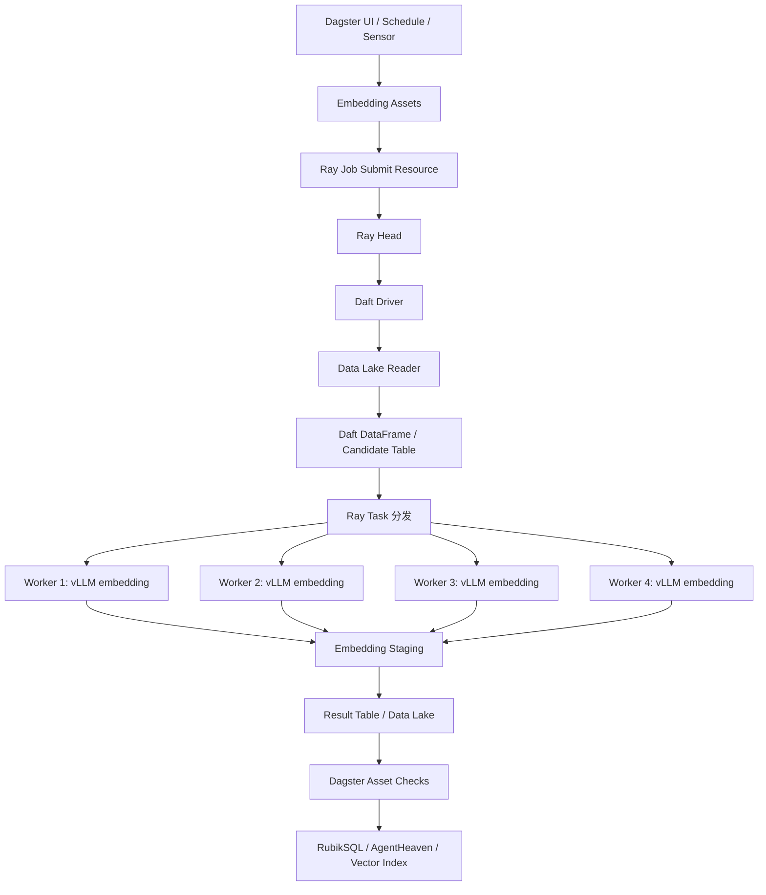
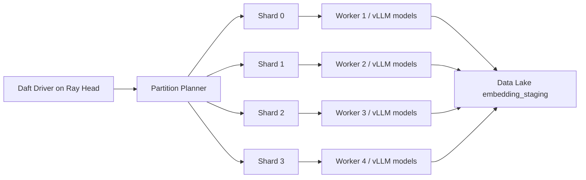

# Dagster + Daft + RayCluster + vLLM Embedding 目标意义与总体框架

本文基于当前原始思路和《dagster数据编排平台详解》重新梳理新的总体方案。

原始思路是：

```text
Python 提交 API 到 RayCluster
  -> Ray Head 负责启动 Daft driver
  -> Daft 接入数据湖读取数据
  -> Daft/Ray 将任务分发到 4 个 worker
  -> 4 个 worker 本地通过 vLLM 拉起多个 embedding 模型
  -> embedding 结果写回数据湖
```

引入 Dagster 后，不建议推翻这条链路。更合理的定位是：

```text
Dagster 做数据编排控制面
Daft 做数据湖读取与分布式 DataFrame 执行
RayCluster 做计算资源池
vLLM 做 worker 本地 embedding 推理服务
数据湖做输入、staging、结果和审计存储
```

## 1. 一句话结论

Dagster 应该加入在“任务编排和资产治理层”，而不是替代 Daft、Ray 或 vLLM。

它负责回答：

- 哪个数据分区需要 embedding。
- 哪个 RayCluster 负责执行。
- 本次运行使用哪套模型、参数和资源。
- 上游数据是否已经准备好。
- 失败后应该重试哪一步。
- 结果是否已经写回数据湖并通过质量检查。
- 后续 RubikSQL、AgentHeaven 或向量索引构建应该消费哪份结果。

Daft/Ray/vLLM 仍负责真正的大规模计算。

## 2. 为什么要加入 Dagster

原始方案已经可以跑任务，但它更像一次 Python job。加入 Dagster 的意义在于把 job 变成可治理的数据资产生产流程。

| 原始方案的问题 | Dagster 加入后的解决方式 |
| --- | --- |
| 只知道 job 成功或失败，不知道产出了哪些数据资产 | 用 Asset Materialization 记录候选集、staging、结果表 |
| 手动提交 Python API，不易管理周期性和回填 | 用 Schedule、Sensor、Partition、Backfill 管理运行 |
| Ray、Daft、数据湖、模型参数散在脚本里 | 用 Dagster Resource 统一配置 |
| 中间结果缺少血缘 | 用 Software-Defined Assets 表达上下游关系 |
| 失败后很难判断重跑范围 | 用分区资产和 run metadata 定位失败分区 |
| 数据质量靠人工检查 | 用 Asset Checks 检查行数、维度、失败率、重复率 |
| 多环境切换麻烦 | 用 Definitions 和 resource config 区分 dev/test/prod |

## 3. 总体架构



## 4. Dagster 的架构角色

Dagster 作为中央控制面板，主要承担 6 类职责。

### 4.1 资产目录

把整条 embedding 管线拆成可观测资产：

| 资产 | 含义 |
| --- | --- |
| `source_snapshot` | 数据湖输入快照，记录文件列表、版本、分区 |
| `embedding_manifest` | 本次 embedding 运行配置，包含模型、维度、Ray 集群、数据范围 |
| `embedding_candidates` | 待 embedding 的文本候选集 |
| `ray_embedding_run` | 提交到 RayCluster 的一次计算运行 |
| `embedding_staging` | worker 写出的中间 embedding 结果 |
| `embedding_result_table` | 清洗、去重、校验后的正式 embedding 表 |
| `embedding_quality_report` | 行数、失败率、向量维度、重复率等质量结果 |

### 4.2 任务编排

Dagster 负责资产之间的依赖顺序：

```text
source_snapshot
  -> embedding_manifest
  -> embedding_candidates
  -> ray_embedding_run
  -> embedding_staging
  -> embedding_result_table
  -> embedding_quality_report
```

### 4.3 资源管理

Dagster Resource 统一管理：

- Ray Job Submission API 地址。
- Ray runtime env。
- Daft runner 配置。
- 数据湖 S3/MinIO/本地文件系统连接。
- vLLM 模型配置。
- embedding 模型维度和版本。
- RubikSQL/AgentHeaven 后续消费路径。

### 4.4 分区与回填

Embedding 管线天然适合按数据分区运行：

```text
date=2026-07-03
db_id=sales
table_id=orders
engine=vec-enums
```

Dagster 的 partition/backfill 能让你只重跑某一天、某张表、某个模型版本对应的数据。

### 4.5 质量检查

通过 Asset Checks 检查：

- 输出行数是否等于候选行数。
- embedding 维度是否符合模型声明。
- 空文本比例是否异常。
- worker 失败率是否超过阈值。
- `text_hash` 是否唯一。
- 同一 `text_hash` 是否复用了相同 embedding。
- 结果是否成功写入目标数据湖路径。

### 4.6 可观测性

Dagster UI 展示：

- 每个 asset 的物化状态。
- 每次 run 的配置。
- Ray job id。
- Daft 执行统计。
- worker 分片耗时。
- vLLM 模型版本。
- 数据湖写入路径。
- 下游资产血缘。

## 5. 推荐执行模式

引入 Dagster 后有两种执行模式。

### 模式 A：Dagster 提交 Ray Job，Ray Head 启动 Daft driver

这是第一版推荐模式，最贴合你的原始思路。

```text
Dagster asset/op
  -> 调用 Ray Job Submission API
  -> Ray Head 运行 embedding_driver.py
  -> driver 内部启动 Daft Ray runner
  -> worker 本地 vLLM embedding
  -> 写回数据湖
  -> Dagster 轮询 Ray job 状态并记录 materialization
```

优点：

- 保留原始的 RayCluster 提交模型。
- Dagster 不进入高负载计算热路径。
- Ray Head 仍是 Daft driver 的执行入口。
- 便于后续将同一 driver 脚本独立调试。

### 模式 B：Dagster Ray Executor / Ray Run Launcher

这种模式让 Dagster 的 op/asset step 更细粒度地在 Ray 上执行。

适用场景：

- 希望每个 Dagster op 都直接映射到 Ray task。
- 希望 Dagster run 本身运行在 Ray 环境里。
- 已经稳定掌握 `dagster-ray` 的部署和调试方式。

第一版不建议直接选择模式 B。它会同时增加 Dagster 部署复杂度和 Ray 执行复杂度。

## 6. 保留原始四 worker 计算模型

新的框架仍然保留 4 个 worker 的 embedding 执行模型。



每个 worker 的职责：

- 拉起或复用本地 vLLM embedding 服务。
- 根据模型配置加载一个或多个 embedding 模型。
- 接收 Daft/Ray 分发的文本 batch。
- 批量生成 embedding。
- 写出该 worker 的结果分片。

Ray Head 的职责：

- 接收 Dagster 提交的 Ray Job。
- 启动 Daft driver。
- 维护 Ray 集群任务调度。
- 聚合 job 状态。

Dagster 的职责：

- 触发 Ray job。
- 记录 run id、partition、模型参数。
- 轮询 Ray job 状态。
- 检查数据湖输出。
- 物化正式资产。

## 7. 数据湖层次

建议将数据湖输出分为 5 层。

```text
embedding_runs/{run_id}/
  manifest/
  candidates/
  staging/
  result/
  quality/
```

| 层 | 内容 | 生产者 | 消费者 |
| --- | --- | --- | --- |
| `manifest` | 本次运行配置、输入快照、模型指纹 | Dagster | Ray driver、审计 |
| `candidates` | 待 embedding 文本 | Daft driver | Daft/Ray workers |
| `staging` | worker 输出的 raw embedding | vLLM workers | result builder |
| `result` | 正式 embedding 表 | Daft/Ray 或 Dagster op | RubikSQL/AgentHeaven |
| `quality` | 质量报告和指标 | Dagster Asset Checks | 运维、审计 |

## 8. 加入 Dagster 后的关键收益

### 8.1 从脚本变成资产管线

原始 Python job 只能说明“跑过一次”。Dagster asset 能说明：

- 哪些输入数据生成了哪些 embedding。
- 用了哪个模型版本。
- 用了哪个 RayCluster。
- 结果写到了哪里。
- 下游哪些资产依赖它。

### 8.2 支持回填和重跑

当某个历史分区需要重新 embedding 时，不必手工拼命令：

```text
Backfill date=2026-06-01..2026-06-30
  -> Dagster 为每个 partition 生成 run
  -> 每个 run 提交 Ray job
  -> 每个 run 独立记录结果和检查
```

### 8.3 支持数据质量门禁

如果 embedding 失败率过高或维度不一致，Dagster 可以让下游发布资产停止继续物化，避免错误结果进入 RubikSQL 或向量索引。

### 8.4 支持多模型版本管理

同一份输入可以按模型版本分区：

```text
model=bge-m3
model=qwen3-embedding
model=embeddinggemma
```

Dagster 记录每次模型切换带来的血缘和结果差异。

## 9. 第一版目标

第一版只做控制面增强，不重写计算内核。

第一版目标：

- 新增 Dagster project 或 Dagster definitions。
- 定义 embedding 相关 assets。
- 通过 Dagster 调 Ray Job Submission API。
- Ray Head 运行现有或新增 `embedding_driver.py`。
- driver 内部用 Daft 读取数据湖并分发到 4 个 worker。
- worker 本地 vLLM embedding。
- 结果写回数据湖。
- Dagster 记录 materialization 和质量检查。

第一版暂不做：

- 不把每个 Daft task 拆成 Dagster op。
- 不直接使用 Dagster Ray Executor 接管所有 worker。
- 不让 Dagster 参与每条 embedding 的计算。
- 不把 vLLM 服务生命周期完全交给 Dagster。

## 10. 第二版目标

第二版再增强 Dagster 和数据资产治理能力：

- 支持 partition/backfill。
- 支持多个模型版本。
- 支持 Sensor 监听数据湖新分区。
- 支持 Asset Checks 阻断下游发布。
- 支持 result table 的版本化发布。
- 支持 RubikSQL/AgentHeaven 向量索引构建作为下游 asset。

## 11. 最终推荐框架

```text
Dagster:
  编排、资产、调度、回填、资源、质量检查、可观测性

RayCluster:
  分布式计算资源池

Ray Head:
  接收 Dagster 提交的 job，启动 Daft driver

Daft:
  数据湖读取、候选集构建、分区、分发、staging/result 写入

Ray Workers:
  本地 vLLM embedding 服务，负责批量推理

Data Lake:
  输入数据、manifest、candidate、staging、result、quality report

RubikSQL/AgentHeaven:
  消费 embedding 结果，构建知识库或向量索引
```

这个设计的重点是“控制面和计算面解耦”。Dagster 让流程可管理、可观测、可回填；Daft/Ray/vLLM 保持高吞吐计算能力；数据湖承担可复现和可审计的中间结果存储。
