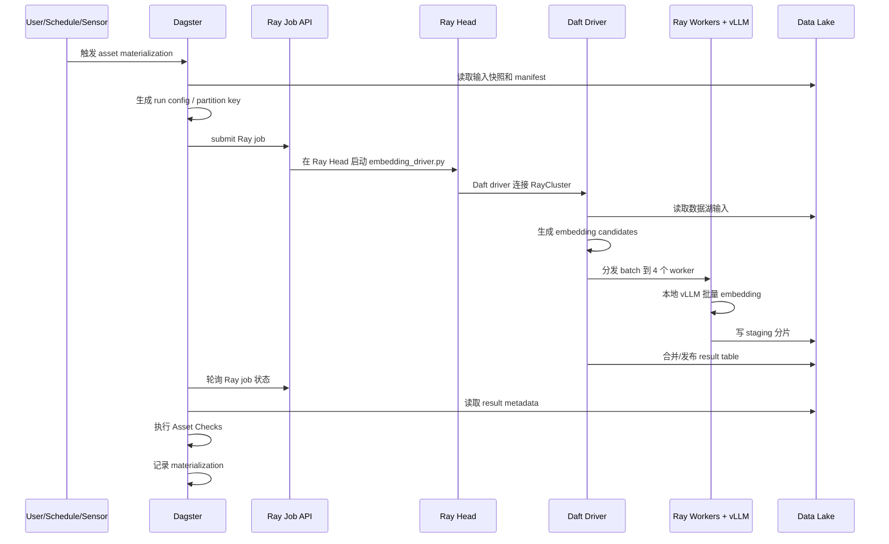
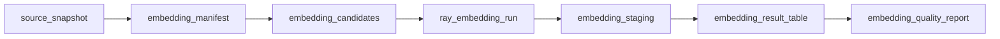
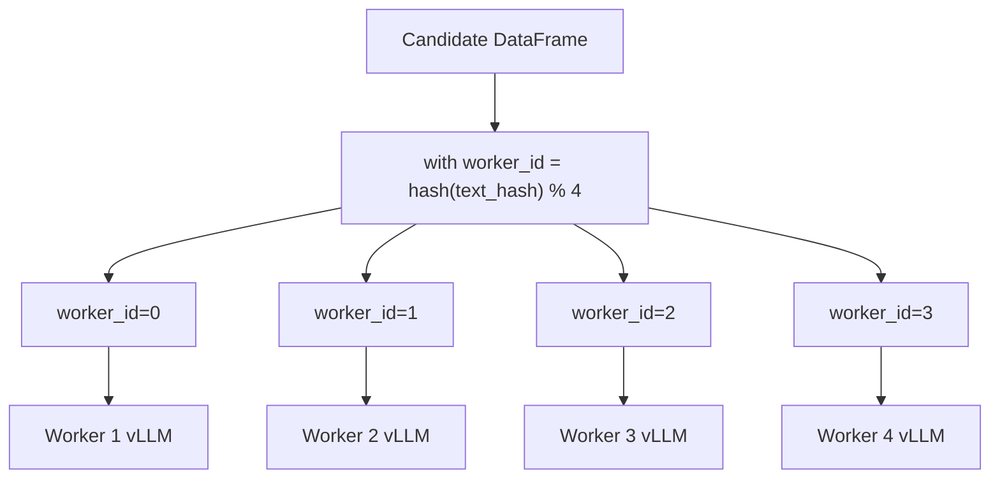

# Dagster 编排 Daft + RayCluster + vLLM Embedding 全过程详解

本文详细描述加入 Dagster 后，一次 embedding 数据湖构建任务从触发、资产物化、Ray job 提交、Daft 分发、vLLM worker 推理，到结果写回和质量检查的完整过程。

目标不是把 Daft/Ray/vLLM 改成 Dagster 内部实现，而是让 Dagster 成为可观测、可回填、可治理的编排控制面。

## 1. 全过程总览



## 2. Dagster 中的核心对象

### 2.1 Definitions

Dagster 项目入口通过 `Definitions` 注册 assets、jobs、resources、schedules、sensors。

```python
defs = Definitions(
    assets=[
        source_snapshot,
        embedding_manifest,
        embedding_candidates,
        ray_embedding_run,
        embedding_result_table,
    ],
    resources={
        "ray_jobs": RayJobSubmitResource(...),
        "lake_io": DataLakeIOManager(...),
        "embedding_config": EmbeddingConfigResource(...),
    },
    schedules=[daily_embedding_schedule],
    sensors=[new_lake_partition_sensor],
)
```

这里的重点是：Dagster 不直接处理大规模 DataFrame，而是通过资源和资产定义来协调外部计算系统。

### 2.2 Resources

推荐定义以下资源。

| Resource | 职责 |
| --- | --- |
| `ray_jobs` | 封装 Ray Job Submission API，提交和轮询 Ray job |
| `lake_io` | 封装数据湖读写路径、凭证、表格式 |
| `daft_config` | 传递 Daft runner、分区数、并行度等参数 |
| `vllm_config` | 定义 worker 本地模型、端口、GPU、batch size |
| `embedding_config` | 定义 provider、model、dim、encoder_hash |
| `rubiksql_config` | 定义下游 RubikSQL/AgentHeaven 消费路径 |

### 2.3 Assets

推荐使用 Software-Defined Assets 描述 pipeline。



每个 asset 都有清晰产物：

| Asset | 产物 |
| --- | --- |
| `source_snapshot` | 输入文件清单、etag、分区、schema |
| `embedding_manifest` | 本次运行配置 JSON/YAML |
| `embedding_candidates` | 候选文本 Parquet |
| `ray_embedding_run` | Ray job id、状态、日志链接 |
| `embedding_staging` | worker raw 输出目录 |
| `embedding_result_table` | 正式 embedding 结果表 |
| `embedding_quality_report` | 质量检查结果 |

## 3. 推荐资产过程

### 3.1 `source_snapshot`

该资产负责固定输入快照。

输入：

- 数据湖路径。
- 分区日期。
- 表名或数据库名。
- 可选 manifest。

输出：

```json
{
  "run_id": "20260703_sales_orders_bge_m3",
  "partition_key": "2026-07-03",
  "input_paths": ["s3://lake/sales/orders/date=2026-07-03/*.parquet"],
  "file_count": 128,
  "row_count_estimate": 10000000,
  "snapshot_hash": "..."
}
```

意义：

- 防止运行过程中上游文件变化导致不可复现。
- 为后续 candidate、embedding、result 建立血缘。

### 3.2 `embedding_manifest`

该资产把运行配置写成 manifest。

包含：

```yaml
run_id: "20260703_sales_orders_bge_m3"
partition_key: "2026-07-03"
ray:
  address: "http://ray-head:8265"
  working_dir: "s3://deploy/rubiksql_embedding_job.zip"
daft:
  runner: ray
  target_partitions: 4
vllm:
  worker_count: 4
  models:
    - name: "bge-m3"
      dim: 1024
      tensor_parallel_size: 1
embedding:
  model: "bge-m3"
  dim: 1024
  batch_size: 256
  encoder_hash: "rubiksql-v1"
output:
  staging_uri: "s3://lake/embedding_runs/.../staging/"
  result_uri: "s3://lake/embedding_runs/.../result/"
```

意义：

- Ray driver 和 Dagster 使用同一份运行配置。
- 后续审计能明确知道本次结果来自哪个模型和参数。

### 3.3 `embedding_candidates`

该资产可以有两种实现方式。

第一版推荐由 Ray job 内部生成 candidates，Dagster 只记录 candidates 路径。

更标准的方式是 Dagster 触发一个轻量 job 先生成 candidates：

```text
source_snapshot
  -> Daft read data lake
  -> select / encode text
  -> write candidates parquet
```

候选表字段：

| 字段 | 说明 |
| --- | --- |
| `run_id` | 运行 ID |
| `partition_key` | 分区 |
| `source_id` | 原始记录 ID 或 UKF ID |
| `text` | 待 embedding 文本 |
| `text_hash` | 文本和模型指纹 hash |
| `model` | 模型名 |
| `dim` | 向量维度 |
| `metadata_json` | 下游需要的业务元数据 |

### 3.4 `ray_embedding_run`

这是 Dagster 与 RayCluster 的连接点。

Dagster 做：

1. 读取 manifest。
2. 组装 Ray job entrypoint。
3. 调 Ray Job Submission API。
4. 轮询 job 状态。
5. 把 Ray job id、dashboard url、日志路径写入 metadata。

伪代码：

```python
@asset(deps=[embedding_manifest])
def ray_embedding_run(context, ray_jobs, embedding_manifest):
    job_id = ray_jobs.submit(
        entrypoint=(
            "python embedding_driver.py "
            f"--manifest-uri {embedding_manifest['uri']}"
        ),
        runtime_env={
            "working_dir": embedding_manifest["ray"]["working_dir"],
            "env_vars": {
                "RUN_ID": embedding_manifest["run_id"],
            },
        },
    )

    result = ray_jobs.wait(job_id)

    context.add_output_metadata({
        "ray_job_id": job_id,
        "status": result.status,
        "logs_uri": result.logs_uri,
    })

    return result
```

### 3.5 `embedding_staging`

Ray job 完成后，Dagster 不需要把所有 embedding 读回内存，只需要检查 staging 是否存在并记录元数据。

输出路径：

```text
s3://lake/embedding_runs/{run_id}/staging/worker_id=0/part-*.parquet
s3://lake/embedding_runs/{run_id}/staging/worker_id=1/part-*.parquet
s3://lake/embedding_runs/{run_id}/staging/worker_id=2/part-*.parquet
s3://lake/embedding_runs/{run_id}/staging/worker_id=3/part-*.parquet
```

staging 字段：

| 字段 | 说明 |
| --- | --- |
| `source_id` | 原始记录 ID |
| `text_hash` | embedding key |
| `embedding` | list[float] |
| `status` | success/failed/skipped |
| `error` | 错误信息 |
| `worker_id` | 产出 worker |
| `model` | 模型 |
| `dim` | 维度 |

### 3.6 `embedding_result_table`

该资产将 staging 结果整理成正式结果表。

处理逻辑：

- 读取所有 worker staging。
- 过滤失败行或写入 failure table。
- 按 `text_hash` 去重。
- 校验 embedding 维度。
- 写入正式 result table。

输出路径：

```text
s3://lake/embedding_results/model=bge-m3/date=2026-07-03/
```

如果后续使用 Delta/Iceberg，也可以在这里做事务式发布。

### 3.7 `embedding_quality_report`

质量报告可以由 Asset Checks 或普通 asset 生成。

检查项：

| 检查 | 规则 |
| --- | --- |
| `row_count_match` | 成功行 + 失败行 = candidate 行 |
| `dim_match` | 所有成功向量维度等于 manifest.dim |
| `failure_rate_ok` | 失败率低于阈值 |
| `duplicate_hash_ok` | 同一 text_hash 不出现多种 embedding |
| `worker_balance_ok` | 4 个 worker 负载差异不超过阈值 |
| `result_path_exists` | result 路径存在且非空 |

## 4. Ray job 内部过程

Ray job 的 entrypoint 可以是：

```bash
python embedding_driver.py --manifest-uri s3://lake/embedding_runs/{run_id}/manifest.yaml
```

### 4.1 driver 启动

driver 做：

1. 读取 manifest。
2. 连接 RayCluster。
3. 设置 Daft Ray runner。
4. 初始化数据湖访问凭证。
5. 启动或检查 worker 本地 vLLM 服务。

伪代码：

```python
def main(manifest_uri: str):
    manifest = read_yaml(manifest_uri)

    import ray
    import daft

    ray.init(address="auto")
    daft.set_runner_ray()

    run_embedding_pipeline(manifest)
```

### 4.2 Daft 读取数据湖

Daft 负责读取输入数据或 candidates。

```python
df = daft.read_parquet(manifest["input"]["candidate_uri"])
```

如果 candidates 尚未生成，driver 可以直接从源表生成：

```python
source = daft.read_parquet(manifest["source_snapshot"]["input_paths"])
df = source.select(
    daft.col("id").alias("source_id"),
    build_embedding_text(...).alias("text"),
)
```

### 4.3 分发到 4 个 worker

可以按 `text_hash` 做稳定分片：

```text
worker_id = hash(text_hash) % 4
```

这样同一文本稳定落到同一个 worker，便于缓存和重跑。



### 4.4 worker 本地 vLLM embedding

每个 worker 可以有两种方式使用 vLLM。

方式 A：worker 本地常驻 vLLM server。

```text
worker 启动时拉起 vLLM OpenAI-compatible server
Daft UDF 通过 localhost 调用 embedding endpoint
```

方式 B：Ray actor 内直接持有模型。

```text
Ray actor 初始化 vLLM engine
actor.embed(batch_texts)
返回 embedding
```

第一版建议方式 A，便于复用 vLLM 服务能力，也便于独立监控端口和日志。

### 4.5 多模型策略

如果每个 worker 要拉起多个 embedding 模型，需要明确调度策略。

| 策略 | 说明 | 适用场景 |
| --- | --- | --- |
| 单 run 单模型 | 每次 Dagster run 只跑一个模型 | 第一版推荐 |
| worker 多端口多模型 | 每个 worker 同时启动多个 vLLM server | GPU 资源充足 |
| 模型作为 partition | `model=bge-m3`、`model=qwen3` 分开 materialize | 多模型版本管理 |

第一版推荐“单 run 单模型”。多个模型通过 Dagster partition/backfill 多次运行，资产血缘更清楚。

### 4.6 写 staging

worker 输出不要直接写最终结果表，而是写 staging：

```text
staging/worker_id=0/part-000.parquet
staging/worker_id=1/part-000.parquet
```

好处：

- worker 失败时只重跑对应分片。
- staging 可审计。
- result 发布前可以统一做质量检查。
- 防止部分成功结果直接污染正式表。

## 5. Dagster 质量检查过程

Ray job 完成不等于 Dagster asset 成功。Dagster 还应该检查输出。

### 5.1 行数检查

```text
candidate_count = read candidates count
success_count = read staging where status=success
failed_count = read staging where status=failed

assert success_count + failed_count == candidate_count
```

### 5.2 维度检查

```text
for each embedding:
    len(embedding) == manifest.embedding.dim
```

### 5.3 失败率检查

```text
failed_count / candidate_count <= max_failure_rate
```

### 5.4 worker 均衡检查

```text
max(worker_rows) / avg(worker_rows) <= threshold
```

如果负载严重不均，说明分片策略需要调整。

## 6. 分区、调度与回填

### 6.1 分区设计

推荐分区键包含时间和模型：

```text
date=2026-07-03|model=bge-m3
```

如果数据量很大，可以扩展：

```text
date=2026-07-03|db=sales|table=orders|model=bge-m3
```

### 6.2 Schedule

每天跑一次新增数据：

```python
daily_embedding_schedule = ScheduleDefinition(
    job=embedding_job,
    cron_schedule="0 2 * * *",
)
```

### 6.3 Sensor

监听数据湖新分区：

```text
发现 s3://lake/sales/orders/date=2026-07-03/_SUCCESS
  -> 触发 date=2026-07-03 的 embedding partition
```

### 6.4 Backfill

历史数据重算：

```text
选择 date=2026-06-01 到 date=2026-06-30
选择 model=bge-m3
Dagster 生成多个 partition run
每个 run 提交独立 Ray job
```

## 7. 失败恢复策略

### 7.1 Dagster 层失败

常见原因：

- Ray Job API 不可用。
- manifest 写入失败。
- result path 检查失败。

处理：

- Dagster op/asset retry。
- 保留 run config。
- 不删除已写出的 staging。

### 7.2 Ray job 失败

常见原因：

- worker 节点不可用。
- vLLM 模型拉起失败。
- GPU OOM。
- 数据湖读取超时。

处理：

- Ray job 输出失败状态。
- Dagster 记录 Ray logs。
- 根据 staging 判断是否能分片重跑。

### 7.3 worker 分片失败

staging 中记录：

```json
{
  "worker_id": 2,
  "shard_id": "2-00013",
  "status": "failed",
  "error": "vLLM timeout"
}
```

后续可以只重跑失败 shard。

## 8. 数据湖目录建议

```text
embedding_runs/
  run_id=20260703_sales_orders_bge_m3/
    manifest/
      manifest.yaml
      source_snapshot.json
    candidates/
      part-*.parquet
    staging/
      worker_id=0/
        part-*.parquet
      worker_id=1/
        part-*.parquet
      worker_id=2/
        part-*.parquet
      worker_id=3/
        part-*.parquet
    result/
      part-*.parquet
    quality/
      summary.json
      checks.json
    logs/
      ray_job.json
      daft_metrics.json
```

正式结果表：

```text
embedding_results/
  model=bge-m3/
    date=2026-07-03/
      part-*.parquet
```

## 9. Metadata 记录

Dagster materialization metadata 建议包含：

| Metadata | 说明 |
| --- | --- |
| `run_id` | 全局运行 ID |
| `partition_key` | Dagster 分区 |
| `ray_job_id` | Ray job id |
| `ray_dashboard_url` | Ray dashboard 链接 |
| `candidate_uri` | 候选集路径 |
| `staging_uri` | staging 路径 |
| `result_uri` | 正式结果路径 |
| `model` | embedding 模型 |
| `dim` | 向量维度 |
| `candidate_count` | 候选行数 |
| `success_count` | 成功行数 |
| `failed_count` | 失败行数 |
| `elapsed_seconds` | 总耗时 |

## 10. 代码骨架

### 10.1 Ray Job Resource

```python
class RayJobSubmitResource:
    def __init__(self, address: str):
        self.address = address

    def submit(self, entrypoint: str, runtime_env: dict) -> str:
        ...

    def wait(self, job_id: str):
        ...
```

### 10.2 Dagster asset

```python
@asset(deps=[embedding_manifest])
def ray_embedding_run(context, ray_jobs: RayJobSubmitResource, embedding_manifest):
    job_id = ray_jobs.submit(
        entrypoint=f"python embedding_driver.py --manifest-uri {embedding_manifest.uri}",
        runtime_env=embedding_manifest.runtime_env,
    )

    result = ray_jobs.wait(job_id)

    context.add_output_metadata({
        "ray_job_id": job_id,
        "status": result.status,
        "logs": result.logs_uri,
    })

    if result.status != "SUCCEEDED":
        raise RuntimeError(f"Ray job failed: {job_id}")

    return {
        "job_id": job_id,
        "staging_uri": embedding_manifest.staging_uri,
    }
```

### 10.3 driver skeleton

```python
def run_embedding_pipeline(manifest):
    import daft
    import ray

    ray.init(address="auto")
    daft.set_runner_ray()

    candidates = daft.read_parquet(manifest["candidate_uri"])

    candidates = candidates.with_column(
        "worker_id",
        stable_worker_id(candidates["text_hash"], manifest["vllm"]["worker_count"]),
    )

    embedded = candidates.with_column(
        "embedding_result",
        vllm_embed_udf(candidates["text"], candidates["worker_id"]),
    )

    embedded.write_parquet(manifest["staging_uri"])

    publish_result_table(manifest)
```

## 11. 最小可交付版本

第一版最小可交付版本建议包含：

1. Dagster assets 定义。
2. `RayJobSubmitResource`。
3. `embedding_manifest` 生成。
4. `ray_embedding_run` 提交 Ray job。
5. Ray job 内部用 Daft 读取 candidates。
6. Daft 分发到 4 个 worker。
7. worker 通过本地 vLLM 生成 embedding。
8. staging 和 result 写回数据湖。
9. Dagster 记录 materialization metadata。
10. Asset Checks 校验行数、维度、失败率。

## 12. 后续增强

第二版可以加入：

- Dagster partitions/backfill。
- Sensor 自动监听数据湖新分区。
- 多模型 partition。
- result table 的 Delta/Iceberg 事务发布。
- 失败 shard 精确重跑。
- Ray job 日志链接回填到 Dagster UI。
- RubikSQL/AgentHeaven 向量索引构建作为下游 asset。

## 13. 最终过程总结

加入 Dagster 后，一次完整过程可以概括为：

```text
Dagster 发现或触发一个数据分区
  -> 固定 source snapshot
  -> 生成 embedding manifest
  -> 提交 Ray job 到 Ray Head
  -> Ray Head 启动 Daft driver
  -> Daft 读取数据湖 candidates
  -> Daft 按 text_hash 分发到 4 个 worker
  -> worker 本地 vLLM 批量 embedding
  -> worker 写 staging
  -> driver 或后续 asset 发布 result table
  -> Dagster 执行 Asset Checks
  -> Dagster 记录 asset materialization
  -> 下游 RubikSQL/AgentHeaven 消费正式 embedding 结果
```

这套流程保留了你原始方案中的高吞吐计算路径，同时让每一次 embedding 构建变得可观测、可重跑、可治理、可审计。
