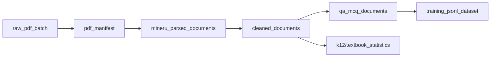
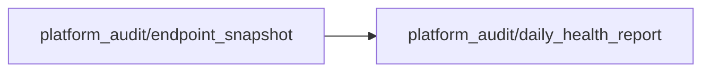
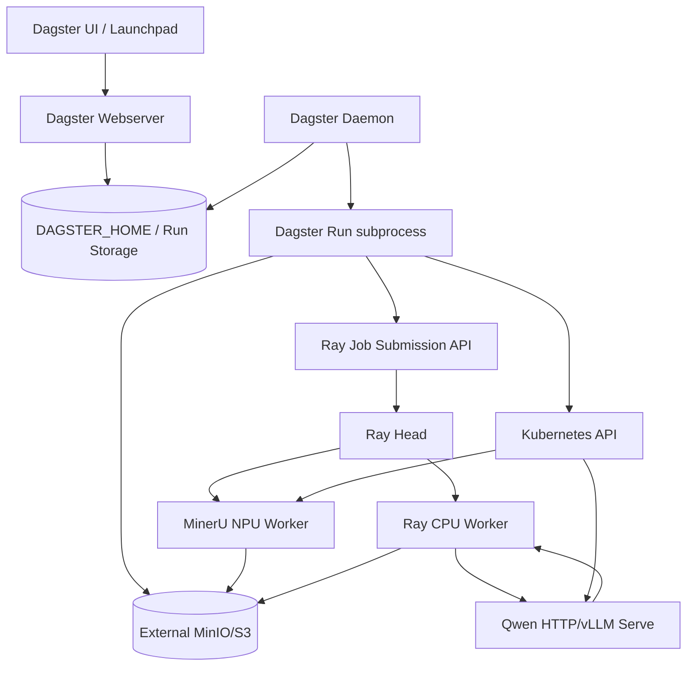

# K12 Dagster Jobs、Asset Lineage、Code Location 与 Deployment 关系说明

## 1. 文档目的

本文回答以下几个容易混淆的问题：

1. Dagster UI 中已经存在的 Job 分别由哪些 Python 文件定义；
2. Job 如何进入 `Definitions`，再进入 Code Location 和 Repository；
3. Job 的 op 图与 Global Asset Lineage 是什么关系；
4. Dagster Deployment、RayCluster、CPU Worker、MinerU Worker 和 Qwen Worker
   分别承担什么职责；
5. 为什么多个完全不同的 Job 会同时出现在一个 Code Location 中；
6. 当前线上实际加载内容与仓库分支源码存在哪些差异。

本文依据 2026-09-15 对以下两处的联合审计编写：

```text
源码工作树：/home/admin/Desktop/sql/kcc-dagster-asset-demos
线上集群：110.120.0.3
Namespace：k12
Dagster Deployment：k12-platform-cpu-k12-clean-qa-pipeline-dagster
```

线上运行状态和 Job 清单来自 Dagster GraphQL 与容器内
`dagster job list`，不是只根据历史文档推断。

---

## 2. 先区分四种不同的“关联”

当前系统中至少存在四种不同含义的关联。它们相互配合，但不是同一件事。

### 2.1 Job 内部的执行图

Job 内部的 op 依赖决定一次 Run 中步骤的先后顺序。例如：

```text
scan_s3_with_daft
  -> write_pdf_manifest
  -> check_ray_cluster
  -> submit_ray_job
  -> monitor_ray_job
  -> validate_existing_outputs
```

这张图只描述“一次 Job Run 如何执行”。它显示在 Job 或 Run 的 graph 视图中。

它不自动等同于 Global Asset Lineage。

### 2.2 Global Asset Lineage

Asset Lineage 描述长期存在的数据产品依赖：

```text
raw_pdf_batch
  -> pdf_manifest
  -> mineru_parsed_documents
  -> cleaned_documents
  -> qa_mcq_documents
  -> training_jsonl_dataset
```

它回答的是：一个数据资产从哪里来，下游依赖谁，而不是某一次 Run 执行了哪些 op。

### 2.3 Code Location 与 Definitions

Code Location 是 Dagster 加载一组 Python Definitions 的运行边界。当前只有一个主要
Code Location：

```text
clean_qa.mineru_dagster.definitions
```

该模块创建一个 `Definitions` 对象，把 Jobs、Assets、Asset Checks、Sensors 和
Resources 汇总后暴露给 Dagster。

Code Location 决定“Dagster 能看到哪些定义”，不负责执行 MinerU 或 Qwen 推理。

### 2.4 Kubernetes Deployment 与计算资源

Kubernetes Deployment/Pod 是代码实际运行的位置：

```text
Dagster Deployment
  -> 启动 Webserver 和 Daemon
  -> 加载 Code Location
  -> 执行轻量 op / 提交 Ray Job / 控制 Worker 生命周期

RayCluster
  -> Ray Head 接收 Dagster 提交
  -> CPU Worker 执行扫描、清洗和协调任务

MinerU/Qwen Worker
  -> 按需拉起
  -> 使用 Ascend NPU
  -> 完成解析或模型推理
```

Job 与 Deployment 不是一对一关系。当前 19 个显式 Job 都由同一个 Dagster
Deployment 暴露；只有需要重计算的 Job 才进一步调用 Ray 或控制 NPU Worker。

---

## 3. 从源码到 UI 的完整加载链路

### 3.1 聚合链路

当前加载过程如下：

```text
各个 jobs/*.py 或 dagster_defs/*.py
        |
        +--> mineru_dagster/jobs/__init__.py
        |       |- CPU_JOBS
        |       |- NPU_JOBS
        |       `- ALL_JOBS
        |
        `--> k12_clean_qa_pipeline/dagster_defs/jobs.py
                |- CPU_PIPELINE_JOBS
                |- NPU_PIPELINE_JOBS
                `- ALL_PIPELINE_JOBS
                         |
                         v
clean_qa/mineru_dagster/definitions.py
        |- ALL_ASSETS
        |- ALL_CHECKS
        |- Jobs selected by profile
        |- Sensors selected by profile
        `- Resources selected by profile
                         |
                         v
Dagster Code Location
clean_qa.mineru_dagster.definitions
                         |
                         v
Repository __repository__
                         |
                         v
Dagster UI / GraphQL / Launchpad
```

### 3.2 为什么 Repository 名叫 `__repository__`

当前工程直接暴露 `Definitions`，没有另外声明一个具名 `@repository`。Dagster 因而
为这组 Definitions 生成默认 Repository：

```text
Code Location：clean_qa.mineru_dagster.definitions
Repository：__repository__
```

提交 GraphQL Run 时，selector 使用：

```json
{
  "repositoryLocationName": "clean_qa.mineru_dagster.definitions",
  "repositoryName": "__repository__",
  "pipelineName": "cleanjopbstage1_10"
}
```

### 3.3 Profile 如何决定可见 Job

线上 Definitions 支持：

```text
K12_PIPELINE_PROFILE=cpu
K12_PIPELINE_PROFILE=full
```

`cpu` profile 加载：

```text
全部 AssetSpec / @asset
全部 Asset Check
CPU_JOBS
CPU_PIPELINE_JOBS
cleaning_sensor
S3Resource
RayJobResource
```

`full` profile 在此基础上增加：

```text
NPU_JOBS
NPU_PIPELINE_JOBS
ray_job_status_sensor
QwenKubernetesResource
```

当前线上 Deployment 的实际环境变量是：

```text
K12_PIPELINE_PROFILE=full
```

因此下文列出的 19 个显式 Job 当前都能在 UI 中看到。

---

## 4. 当前 Code Location 中的完整 Job 清单

线上 Repository 当前包含：

```text
19 个显式 Job
1 个 Dagster 自动生成的 __ASSET_JOB
0 个 Schedule
2 个 Sensor
9 个 Asset
```

### 4.1 MinerU 编排类 Job

| Job | 源码定义 | Profile | 主要职责 | 计算落点 |
| --- | --- | --- | --- | --- |
| `mineru_smoke_10_job` | `mineru_dagster/jobs/mineru_smoke_job.py` | full | 扫描、提交、监控、逐文档展示、校验并登记 MinerU smoke | Dagster 提交，Ray/MinerU Worker 执行 |
| `mineru_submit_job` | `mineru_dagster/jobs/mineru_submit_job.py` | full | 只完成扫描、服务检查与 Ray Job 提交，不等待最终物化 | Dagster 提交，Ray 后台执行 |
| `mineru_finalize_job` | `mineru_dagster/jobs/mineru_finalize_job.py` | cpu/full | 对已提交或已完成的 MinerU 结果进行重建 manifest、校验和资产登记 | Dagster Pod，读取 S3/Ray 状态 |
| `register_existing_mineru_batch_job` | `mineru_dagster/jobs/register_existing_batch.py` | cpu/full | 将数据湖中已经存在的 MinerU 批次登记进 Dagster | Dagster Pod，只读审计 S3 |

这四个 Job 构成了三种使用方式：

```text
同步 smoke：mineru_smoke_10_job

异步生产：mineru_submit_job
             -> 后续 mineru_finalize_job

历史结果接入：register_existing_mineru_batch_job
```

`mineru_smoke_10_job` 最终通过 `register_asset_metadata` 手工记录：

```text
raw_pdf_batch
pdf_manifest
mineru_parsed_documents
```

因此它参与资产物化历史，但并不是通过 `define_asset_job` 创建的资产 Job。

### 4.2 Stage 1 清洗 Job

当前存在两代清洗编排，必须区别使用。

| Job | 源码定义 | Profile | 定位 | 说明 |
| --- | --- | --- | --- | --- |
| `cleaning_smoke_10_job` | `mineru_dagster/jobs/cleaning_job.py` | cpu/full | 较早的三阶段清洗 smoke | `step_job1 -> step_job2 -> step_job3`，保留用于兼容和演示 |
| `cleaning_full_job` | `mineru_dagster/jobs/cleaning_full_job.py` | cpu/full | 较早的三阶段全量清洗 | 与上面使用同一组三阶段 op |
| `cleanjopbstage1_10` | `k12_clean_qa_pipeline/dagster_defs/stage1_jobs.py` | cpu/full | 当前规范化 Stage 1 smoke | 当前 Stage 1 主实现，调用 Stage 1 Ray driver |
| `cleanjopbstage1_ful` | `k12_clean_qa_pipeline/dagster_defs/stage1_jobs.py` | cpu/full | 当前规范化 Stage 1 全量入口 | 支持 resume/dry-run/全量 manifest |

当前规范主链应优先使用：

```text
cleanjopbstage1_10
cleanjopbstage1_ful
```

其内部逻辑是：

```text
resolve_source_manifest
  -> select_documents
  -> submit_ray_clean_job
  -> read_mineru_markdown
  -> parse_document_structure
  -> filter_noise
  -> normalize_math_content
  -> build_structured_blocks
  -> render_clean_markdown
  -> write_document_outputs
  -> validate_outputs
  -> write_summary
```

Stage 1 不申请 NPU。Dagster 负责参数和观测，Ray CPU Worker 负责实际文档清洗，
MinIO 保存 `blocks.jsonl`、`clean.md`、报告和 `_SUCCESS.json`。

### 4.3 Stage 2 QA/MCQ Job

| Job | 源码定义 | Profile | 定位 | 说明 |
| --- | --- | --- | --- | --- |
| `qajobstage2_10` | `k12_clean_qa_pipeline/dagster_defs/stage2_jobs.py` | full | 10 本书动态可视化 smoke | 按书动态映射，展示 `process_each_book` |
| `qajobstage2_ful` | 同上 | full | 标准全量 Stage 2 | 生成、程序校验、Judge、去重、导出 |
| `qa_stage2_8_16` | 同上 | full | 8-NPU 16 本吞吐测试 | 使用 8-NPU 默认参数集 |
| `qa_stage2_8_ful` | 同上 | full | 8-NPU 全量生产入口 | 历史全量生产采用的入口 |

共同的逻辑阶段包括：

```text
resolve_stage1_test_manifest
  -> validate_stage1_outputs
  -> submit_ray_stage2_job
  -> load_structured_blocks
  -> rule_prefilter
  -> classify_eligibility
  -> extract_facts_and_skills
  -> generate_qa_candidates
  -> solve_textbook_exercises
  -> generate_mcq_candidates
  -> run_structure_validation
  -> run_math_validation
  -> run_qwen_judge
  -> deduplicate_items
  -> export_training_formats
  -> validate_document_outputs
  -> write_stage2_summary
```

其中 `qajobstage2_10` 使用书籍级动态映射，所以 UI 图更接近：

```text
fan_out_stage2_books
  -> process_each_book[book A]
  -> process_each_book[book B]
  -> ...
  -> merge_all_books
```

Stage 2 的 Dagster op 不在 Dagster Pod 中加载模型。它向 Ray 提交协调任务，再由
Worker 通过 HTTP 调用常驻 Qwen/vLLM 服务。

### 4.4 Qwen 生命周期与调用 Job

| Job | 源码定义 | Profile | 主要职责 |
| --- | --- | --- | --- |
| `qwen_vllm_lifecycle_job` | `mineru_dagster/jobs/qwen_jobs.py` | full | 启停并检查较小规模 Qwen Deployment |
| `qwen_vllm_8npulifecycle_job` | 同上 | full | 管理历史 8-NPU、4 个 TP1 endpoint 拓扑 |
| `qwen_chat_job` | 同上 | full | 向已运行 Qwen 服务提交和监控聊天 smoke |

生命周期 Job 通过 `QwenKubernetesResource` 调用 Kubernetes API。它们控制 Deployment
副本、检查 Pod/Service/endpoint，并不直接执行 vLLM 模型代码。

`qwen_vllm_8npulifecycle_job` 源码中的历史拓扑为：

```text
device pairs：8,9;10,11;12,13;14,15
service_count：4
每个 endpoint：TP1
```

### 4.5 端到端演示和自动伸缩 Job

| Job | 源码定义 | Profile | 主要职责 |
| --- | --- | --- | --- |
| `textbook_mineru_clean_qa_demo_job` | `k12_clean_qa_pipeline/dagster_defs/e2e_demo_job.py` | full | 书籍级 MinerU -> Cleaning -> QA -> 校验端到端演示 |
| `k12_e2e_autoscale_nojudge_job` | `k12_clean_qa_pipeline/dagster_defs/autoscale_nojudge_job.py` | full | 展示 MinerU/Qwen Worker 生命周期、Serve、书籍分配和自动释放 |

`textbook_mineru_clean_qa_demo_job` 的动态链路为：

```text
resolve_e2e_books
  -> submit_e2e_ray_pipeline
  -> fan_out_e2e_books
       -> mineru_parse_book
       -> clean_book
       -> generate_qa_book
       -> validate_e2e_book_outputs
  -> merge_e2e_books
```

`k12_e2e_autoscale_nojudge_job` 进一步显式展示：

```text
MinerU Worker Pod
MinerU Serve A/B
QA Worker Pod
各 Qwen vLLM endpoint
每本书在 MinerU/Cleaning/QA/Schema/MinIO 阶段的状态
资源 requested/ready/busy/draining/released 生命周期
```

名称中的 `nojudge` 是数据质量边界：其结果不能冒充完整 Judge 后的 verified 生产集。

### 4.6 新增的两个 Asset Demo Job

| Job | 源码定义 | Profile | Asset 绑定 |
| --- | --- | --- | --- |
| `textbook_statistics_job` | `mineru_dagster/jobs/demo_asset_jobs.py` | cpu/full | `cleaned_documents -> k12/textbook_statistics` |
| `platform_audit_daily_job` | 同上 | cpu/full | `platform_audit/endpoint_snapshot -> platform_audit/daily_health_report` |

这两个 Job 使用 `define_asset_job`，因此 GraphQL 的 `assetNode.jobNames` 能直接显示
对应 Job。这与旧主链的手工物化方式不同。

### 4.7 `__ASSET_JOB` 是什么

`__ASSET_JOB` 不是业务代码手写的 Job。它是 Dagster 根据可执行 `@asset` 自动生成的
隐式资产 Job。

当前它包含新 Demo 的可执行资产和相关 Asset Check。旧主链大部分节点是
`AssetSpec`，只描述外部数据资产，不具备直接执行函数，因此不会作为可执行 op
出现在 `__ASSET_JOB` 中。

---

## 5. 当前 Global Asset Lineage

### 5.1 K12 主链



资产组：

```text
raw_pdf_batch               mineru_lake
pdf_manifest                mineru_lake
mineru_parsed_documents     mineru_lake
cleaned_documents           mineru_lake
qa_mcq_documents            mineru_lake
training_jsonl_dataset      mineru_lake
k12/textbook_statistics     k12_analytics_demo
```

除统计 Demo 外，主链统一使用动态分区：

```text
Dynamic partitions: batch_id
```

同一个 `batch_id` 把一批原始 PDF、manifest、MinerU 结果、清洗结果和 QA 结果关联起来。

### 5.2 独立平台审计子图



该子图没有 K12 上游依赖，使用 `platform_audit_demo` 资产组和日期分区。它与 K12
主链共存于同一 Code Location，但 Asset Key 不冲突。

### 5.3 为什么旧主链的 `jobNames` 为空

线上 GraphQL 当前显示：

```text
raw_pdf_batch              jobNames=[]
pdf_manifest               jobNames=[]
mineru_parsed_documents    jobNames=[]
cleaned_documents          jobNames=[]
qa_mcq_documents           jobNames=[]
training_jsonl_dataset     jobNames=[]
```

这不表示它们没有被 Job 生产。原因是：

1. 这些节点使用 `AssetSpec` 声明数据血缘；
2. 业务 Job 使用普通 `@job` 和 `@op`；
3. op 完成时通过 `context.log_event(AssetMaterialization(...))` 登记资产物化；
4. Dagster 可以保存物化历史，但静态定义层面没有 `define_asset_job` 绑定。

新 Demo 则显示：

```text
k12/textbook_statistics:
  __ASSET_JOB
  textbook_statistics_job

platform_audit/endpoint_snapshot:
  __ASSET_JOB
  platform_audit_daily_job
```

这是两种建模方式的差异，不是数据丢失或 UI 故障。

---

## 6. Code Location 与 Kubernetes Deployment 的关系

### 6.1 当前 Deployment

```text
Deployment：k12-platform-cpu-k12-clean-qa-pipeline-dagster
Namespace：k12
Replica：1
Node：server-00 / amd64
ServiceAccount：k12-data-pipeline
Storage：PVC k12-dagster-home
```

Pod 内有两个容器：

```text
webserver
daemon
```

二者使用同一镜像、同一 `DAGSTER_HOME` 和同一 Definitions 模块。

### 6.2 Webserver 如何加载 Code Location

实际启动命令：

```bash
dagster-webserver \
  -h 0.0.0.0 \
  -p 3000 \
  -m clean_qa.mineru_dagster.definitions
```

`-m` 表示按 Python module 加载 Definitions。当前没有另外部署一个长期独立的
user-code gRPC Deployment/Service；Code Location 由这个模块加载形成。

Webserver 提供：

```text
UI
GraphQL API
Launchpad Schema
Definitions/Repository/Asset 浏览
Run 日志查询
```

### 6.3 Daemon 如何加载同一 Definitions

实际启动命令：

```bash
dagster-daemon run -m clean_qa.mineru_dagster.definitions
```

Daemon 负责：

```text
QueuedRunCoordinator
Run 启动
Sensor tick
后台状态协调
```

当前 `dagster.yaml` 使用本地计算日志、QueuedRunCoordinator 和 DefaultRunLauncher。
因此 Dagster Run 的控制进程在 Dagster Pod 中启动；重计算通过 Ray Job Submission
转移到 RayCluster，而不是为每个 Dagster Run 自动创建一个 Kubernetes Job Pod。

### 6.4 Service 与访问入口

Chart 中 Dagster Service 端口为：

```text
containerPort：3000
servicePort：3000
NodePort：30080
```

从 server-00 可访问：

```text
http://127.0.0.1:30080
```

从不能直连 NodePort 的客户端可使用：

```bash
ssh -L 30080:127.0.0.1:30080 admin@110.120.0.3
```

再访问：

```text
http://127.0.0.1:30080
```

---

## 7. Dagster 与 Ray、MinerU、Qwen 的控制关系



职责边界：

| 组件 | 负责 | 不负责 |
| --- | --- | --- |
| Dagster | Job/Asset 编排、配置、Run 状态、元数据、生命周期控制 | 大规模 PDF 解析、模型推理 |
| Daft | 在 Ray/CPU 侧扫描 S3、形成 manifest | Dagster Definition 注册 |
| Ray Head | 接收作业、资源调度、Actor/Task 管理 | 长期资产血缘展示 |
| CPU Worker | Stage 1、Stage 2 协调、S3 I/O、校验 | 本地加载 Qwen NPU 模型 |
| MinerU Worker | PDF 下载、MinerU 解析、产物上传 | Dagster UI |
| Qwen Worker | vLLM-Ascend 常驻服务、QA/MCQ 推理 | Stage 1 确定性清洗 |
| MinIO | 输入、产物、进度、`_SUCCESS.json` | Job 调度 |

---

## 8. Resources 与 Job 的关系

### 8.1 `S3Resource`

通过环境变量连接外部 MinIO：

```text
S3_ENDPOINT_URL
AWS_ACCESS_KEY_ID
AWS_SECRET_ACCESS_KEY
AWS_DEFAULT_REGION
```

凭据来自 Kubernetes Secret `k12-pipeline-s3`，不在 Job 源码中保存。

### 8.2 `RayJobResource`

通过：

```text
RAY_DASHBOARD_ADDRESS
```

连接 KubeRay Head 的 Job Submission API。当前实际地址指向：

```text
k12-platform-cpu-k12-clean-qa-pipeline-k12-clean-qa-head-svc
```

### 8.3 `QwenKubernetesResource`

该 Resource 不是 Qwen HTTP 客户端，而是 Qwen Kubernetes 生命周期控制器。它需要
ServiceAccount/RBAC 读取和修改相关 Deployment、Pod、Service 或配置对象。

真正的 Stage 2 推理请求由 Ray Worker 通过 HTTP 发给 Qwen/vLLM Serve。

---

## 9. Sensor 与 Schedule

当前没有注册 Schedule：

```text
schedules=[]
```

当前两个 Sensor：

| Sensor | Profile | 线上状态 | 用途 |
| --- | --- | --- | --- |
| `cleaning_sensor` | cpu/full | STOPPED | 清洗链路事件驱动入口 |
| `ray_job_status_sensor` | full | RUNNING | 跟踪异步 Ray Job 状态和后续处理 |

Sensor 是否运行是 Dagster Instance 中的状态，不只由 Python 文件是否存在决定。
重新部署 Definitions 不必然自动开启已停止的 Sensor。

---

## 10. 线上最近一次 Run 状态

以下是 2026-09-15 查询 Dagster 最近 500 条 Run 后，每个已运行 Job 的最近一次状态。
它表示历史记录，不代表对应外部 Worker 当前仍在运行。

| Job | 最近状态 | 最近 Run ID |
| --- | --- | --- |
| `cleaning_full_job` | SUCCESS | `282fa74c-283f-4336-8ca1-9e7036a419c4` |
| `cleaning_smoke_10_job` | SUCCESS | `126dedaf-cb85-45af-9eb4-c4e72e30ce85` |
| `cleanjopbstage1_10` | SUCCESS | `34ab2361-4a73-4d97-9d28-fe5af5415288` |
| `cleanjopbstage1_ful` | SUCCESS | `5549cbce-8788-4a9c-b91f-c201d50ffeb4` |
| `k12_e2e_autoscale_nojudge_job` | SUCCESS | `bffe0caa-58c7-4192-b353-120975a38936` |
| `mineru_finalize_job` | SUCCESS | `d132eb6a-e04c-42b1-9d9c-21efb00adb55` |
| `mineru_smoke_10_job` | CANCELED | `a2b6bc76-b801-44ac-9543-50b0c38602ee` |
| `platform_audit_daily_job` | SUCCESS | `77f91658-e92c-4e41-87c8-d52ca17ad78d` |
| `qa_stage2_8_16` | SUCCESS | `1f788d1a-7803-4554-88a7-ded509586869` |
| `qa_stage2_8_ful` | SUCCESS | `acebf4e2-c648-4e23-93c3-4e91316fcc4e` |
| `qajobstage2_10` | SUCCESS | `0dfb1403-1482-4b23-87f4-af4afdf22275` |
| `qajobstage2_ful` | FAILURE | `16223571-4a7b-47ff-bb83-c2a53c13f17a` |
| `qwen_chat_job` | SUCCESS | `1a9158ec-8977-4f19-8ce3-d461867373a0` |
| `qwen_vllm_8npulifecycle_job` | SUCCESS | `22eb445e-eb99-4457-97e0-349f189a0c40` |
| `qwen_vllm_lifecycle_job` | SUCCESS | `dad5ff14-24c8-4880-bb1c-520766cca0cc` |
| `register_existing_mineru_batch_job` | SUCCESS | `c8f08b33-0d43-4e9b-8aaf-6c88543b02fe` |
| `textbook_mineru_clean_qa_demo_job` | SUCCESS | `5fb12e24-c477-49d5-bfca-12b87686a4a2` |
| `textbook_statistics_job` | SUCCESS | `5d35fd7f-2e74-4742-8604-ad0503bf3ff1` |

`mineru_submit_job` 当前已注册，但最近 500 条 Run 中没有执行记录。

历史 `FAILURE` 或 `CANCELED` 不应仅凭状态名称判断当前代码不可用，需要打开具体
Run 查看当时配置、外部服务状态和错误日志。

---

## 11. 当前源码与线上运行版本的差异

这是本次审计发现的最重要维护风险。

### 11.1 线上镜像包含 profile-aware Definitions

线上容器的 `definitions.py` 包含：

```python
def definitions_for_profile(profile: str) -> Definitions:
    ...

defs = definitions_for_profile(
    os.environ.get("K12_PIPELINE_PROFILE", "full")
)
```

并且有：

```text
CPU_JOBS / NPU_JOBS
CPU_PIPELINE_JOBS / NPU_PIPELINE_JOBS
CPU_SENSORS / NPU_SENSORS
```

### 11.2 当前 Git 工作树的基础分支较旧

当前独立工作树基于 `origin/feature/k12-data-pipeline`。其中部分文件仍是较旧形态：

```text
definitions.py 直接加载 ALL_JOBS + ALL_PIPELINE_JOBS
dagster_defs/jobs.py 只定义 ALL_PIPELINE_JOBS
sensors/__init__.py 只定义 ALL_SENSORS
```

本次 Demo 镜像采用“以线上稳定镜像为基础、只覆盖新增模块”的方式，因而线上 profile
行为没有被回退。但 Git 分支如果直接进行完整镜像重建，可能失去该 profile 分层。

### 11.3 必须采取的维护动作

在下一次正式合并或 Helm upgrade 前，应先把线上这些能力同步回源码：

```text
profile-aware definitions.py
CPU_JOBS / NPU_JOBS
CPU_PIPELINE_JOBS / NPU_PIPELINE_JOBS
CPU_SENSORS / NPU_SENSORS
K12_PIPELINE_PROFILE Helm value/env
当前镜像 tag/digest
```

否则可能出现：

```text
CPU-only 环境错误加载 Qwen Kubernetes Resource
不需要 NPU 的 Deployment 暴露全部 NPU Job
下一次 Helm upgrade 把当前 Demo 镜像覆盖回旧 tag
Definitions 与 UI 中可见 Job 集合发生意外变化
```

---

## 12. 如何判断一个 Job 属于哪个 Definition

推荐按以下顺序排查。

### 12.1 从 UI 获取 Code Location

在 Job 页面标题旁查看：

```text
Job in clean_qa.mineru_dagster.definitions
```

这说明 Job 来自哪个 Code Location，但还没有说明源码文件。

### 12.2 在 Repository 中确认 Job 已加载

容器内执行：

```bash
dagster job list -m clean_qa.mineru_dagster.definitions
```

### 12.3 在聚合列表中定位

先检查：

```text
clean_qa/mineru_dagster/jobs/__init__.py
clean_qa/k12_clean_qa_pipeline/dagster_defs/jobs.py
```

再沿 import 找到具体文件。

### 12.4 检查 profile

```bash
kubectl -n k12 get deploy \
  k12-platform-cpu-k12-clean-qa-pipeline-dagster \
  -o jsonpath='{.spec.template.spec.containers[0].env}'
```

重点看：

```text
K12_PIPELINE_PROFILE
```

Job 写在代码中但不在当前 profile 的列表里时，不会出现在该 Code Location 的 UI 中。

---

## 13. 新增 Job 时应该放在哪里

### 13.1 扩展现有 K12 数据主链

建议：

1. 在 `mineru_dagster/assets/` 声明新资产及上游依赖；
2. 使用命名空间 Asset Key，例如 `k12/textbook_statistics`；
3. 优先使用 `@asset` 或 `define_asset_job` 建立静态 Job 绑定；
4. 在 `assets/__init__.py` 和 `jobs/__init__.py` 聚合；
5. 明确它属于 CPU 还是 NPU profile；
6. 在 `definitions.py` 所选列表中注册；
7. 构建镜像并滚动更新 Dagster Deployment。

### 13.2 增加完全不相关的任务

建议使用独立命名空间和 Asset Group：

```python
@asset(
    key=AssetKey(["platform_audit", "endpoint_snapshot"]),
    group_name="platform_audit_demo",
)
def endpoint_snapshot():
    ...
```

只要 Asset Key 唯一，新子图不会和 K12 主链冲突。是否使用新的 Code Location 取决于
部署隔离需求，而不是业务名字是否不同。

适合继续放在当前 Code Location 的情况：

```text
依赖相同 Python 环境
共享发布节奏
共享 Secret/Resource
故障不会拖垮核心管线
```

适合新建 Code Location/Deployment 的情况：

```text
依赖冲突
发布周期独立
需要不同权限
资源需求差异很大
需要独立扩缩容或故障隔离
```

---

## 14. 演示时可以使用的讲解顺序

1. 打开 **Deployment / Code Locations**，指出当前 location：
   `clean_qa.mineru_dagster.definitions`；
2. 打开 **Jobs**，说明 19 个业务 Job 来自同一个 Definitions，但职责不同；
3. 打开 `cleanjopbstage1_10`，展示一次 Run 的 op 执行图；
4. 打开 **Global Asset Lineage**，展示跨 Run 的长期数据血缘；
5. 搜索 `cleaned_documents`，说明它是 `AssetSpec + 手工物化`；
6. 搜索 `k12/textbook_statistics`，说明它是直接 `@asset` 绑定 Job；
7. 搜索 `platform_audit`，展示完全独立的资产子图不会冲突；
8. 回到 Kubernetes，说明 Dagster Pod 是控制面，Ray/NPU Worker 是计算面；
9. 展示 `K12_PIPELINE_PROFILE=full`，解释 Definitions 如何裁剪可见 Job 和 Resource；
10. 最后强调 `_SUCCESS.json`、动态 `batch_id` 和 Asset Materialization 如何把
    MinIO 中的数据结果与 Dagster 元数据连接起来。

---

## 15. 结论

当前系统的实际关系可以浓缩为：

```text
一个 Kubernetes Dagster Deployment
  -> 加载一个 Python Code Location
  -> 暴露一个默认 Repository
  -> Repository 汇总 19 个显式 Job、9 个 Asset、2 个 Sensor
  -> Job 通过 Resources 控制 S3、Ray 和 Kubernetes
  -> 重计算实际落在 Ray CPU/NPU Worker
  -> Asset Lineage 记录跨 Job、跨 Run 的长期数据依赖
```

最需要记住的三个边界是：

1. **Job graph 不等于 Asset Lineage**：前者描述单次执行，后者描述长期数据依赖；
2. **Code Location 不等于 Deployment**：当前由一个 Deployment 加载一个 Location，
   但架构上可以拆分；
3. **Job 不等于 Worker**：Job 是控制逻辑，Ray/MinerU/Qwen Worker 才是主要计算面。

