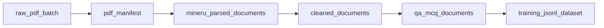
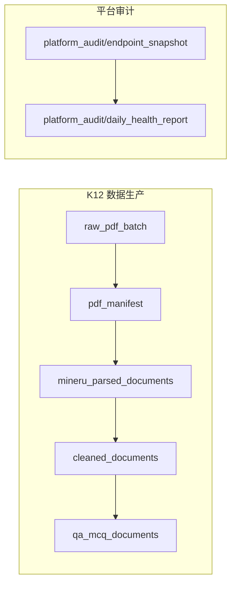
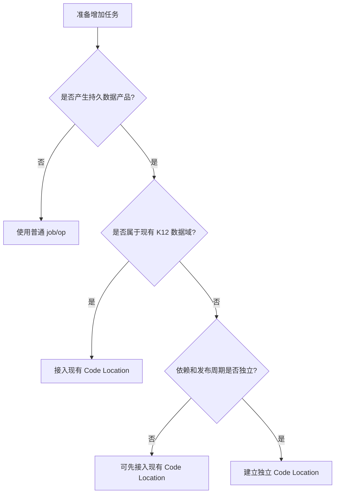
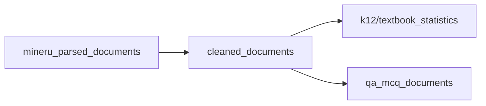
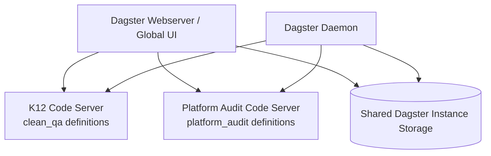
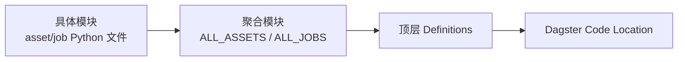

# Dagster 新任务接入与 Global Asset Lineage 指南

> 本文基于当前部署在 `110.120.0.3` 的 K12 数据生产 Dagster，详细解释 Dagster 实例、Code Location、Job、Asset、Partition、Materialization 与 Global Asset Lineage 的关系，并分别给出“增加一个现有管线的新阶段”和“增加一个完全无关的新任务”的完整代码与部署方法。

## 1. 先回答你的理解是否正确

你的理解大体正确：

> Dagster 服务部署在 `110.120.0.3` 所在的 Kubernetes 集群中。当前在这个 Dagster UI 中可见的 Job、Asset、Asset Check、Sensor，都是该 Dagster 实例当前加载的代码定义。

但还需要补充四个关键边界。

### 1.1 Dagster 服务运行在集群，定义存在于部署镜像

当前 Helm Deployment 使用：

```bash
dagster-webserver \
  -h 0.0.0.0 \
  -p 3000 \
  -m clean_qa.mineru_dagster.definitions
```

Daemon 使用同一个模块：

```bash
dagster-daemon run \
  -m clean_qa.mineru_dagster.definitions
```

这表示：

- Dagster Webserver 和 Daemon 运行在 Kubernetes Pod 中；
- Python Job/Asset 定义来自 Pod 镜像里的 `clean_qa.mineru_dagster.definitions`；
- 代码文件没有被注册进 `Definitions`，Dagster 就看不到它；
- 修改本地 Python 文件不会自动改变集群中的 Dagster；
- 必须构建新镜像并升级 Deployment，新的定义才会进入 UI。

### 1.2 计算数据不保存在 Dagster 中

当前系统的状态分布是：

| 内容 | 保存位置 |
|---|---|
| Job、Asset、Sensor 的代码定义 | Dagster 部署镜像 |
| Run ID、事件、日志、materialization 记录 | Dagster Instance Storage |
| MinerU、Stage 1、Stage 2 大文件 | MinIO/S3 |
| 并行任务和计算状态 | Ray Cluster |
| Worker 生命周期与资源 | Kubernetes/KubeRay |

所以“任务在 Dagster 上”更准确的说法是：

> Dagster 管理这个任务的定义、配置、启动、状态和元数据；真正的数据与计算可能位于 MinIO、Ray 和 Kubernetes Worker。

### 1.3 当前 UI 中可见的是当前加载的 Code Location

当前主要 Code Location 对应模块：

```text
clean_qa.mineru_dagster.definitions
```

其中的 `Definitions` 汇总：

```python
defs = Definitions(
    assets=ALL_ASSETS,
    asset_checks=ALL_CHECKS,
    jobs=[*ALL_JOBS, *ALL_PIPELINE_JOBS],
    sensors=ALL_SENSORS,
    resources={
        "s3": S3Resource(),
        "ray_jobs": RayJobResource(),
        "qwen_k8s": QwenKubernetesResource(),
    },
)
```

因此当前所有 K12 Job 和 Asset 被统一加载到同一个 Definitions/Code Location。

一个 Dagster 实例也可以同时加载多个 Code Location。此时同一个 UI 会展示多个独立代码包提供的 Job 和 Asset，并将它们的资产关系聚合为 Global Asset Lineage。

### 1.4 Dagster Instance 不等于一个代码仓库

Dagster 实例是编排控制平面；Code Location 才是代码部署边界。可以理解为：

```text
一个 Dagster Instance
├── K12 Clean/QA Code Location
├── Platform Audit Code Location
├── 用户画像 Code Location
└── 其他团队 Code Location
```

每个 Code Location 可以使用：

- 不同 Python 包；
- 不同依赖；
- 不同镜像；
- 不同发布周期；
- 不同 Kubernetes Service；
- 同一个 Dagster Instance Storage。

## 2. Global Asset Lineage 到底是什么

Global Asset Lineage 是 Dagster 根据 Asset Key 和依赖关系拼成的全局数据产品图。

当前 K12 主链路是：



每个节点代表一类持久数据产品，不是一次 Python 函数调用。

### 2.1 Asset 的身份由 Asset Key 决定

例如：

```python
AssetKey("cleaned_documents")
```

和：

```python
AssetKey(["k12", "cleaned_documents"])
```

是两个不同的 Asset Key。

在 UI 中通常显示为：

```text
cleaned_documents
k12/cleaned_documents
```

Asset Key 是 Dagster 实例内识别数据产品的核心身份。

### 2.2 `group_name` 不是命名空间

以下两个 Asset 仍然冲突：

```python
@asset(name="daily_report", group_name="team_a")
def report_a(): ...

@asset(name="daily_report", group_name="team_b")
def report_b(): ...
```

因为它们的 Asset Key 都是：

```text
daily_report
```

`group_name` 只负责 UI 分组和筛选，不参与唯一性判断。

应该使用 Asset Key 前缀：

```python
@asset(key_prefix=["team_a"], name="daily_report")
def report_a(): ...

@asset(key_prefix=["team_b"], name="daily_report")
def report_b(): ...
```

得到：

```text
team_a/daily_report
team_b/daily_report
```

### 2.3 新的无关 Asset 会怎样显示

如果增加一组与 K12 完全无依赖的 Asset：



它会成为 Global Asset Lineage 中一个断开的新连通分量。

这是正常现象，不会与原有 K12 图冲突，也不要求所有 Asset 必须连成一条链。

### 2.4 什么情况下会冲突

常见冲突包括：

1. 两个 Code Location 同时定义同一个 Asset Key，并都声称拥有它；
2. 新 Asset 使用了已有的 `cleaned_documents` 等 key；
3. 上下游分区定义不兼容，却没有声明 Partition Mapping；
4. 同一 Definitions 中 Job 名称重复；
5. 新代码依赖版本与现有镜像中的 Dagster/Ray 版本不兼容；
6. 新任务复用已有 S3 输出前缀，造成数据层覆盖；
7. 新 Job 使用了现有 Kubernetes 资源名称或 Ray submission ID。

推荐的 Asset Key 规范：

```text
<domain>/<dataset>/<stage>
```

示例：

```text
k12/textbook_statistics
platform_audit/endpoint_snapshot
platform_audit/daily_health_report
finance/invoice/normalized
```

当前既有 K12 Asset 是无前缀 key。不要为了统一命名直接重命名它们，因为更改 Asset Key 会在 Dagster 中形成全新的资产，并断开历史记录。新 Asset 可以从现在开始采用前缀规范。

## 3. Job 和 Asset 的关系

一个非常重要的结论是：

> 新 Job 不一定产生新的 Global Asset Lineage。

### 3.1 纯 Job：只管理动作，不产生 Asset 节点

```python
from dagster import job, op


@op
def send_test_request():
    return {"status": "ok"}


@op
def print_result(result):
    print(result)


@job
def endpoint_test_job():
    print_result(send_test_request())
```

这个 Job 会出现在 Jobs 页面，也会产生 Run 和日志，但不会自动出现在 Global Asset Lineage。

适合纯 Job 的任务：

- 启动或停止 Qwen Worker；
- 临时健康检查；
- 清理临时目录；
- 发送通知；
- 触发外部 API；
- 不产生长期数据产品的一次性运维动作。

### 3.2 Asset Job：运行目标是物化数据产品

```python
from dagster import asset, define_asset_job


@asset
def daily_report():
    return {"status": "ok"}


daily_report_job = define_asset_job(
    name="daily_report_job",
    selection=["daily_report"],
)
```

这里 `daily_report` 会进入 Asset Lineage，运行 `daily_report_job` 会物化该 Asset。

适合 Asset 的对象：

- 数据湖 manifest；
- MinerU 解析结果；
- 清洗语料；
- QA/MCQ 数据集；
- 训练 JSONL；
- 长期保存并被下游消费的报表或索引。

### 3.3 普通 Job 手动记录 Materialization

当前 K12 部分流程采用普通 `@job/@op`，完成后手动记录：

```python
context.log_event(
    AssetMaterialization(
        asset_key="mineru_parsed_documents",
        partition=batch_id,
        metadata={...},
    )
)
```

这种方式适合“计算主要发生在外部 Ray Job，Dagster 只负责提交和验收”的架构。

但必须注意：静态 `AssetSpec` 只建立 lineage 定义；只有实际记录 `AssetMaterialization`，Asset 页面才会出现本批次的物化事件。

## 4. 选择哪一种接入方式



建议：

| 场景 | 推荐方式 |
|---|---|
| 在 `cleaned_documents` 后增加统计、索引或导出阶段 | 同一 K12 Code Location，新 Asset |
| 增加新的 K12 Job，但复用 S3/Ray 资源 | 同一 K12 Code Location |
| 完全无关、依赖简单、只是短期演示 | 可先同一 Location，但使用独立 Asset Key 前缀 |
| 完全无关、长期维护、依赖和发布周期不同 | 独立 Python 包、镜像和 Code Location |
| 纯生命周期或运维操作 | 普通 Job，不必创建 Asset |

## 5. 示例一：给现有 K12 管线增加教材统计阶段

目标：在 `cleaned_documents` 后增加一个 `k12/textbook_statistics` Asset，读取 Stage 1 的 `blocks.jsonl`，统计每本书的块数和习题数，并将结果写回独立 S3 前缀。

新的 lineage：



这表示统计阶段和 QA 阶段都消费 Stage 1 清洗结果，二者互不阻塞。

### 5.1 目录

```text
app/data_pipeline/src/clean_qa/mineru_dagster/
├── assets/
│   ├── __init__.py
│   └── textbook_statistics.py
├── jobs/
│   ├── __init__.py
│   └── textbook_statistics_job.py
└── definitions.py
```

### 5.2 Asset 代码

文件：

```text
src/clean_qa/mineru_dagster/assets/textbook_statistics.py
```

```python
from __future__ import annotations

import json
from collections import Counter

from dagster import (
    AssetExecutionContext,
    AssetKey,
    Config,
    MaterializeResult,
    MetadataValue,
    asset,
)

from clean_qa.k12_clean_qa_pipeline.common.atomic_writer import atomic_write_json
from clean_qa.k12_clean_qa_pipeline.common.minio_client import ObjectStore
from ..partitions import batch_partitions


class TextbookStatisticsConfig(Config):
    input_bucket: str = "k12-cleaned-corpus"
    input_prefix: str = "stage1/full/stage1-v1.0.2"
    output_bucket: str = "k12-cleaned-corpus"
    output_prefix: str = "analytics/textbook-statistics-v1"


@asset(
    key=AssetKey(["k12", "textbook_statistics"]),
    deps=[AssetKey("cleaned_documents")],
    partitions_def=batch_partitions,
    group_name="k12_analytics",
    kinds={"s3", "python", "analytics"},
    description="Statistics derived from Stage 1 blocks.jsonl.",
)
def textbook_statistics(
    context: AssetExecutionContext,
    config: TextbookStatisticsConfig,
) -> MaterializeResult:
    batch_id = context.partition_key
    store = ObjectStore()
    source_prefix = config.input_prefix.rstrip("/") + "/"

    block_keys = [
        key
        for key in store.list_keys(config.input_bucket, source_prefix)
        if key.endswith("/blocks.jsonl")
    ]
    if not block_keys:
        raise RuntimeError(f"No blocks.jsonl under s3://{config.input_bucket}/{source_prefix}")

    documents = []
    total_blocks = 0
    total_exercises = 0
    block_types: Counter[str] = Counter()

    for key in sorted(block_keys):
        document_id = key.removeprefix(source_prefix).split("/", 1)[0]
        rows = [
            json.loads(line)
            for line in store.read_bytes(config.input_bucket, key)
            .decode("utf-8")
            .splitlines()
            if line.strip()
        ]
        exercise_count = sum(row.get("block_type") == "exercise" for row in rows)
        block_types.update(str(row.get("block_type", "unknown")) for row in rows)
        total_blocks += len(rows)
        total_exercises += exercise_count
        documents.append(
            {
                "document_id": document_id,
                "block_count": len(rows),
                "exercise_count": exercise_count,
            }
        )

    report = {
        "batch_id": batch_id,
        "source": f"s3://{config.input_bucket}/{config.input_prefix}",
        "document_count": len(documents),
        "total_blocks": total_blocks,
        "total_exercises": total_exercises,
        "block_types": dict(sorted(block_types.items())),
        "documents": documents,
    }
    output_key = f"{config.output_prefix.rstrip('/')}/{batch_id}/summary.json"
    atomic_write_json(store, config.output_bucket, output_key, report)

    return MaterializeResult(
        metadata={
            "batch_id": batch_id,
            "document_count": len(documents),
            "total_blocks": total_blocks,
            "total_exercises": total_exercises,
            "output": MetadataValue.path(
                f"s3://{config.output_bucket}/{output_key}"
            ),
        }
    )
```

### 5.3 为什么这段代码会连到 `cleaned_documents`

关键是：

```python
deps=[AssetKey("cleaned_documents")]
```

这告诉 Dagster：`k12/textbook_statistics` 的数据语义依赖 Stage 1 清洗结果。

两者都使用：

```python
partitions_def=batch_partitions
```

因此默认是相同 `batch_id` 对相同 `batch_id` 的依赖：

```text
cleaned_documents[batch-001]
    -> k12/textbook_statistics[batch-001]
```

如果上下游不是同一种分区，例如上游按天、下游按月，则必须显式配置 Partition Mapping，不能依靠默认映射。

### 5.4 定义 Asset Job

文件：

```text
src/clean_qa/mineru_dagster/jobs/textbook_statistics_job.py
```

```python
from dagster import AssetSelection, define_asset_job

from ..assets.textbook_statistics import textbook_statistics


textbook_statistics_job = define_asset_job(
    name="textbook_statistics_job",
    selection=AssetSelection.assets(textbook_statistics),
    description="Materialize K12 textbook statistics for one batch partition.",
)
```

### 5.5 注册 Asset

修改：

```text
src/clean_qa/mineru_dagster/assets/__init__.py
```

```python
from .textbook_statistics import textbook_statistics


ALL_ASSETS = [
    raw_pdf_batch,
    pdf_manifest,
    mineru_parsed_documents,
    cleaned_documents,
    qa_mcq_documents,
    training_jsonl_dataset,
    textbook_statistics,
]
```

### 5.6 注册 Job

修改：

```text
src/clean_qa/mineru_dagster/jobs/__init__.py
```

```python
from .textbook_statistics_job import textbook_statistics_job


ALL_JOBS = [
    # 现有 Job...
    textbook_statistics_job,
]
```

现有顶层 `definitions.py` 已经引用 `ALL_ASSETS` 和 `ALL_JOBS`，不需要再单独修改它。

### 5.7 Run Config

```yaml
ops:
  textbook_statistics:
    config:
      input_bucket: k12-cleaned-corpus
      input_prefix: stage1/full/stage1-v1.0.2
      output_bucket: k12-cleaned-corpus
      output_prefix: analytics/textbook-statistics-v1
```

运行时还要选择一个 `batch_id` partition。推荐从 Dagster Asset 页面选择 Materialize，并指定已存在的 Stage 1 批次。

### 5.8 这个例子中的完成证据

成功必须同时满足：

- Dagster Run 为 `SUCCESS`；
- `k12/textbook_statistics[batch_id]` 出现 materialization；
- metadata 显示文档数、块数和习题数；
- MinIO 中存在 `summary.json`；
- 输出前缀不与 Stage 1 源前缀重叠。

## 6. 示例二：增加一个完全无关的平台 Endpoint 审计任务

假设要增加一个任务，每天检查若干 HTTP Endpoint 的状态并生成健康报告。它与 K12 PDF、MinerU 和 Qwen 完全无关。

### 6.1 先判断它是否应该是 Asset

如果只是点击按钮看一次 HTTP 结果，可以写普通 Job，不需要 Asset。

如果每天的报告要长期保存、追踪历史、被告警或下游消费，就应该建模为 Asset：

```text
platform_audit/endpoint_snapshot
    -> platform_audit/daily_health_report
```

### 6.2 独立包目录

```text
app/data_pipeline/src/platform_audit/
├── __init__.py
├── assets.py
└── definitions.py
```

演示阶段可以被同一个数据管线镜像打包；长期生产建议将其拆为独立镜像和 Code Location。

### 6.3 完整 Asset 代码

文件：

```text
src/platform_audit/assets.py
```

```python
from __future__ import annotations

import time
from datetime import datetime, timezone

import requests
from dagster import (
    AssetExecutionContext,
    AssetIn,
    AssetKey,
    Config,
    DailyPartitionsDefinition,
    MaterializeResult,
    MetadataValue,
    Output,
    asset,
)


audit_partitions = DailyPartitionsDefinition(start_date="2026-01-01")


class EndpointSnapshotConfig(Config):
    endpoints: list[str] = [
        "http://example-service.default.svc.cluster.local:8080/health",
    ]
    timeout_seconds: float = 5.0


@asset(
    key=AssetKey(["platform_audit", "endpoint_snapshot"]),
    partitions_def=audit_partitions,
    group_name="platform_audit",
    kinds={"http", "monitoring"},
)
def endpoint_snapshot(
    context: AssetExecutionContext,
    config: EndpointSnapshotConfig,
):
    rows = []
    for endpoint in config.endpoints:
        started = time.perf_counter()
        try:
            response = requests.get(endpoint, timeout=config.timeout_seconds)
            status_code = response.status_code
            healthy = 200 <= status_code < 300
            error = None
        except requests.RequestException as exc:
            status_code = None
            healthy = False
            error = repr(exc)

        rows.append(
            {
                "endpoint": endpoint,
                "healthy": healthy,
                "status_code": status_code,
                "latency_ms": round((time.perf_counter() - started) * 1000, 2),
                "error": error,
                "observed_at": datetime.now(timezone.utc).isoformat(),
            }
        )

    yield Output(
        rows,
        metadata={
            "partition": context.partition_key,
            "endpoint_count": len(rows),
            "healthy_count": sum(row["healthy"] for row in rows),
        },
    )


@asset(
    key=AssetKey(["platform_audit", "daily_health_report"]),
    ins={
        "snapshot": AssetIn(
            key=AssetKey(["platform_audit", "endpoint_snapshot"])
        )
    },
    partitions_def=audit_partitions,
    group_name="platform_audit",
    kinds={"json", "monitoring"},
)
def daily_health_report(
    context: AssetExecutionContext,
    snapshot: list[dict],
) -> MaterializeResult:
    unhealthy = [row for row in snapshot if not row["healthy"]]
    report = {
        "date": context.partition_key,
        "status": "healthy" if not unhealthy else "degraded",
        "endpoint_count": len(snapshot),
        "unhealthy_count": len(unhealthy),
        "results": snapshot,
    }

    # 生产实现应把 report 原子写入专属对象存储前缀。
    context.log.info("Daily endpoint report: %s", report)

    return MaterializeResult(
        metadata={
            "status": report["status"],
            "endpoint_count": len(snapshot),
            "unhealthy_count": len(unhealthy),
            "report_preview": MetadataValue.json(report),
        }
    )
```

### 6.4 Definitions 代码

文件：

```text
src/platform_audit/definitions.py
```

```python
from dagster import AssetSelection, Definitions, define_asset_job

from .assets import audit_partitions, daily_health_report, endpoint_snapshot


platform_audit_daily_job = define_asset_job(
    name="platform_audit_daily_job",
    selection=AssetSelection.assets(
        endpoint_snapshot,
        daily_health_report,
    ),
)


defs = Definitions(
    assets=[endpoint_snapshot, daily_health_report],
    jobs=[platform_audit_daily_job],
)
```

### 6.5 为什么它不会与 K12 冲突

它的 Asset Key 是：

```text
platform_audit/endpoint_snapshot
platform_audit/daily_health_report
```

K12 使用：

```text
raw_pdf_batch
pdf_manifest
mineru_parsed_documents
cleaned_documents
qa_mcq_documents
training_jsonl_dataset
```

两者 key 不同、依赖不同、分区不同，因此 Global Asset Lineage 中会出现两组互不相连的节点。

## 7. 同一 Code Location 接入完全无关任务

这是改动最少的方案，适合短期演示或同一团队维护的小任务。

### 7.1 汇总到现有 Definitions

```python
from platform_audit.assets import daily_health_report, endpoint_snapshot
from platform_audit.definitions import platform_audit_daily_job


defs = Definitions(
    assets=[
        *ALL_ASSETS,
        endpoint_snapshot,
        daily_health_report,
    ],
    asset_checks=ALL_CHECKS,
    jobs=[
        *ALL_JOBS,
        *ALL_PIPELINE_JOBS,
        platform_audit_daily_job,
    ],
    sensors=ALL_SENSORS,
    resources={...},
)
```

### 7.2 优点

- 不需要改变 Dagster Webserver 加载方式；
- 复用现有镜像和 Helm Chart；
- 新 Job 很快出现在同一个 UI；
- 可直接使用现有 Dagster Instance Storage。

### 7.3 缺点

- 新任务依赖会进入 K12 镜像；
- 发布新任务需要重启 K12 Code Location；
- 一个错误 import 可能导致整个 Definitions 加载失败；
- 不同团队共享发布节奏；
- 长期容易把 `clean_qa` 包变成混合业务集合。

所以完全无关任务虽然可以这样接入，但不应长期堆在 `clean_qa.mineru_dagster.definitions` 中。

## 8. 独立 Code Location 接入完全无关任务

这是长期推荐方案。

### 8.1 目标拓扑



### 8.2 每个 Code Location 单独启动 gRPC Server

K12：

```bash
dagster api grpc \
  -h 0.0.0.0 \
  -p 4000 \
  -m clean_qa.mineru_dagster.definitions
```

Platform Audit：

```bash
dagster api grpc \
  -h 0.0.0.0 \
  -p 4000 \
  -m platform_audit.definitions
```

二者通常位于不同 Deployment/Service，所以可以使用相同容器端口。

### 8.3 Workspace 配置

```yaml
load_from:
  - grpc_server:
      host: k12-clean-qa-code.k12.svc.cluster.local
      port: 4000
      location_name: k12_clean_qa

  - grpc_server:
      host: platform-audit-code.platform.svc.cluster.local
      port: 4000
      location_name: platform_audit
```

Webserver 和 Daemon 改为加载 workspace：

```bash
dagster-webserver -h 0.0.0.0 -p 3000 -w /opt/dagster/workspace.yaml
```

```bash
dagster-daemon run -w /opt/dagster/workspace.yaml
```

当前部署使用 `-m clean_qa.mineru_dagster.definitions` 直接加载单一模块。要启用真正的多 Code Location，需要将 Helm 模板升级为 workspace/gRPC 结构。不能只创建第二个 Python 文件就期待 Webserver 自动发现它。

### 8.4 独立 Code Location 的优点

- Python 依赖隔离；
- 镜像与发布周期隔离；
- 新任务部署失败不必重建 K12 镜像；
- Code Location 可以单独 reload；
- UI 仍然展示统一 Global Asset Lineage；
- Job 名称、资源和日志更容易按团队管理。

### 8.5 资产跨 Code Location 依赖

如果独立 Location 的 Asset 要依赖 K12 Asset，可以引用同一个上游 Asset Key：

```python
from dagster import AssetKey, AssetSpec, asset


k12_cleaned_documents = AssetSpec(
    key=AssetKey("cleaned_documents"),
)


@asset(
    key_prefix=["analytics"],
    deps=[AssetKey("cleaned_documents")],
)
def textbook_dashboard():
    ...
```

原则是：

- 上游拥有者只在一个 Code Location 中定义可执行 Asset；
- 下游 Location 只引用上游 Asset Key 或声明外部 AssetSpec；
- 不要在两个 Location 中重复实现同一个 Asset Key；
- 两个 Location 必须连接到同一个 Dagster Instance，UI 才能拼接全局 lineage。

## 9. 从代码到集群的完整操作流程

### 9.1 开发前检查

```bash
cd /home/admin/Desktop/sql/kcc/app/data_pipeline

git status --short
python -m pytest
```

确认：

- 不覆盖现有用户修改；
- 新 Asset Key 不与现有 key 重复；
- 新 Job 名称不与当前 Definitions 中名称重复；
- 新输出前缀不覆盖生产结果；
- 新依赖已加入 `pyproject.toml` 和 `requirements.txt`。

### 9.2 本地加载检查

```bash
PYTHONPATH=src \
python -c '
from clean_qa.mineru_dagster.definitions import defs
repository = defs.get_repository_def()
print("jobs:")
for job_def in sorted(repository.get_all_jobs(), key=lambda value: value.name):
    print(" -", job_def.name)
print("assets:")
for asset_key in sorted(
    repository.asset_graph.get_all_asset_keys(),
    key=lambda value: value.to_user_string(),
):
    print(" -", asset_key.to_user_string())
'
```

也可以使用 Dagster CLI 检查 Job：

```bash
PYTHONPATH=src \
dagster job list -m clean_qa.mineru_dagster.definitions
```

### 9.3 运行针对性测试

```bash
PYTHONPATH=src \
pytest -q src/clean_qa/k12_clean_qa_pipeline
```

新任务应增加自己的测试目录，例如：

```text
src/platform_audit/tests/test_assets.py
```

至少测试：

- 配置解析；
- Asset Key；
- 上下游依赖；
- 分区键；
- 正常响应；
- 超时响应；
- 输出前缀安全；
- 重跑幂等性。

### 9.4 构建并推送镜像

使用现有脚本：

```bash
cd /home/admin/Desktop/sql/kcc/app/data_pipeline

IMAGE_REPOSITORY=<private-registry>/k12-data-pipeline \
IMAGE_TAG=<new-immutable-tag> \
IMAGE_PUSH=1 \
./scripts/clean_qa/build-image.sh
```

不要复用可变生产 tag。新 tag 应能对应到 Git commit 或构建日期。

### 9.5 Helm 升级

```bash
IMAGE_TAG=<new-immutable-tag> \
./scripts/clean_qa/upgrade_pipeline.sh \
  --set-string dagster.image.tag=<new-immutable-tag>
```

然后检查：

```bash
kubectl -n k12 rollout status \
  deployment/<dagster-deployment-name>

./scripts/clean_qa/status_pipeline.sh
```

### 9.6 检查 Code Location

在 Dagster UI 中检查：

- Deployment/Code Location 状态为 Loaded；
- 新 Job 出现在 Jobs 页面；
- 新 Asset 出现在 Assets 页面；
- Global Asset Lineage 的边符合设计；
- 旧 K12 Asset 和 Job 仍能加载；
- Launchpad Schema 能生成合法默认配置。

### 9.7 先 Dry Run，再 Smoke

对于会写数据或提交 Ray 的任务，推荐：

```yaml
dry_run: true
```

先验证：

- manifest；
- 参数；
- 目标前缀；
- Ray entrypoint；
- 资源声明；
- 不执行实际写入。

之后使用独立 smoke 前缀运行少量数据。

## 10. 如何提交新任务

### 10.1 从 Dagster UI 提交

1. 通过 SSH 隧道访问 Dagster：

```bash
ssh -L 13000:127.0.0.1:30080 admin@110.120.0.3
```

2. 打开：

```text
http://127.0.0.1:13000
```

3. 选择对应 Code Location 和 Job；
4. 打开 Launchpad；
5. 填写 Run Config；
6. 对 Asset Job 选择 partition；
7. 点击 Launch Run；
8. 从 Run 页面查看步骤、日志和 metadata；
9. 从 Asset 页面查看 materialization 和 checks。

### 10.2 使用现有命令行入口

现有脚本支持将配置复制到 Dagster Pod 并执行 Job：

```bash
cd /home/admin/Desktop/sql/kcc/app/data_pipeline

./scripts/clean_qa/run-dagster-job.sh \
  textbook_statistics_job \
  /absolute/path/textbook-statistics.yaml
```

脚本内部执行：

```bash
dagster job execute \
  -m clean_qa.mineru_dagster.definitions \
  -j textbook_statistics_job \
  -c /tmp/textbook-statistics.yaml
```

对于 partitioned Asset Job，命令行还需要传递分区选择；若现有脚本没有暴露 partition 参数，应优先从 UI 运行，或扩展脚本显式接收 partition，而不是把 partition 写死在代码里。

### 10.3 通过 Schedule 或 Sensor 自动提交

只有满足明确事件驱动条件时才增加 Sensor。例如：

```text
发现新的 MinerU _SUMMARY.json 成功文件
    -> 注册 batch_id partition
    -> 提交 Stage 1 Job
```

Sensor 必须保存 cursor，防止同一对象反复提交：

```python
from dagster import RunRequest, SensorEvaluationContext, sensor


@sensor(job=textbook_statistics_job, minimum_interval_seconds=60)
def new_cleaned_batch_sensor(context: SensorEvaluationContext):
    last_seen = context.cursor
    new_batch_id = find_next_completed_batch(after=last_seen)
    if not new_batch_id:
        return

    yield RunRequest(
        run_key=f"textbook-statistics:{new_batch_id}",
        partition_key=new_batch_id,
        run_config={
            "ops": {
                "textbook_statistics": {
                    "config": {
                        "input_prefix": "stage1/full/stage1-v1.0.2",
                        "output_prefix": "analytics/textbook-statistics-v1",
                    }
                }
            }
        },
    )
    context.update_cursor(new_batch_id)
```

`run_key` 防止同一批次生成重复 Run；`cursor` 防止 Sensor 每次扫描全量历史。

## 11. Definitions 注册规则

新增任务后至少检查三层引用：



常见“代码写了但 UI 看不到”的原因：

- 忘了加入 `ALL_ASSETS`；
- 忘了加入 `ALL_JOBS`；
- 顶层 `Definitions` 没有引用新聚合数组；
- Dockerfile 没有复制新包；
- Python 包发现配置没有包含新目录；
- 镜像 tag 没变化，节点复用了旧镜像；
- Deployment 没有滚动重启；
- Code Location import 失败；
- Webserver 和 Daemon 加载的不是同一个 definitions 模块。

## 12. 新任务使用 Ray 的标准封装

如果完全无关任务需要大规模并行，也可以复用 Ray，但应保持控制面和数据面分离。

### 12.1 Dagster 只提交

```python
from dagster import Config, MetadataValue, op


class AuditRayConfig(Config):
    input_uri: str
    output_uri: str
    max_inflight: int = 8
    dry_run: bool = True


@op(required_resource_keys={"ray_jobs"})
def submit_audit_ray_job(context, config: AuditRayConfig) -> dict:
    job_id = f"platform-audit-{context.run_id[:8]}"
    entrypoint = (
        "python -m platform_audit.ray_driver "
        f"--input-uri {config.input_uri} "
        f"--output-uri {config.output_uri} "
        f"--max-inflight {config.max_inflight}"
    )
    if not config.dry_run:
        context.resources.ray_jobs.submit(job_id, entrypoint)
    context.add_output_metadata(
        {
            "ray_job_id": job_id,
            "entrypoint": MetadataValue.text(entrypoint),
            "submitted": not config.dry_run,
        }
    )
    return {"ray_job_id": job_id, "output_uri": config.output_uri}
```

生产代码构造 shell entrypoint 时应使用 `shlex.quote()` 处理用户参数，防止空格和命令注入；这里为突出结构省略了该部分。

### 12.2 Ray Worker 直接读写数据

```python
@ray.remote(num_cpus=1, max_retries=1)
def process_one(item: dict) -> dict:
    source = read_from_object_store(item["input_uri"])
    result = transform(source)
    atomic_write(item["output_uri"], result)
    return {
        "item_id": item["item_id"],
        "status": "success",
    }
```

不要把大文件作为 Dagster op 输出，也不要经 Ray Head 将大对象返回 Dagster。返回小型状态对象，正文直接写入对象存储。

### 12.3 Dagster 等待并验收

```python
@op(required_resource_keys={"ray_jobs", "s3"})
def validate_audit_job(context, state: dict) -> dict:
    status = context.resources.ray_jobs.wait(state["ray_job_id"])
    if str(status) != "SUCCEEDED":
        raise RuntimeError(
            context.resources.ray_jobs.logs(state["ray_job_id"])[-8000:]
        )

    summary = context.resources.s3.read_json(
        "audit-bucket",
        state["summary_key"],
    )
    if summary.get("failed_count") != 0:
        raise RuntimeError(f"Audit output failed validation: {summary}")
    return summary
```

这与当前 K12 Stage 1 的模式一致：

```text
Dagster 提交
    -> Ray 执行
    -> Worker 直接读写 S3
    -> Dagster 读取 summary 验收
```

## 13. 新 Asset 的数据合同

不要只定义一条 lineage 边，还要定义数据完成语义。

推荐每个持久数据阶段至少包含：

```text
<output_prefix>/
├── _RUN_MANIFEST.json
├── _PROGRESS.json
├── _SUMMARY.json
├── _FAILED.jsonl
└── <partition-or-item>/
    ├── data files
    └── _SUCCESS.json
```

### 13.1 `_SUCCESS.json` 应包含

```json
{
  "status": "success",
  "asset_key": "platform_audit/daily_health_report",
  "partition_key": "2026-09-15",
  "code_version": "v1.0.0",
  "source_sha256": "...",
  "artifact_sha256": {
    "summary.json": "..."
  },
  "completed_at": "2026-09-15T00:00:00Z"
}
```

### 13.2 Resume 条件

只在以下条件全部满足时跳过：

```text
成功标记存在
代码/数据版本一致
源 ETag 或 SHA 一致
必要产物全部存在
产物哈希符合合同
```

### 13.3 输出前缀安全

运行前必须检查：

```python
if output_bucket == input_bucket and output_prefix.startswith(
    input_prefix.rstrip("/") + "/"
):
    raise ValueError("output prefix overlaps input prefix")
```

全量任务与 smoke 必须使用不同前缀。

## 14. Partition 设计

Partition 回答的是“同一种 Asset 有哪些可独立运行和追踪的切片”。

### 14.1 K12 批次分区

```python
batch_partitions = DynamicPartitionsDefinition(name="batch_id")
```

适合：

```text
一批 PDF
一次 MinerU 生产批次
一轮 Stage 1/Stage 2 版本化处理
```

### 14.2 日期分区

```python
DailyPartitionsDefinition(start_date="2026-01-01")
```

适合平台健康报告、每日统计和日志快照。

### 14.3 不应该把每本文档都注册成全局动态分区的情况

如果一次有 2,595 本书且每本书只是一个批次内部 Task，通常保留：

```text
Asset partition = batch_id
Ray task = document_id
```

这样 Dagster 管批次资产，Ray 管高基数文档并行。若把所有文档都做成 Dagster Partition 或动态映射，UI 和事件存储会产生更高压力。只有确实需要逐书回填、逐书 SLA 或逐书独立物化时才这样设计。

## 15. Asset Check 设计

新 Asset 至少应检查：

- `_SUMMARY.json` 状态成功；
- 输入数量和输出数量匹配；
- 失败数为 0，或符合允许的部分成功策略；
- 必要文件存在；
- JSON/JSONL 可解析；
- `_SUCCESS.json` 最后写入；
- 源对象没有被修改；
- 业务指标在合理范围内。

示例：

```python
from dagster import AssetCheckResult, AssetKey, asset_check


@asset_check(
    asset=AssetKey(["platform_audit", "daily_health_report"]),
    name="all_endpoints_observed",
    partitions_def=audit_partitions,
)
def all_endpoints_observed(context):
    report = read_report(context.partition_key)
    expected = report["endpoint_count"]
    actual = len(report["results"])
    return AssetCheckResult(
        passed=expected == actual,
        metadata={"expected": expected, "actual": actual},
    )
```

Asset Check 是资产质量判断，不应偷偷重跑昂贵计算。

## 16. Resource 设计

Dagster Resource 用于注入外部系统客户端和配置，例如当前：

```text
s3       -> MinIO/S3 client
ray_jobs -> Ray JobSubmissionClient
qwen_k8s -> Kubernetes Worker lifecycle client
```

完全无关任务有自己的外部系统时，应定义新 Resource：

```python
from dagster import ConfigurableResource, EnvVar


class AuditApiResource(ConfigurableResource):
    base_url: str = EnvVar("AUDIT_API_BASE_URL")
    token: str = EnvVar("AUDIT_API_TOKEN")

    def get_status(self):
        ...
```

敏感值必须来自 Kubernetes Secret，不写进：

- Python 源码；
- `values.yaml`；
- Launchpad 默认配置；
- Git 仓库；
- Dagster metadata。

如果采用独立 Code Location，它可以拥有独立 ServiceAccount、Secret 和最小 RBAC，不必继承 K12 管线对 NPU Worker 的生命周期权限。

## 17. 命名和冲突检查表

新增任务前检查：

| 对象 | 唯一性范围 | 推荐命名 |
|---|---|---|
| Asset Key | 整个 Dagster Asset Graph | `<domain>/<dataset>` |
| Job Name | Repository/Code Location 内必须唯一 | `<domain>_<purpose>_job` |
| Dynamic Partition Name | Dagster Instance Storage | `<domain>_<dimension>` |
| Sensor Name | Repository 内唯一 | `<domain>_<event>_sensor` |
| Schedule Name | Repository 内唯一 | `<domain>_<cadence>_schedule` |
| Ray Submission ID | Ray Cluster 当前和历史 Job | `<domain>-<purpose>-<run-id>` |
| S3 Prefix | Bucket 内 | `<domain>/<stage>/<version>/<run-or-batch>` |
| Kubernetes Resource | Namespace 内 | `<release>-<component>` |
| ConfigMap/Secret | Namespace 内 | `<domain>-<purpose>` |

尤其注意：不同 `group_name` 不能避免 Asset Key 冲突。

## 18. 新任务发布后的验收清单

### 18.1 Definitions

- 新模块可以 import；
- Code Location 为 Loaded；
- 新 Job 可见；
- 新 Asset 可见；
- 旧 Job 和 Asset 数量没有异常减少；
- 没有 Duplicate Asset Key 错误。

### 18.2 Global Asset Lineage

- 新阶段连接到正确上游；
- 完全无关任务显示为独立子图；
- 没有错误连到 K12 Asset；
- `group_name` 仅用于展示；
- Asset Key 符合域前缀规范。

### 18.3 执行

- Launchpad Schema 正确；
- Dry Run 不产生写入；
- Smoke 使用独立输出前缀；
- Run metadata 包含输入、输出和版本；
- 外部 Ray Job ID 可追踪；
- Worker 资源与任务类型匹配；
- 纯 CPU 任务没有申请 NPU。

### 18.4 数据

- 输入只读；
- 输出原子发布；
- 单项 `_SUCCESS.json` 最后写；
- `_SUMMARY.json` 可解析；
- Resume 能正确跳过；
- 版本变化能触发重跑；
- Asset materialization metadata 指向真实 S3 URI。

### 18.5 权限

- 使用专用 ServiceAccount；
- Kubernetes RBAC 为最小权限；
- S3 权限限制到必要 bucket/prefix；
- 恢复测试若需要删除，只开放测试前缀的删除权限；
- Token 和密码来自 Secret。

## 19. 常见误解

### 19.1 “我在 Python 中写了 Job，Dagster 就会自动发现”

不会。必须进入 `Definitions`，并把包含它的新镜像部署到 Code Location。

### 19.2 “新 Job 一定会出现在 Global Asset Lineage”

不会。只有 Asset 定义进入 lineage。普通 Job 只产生 Run。

### 19.3 “给新 Asset 换一个 group_name 就不会冲突”

不对。必须使用不同 Asset Key。

### 19.4 “完全无关的 Asset 不能放在同一个 Dagster 中”

可以。它会形成独立子图。Dagster 的 Global Asset Lineage 本来就允许多个数据域共存。

### 19.5 “同一个 Dagster UI 只能有一个 Code Location”

不对。一个实例可以加载多个 Code Location，并统一展示 Job、Run 与资产图。

### 19.6 “在两个 Code Location 中定义同一个 Asset，可以自动合并”

通常不可以。Dagster 需要明确的资产所有权。一个 Location 拥有可执行定义，其他 Location 只引用该 Asset Key 或声明外部依赖。

### 19.7 “Job 成功就说明 Asset 已 materialize”

不一定。普通 op-based Job 必须显式记录 `AssetMaterialization`；asset-based Job 才会由 Dagster 自动记录对应 Asset 物化。

## 20. 对当前项目的推荐路线

### 20.1 增加 K12 新阶段

继续放在：

```text
src/clean_qa/
```

并：

- 复用 `S3Resource`、`RayJobResource`；
- 复用 `batch_partitions`；
- 使用新的 Asset Key 前缀；
- 通过 `ALL_ASSETS`、`ALL_JOBS` 汇总；
- 为每次成功 Run 显式 materialize 对应 Asset partition；
- 保持 `_SUCCESS.json` 和版本化前缀合同。

### 20.2 增加完全不相关的短期演示任务

可以先建立独立 Python 包：

```text
src/platform_audit/
```

然后暂时汇总到当前顶层 `Definitions`，但必须：

- 使用 `platform_audit/...` Asset Key；
- 使用独立 group；
- 使用独立输出前缀；
- 不复用不需要的 NPU/Ray Resource；
- 不把平台任务文件放到 `k12_clean_qa_pipeline` 包内部。

### 20.3 增加完全无关的长期生产任务

升级为独立 Code Location：

```text
独立包
  -> 独立 Definitions
  -> 独立镜像
  -> 独立 Deployment/Service
  -> Dagster workspace.yaml 加载
```

这样它仍然属于同一个 Dagster 控制平面和 Global Asset Lineage，但不会与 K12 代码、依赖和发布周期耦合。

## 21. 一段可直接用于讲解的话

> 我们的 Dagster 服务部署在 `110.120.0.3` 所在的 Kubernetes 集群。UI 中看到的 Job 和 Asset 来自当前加载的 Python Code Location，而不是 Dagster 自动扫描机器目录。Job 描述一次计算如何执行，Asset 描述长期存在的数据产品，Global Asset Lineage 则根据 Asset Key 和依赖关系把所有 Code Location 的数据产品拼成全局图。新增一个普通 Job 不会自动产生 lineage；只有新增 Asset 或记录 Asset materialization 才会影响资产图。完全无关的任务可以安全接入同一个 Dagster，它会显示成一组独立节点，只要使用全局唯一的 Asset Key，例如 `platform_audit/daily_health_report`。短期任务可以先加入当前 Definitions，长期独立业务更适合使用自己的包、镜像和 Code Location，由同一个 Dagster Webserver 通过 workspace 统一加载。

## 22. 最终结论

你的原始理解可以修正为：

```text
Dagster Instance 部署在 110.120.0.3 集群
    -> 当前加载一个主要 K12 Code Location
    -> Code Location 从部署镜像读取 Definitions
    -> Definitions 注册 Jobs / Assets / Checks / Sensors / Resources
    -> Jobs 产生 Runs
    -> Assets 形成 Global Asset Lineage
    -> Materializations 记录某个 Asset Partition 的实际生成事件
    -> MinIO 保存真实数据产品
    -> Ray/Kubernetes 执行实际计算
```

增加现有管线阶段时，应连接现有 Asset Key 并复用批次分区；增加完全无关任务时，可以在同一 Global Asset Lineage 中形成独立子图。两者不会因为“出现在同一个 Dagster UI”而互相冲突，真正需要保证唯一的是 Asset Key、Job/资源名称和数据输出位置。长期无关业务应采用独立 Code Location，获得更清晰的依赖、权限和发布边界。
