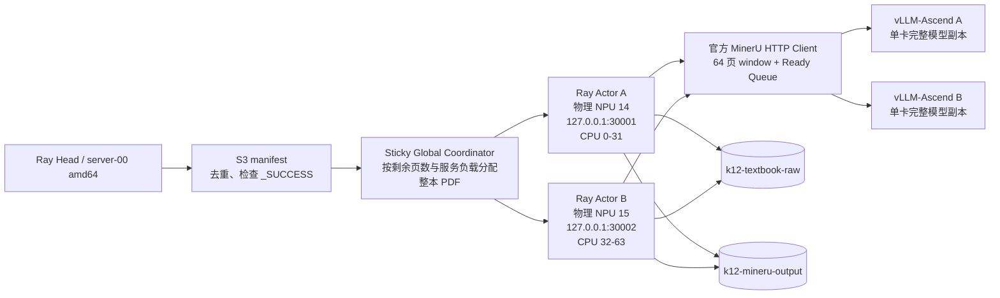

# Ascend 910C 双 NPU MinerU 实验报告与运行手册

实验时间：2026-07-17 UTC  
命名空间：`k12`  
Ray 集群：`raycluster-k12-smoke`  
输入：`s3://k12-textbook-raw/.../batch_id=k12_pdf_full_20260713T062427Z/`  
输出：`s3://k12-mineru-output/test-output/mineru-dual-prod-20260717T040200Z/`

## 1. 结论

双卡生产实验成功完成。30 个 PDF、3233 页全部成功，所有输出页数与 manifest 完全一致；没有 NPU OOM、Pod OOM、vLLM 重载或推理 window 失败。

| 指标 | 结果 |
| --- | ---: |
| 总 PDF / 成功 PDF | 30 / 30 |
| 总页数 / 页数校验 | 3233 / 3233 |
| 总墙钟时间 | 1061.990 s（17 分 42 秒） |
| 总吞吐 | **3.044 pages/s** |
| 服务 A（物理 14） | 15 PDF，1594 页，约 1.50 pages/s |
| 服务 B（物理 15） | 15 PDF，1639 页，约 1.54 pages/s |
| 单卡已验证基线 | 约 1.55 pages/s |
| 相对单卡扩展倍率 | **1.96x** |
| 上传工件 | 180 个，490,316,345 bytes，17 个 multipart |
| Pod 内存峰值 / 上限 | 66.32 GiB / 256 GiB |
| Pod 内存 OOM 事件 | 0 |

这已经接近两个独立单卡服务的线性叠加。下一轮若要继续提高吞吐，优先小步验证每卡的 vLLM 调度容量，而不是再增加 PDF 级并发：两张卡的 `running_requests` P90 已到 282、最大到 287，已经接近 `max_num_seqs=288`；同时 `waiting_requests` 平均约 27，说明请求并不缺。

## 2. 最终架构



Head 只读取 manifest、生成任务描述和收集结果；PDF 下载、渲染、推理、归档和上传均在 A3 Worker 内完成。每本 PDF 在提交后固定归属于 A 或 B，不会因 window 乱序迁移。服务失活时协调器停止向该服务提交新 PDF，未开始的任务才会保留给健康服务选择。

## 3. Kubernetes、设备和 Ray 资源

Worker 定义在 [mineru-npu-worker-ascend910-14-15.yaml](../k8s/mineru-npu-worker-ascend910-14-15.yaml)。实际验证结果如下。

| 项目 | A | B |
| --- | --- | --- |
| 物理 Phy-ID | 14 | 15 |
| 容器逻辑设备 | 14，对应 `/dev/davinci14` | 15，对应 `/dev/davinci15` |
| `npu-smi` 设备位置 | NPU 7 / chip 0 | NPU 7 / chip 1 |
| HTTP 端口 | 30001 | 30002 |
| CPU 亲和性 | 0-31 | 32-63 |
| Ray 自定义资源 | `NPU=1, MINERU_NPU=1` | `NPU=1, MINERU_NPU=1` |

Pod 请求和限制均为 `cpu: 64`、`memory: 256Gi`、`huawei.com/Ascend910: 2`；Ray 节点注册为 `CPU=64, NPU=2, MINERU_NPU=2`。物理到逻辑设备映射不写死在启动命令中，由 [discover_npu_mapping.py](discover_npu_mapping.py) 在 Pod 重建后读取 `npu-smi info -m` 和 `/dev/davinci*` 验证后生成。

## 4. MinerU 代码改动和语义

本实现没有替换 MinerU 的识别算法，也没有把 Flash-MinerU、CUDA 或通用 vLLM 代码移入镜像。推理仍然使用：

- 常驻 `mineru-vllm-server`（每卡一个单卡模型副本，未启用 tensor parallel）；
- MinerU 官方 HTTP client；
- 官方 `aio_concurrent_two_step_extract()`；
- 官方 `append_page_blocks_to_middle_json()` 和 `finalize_middle_json()`；
- 原有 S3 下载、`images.tar.zst` 归档和 multipart 上传逻辑。

新增部分的边界如下。

| 文件 | 作用 |
| --- | --- |
| [official_window_pipeline.py](../official_window_pipeline.py) | 使用 64 页官方 processing window；将渲染、官方 two-step 推理和有序 `middle_json` 组装重叠；页面最终仍按原页序 append/finalize。 |
| [dual_service_actor.py](dual_service_actor.py) | 每张卡一个 Ray actor、独立线程池与 Ready Window Queue；直接从 S3 下载并回写结果；每秒写服务监控 JSONL。 |
| [dual_ray_job.py](dual_ray_job.py) | Head 侧 manifest 去重和 `_SUCCESS.json` 跳过；基于估计剩余时间与活跃 window 的粘性整本 PDF 调度。 |
| [start_dual_vllm.sh](start_dual_vllm.sh) | 映射物理卡，启动两个独立 HTTP 服务并用 `taskset` 隔离 CPU。 |
| [official_concurrent_runner.py](../official_concurrent_runner.py) | 工件 allowlist：上传 MD/JSON/TXT 与 `images.tar.zst`，不上传输入 PDF；8 MiB 阈值、16 MiB 分片、并发 4 的上传。 |
| [summarize_monitor.py](summarize_monitor.py) | 汇总每个服务 JSONL 中的 AICore、HBM、vLLM 队列与 RSS 指标。 |

每个服务的运行参数为：`inference_slots=4`、`document_inflight=5`、`window_prefetch=1`、`max_num_seqs=288`、`max_num_batched_tokens=2560`。`window_prefetch=1` 的意思是只额外保留一个已渲染 window，避免多个 64 页图像同时常驻内存。

## 5. 监控与性能分析

每秒的服务监控来自 `service-A/service-monitor.jsonl` 和 `service-B/service-monitor.jsonl`。以下为本次生产运行的完整样本汇总。

| 指标 | 服务 A / 物理 14 | 服务 B / 物理 15 |
| --- | ---: | ---: |
| 监控样本 | 615 | 618 |
| AICore 平均 / P50 / P90 / 最大 | 55.95 / 48 / 100 / 100 % | 56.75 / 50 / 100 / 100 % |
| AICore 非零样本占比 | 98.5 % | 97.1 % |
| HBM 平均 / 最大 | 70.65 / 71 % | 66 / 66 % |
| vLLM running 平均 / P90 / 最大 | 175.14 / 282 / 287 | 171.35 / 282 / 287 |
| vLLM waiting 平均 / P90 / 最大 | 26.76 / 94 / 188 | 27.23 / 92 / 154 |
| waiting 大于零的样本占比 | 44.8 % | 49.0 % |
| Actor RSS 峰值 | 12.54 GiB | 14.74 GiB |

两张 NPU 都长期有工作，且 P90 达到 100% AICore；但平均约 56%，反映 PDF 渲染、block prepare、结果解析和文档尾部不均衡仍会产生空档。`waiting` 经常非零且 `running` 已逼近 288，因此此配置下“增加文档数量”不会显著提高单卡吞吐；应先以一次一个变量的方式测试 `max_num_seqs` 或 `max_num_batched_tokens`，并在 HBM、P95 请求延迟和健康检查不恶化时保留变更。

上传不是瓶颈。30 本中上传阶段累计 9.895 秒（A 5.337 秒、B 4.558 秒），相对累计解析阶段 10190.878 秒极小；该累计值是并行文档的工作量之和，不应拿来与 1061.990 秒总墙钟直接相减。上传的每个文件都做 HEAD 校验，图片以压缩包上传，避免大量小对象。

## 6. 输出结构和幂等性

每本成功 PDF 都写入：

```text
s3://k12-mineru-output/<output-prefix>/<document_id>/
  artifacts/<document_id>/vlm/*.md
  artifacts/<document_id>/vlm/*.json
  artifacts/images.tar.zst
  _SUCCESS.json
  _RESULT.json
```

作业根目录还写入 `_HEAD_MANIFEST.json` 和 `_SUMMARY.json`。重新运行同一个 `output-prefix` 时，Head 会检查 `<document_id>/_SUCCESS.json`，已成功文档不会重复解析。因此生产重跑必须保持输出前缀，新的实验必须使用新的、带时间戳的前缀。

## 7. 从零执行：双卡 Worker 与服务

以下命令在 `server-00` 的项目目录执行。将 `PROJECT_DIR` 换成实际同步后的路径；不要在有正在运行的生产任务时执行 Worker 重建或 stop 脚本。

```bash
PROJECT_DIR=/home/admin/testpanxy/ray_job_test/mineru_dual_npu_20260717
KUBECTL='/usr/local/bin/k3s kubectl'

# 1. 用 ConfigMap 挂载当前双服务脚本，重建双 NPU Worker。
sudo bash "$PROJECT_DIR/dual_npu/apply_dual_worker.sh" "$PROJECT_DIR"

# 2. 验证 Pod、资源、设备映射和 Ray 资源。
sudo /usr/local/bin/k3s kubectl -n k12 get pod mineru-npu-worker-ascend910-14 -o wide
sudo /usr/local/bin/k3s kubectl -n k12 exec mineru-npu-worker-ascend910-14 -- \
  python3 /opt/mineru-dual/discover_npu_mapping.py --output /tmp/mineru-dual/npu-mapping.json
sudo /usr/local/bin/k3s kubectl -n k12 exec mineru-npu-worker-ascend910-14 -- \
  bash /opt/mineru-dual/start_dual_vllm.sh /tmp/mineru-dual
sudo /usr/local/bin/k3s kubectl -n k12 exec mineru-npu-worker-ascend910-14 -- \
  bash -lc 'curl --noproxy "*" -fsS http://127.0.0.1:30001/health; curl --noproxy "*" -fsS http://127.0.0.1:30002/health; npu-smi info'
```

启动脚本显式清空 vLLM 进程的代理环境，确保本机 HTTP 推理不经代理；Pod 的 `NO_PROXY` 也包含 S3/集群内部地址。外网下载依赖时才应保留 Worker 代理。

将映射文件带到 Head 作业目录。这个文件是启动后验证得到的事实，不要手写。

```bash
HEAD_POD=raycluster-k12-smoke-head-479l7
sudo /usr/local/bin/k3s kubectl -n k12 cp \
  mineru-npu-worker-ascend910-14:/tmp/mineru-dual/npu-mapping.json \
  "$PROJECT_DIR/dual_npu/npu-mapping.json"
sudo /usr/local/bin/k3s kubectl -n k12 cp "$PROJECT_DIR" "$HEAD_POD:/tmp/mineru_dual_npu"
```

若目标目录已经存在，使用新的不可冲突目录名，例如 `/tmp/mineru_dual_npu_20260717`，并在下一节的 `--working-dir` 中使用该路径。

## 8. 提交 6 PDF smoke 和生产任务

以下命令从 Head 容器执行。`RUN_ID` 仅用于输出路径与本地运行目录，避免覆盖其他实验。

```bash
HEAD_POD=raycluster-k12-smoke-head-479l7
RUN_ID=$(date -u +%Y%m%dT%H%M%SZ)
WORKDIR=/tmp/mineru_dual_npu
MANIFEST='test-output/mineru-flash30-20260716T043750Z/selected_30_manifest.json'

# 先用固定六本做健康与正确性 smoke。
sudo /usr/local/bin/k3s kubectl -n k12 exec -it "$HEAD_POD" -c ray-head -- bash -lc "
  cd '$WORKDIR' &&
  ray job submit --address http://127.0.0.1:8265 --working-dir . \\
    --runtime-env-json '{\"env_vars\":{\"PYTHONPATH\":\".\"}}' -- \\
    python3 dual_npu/dual_ray_job.py \\
      --manifest-key '$MANIFEST' \\
      --output-prefix 'test-output/mineru-dual-smoke-$RUN_ID' \\
      --count 6 \\
      --run-dir '/tmp/mineru-dual-smoke-$RUN_ID' \\
      --mapping-file dual_npu/npu-mapping.json"
```

确认 S3 的 `_SUMMARY.json` 是 `success`、`success_count=6` 且全部 `page_count_matches=true` 后，将 `--count 6` 改为 `--count 30`，并使用新的 `--output-prefix` / `--run-dir` 即可提交固定 30 PDF。

查看作业与结果：

```bash
ray job list --address http://127.0.0.1:8265
ray job logs <job-id> --address http://127.0.0.1:8265

# Worker 侧：查看双服务健康、NPU 和监控尾部。
sudo /usr/local/bin/k3s kubectl -n k12 exec mineru-npu-worker-ascend910-14 -- bash -lc '
  npu-smi info
  curl --noproxy "*" -fsS http://127.0.0.1:30001/health
  curl --noproxy "*" -fsS http://127.0.0.1:30002/health
  tail -5 /tmp/<run-dir>/service-A/service-monitor.jsonl
  tail -5 /tmp/<run-dir>/service-B/service-monitor.jsonl
  python3 /tmp/summarize_monitor.py /tmp/<run-dir>
'
```

## 9. 哪些参数该修改、怎样修改

| 目标 | 文件 / 参数 | 当前验证值 | 修改原则 |
| --- | --- | --- | --- |
| vLLM 调度容量 | `dual_npu/start_dual_vllm.sh` 中 `--max-num-seqs` | 288 | 每次增加 16 或 32；同时观察 waiting、P95 延迟、HBM、健康检查。 |
| vLLM token 批次 | 同文件 `--max-num-batched-tokens` | 2560 | 小步增加；若 HBM 或延迟恶化即回退。 |
| 单卡官方推理 window 并发 | `dual_service_actor.py` 的 `GlobalWindowScheduler(inference_slots=4)` | 4 | 不要先增加。当前 running 已接近 288。 |
| 每卡 PDF 预取数 | `submit()` 中 `inflight >= 5` | 5 | 只影响下载/渲染/归档重叠；不是 NPU 并发。内存紧张时先降低。 |
| 已渲染 window 缓冲 | `window_prefetch=1` | 1 | 保持 1；增加会让更多页面图像驻留内存。 |
| CPU block prepare | `pool_args.block_prepare_workers` | 12 | 仅当 `block_prepare_queue_depth` 长期非零且 worker 常满时增至 16。 |
| PDF 渲染线程 | `pool_args.render_workers` | 6 | CPU 尚有余量、Ready Queue 经常为空时可试 8。 |
| 上传 | `upload_one(..., 16 MiB, 4)` | 16 MiB / 4 | 本实验不是瓶颈；除非对象变得很大，否则不建议先调。 |
| MinerU 官方 window 大小 | MinerU 运行环境中的 `get_processing_window_size()` 配置 | 64 页 | 这是算法级批处理参数，先做单变量 A/B 与输出一致性校验，不能随意增大。 |

不要同时改变 `inference_slots`、`max_num_seqs`、window size 和 CPU 线程池，否则无法解释吞吐变化。每轮只改一个主变量，并保留 `_SUMMARY.json`、两份 `service-monitor.jsonl` 和 profile JSONL。

## 10. 扩展到 S3 数据湖更多 PDF

当前 `dual_ray_job.py` 的 smoke 特判是 `count=6`；除此之外，`--count` 接受任意正整数，应与 manifest 中待处理的 PDF 数一致。`scan_manifest()` 会去重、跳过同一输出前缀下已有 `_SUCCESS.json` 的条目，协调器会持续向两路服务滚动补充任务。

建议按以下顺序扩大，而不是直接把 3800 本一次塞入作业。

1. 先生成一个可追溯 manifest。每条记录至少应包含 `document_id`、`object_key`、`etag`、`page_count`、`size_bytes`。`document_id` 应稳定且唯一，推荐由对象 key 的哈希或上游 content id 生成。

2. 首批以 100 本运行，使用单独输出前缀，例如 `test-output/mineru-dual-batch-001-<UTC>`；确认 A/B HBM、Pod 内存与成功率稳定。

3. 继续按 200-500 本的 batch 提交。若需失败重试，使用同一个 batch 输出前缀；Head 会跳过成功文档，只处理没有 `_SUCCESS.json` 的条目。

4. 观察 coordinator JSONL 的尾部是否出现一张卡长期空闲；若出现，优先调整 manifest 的排序/长文档分配，而不是破坏同一本 PDF 的服务粘性。

创建更多 PDF 的 manifest 时可复用 [create_selected_30_manifest.py](../create_selected_30_manifest.py) 的 `list_pdfs()`、页数统计和 SHA256 逻辑，但该脚本当前将 bucket/prefix 和 30 本分层抽样写死，适合实验样本而不适合全湖生产清单。生产版清单应改为传入 `--input-bucket`、`--input-prefix`、`--output-bucket` 和 `--limit`，并把分页 `list_objects_v2` 的全部 PDF 写成 JSON/JSONL 清单后再提交。

推荐的生产 manifest 形状：

```json
{
  "documents": [
    {
      "document_id": "sha1-of-object-key",
      "object_key": "source=.../pdf/example.pdf",
      "etag": "s3-etag",
      "page_count": 123,
      "size_bytes": 4567890
    }
  ]
}
```

页数是调度的关键输入。对于很大的湖，先由 Head 或独立 manifest job 顺序下载一次计算页数并写清单；解析作业本身仍不在 Head 下载 PDF。若 manifest 缺少页数，当前 LPT 调度会退化为不准确的均衡，长文档尾部会拉低总吞吐。

## 11. 回退与运维边界

停止双 vLLM 进程但不删除 Pod：

```bash
sudo /usr/local/bin/k3s kubectl -n k12 exec mineru-npu-worker-ascend910-14 -- \
  bash /opt/mineru-dual/stop_dual_vllm.sh /tmp/mineru-dual
```

恢复单 NPU Worker 定义：

```bash
PROJECT_DIR=/home/admin/testpanxy/ray_job_test/mineru_dual_npu_20260717
sudo bash "$PROJECT_DIR/dual_npu/rollback_single_worker.sh" "$PROJECT_DIR"
```

回退脚本只恢复单卡 Pod 配置，不会自动启动旧的单卡 vLLM 服务；恢复后必须按旧单卡启动脚本单独启动，并先验证 NPU 映射、Ray 资源和 `/health`。任何 Worker 重建、服务停止、映像升级都应在没有活跃 Ray 解析任务时执行。

## 12. 本次实验的原始证据

- Head 运行目录：`/tmp/mineru-dual-prod-20260717T040200Z`
- Worker 运行目录：`/tmp/mineru-dual-prod-20260717T040200Z/service-A`、`service-B`
- S3 汇总：`s3://k12-mineru-output/test-output/mineru-dual-prod-20260717T040200Z/_SUMMARY.json`
- S3 清单快照：`s3://k12-mineru-output/test-output/mineru-dual-prod-20260717T040200Z/_HEAD_MANIFEST.json`
- 双服务监控：各服务目录下的 `service-monitor.jsonl`
- 每本 PDF 的页面级时间线：各服务目录下的 `profile-doc-*.jsonl`
