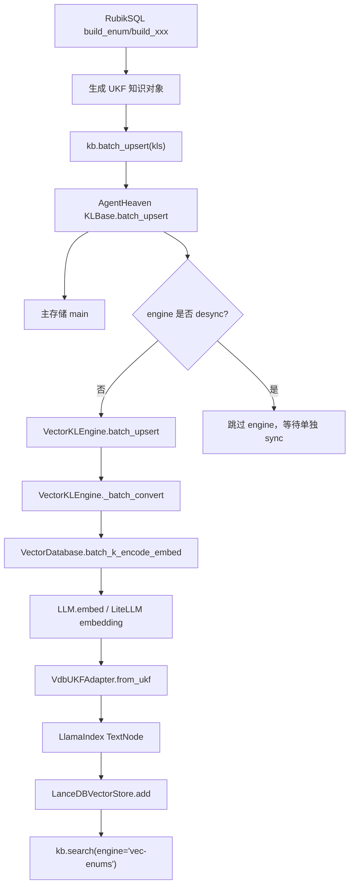
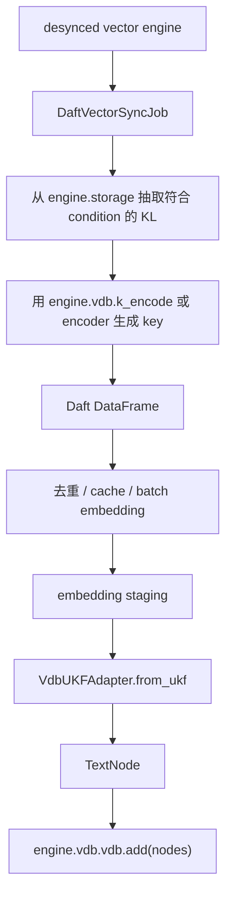
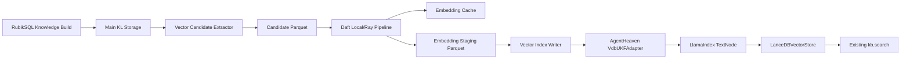

# Daft 接入 RubikSQL + AgentHeaven 的实现可能性分析

本文专门回答一个问题：在已经拿到本地 `ahvn`/AgentHeaven 源码之后，RubikSQL 后续用 Daft 改造 embedding 与向量索引构建是否可行，应该怎么做，风险在哪里，第一版该从哪里下手。

结论先说：可行，而且现在比只看 RubikSQL 仓库时清楚很多。AgentHeaven 的 `VectorKLEngine` 已经把“知识对象 -> 编码文本 -> embedding -> LlamaIndex TextNode -> 向量库写入”拆得比较干净。Daft 最适合接管其中的“批量 embedding 管线”，然后复用 AgentHeaven 现有的 `VdbUKFAdapter`/`VectorDatabase` 写入逻辑，避免重造向量库 schema。

## 1. 最推荐的实现路线

推荐优先做这条路线：

```text
RubikSQL 继续负责构建 UKF 知识对象
    -> 主知识库存储先落盘
    -> vector engine 设置为 desync，避免同步 upsert 时立即 embedding
    -> 新增 Daft vector sync job
    -> 从主存储抽取待向量化的 KL
    -> 使用现有 encoder 生成 key/text
    -> Daft 批量/分布式 embedding
    -> 使用 AgentHeaven VdbUKFAdapter 生成 TextNode
    -> 使用现有 VectorDatabase/LlamaIndex vector store 写入 LanceDB
    -> 保持 kb.search(engine="vec-enums") 查询接口不变
```

这条路线的关键优点：

- 不需要第一版就重写 SQL Agent 或检索 Agent。
- 不需要猜 LanceDB 的底层 schema，直接复用 AgentHeaven 的 adapter。
- 可以把 embedding 构建从 `kb.batch_upsert()` 的同步路径里拿出来。
- 可以本地 Daft 先跑通，再切 Ray 分布式。
- 对 `vec-enums` 这类高数据量索引最有收益。

一句话概括：让 Daft 做“高吞吐批量计算”，让 AgentHeaven 继续做“知识对象和向量库格式适配”。

## 2. 本地源码中的关键证据

### 2.1 RubikSQL 侧：哪些知识会进入向量引擎

RubikSQL 的向量引擎配置在：

- [default_config.yaml](../src/rubiksql/resources/configs/default_config.yaml)

关键配置：

| Engine | 配置位置 | 知识类型 | provider | embedder |
| --- | --- | --- | --- | --- |
| `vec-enums` | `default_config.yaml:69` | `db-enum` | `lancedb` | `embedder` |
| `vec-queries-by-name` | `default_config.yaml:85` | `nl2sql-query` | `lancedb` | `embedder` |
| `vec-queries-by-mask` | `default_config.yaml:100` | `nl2sql-query` | `lancedb` | `embedder` |
| `skills` | `default_config.yaml:115` | `skill` | `lancedb` | `embedder` |

当前最值得优先优化的是 `vec-enums`，因为 `build_enum()` 会从数据库列里读 distinct values，可能生成大量 `EnumUKFT`。

相关代码：

- [knowledge.py](../src/rubiksql/api/knowledge.py) 的 `build_enum()` 从 `1551` 行开始。
- `build_enum_worker()` 在 `1690` 行附近读取列频率。
- `db.col_freqs(t_id, c_id)` 在 `1697` 行读取 distinct values/frequencies。
- `EnumUKFT.from_enum(...)` 在 `1718` 行附近创建枚举知识对象。
- `kb.batch_upsert(all_enum_ukfts, batch_size=batch_size)` 在 `1791` 行触发入库和索引同步。

### 2.2 RubikSQL 侧：VectorKLEngine 是如何被创建的

RubikSQL 通过：

- [base.py](../src/rubiksql/klbase/base.py)

在 `build_engines()` 中根据配置创建 engine。关键位置：

- `build_engines()` 在 `132` 行。
- `desync = engine_cfg.pop("desync", False)` 在 `153` 行。
- `"vector": VectorKLEngine` 在 `185` 行。
- `self.add_engine(engine, desync=desync)` 在 `191` 行。

这说明 RubikSQL 已经有一个配置层面的开关可以控制 engine 是否同步更新。当前 `ac` 和 `ac-enums` 是 `desync: true`，但 `vec-enums` 不是。后续可以考虑让 vector engine 也支持 desync 构建。

### 2.3 AgentHeaven 侧：VectorKLEngine 的 embedding 发生在哪里

AgentHeaven 的核心文件：

- [vector_engine.py](../../AgentHeaven-dev-master/AgentHeaven-dev-master/src/ahvn/klengine/vector_engine.py)

关键位置：

- `VectorKLEngine` 定义在 `39` 行。
- `_batch_convert()` 定义在 `127` 行。
- `self.vdb.batch_k_encode_embed(non_dummy_kls)` 在 `130` 行。
- `_batch_upsert()` 定义在 `256` 行。
- `batch_k_encode_embed()` 对外暴露在 `338` 行。
- `embedding_field` 默认是 `_vec`，在 `351` 行。

核心逻辑可以简化为：

```python
def _batch_convert(self, kls):
    kls_list = list(kls)
    non_dummy_kls = [...]
    non_dummy_key_embeddings = self.vdb.batch_k_encode_embed(non_dummy_kls)
    for kl in kls_list:
        key, embedding = non_dummy_mapping[kl.id]
        node = self.adapter.from_ukf(kl=kl, key=key, embedding=embedding)
```

这就是 Daft 的最佳切入点。原逻辑是：

```text
UKF list -> batch_k_encode_embed -> TextNode list
```

Daft 可以替代中间的 `batch_k_encode_embed`，变成：

```text
UKF list -> encode text -> Daft batch embedding -> TextNode list
```

### 2.4 AgentHeaven 侧：向量写入 schema 在哪里

AgentHeaven 的 adapter：

- [vdb.py](../../AgentHeaven-dev-master/AgentHeaven-dev-master/src/ahvn/adapter/vdb.py)

关键位置：

- `VdbUKFAdapter` 定义在 `49` 行。
- `self.key_field = "_key"` 在 `85` 行。
- `self.embedding_field = "_vec"` 在 `86` 行。
- `from_ukf()` 定义在 `92` 行。
- `data[self.key_field] = ...` 在 `119` 行。
- `TextNode(text=..., embedding=..., metadata=data, id_=data["id"])` 在 `121` 行。

这说明向量库中的一条记录，本质上是一个 LlamaIndex `TextNode`：

```python
TextNode(
    text=data["_key"],
    embedding=vector,
    metadata=data,
    id_=data["id"],
)
```

因此，不建议第一版直接用 Daft 写一个自定义 LanceDB schema。最稳的是仍然调用：

```python
engine.adapter.from_ukf(kl=kl, key=key, embedding=embedding)
```

这样搜索侧 `engine.search()`、`adapter.to_ukf()`、metadata filter 都能继续兼容。

### 2.5 AgentHeaven 侧：VectorKLStore 的写入模式

AgentHeaven 的 vector store：

- [vdb_store.py](../../AgentHeaven-dev-master/AgentHeaven-dev-master/src/ahvn/klstore/vdb_store.py)

关键位置：

- `VectorKLStore` 定义在 `26` 行。
- `_batch_convert()` 定义在 `105` 行。
- `_batch_upsert()` 定义在 `117` 行。
- 批量 upsert 时先 `delete_nodes(ukf_ids)`，再 `vdb.vdb.add(...)`，在 `122-123` 行。

这给 Daft writer 提供了一个明确模板：

```text
对一批 KL:
    1. 计算 ukf_ids
    2. 删除旧节点
    3. adapter.from_ukf(...) 生成 TextNode
    4. vdb.add(nodes)
    5. flush
```

### 2.6 AgentHeaven 侧：KLBase 已经支持 desync

AgentHeaven 的通用知识库：

- [base.py](../../AgentHeaven-dev-master/AgentHeaven-dev-master/src/ahvn/klbase/base.py)

关键位置：

- `desync_engine()` 在 `123` 行。
- `resync_engine()` 在 `133` 行。
- `batch_upsert()` 在 `253` 行。
- `target_engines = ... ename not in self.desync` 在 `277` 行。
- 对 target engines 执行 `batch_upsert` 在 `297` 行。

这说明只要某个 engine 在 `self.desync` 里，`KLBase.batch_upsert()` 就不会同步更新它。这对 Daft 非常重要，因为我们可以：

1. 先把所有知识对象写入主存储。
2. 不在主写入路径里做 embedding。
3. 后面单独跑 Daft vector sync。

### 2.7 AgentHeaven 侧：LLM.embed 已经有 batch/cache/parallel

AgentHeaven 的 LLM：

- [base.py](../../AgentHeaven-dev-master/AgentHeaven-dev-master/src/ahvn/utils/llm/base.py)

关键位置：

- `_embed_dispatch()` 在 `844` 行，会处理去重、batch size、num_threads。
- `_cached_embed()` 在 `904` 行。
- 多 sub-batch 时调用 `Parallelized`，在 `918` 行。
- 单 batch 时调用 `litellm.embedding(input=sb, **kwargs)`，在 `930` 行。
- `batch_memoize` 缓存在 `934` 行。
- 对外 `embed()` 在 `1562` 行。

这点很重要：当前 AgentHeaven 不是完全逐条 embedding，它已经具备批处理、去重、缓存和线程并发。Daft 的价值不在于“第一次让它能 batch”，而在于：

- 把 batch 过程变成显式数据管线。
- 支持超大候选集分片。
- 支持 Ray 多机调度。
- 支持中间结果落盘和断点重跑。
- 支持更清楚的指标、缓存命中率、失败重试和资源隔离。

换句话说，小数据集上 Daft 不一定明显更快；大数据集、可分布式 embedding 服务、多库批量构建时才是它的主场。

## 3. 当前完整链路



Daft 的推荐接入方式是把 `H` 后面补一条外部同步链路：



## 4. 五种实现方案对比

### 方案 A：desync + Daft 外部 vector sync job

这是最推荐的方案。

#### 思路

让 RubikSQL 构建知识时只写主存储，不同步更新向量索引。然后新增一个 Daft job，专门负责同步某个 vector engine。

流程：

```text
rubiksql build enum -n mydb
    -> 写 main storage
    -> vec-enums 因 desync 不立即 embedding

rubiksql sync vector -n mydb --engine vec-enums --backend daft
    -> Daft 抽取候选集
    -> Daft embedding
    -> AgentHeaven adapter 写回 LanceDB
```

#### 需要改哪里

RubikSQL：

- `src/rubiksql/resources/configs/default_config.yaml`
- `src/rubiksql/api/vector_sync.py`
- `src/rubiksql/pipelines/vector_candidates.py`
- `src/rubiksql/pipelines/daft_vector_sync.py`
- `src/rubiksql/pipelines/vector_index_writer.py`
- `src/rubiksql/cli/build_cli.py` 或新增 `src/rubiksql/cli/vector_cli.py`

AgentHeaven：

- 第一版可以不改。
- 第二版可以考虑给 `VectorKLEngine` 增加 `batch_upsert_precomputed()`，让写入预计算 embedding 更正式。

#### 优点

- 风险最低。
- 与现有 `KLBase.desync` 机制契合。
- 不改变上层 `kb.search()`。
- 可以在 Daft job 里做 checkpoint、cache、重试。
- 可以从 `vec-enums` 一个 engine 开始试点。

#### 缺点

- 需要新增 sync 命令或 API。
- 构建知识和构建向量索引变成两个阶段，调用方要理解“索引未同步”的状态。
- writer 阶段如果仍然单进程写 LanceDB，最终写入可能成为瓶颈。

#### 可行性判断

高。建议作为第一版。

### 方案 B：在 `VectorKLEngine._batch_convert()` 内部接入 Daft

#### 思路

不改变 RubikSQL 的外部流程，仍然在 `kb.batch_upsert()` 时同步更新 vector engine，只是把 `VectorKLEngine._batch_convert()` 里的 embedding 调用改成 Daft。

原逻辑：

```python
non_dummy_key_embeddings = self.vdb.batch_k_encode_embed(non_dummy_kls)
```

替换为：

```python
non_dummy_key_embeddings = daft_batch_k_encode_embed(self, non_dummy_kls)
```

#### 优点

- 上层完全无感。
- `kb.batch_upsert()` 仍然一次完成知识入库和索引构建。
- 改动点集中。

#### 缺点

- `batch_upsert` 的 batch size 当前通常是 256，Daft 每次只处理小批量，调度开销可能抵消收益。
- 不容易做跨 batch 去重、checkpoint 和断点续跑。
- 如果每次 upsert 都启动 Daft/Ray 任务，成本很高。
- 同步路径变复杂，失败会影响知识构建。

#### 可行性判断

中等。适合作为局部优化或本地并行优化，不适合作为大型分布式 embedding 的主方案。

### 方案 C：新增 `DaftVectorKLEngine`

#### 思路

新增一个继承 `BaseKLEngine` 或 `VectorKLEngine` 的 engine，实现自己的：

- `_batch_upsert()`
- `_batch_convert()`
- `sync()`
- 可能还有 `_search_vector()`

搜索仍可复用 `VectorKLEngine._search_vector()` 或 `VectorDatabase.search()`。

#### 优点

- 架构上最干净，Daft 成为正式 engine 能力。
- 可以长期支持不同 vector build backend。
- 可以把 Daft 配置放进 engine config。

#### 缺点

- 工作量比方案 A 大。
- 要维护 AgentHeaven engine 协议兼容。
- 需要更多测试覆盖。
- 如果 AgentHeaven 上游变化，维护成本较高。

#### 可行性判断

中高。适合第二阶段或产品化阶段，不建议第一版直接做。

### 方案 D：Daft 直接写 LanceDB

#### 思路

Daft 计算 embedding 后，不再通过 AgentHeaven adapter，而是直接写 LanceDB 表。

#### 优点

- 理论吞吐最高。
- 写入过程完全由 Daft/Lance 控制。
- 更接近标准数据工程架构。

#### 缺点

- AgentHeaven 当前通过 LlamaIndex `LanceDBVectorStore` 管理 LanceDB schema。
- 如果直接写错字段或类型，`VectorKLEngine.search()` 可能读不回来。
- `metadata`、`id_`、`_key`、`_vec`、UKF 字段转换都要完全兼容。
- 后续 AgentHeaven schema 变化时容易坏。

#### 可行性判断

中等偏低。除非先把 LlamaIndex/LanceDB 的实际表结构验证清楚，否则不建议第一版直接做。

### 方案 E：Daft 接管整个数据管线，包括 enum 抽取

#### 思路

不仅让 Daft 做 embedding，还让 Daft 从数据库读取 distinct values，直接构建 enum candidate。

例如：

```text
daft.read_sql(...)
    -> distinct enum values
    -> build EnumUKFT candidates
    -> embedding
    -> write main storage and vector index
```

#### 优点

- 对超大数据库 profile/enum 抽取也能提速。
- 可以把数据库读取、清洗、embedding、写入统一成一个 pipeline。
- 更适合未来多库批量构建。

#### 缺点

- 会绕开或重写 `api/knowledge.py` 里现有的 `build_enum()` 逻辑。
- 要处理 RubikSQL DB abstraction、权限、datatype、enum_index_enabled 等业务判断。
- 改动范围大，回归风险高。

#### 可行性判断

长期可行，第一版不建议。先只接管 embedding，再考虑 enum 抽取。

## 5. 推荐 MVP 设计

### 5.1 MVP 范围

第一版只做：

```text
vec-enums 的离线 Daft embedding sync
```

暂时不做：

- 不改 SQL Agent。
- 不改 retrieval agent。
- 不改 `fuzzy_enum.py`。
- 不重写 `build_enum()`。
- 不直接写自定义 LanceDB schema。
- 不一次支持所有 vector engines。

### 5.2 MVP 配置

在 RubikSQL 的 `default_config.yaml` 中给 `vec-enums` 增加：

```yaml
vec-enums:
    type: vector
    storage: main
    inplace: false
    provider: lancedb
    uri_suffix: "vec/"
    embedder: "embedder"
    desync: true
```

也可以先不改默认配置，而是新增 CLI 参数控制：

```bash
rubiksql build enum -n mydb --skip-vector
rubiksql sync vector -n mydb --engine vec-enums --backend daft
```

但从架构上看，vector build 更适合成为单独阶段。

### 5.3 MVP API

建议新增：

```python
sync_vector_index(
    db_id: str,
    engine: str = "vec-enums",
    backend: str = "daft",
    runner: str = "local",
    batch_size: int = 1024,
    write_batch_size: int = 4096,
    rebuild: bool = False,
)
```

CLI：

```bash
rubiksql sync vector -n mydb --engine vec-enums --backend daft
rubiksql sync vector -n mydb --engine vec-enums --backend daft --runner ray
```

### 5.4 MVP 内部流程

```text
1. load_kb(db_id)
2. engine = kb.engines["vec-enums"]
3. 校验 engine 是 VectorKLEngine 且 inplace=False
4. 从 engine.storage 批量遍历 KL
5. 使用 engine.full_condition(kl) 过滤
6. 使用 engine.k_encode(kl) 或 engine.vdb.k_encoder(kl) 得到 key
7. 生成候选 DataFrame: kl_id, key, text_hash, engine_name
8. Daft 对 key 去重
9. Daft 调用 embedding
10. 得到 key -> embedding
11. 按 kl_id 回查 KL
12. engine.adapter.from_ukf(kl, key, embedding) 生成 TextNode
13. engine.vdb.vdb.delete_nodes(ukf_ids)
14. engine.vdb.vdb.add(nodes)
15. engine.vdb.flush()
```

### 5.5 为什么 writer 阶段建议先放在 driver

第一版不建议让每个 Ray worker 都直接写同一个 LanceDB table。原因：

- LanceDB/LlamaIndex vector store 的并发写语义需要验证。
- 多 worker 同时 delete + add 容易出现顺序问题。
- schema 和 metadata 由 `VdbUKFAdapter` 负责，集中写更容易保证一致。

更保守的第一版：

```text
Daft/Ray workers:
    负责 embedding
    输出 staging parquet

Driver:
    读取 staging
    回查 KL
    adapter.from_ukf
    分批写 VectorDatabase
```

等稳定后再探索分布式写入。

## 6. Daft 管线数据模型

### 6.1 Candidate 表

每一行表示“某个 KL 在某个 vector engine 下需要被 embedding”。

| 字段 | 类型 | 说明 |
| --- | --- | --- |
| `db_id` | string | RubikSQL 数据库 ID |
| `engine_name` | string | 例如 `vec-enums` |
| `kl_id` | string/int | UKF id |
| `kl_type` | string | 例如 `db-enum` |
| `key` | string | AgentHeaven encoder 输出，也就是 TextNode.text |
| `text_hash` | string | key + model + encoder 的 hash |
| `model_provider` | string | 例如 `ollama` |
| `model_name` | string | 例如 `embeddinggemma` |
| `encoder_version` | string | encoder 版本或配置 hash |

第一版不建议把完整 UKF 对象塞进 Daft DataFrame。原因是：

- UKF 对象可能不容易跨 Ray worker 序列化。
- 对象很大时会增加网络和内存成本。
- embedding 阶段只需要 `key`。
- 写入阶段可以通过 `kl_id` 从主存储回查。

### 6.2 Embedding staging 表

| 字段 | 类型 | 说明 |
| --- | --- | --- |
| `db_id` | string | 数据库 ID |
| `engine_name` | string | engine |
| `kl_id` | string/int | UKF id |
| `key` | string | embedding 文本 |
| `text_hash` | string | cache key |
| `embedding` | list[float] | embedding 向量 |
| `status` | string | success/failed/skipped |
| `error` | string | 失败原因 |

后续可以把 staging 写到：

```text
<kb_path>/vector-staging/<engine>/<run_id>/
```

## 7. Daft embedding 有两种调用方式

### 7.1 使用 AgentHeaven LLM.embed 的 Daft UDF

这是保持语义最一致的方式。

伪代码：

```python
def embed_batch_with_ahvn(keys: list[str], preset: str, batch_size: int, num_threads: int):
    from ahvn.utils.llm import LLM

    llm = LLM(preset=preset)
    return llm.embed(
        keys,
        batch_size=batch_size,
        num_threads=num_threads,
    )
```

优点：

- 复用 RubikSQL/AgentHeaven 当前 `embedder` 配置。
- 复用 LiteLLM provider 适配。
- 复用 AgentHeaven 的缓存、去重、重试。
- 与现有向量结果最容易保持一致。

缺点：

- 每个 worker 都要能初始化 AgentHeaven 配置。
- DiskCache 在分布式环境下可能不是共享缓存。
- 多 worker 打同一个 Ollama 服务时，后端仍可能成为瓶颈。

### 7.2 使用 Daft 原生 `embed_text`

Daft 官方 Batch Inference 文档提供了 `embed_text` 这类 AI function。

伪代码：

```python
from daft.functions.ai import embed_text

df = df.with_column(
    "embedding",
    embed_text(
        daft.col("key"),
        provider=provider,
        model=model,
    ),
)
```

优点：

- Daft 负责 batching、concurrency、backpressure。
- 更像标准 Daft pipeline。
- 后续切不同 provider 更简单。

缺点：

- 要确认 Daft provider/model 与 AgentHeaven 当前 LiteLLM/Ollama 配置完全等价。
- 如果 embedding 输出不一致，旧索引和新索引不能混用。
- 需要额外适配 RubikSQL 当前配置体系。

### 7.3 推荐顺序

第一版建议：

```text
先用 AgentHeaven LLM.embed 作为 Daft UDF
    -> 保证结果一致
再评估是否切 Daft 原生 embed_text
```

不要一开始同时换 pipeline 和换 embedding provider，否则结果差异不好定位。

## 8. 伪代码设计

### 8.1 抽取候选集

```python
def iter_vector_candidates(kb, engine_name: str):
    engine = kb.engines[engine_name]

    for kl_batch in engine.storage.batch_iter(batch_size=1024):
        for kl in kl_batch:
            if not engine.full_condition(kl):
                continue

            key = engine.k_encode(kl)
            yield {
                "db_id": kb.name,
                "engine_name": engine_name,
                "kl_id": kl.id,
                "kl_type": kl.type,
                "key": key,
                "text_hash": hash_key(engine_name, key, model_fingerprint(engine)),
            }
```

注意：这里用 `engine.k_encode(kl)`，而不是重新解析 RubikSQL 的 YAML encoder。这样能最大限度复用 AgentHeaven 当前行为。

### 8.2 Daft embedding

```python
def run_daft_embedding(candidates, runner: str = "local"):
    import daft

    if runner == "ray":
        daft.set_runner_ray()

    df = daft.from_pylist(list(candidates))

    df = df.where(daft.col("key").not_null())
    df = df.distinct("text_hash")

    df = df.with_column(
        "embedding",
        ahvn_embed_udf(daft.col("key")),
    )

    return df
```

大数据量时不要 `list(candidates)`，而应先写候选 parquet，再 `daft.read_parquet()`。

### 8.3 写回 AgentHeaven vector store

```python
def write_precomputed_embeddings(kb, engine_name: str, rows):
    engine = kb.engines[engine_name]

    nodes = []
    ukf_ids = []

    for row in rows:
        kl = engine.storage.get(row["kl_id"])
        if kl is None:
            continue

        ukf_id = engine.adapter.parse_id(kl.id)
        node = engine.adapter.from_ukf(
            kl=kl,
            key=row["key"],
            embedding=row["embedding"],
        )
        ukf_ids.append(ukf_id)
        nodes.append(node)

    if ukf_ids:
        engine.vdb.vdb.delete_nodes(ukf_ids)
    if nodes:
        engine.vdb.vdb.add(nodes)
    engine.vdb.flush()
```

这段逻辑基本复刻了 AgentHeaven `VectorKLStore._batch_upsert()` 的写法，但 embedding 来自 Daft。

## 9. 推荐代码组织

### 9.1 RubikSQL 新增模块

| 文件 | 职责 |
| --- | --- |
| `src/rubiksql/pipelines/vector_candidates.py` | 从 KLBase/engine/storage 抽取 candidate |
| `src/rubiksql/pipelines/daft_embedding.py` | Daft DataFrame embedding pipeline |
| `src/rubiksql/pipelines/vector_index_writer.py` | 使用 AgentHeaven adapter 写回 vector store |
| `src/rubiksql/api/vector_sync.py` | 对外 Python API |
| `src/rubiksql/cli/vector_cli.py` | CLI 命令 |

### 9.2 AgentHeaven 可选增强

第一版可以不改 AgentHeaven。如果要做得更优雅，可以向 AgentHeaven 加：

```python
class VectorKLEngine:
    def batch_upsert_precomputed(
        self,
        items: Iterable[tuple[BaseUKF, str, list[float]]],
        progress=None,
    ):
        ...
```

或者在 `VectorDatabase` 层增加：

```python
def batch_insert_nodes(self, nodes):
    self.vdb.add(nodes)
```

这样 RubikSQL 不需要直接访问 `engine.vdb.vdb.add` 这种较深的内部字段。

## 10. 实施阶段建议

### 阶段 0：基线与验证

先写一个只读 inspector：

```bash
rubiksql inspect vector -n mydb --engine vec-enums
```

输出：

```text
engine: vec-enums
storage: main
condition: db-enum
candidates: 123456
unique_keys: 98765
embedder: ollama/embeddinggemma
vector_backend: lancedb
```

同时记录旧流程耗时：

- `build_enum()` 总耗时。
- `kb.batch_upsert()` 耗时。
- `VectorKLEngine._batch_convert()` 耗时。
- `LLM.embed()` 耗时。
- `vdb.add()` 耗时。

### 阶段 1：预计算 embedding 但不接 Daft

先实现一个普通 Python 版：

```text
extract candidates
    -> engine.batch_k_encode_embed
    -> writer 写回
```

目的是验证“外部 sync job 写出来的索引”和“原生 VectorKLEngine 写出来的索引”是否一致。

### 阶段 2：接入本地 Daft

把 embedding 过程替换成 Daft local runner：

```text
candidate parquet
    -> daft.read_parquet
    -> local embedding UDF
    -> staging parquet
    -> writer 写回
```

先不要 Ray。

### 阶段 3：接入 Ray

在 pipeline 初始化时：

```python
if runner == "ray":
    daft.set_runner_ray()
```

Ray 版本需要验证：

- worker 是否能 import `rubiksql` 和 `ahvn`。
- worker 是否能读取配置。
- worker 是否能访问 embedding provider。
- DiskCache 是否要换共享路径。
- staging 路径是否所有 worker 可访问。

### 阶段 4：扩展到更多 engine

顺序建议：

1. `vec-enums`
2. `vec-queries-by-name`
3. `vec-queries-by-mask`
4. `skills`

不要第一版同时支持所有 engine。`vec-enums` 最能暴露性能瓶颈和收益。

### 阶段 5：再考虑数据库读取管线 Daft 化

等 embedding sync 稳定后，再考虑让 Daft 接管 `build_enum()` 里的 distinct values 抽取。

## 11. 关键风险

### 11.1 单个 Ollama 服务可能仍是瓶颈

RubikSQL 当前配置里 `embedder` 默认走 Ollama 的 `embeddinggemma`。如果只有一个本地 Ollama 服务，Daft/Ray worker 再多，也可能只是更快把请求排队到同一个瓶颈前。

真正提速可能需要：

- 每个 Ray worker 本地部署 embedding 模型。
- 多个 Ollama 实例。
- 换成支持高并发 batch 的远程 embedding provider。
- 调整 `batch_size`、`num_threads`。
- 用共享缓存减少重复请求。

### 11.2 AgentHeaven 已经有缓存，Daft 缓存不能乱叠

AgentHeaven `LLM.embed()` 已经有 `batch_memoize`。如果 Daft 再做一层缓存，需要确保 cache key 包含：

- engine name
- key/text
- model provider
- model name
- model version
- encoder version/hash

否则换模型或换 encoder 后容易复用错误向量。

### 11.3 动态 encoder 与 Ray 序列化

RubikSQL 的 encoder 当前来自 YAML 字符串 lambda。直接把这些 callable 发到 Ray worker 可能不稳定。

MVP 建议在 driver 侧先执行：

```python
key = engine.k_encode(kl)
```

Daft/Ray worker 只处理纯字符串 `key`，不要处理完整 UKF 和 lambda。

### 11.4 LanceDB 并发写需要验证

第一版建议单 writer 写入。后续如果要并行写，需要专项测试：

- 多 worker 同时写同一 table 是否安全。
- delete + add 是否会互相覆盖。
- flush 行为是否可预期。
- LlamaIndex `LanceDBVectorStore` 是否支持并发写。

### 11.5 直接使用 Daft `embed_text` 会带来模型一致性风险

如果 Daft 原生 provider 和 AgentHeaven/LiteLLM provider 对同一模型的调用参数不同，生成的向量可能不同。向量索引里不能混用不同 embedding 空间。

第一版最好复用 AgentHeaven `LLM.embed()`。

## 12. 成功标准

### 功能正确性

小数据集上：

```text
旧 VectorKLEngine 构建 vec-enums
新 Daft sync 构建 vec-enums
用同一批 query 搜索
topk 返回的 kl_id 集合基本一致
```

### 性能收益

至少记录：

- candidate 数量。
- unique key 数量。
- embedding 总耗时。
- vector write 总耗时。
- 每秒 embedding 数。
- 每秒写入节点数。
- cache 命中率。
- 失败重试次数。

### 运维可用性

必须支持：

- 中断后重跑。
- 跳过已成功 embedding 的 key。
- 写入失败能定位到具体 batch。
- 输出 run id 和日志目录。

## 13. 具体开发 checklist

### 第一周建议

- [ ] 写 `vector_candidates.py`，能抽取 `vec-enums` candidates。
- [ ] 写 inspector CLI，输出候选数量和 unique key 数量。
- [ ] 写普通 Python 版 precomputed writer，复用 `engine.adapter.from_ukf()`。
- [ ] 用小数据库对比旧索引和新索引搜索结果。

### 第二周建议

- [ ] 接入 Daft local runner。
- [ ] staging 写 Parquet。
- [ ] 支持 embedding cache key。
- [ ] 输出性能指标。
- [ ] 加入失败重试和错误记录。

### 第三周建议

- [ ] 接入 Ray runner。
- [ ] 验证 worker 环境、配置和 provider 访问。
- [ ] 验证大数据量 enum。
- [ ] 对比单机 AgentHeaven batch 与 Daft local/Ray 的吞吐。

## 14. 推荐最终架构



这套架构把职责拆得比较干净：

- RubikSQL 负责业务知识构建。
- AgentHeaven 负责 UKF、engine、adapter、search。
- Daft 负责高吞吐 embedding pipeline。
- LanceDB 负责向量存储和检索。

## 15. 最终判断

综合本地 AgentHeaven 源码后，Daft 接入的可行性比之前更高。最关键的原因是：

1. `VectorKLEngine._batch_convert()` 明确暴露了 embedding 前后的边界。
2. `VdbUKFAdapter.from_ukf()` 已经能用预计算 embedding 生成兼容 `TextNode`。
3. `KLBase.desync` 已经支持把索引构建从知识写入路径里拆出去。
4. `VectorKLStore._batch_upsert()` 给出了 delete + add 的兼容写入模板。
5. `LLM.embed()` 已经支持 batch/cache/parallel，Daft 可以在这个基础上做更大的分布式编排。

所以最稳路线不是“重写 AgentHeaven vector engine”，而是：

```text
第一版：外部 Daft vector sync job
第二版：AgentHeaven 增加正式 precomputed embedding 写入 API
第三版：按需要抽象成 DaftVectorKLEngine 或完整分布式知识构建管线
```

如果只做一个最小可交付版本，目标应该非常聚焦：

```text
让 vec-enums 支持 desync 后用 Daft 离线构建，并保持 fuzzy_enum/kb.search 查询结果兼容。
```

做到这一步，就已经能验证 Daft 对 RubikSQL embedding 性能改造的真实价值。

## 16. 参考资料

本地源码：

- [RubikSQL default_config.yaml](../src/rubiksql/resources/configs/default_config.yaml)
- [RubikSQL knowledge.py](../src/rubiksql/api/knowledge.py)
- [RubikSQL klbase/base.py](../src/rubiksql/klbase/base.py)
- [AgentHeaven vector_engine.py](../../AgentHeaven-dev-master/AgentHeaven-dev-master/src/ahvn/klengine/vector_engine.py)
- [AgentHeaven vdb_store.py](../../AgentHeaven-dev-master/AgentHeaven-dev-master/src/ahvn/klstore/vdb_store.py)
- [AgentHeaven adapter/vdb.py](../../AgentHeaven-dev-master/AgentHeaven-dev-master/src/ahvn/adapter/vdb.py)
- [AgentHeaven utils/vdb/base.py](../../AgentHeaven-dev-master/AgentHeaven-dev-master/src/ahvn/utils/vdb/base.py)
- [AgentHeaven utils/llm/base.py](../../AgentHeaven-dev-master/AgentHeaven-dev-master/src/ahvn/utils/llm/base.py)

Daft 官方文档：

- [Daft Batch Inference](https://docs.daft.ai/en/stable/use-case/batch-inference/)
- [Daft Scaling Out and Deployment](https://docs.daft.ai/en/stable/distributed/)
- [Daft SQL Databases](https://docs.daft.ai/en/stable/connectors/sql/)
- [Daft Text Embeddings](https://docs.daft.ai/en/stable/ai-functions/embed/)
- [Daft UDFs](https://docs.daft.ai/en/stable/custom-code/udfs/)
