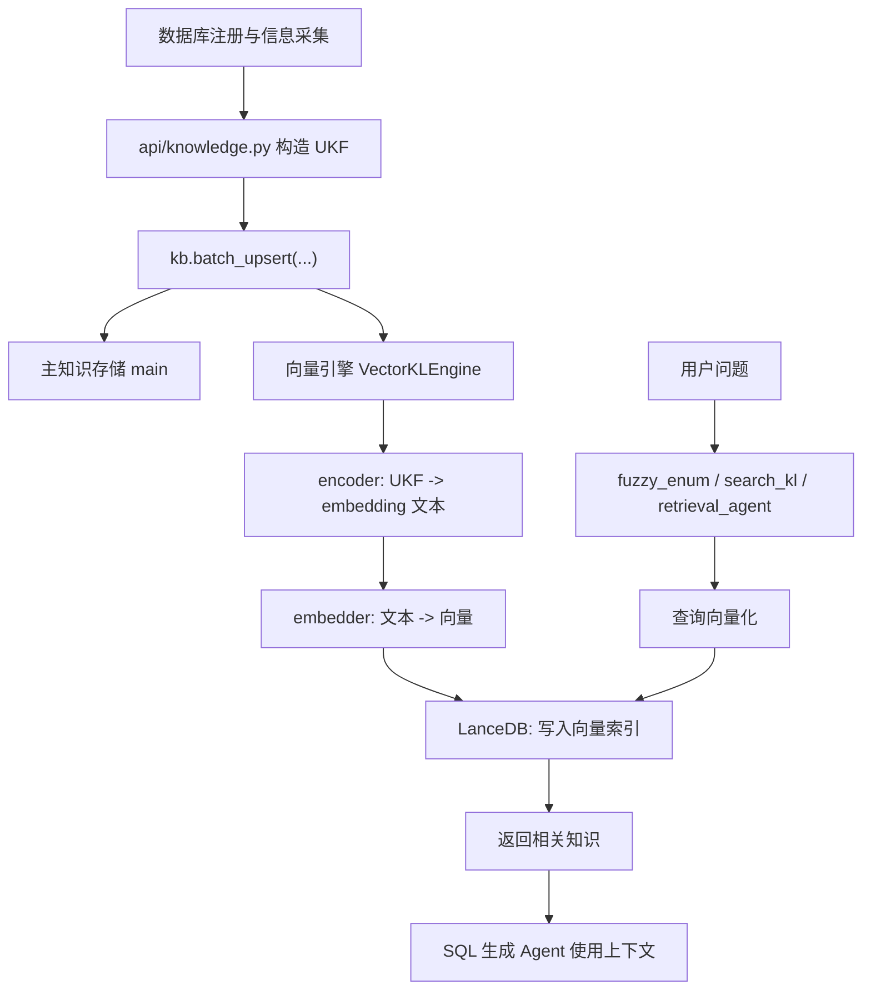
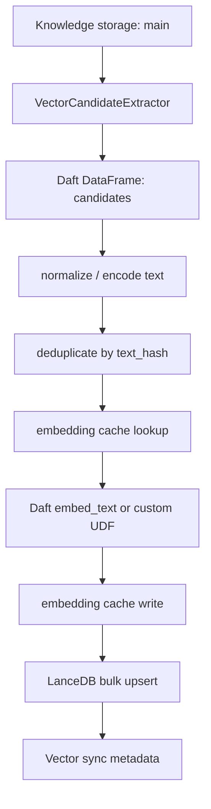

# RubikSQL Daft 分布式数据管线与 Embedding 改造指南

本文面向后续要把 RubikSQL 的数据管线改造成分布式架构，并用 Daft 提升 embedding 过程性能的开发者。假设读者还没有知识库、向量检索、embedding 和 Daft 的背景知识，所以本文会先用通俗语言解释基本概念，再落到本仓库应该重点关注的代码位置。

本文基于当前本地仓库 `RubikSQL-dev` 代码，以及 Daft 官方文档在 2026-06-21 的公开说明整理。Daft 和 RubikSQL/AgentHeaven 都可能继续演进，真正动手改代码前仍建议再核对一次版本和 API。

## 1. 一句话结论

后续如果目标是“用 Daft 加速 embedding 并改造成分布式数据管线”，不要一开始就盯着 SQL 生成 Agent，也不要只看 `tools/fuzzy_enum.py`。最应该先看的是下面这条链路：

```text
数据库元信息/枚举值/经验样例/技能
    -> api/knowledge.py 批量构造 UKF 知识对象
    -> kb.batch_upsert(...)
    -> klbase/base.py 根据 default_config.yaml 创建 VectorKLEngine
    -> VectorKLEngine 对符合条件的知识对象执行 encoder
    -> embedder 生成向量
    -> LanceDB 写入向量索引
    -> 查询时 fuzzy_enum/search_kl/retrieval_agent 使用向量索引
```

因此，最核心的改造目标应该是：

1. 把“哪些知识对象需要做 embedding”这件事显式抽出来。
2. 把“知识对象 -> embedding 文本 -> embedding 向量 -> 向量库写入”变成一个可批量、可分区、可重试、可观测的数据管线。
3. 用 Daft 承接这个数据管线，在本地多线程 runner 上先跑通，再切到 Ray runner 做分布式执行。

## 2. 先补基础概念

### 2.1 RubikSQL 的知识库在存什么

RubikSQL 做 NL2SQL，也就是把自然语言问题转换成 SQL。为了让模型知道数据库里有什么表、字段、枚举值、业务规则和历史样例，它需要一个“知识库”。

可以把知识库理解成一个给 SQL Agent 查资料的资料柜。资料柜里不是随便塞文本，而是塞很多结构化的“知识对象”。在这个项目里，这类对象经常叫 UKF/UKFT，来自 AgentHeaven 的知识对象体系。

常见知识对象包括：

- 数据库知识：这个数据库整体是什么。
- 表知识：某张表表示什么业务含义。
- 列知识：某一列的含义、类型、主外键关系、同义词。
- 枚举值知识：例如 `status = "paid"`、`country = "China"` 这种列里的具体值。
- NL2SQL 样例：历史自然语言问题和对应 SQL。
- Skill：Agent 可调用的能力描述。

这些知识对象最终会被检索出来，作为上下文喂给 SQL 生成 Agent。

### 2.2 为什么需要 embedding

假设用户问：“帮我查已付款订单”。数据库里真实枚举值可能是：

```text
payment_state = "paid"
payment_status = "completed"
order_status = "settled"
```

如果只做普通关键词匹配，用户说“已付款”时，不一定能精确匹配到 `"paid"` 或 `"completed"`。embedding 的作用就是把文本变成向量，让语义相近的文本在向量空间里距离更近。

通俗地说：

- 普通关键词检索像查字典，字面上对不上就难找。
- embedding + 向量检索像按意思找，词不一样但意思接近也能找到。

在 RubikSQL 里，枚举值、历史 query、技能描述等都可能被做成向量索引，方便后续按自然语言问题检索。

### 2.3 什么是向量索引

embedding 模型会把文本变成一串数字，例如：

```text
"paid" -> [0.12, -0.03, 0.88, ...]
```

这些数字需要存到一个适合相似度搜索的数据库里。当前 RubikSQL 配置里使用的是 LanceDB：

```yaml
provider: lancedb
```

可以把 LanceDB 理解成一个专门存向量、按相似度找近邻的数据库。

### 2.4 Daft 在这里解决什么问题

Daft 是一个数据处理引擎，适合把“读取数据 -> 清洗/转换 -> 批量推理 -> 写出结果”这类过程做成高吞吐的数据管线。官方文档中它支持：

- `daft.read_sql()` 从 SQL 数据库读取数据，并可通过 `partition_col` 和 `num_partitions` 做并行/分布式读取。
- Batch Inference 场景里通过 `embed_text` 做文本 embedding，并由 Daft 处理批量、并发和背压。
- 通过 `daft.set_runner_ray()` 切换到 Ray 分布式 runner，把同一套管线调度到集群执行。

这正好对应 RubikSQL 的痛点：大量枚举值、历史样例、技能描述需要批量 embedding，并写入向量库。

## 3. 当前 embedding 主线

### 3.1 总体流程图



### 3.2 这条链路里最容易误解的地方

当前仓库里不一定能看到类似下面这种非常直白的代码：

```python
for text in texts:
    embedding = embed(text)
```

原因是 embedding 逻辑被封装在 AgentHeaven 的 `VectorKLEngine` 里。RubikSQL 本仓库主要做三件事：

1. 在配置文件里声明哪些知识对象需要向量索引。
2. 在 `RubikSQLKLBase.build_engines()` 里根据配置创建 `VectorKLEngine`。
3. 在 `api/knowledge.py` 里批量创建知识对象，并调用 `kb.batch_upsert(...)`。

真正的向量化细节大概率发生在 `VectorKLEngine.batch_upsert()` 或相关同步逻辑中，这部分来自 `ahvn`/AgentHeaven 依赖，而不是完全写在本仓库里。

后续改造前需要先确认 AgentHeaven 当前版本的 `VectorKLEngine` 是否支持：

- 传入预计算 embedding。
- 批量 upsert 已经算好的向量。
- 指定 LanceDB table/schema。
- 禁用自动 embedding，只保留搜索接口。

如果它支持预计算向量，那么最稳的方案是保留当前 `VectorKLEngine` 抽象，让 Daft 只负责离线/批量 embedding；如果不支持，就要考虑自定义 vector engine 或绕过它直接写 LanceDB。

## 4. 最高优先级代码地图

本节按“你后续改 Daft 时应该先看哪里”的优先级排序。

### 4.1 `src/rubiksql/resources/configs/default_config.yaml`

这是第一优先级文件，因为它定义了哪些知识会进入向量索引。

重点关注 `klbase.engines` 下的 vector engine：

```yaml
vec-enums:
    type: vector
    storage: main
    provider: lancedb
    uri_suffix: "vec/"
    encoder:
    - "lambda kl: str(kl.enum).strip().lower()"
    - "lambda q: str(q).strip().lower()"
    embedder: "embedder"
    condition:
        type_include:
        - db-enum
```

这段配置的含义是：

- `vec-enums` 是一个向量检索引擎。
- 它读取 `main` 存储里的知识对象。
- 只处理类型为 `db-enum` 的知识对象。
- 对知识对象做 embedding 时，取 `kl.enum` 作为文本。
- 查询时也把 query 做 `strip().lower()` 后再 embedding。
- embedding 模型使用名为 `embedder` 的预设。
- 向量库使用 LanceDB，路径后缀是 `vec/`。

其他向量引擎：

```yaml
vec-queries-by-name:
    type_include:
    - nl2sql-query
    encoder:
    - "lambda kl: str(kl.name).strip().lower()"

vec-queries-by-mask:
    type_include:
    - nl2sql-query
    encoder:
    - "lambda kl: str(kl.get('masked', '')).strip().lower()"

skills:
    type_include:
    - skill
    encoder:
    - 'lambda kl: "<name>"+...+"</description>"'
```

这些配置决定了 Daft 管线中的候选集应该怎么抽取。

后续改造时，这个文件至少要回答四个问题：

1. 哪些 engine 需要由 Daft 构建 embedding。
2. 每个 engine 的输入知识类型是什么。
3. 每个 engine 的 embedding 文本如何从 UKF 中生成。
4. 每个 engine 的向量写到哪里。

### 4.2 `src/rubiksql/resources/configs/ahvn_config.yaml`

这里定义 embedding 模型预设：

```yaml
llm:
    presets:
        embedder:
            provider: ollama
            model: embeddinggemma
```

这说明当前默认 embedding 是通过 Ollama 的 `embeddinggemma` 模型完成的。

这对 Daft 改造非常关键，因为 Daft 只能把 embedding 请求并行化；如果后端只有一个本地 Ollama 实例，而且它本身吞吐很低，那么分布式调度不会凭空变快。真正的吞吐上限取决于：

- Ollama 是否能并发处理请求。
- 机器是否有足够 CPU/GPU。
- 是否能部署多个 embedding 服务实例。
- 是否改用远程 provider。
- 每个 worker 的 batch size 和连接池配置。

### 4.3 `src/rubiksql/klbase/base.py`

这是 RubikSQL 自己封装知识库的核心类。

重点函数是 `RubikSQLKLBase.build_engines()`。它会：

1. 读取 `default_config.yaml` 里的 engine 配置。
2. 判断 engine 类型，例如 `facet`、`daac`、`vector`。
3. 对 `condition` 做构造。
4. 对 `encoder` 做构造。
5. 当 `type: vector` 时创建 `VectorKLEngine`。

关键代码逻辑可以概括成：

```python
engine_types = {
    "scan": ScanKLEngine,
    "facet": FacetKLEngine,
    "daac": DAACKLEngine,
    "vector": VectorKLEngine,
    "mongo": MongoKLEngine,
}

engine = engine_types.get(engine_type)(
    name=engine_name,
    storage=storage,
    **engine_cfg,
)
self.add_engine(engine, desync=desync)
```

这意味着 RubikSQL 对 `VectorKLEngine` 的依赖点很集中：配置 -> 构造 engine -> add engine。

后续有三种插入 Daft 的方向：

1. 保持 `VectorKLEngine` 不变，只在它同步前用 Daft 预先构建向量。
2. 替换 `VectorKLEngine` 为自定义的 `RubikDaftVectorKLEngine`。
3. 保持搜索接口不变，但把 LanceDB 索引构建过程改为外部 Daft job。

从风险看，推荐优先尝试第 1 种或第 3 种，因为对上层检索 Agent 的影响更小。

### 4.4 `src/rubiksql/klbase/utils.py`

这里有两个关键函数：

- `build_encoder()`
- `infer_engine_type()`

`build_encoder()` 会把配置里的字符串 lambda 转成实际可调用函数。比如：

```yaml
encoder:
- "lambda kl: str(kl.enum).strip().lower()"
- "lambda q: str(q).strip().lower()"
```

会变成：

```python
encoder[0](kl)  # 知识对象 -> embedding 文本
encoder[1](q)   # 查询文本 -> embedding 文本
```

这对 Daft 有一个很重要的隐患：分布式 worker 之间传递 Python lambda/闭包可能不稳定，尤其这些 lambda 是从字符串 `eval` 出来的。后续建议把 encoder 逐步改成可序列化、可引用的命名函数，或者在 Daft 管线里用显式的字段规则代替动态 lambda。

### 4.5 `src/rubiksql/api/knowledge.py`

这是第二条最重要的主线：它负责生产大量知识对象。

#### 4.5.1 `build_column()`

`build_column()` 会遍历数据库里的列，构造 `ColumnUKFT`，最后调用：

```python
kb.batch_upsert(built_kls, batch_size=batch_size)
```

列知识本身当前不一定进入向量索引，但它会影响枚举构建、描述生成、同义词生成和检索上下文。

#### 4.5.2 `build_enum()`

`build_enum()` 是后续 Daft embedding 改造最应该重点关注的函数。

它做的事情是：

1. 找出哪些列需要构建枚举知识。
2. 对每个列调用数据库接口读取 distinct values/frequencies。
3. 把每个枚举值构造成 `EnumUKFT`。
4. 最后调用：

```python
kb.batch_upsert(all_enum_ukfts, batch_size=batch_size)
```

当前配置中 `vec-enums` 会对 `db-enum` 做向量索引，所以 `build_enum()` 产出的每一个 `EnumUKFT` 都可能触发 embedding。

这是最容易产生大数据量的地方。例如：

- 100 张表。
- 每张表 20 个文本/类别列。
- 每列 500 个 distinct values。

那么枚举知识对象就是：

```text
100 * 20 * 500 = 1,000,000
```

一百万条 enum embedding 如果逐条或低并发处理，会非常慢。因此 Daft 改造首先应该围绕 `build_enum()` 产物展开。

#### 4.5.3 描述和同义词构建函数

`api/knowledge.py` 中还有很多类似的构建函数，最终也会 `batch_upsert`：

- 表描述。
- 列描述。
- 数据库描述。
- 表同义词。
- 列同义词。
- 枚举同义词。

这些函数不一定直接进入 vector engine，但它们会改变知识对象的文本内容，可能间接影响 embedding 内容和缓存失效。

后续如果 embedding 文本不只取 `kl.enum`，而是取 `description`、`synonyms`、`content_resources`，这些构建函数也会变成高优先级。

### 4.6 `src/rubiksql/ukfs/enum_ukft.py`

这是枚举知识对象的定义。

`EnumUKFT.from_enum()` 会生成如下内容：

- `name`: 枚举完整名字，例如 `table.column=value`。
- `content_resources`: 结构化字段，包括 `db_id`、`tab_id`、`col_id`、`enum`、`predicate`。
- `tags`: DATABASE/TABLE/COLUMN/ENUM 标签。
- `synonyms`: 枚举值同义词集合。

当前 `vec-enums` 的 encoder 只使用：

```python
str(kl.enum).strip().lower()
```

也就是说，向量索引里嵌入的是枚举值本身，不包含表名、列名、描述和同义词。

这点很重要。因为如果只 embed `"paid"`，模型可能不知道这是订单状态还是支付状态；如果 embed `"orders.payment_status = paid"`，检索语义可能更稳定，但索引内容会变化，缓存也要跟着失效。

后续可以考虑把 enum embedding 文本升级成：

```text
table: orders
column: payment_status
value: paid
column_description: ...
synonyms: ...
```

这属于召回质量优化，不只是性能优化。

### 4.7 `src/rubiksql/tools/fuzzy_enum.py`

这是查询时使用枚举向量索引的工具。

核心逻辑是：

```python
results = kb.search(engine="vec-enums", query=keyword, topk=fetchk)
```

它不是构建 embedding 的地方，而是消费向量索引的地方。

后续 Daft 改造时，不建议第一步就改这里。更合理的顺序是：

1. 先保证 `vec-enums` 索引构建更快。
2. 保证 `kb.search(engine="vec-enums")` 行为不变。
3. 最后再优化查询侧，如 query embedding 缓存、多 engine 查询合并、fetchk 策略等。

### 4.8 `src/rubiksql/klbase/base__legacy.py`

虽然这是 legacy 文件，但里面有一个值得学习的模式：`build_daac()` 和 `sync_stream()` 会对 desynced engine 做批量同步。

核心模式是：

```python
engine.clear()
batch_iter = engine.storage.batch_iter(batch_size=batch_size)
for kl_batch in batch_iter:
    engine.batch_upsert(kl_batch, flush=False, progress=None)
engine.flush()
```

这给 Daft 改造提供了一个参考：不要把向量索引构建完全绑死在单次 `kb.batch_upsert()` 中，而是允许“主存储先落库，索引之后批量同步”。

后续可以设计一个类似的 vector sync 流程：

```text
main storage 已经有知识对象
    -> collect vector candidates
    -> Daft batch embedding
    -> LanceDB bulk upsert
    -> 标记 vector engine 已同步
```

### 4.9 `src/rubiksql/agents/retrieval_agent.py`

这是 Agent 驱动检索时会用到的文件。它会把知识库 engine 包装成 Agent 工具，让 Agent 自己决定如何检索。

它对 embedding 性能的影响主要在查询时，而不是构建时。

后续如果发现用户一次查询会触发多个 vector engine，每个 engine 都重复做 query embedding，就可以在这里或更底层增加 query embedding 缓存。

### 4.10 `src/rubiksql/cli/build_cli.py`

这是 CLI 入口。用户会通过类似命令触发构建：

```bash
rubiksql build enum -n mydb
```

如果后续新增 Daft 构建模式，可以考虑加 CLI 参数：

```bash
rubiksql build enum -n mydb --vector-sync daft
rubiksql sync vector -n mydb --engine vec-enums --runner ray
rubiksql build vector-index -n mydb --engine vec-enums --backend daft
```

CLI 不应该承载复杂逻辑，但它应该提供清晰入口。

## 5. 当前配置里的向量引擎清单

| Engine | 知识类型 | embedding 文本 | 向量库 | 性能风险 |
| --- | --- | --- | --- | --- |
| `vec-enums` | `db-enum` | `kl.enum` | LanceDB `vec/` | 最高，枚举值可能非常多 |
| `vec-queries-by-name` | `nl2sql-query` | `kl.name` | LanceDB `vec/` | 中等，取决于历史 query 数量 |
| `vec-queries-by-mask` | `nl2sql-query` | `kl.get("masked", "")` | LanceDB `vec/` | 中等，注意 masked 字段是否存在 |
| `skills` | `skill` | name + description | LanceDB `skills/` | 通常较低，skill 数量少 |

后续第一阶段建议只聚焦 `vec-enums`，原因是：

- 数据量最大。
- 对用户问题中的条件值召回非常关键。
- 当前构建路径最清楚：`build_enum()` -> `EnumUKFT` -> `vec-enums`。
- 性能收益最容易测量。

## 6. Build-time embedding 与 Query-time embedding

后续排查性能时，一定要区分两种 embedding。

### 6.1 Build-time embedding

Build-time embedding 是构建索引时发生的：

```text
把一批知识对象变成向量并写入 LanceDB
```

例如 `build_enum()` 生成 100 万个 `EnumUKFT`，这些 enum 都要进入 `vec-enums`。这就是高成本、高吞吐场景，最适合 Daft。

优化重点：

- 批量化。
- 分区。
- 去重。
- 缓存。
- 失败重试。
- 向量库 bulk write。
- 进度统计。

### 6.2 Query-time embedding

Query-time embedding 是用户提问时发生的：

```text
把用户 query 或 keyword 变成向量，然后去 LanceDB 查近邻
```

例如：

```python
kb.search(engine="vec-enums", query=keyword, topk=fetchk)
```

单次查询的数据量通常小很多，不是 Daft 第一优先级。但它仍然可能有优化空间：

- 对相同 query 做短期缓存。
- 多个 vector engine 共用 query embedding。
- 避免 Agent 重复调用同一个检索工具。
- 控制 `fetchk/topk`。

## 7. 建议的 Daft 改造架构

### 7.1 推荐目标形态



### 7.2 候选集 DataFrame 应该长什么样

建议把待 embedding 的数据显式整理成表格，每一行表示一个“某个 engine 下的一个知识对象要生成一个向量”：

| 列名 | 含义 |
| --- | --- |
| `db_id` | 数据库 ID |
| `engine_name` | 例如 `vec-enums` |
| `kl_id` | 知识对象 ID |
| `kl_type` | 例如 `db-enum` |
| `embedding_text` | encoder 生成的文本 |
| `text_hash` | embedding 文本 hash |
| `model_provider` | 例如 `ollama` |
| `model_name` | 例如 `embeddinggemma` |
| `model_version` | 可选，模型版本 |
| `metadata` | 写入向量库需要保留的额外字段 |
| `updated_at` | 知识对象更新时间，若有 |

这里最重要的是 `text_hash`。它应该至少由这些字段组成：

```text
engine_name + embedding_text + model_provider + model_name + model_version
```

这样可以避免重复 embedding，也可以在模型变更后自动失效旧缓存。

### 7.3 为什么要显式做候选集

当前逻辑里，候选集隐含在 `VectorKLEngine` 内部：

```text
engine.condition + engine.encoder + engine.storage
```

这对单机封装很方便，但对分布式 embedding 不友好，因为你很难：

- 统计到底有多少条需要 embedding。
- 在任务失败后从中间继续。
- 单独重跑某个 engine。
- 做缓存命中率统计。
- 根据 engine 或 hash 分区。
- 控制 Daft/Ray worker 的并发。

显式候选集可以把这些能力都暴露出来。

### 7.4 Daft 管线伪代码

下面是目标形态的伪代码，不是当前仓库已有代码：

```python
import daft

def build_vector_index_with_daft(db_id: str, engine_name: str):
    candidates = collect_vector_candidates(db_id=db_id, engine_name=engine_name)

    df = daft.from_pydict(candidates)

    df = (
        df
        .where(daft.col("embedding_text").not_null())
        .with_column("text_hash", make_hash(
            daft.col("engine_name"),
            daft.col("embedding_text"),
            daft.col("model_name"),
        ))
        .distinct("text_hash")
    )

    df = attach_cache_status(df)
    missing = df.where(daft.col("cache_hit") == False)

    embedded = missing.with_column(
        "embedding",
        embed_text_column(daft.col("embedding_text")),
    )

    write_embedding_cache(embedded)
    write_lancedb_vectors(embedded)
```

如果用 Daft 官方 AI function，方向类似：

```python
from daft.functions.ai import embed_text

df = df.with_column(
    "embedding",
    embed_text(
        daft.col("embedding_text"),
        provider=provider,
        model=model,
    ),
)
```

如果要兼容当前 AgentHeaven/Ollama 封装，也可以先写自定义 UDF 调用现有 embedder，等接口稳定后再替换为 Daft 原生 AI function。

### 7.5 本地 runner 到 Ray runner 的演进

建议分两步做：

第一步，本地 Daft runner：

```python
df = daft.from_pydict(...)
...
df.collect()
```

先保证语义完全正确，结果和旧索引一致。

第二步，Ray runner：

```python
import daft

daft.set_runner_ray()
```

再把同样的代码放到 Ray 集群上跑。

这样做的好处是业务逻辑和分布式调度解耦，调试成本低很多。

## 8. 推荐落地路径

### 阶段 0：先做基线测量

在改代码前先回答这些问题：

| 指标 | 为什么重要 |
| --- | --- |
| `db-enum` 数量 | 决定 `vec-enums` 的 embedding 总量 |
| `nl2sql-query` 数量 | 决定 query 向量索引规模 |
| 平均 embedding 文本长度 | 影响模型吞吐 |
| 当前 build enum 耗时 | 作为优化前基线 |
| 当前 vector index build 耗时 | 直接衡量 embedding/index 写入成本 |
| Ollama 单实例 QPS | 判断瓶颈是否在模型服务 |
| LanceDB 写入吞吐 | 判断瓶颈是否在向量库 |
| 重复文本比例 | 判断缓存收益 |

建议先加一个只统计不改行为的命令：

```bash
rubiksql inspect vector-candidates -n mydb --engine vec-enums
```

输出示例：

```text
engine: vec-enums
kl_type: db-enum
candidates: 1,000,000
unique_texts: 820,000
cache_hits: 0
estimated_batches: 3,204
```

### 阶段 1：把向量候选集抽象出来

新增一个很薄的抽象，例如：

```text
src/rubiksql/pipelines/vector_candidates.py
```

职责：

- 读取 `klbase.engines` 配置。
- 找到 vector engine。
- 根据 condition 从 storage 中找知识对象。
- 应用 encoder 得到 embedding 文本。
- 输出标准候选集记录。

不要在这个阶段引入 Daft，也不要改 Agent 行为。先把“谁要 embedding”这件事讲清楚。

### 阶段 2：加本地 Daft embedding 管线

新增：

```text
src/rubiksql/pipelines/daft_embedding.py
```

职责：

- 接收候选集。
- 转成 Daft DataFrame。
- 做去重、hash、缓存检查。
- 调用 embedder。
- 生成可写入 LanceDB 的结果。

这一阶段可以先只支持 `vec-enums`，并提供 feature flag：

```yaml
klbase:
    vector_build:
        backend: daft
        engines:
        - vec-enums
```

### 阶段 3：接入 LanceDB bulk write

这一阶段要确认 AgentHeaven `VectorKLEngine` 的内部 schema。

有三种可能：

#### 方案 A：复用 `VectorKLEngine` 的写入 API

如果 `VectorKLEngine` 支持传入预计算 embedding，这是最佳方案。

优点：

- 上层查询逻辑不用改。
- 与现有 engine 生命周期兼容。
- 风险最小。

缺点：

- 依赖 AgentHeaven 是否暴露 API。

#### 方案 B：Daft 直接写 LanceDB，但保持 schema 兼容

如果能确认 LanceDB table schema，可以让 Daft 直接写同一张表。

优点：

- embedding 构建完全可控。
- 容易批量化和分布式化。

缺点：

- schema 一旦和 `VectorKLEngine.search()` 不一致，查询会坏。
- 升级 AgentHeaven 时容易踩兼容性问题。

#### 方案 C：自定义 vector engine

新增类似：

```text
src/rubiksql/klbase/daft_vector_engine.py
```

让它实现和 `VectorKLEngine` 类似的 `search()`/`batch_upsert()` 接口。

优点：

- 完全掌控构建和查询。

缺点：

- 工作量最大。
- 要兼容 KLBase engine 接口。
- 需要更多测试。

推荐优先级：

```text
A > B > C
```

### 阶段 4：加入 Ray 分布式执行

当本地 Daft 版本跑通后，再加入 Ray：

```python
import daft

if runner == "ray":
    daft.set_runner_ray()
```

这一阶段要特别关注：

- 每个 Ray worker 如何访问知识库文件。
- 每个 worker 如何访问 Ollama/embedding 服务。
- LanceDB 写入是否支持多 worker 并发。
- 如果不能并发写，是否先写 Parquet，再单独 merge 到 LanceDB。
- 失败任务如何重试。
- 是否需要把 embedding 服务也部署成分布式。

### 阶段 5：把构建模式并入 CLI/API

最终对用户暴露的形态可以是：

```bash
rubiksql sync vector -n mydb --engine vec-enums --backend daft
rubiksql sync vector -n mydb --engine all --backend daft --runner ray
```

Python API 可以是：

```python
sync_vector_index(
    db_id="mydb",
    engine="vec-enums",
    backend="daft",
    runner="ray",
)
```

不要让用户需要知道太多内部细节。用户只需要知道“同步哪个 vector index，用什么 backend，用不用 Ray”。

## 9. 需要重点改或新增的代码位置

### 9.1 建议新增文件

| 文件 | 职责 |
| --- | --- |
| `src/rubiksql/pipelines/__init__.py` | 管线模块入口 |
| `src/rubiksql/pipelines/vector_candidates.py` | 从 KLBase 中抽取待 embedding 候选集 |
| `src/rubiksql/pipelines/daft_embedding.py` | Daft DataFrame embedding 管线 |
| `src/rubiksql/pipelines/embedding_cache.py` | embedding 缓存读写 |
| `src/rubiksql/pipelines/vector_writer.py` | LanceDB/VectorKLEngine 写入适配 |
| `src/rubiksql/api/vector_sync.py` | 对外 API，封装同步流程 |
| `src/rubiksql/cli/vector_cli.py` | CLI 命令 |

### 9.2 建议修改文件

| 文件 | 修改点 |
| --- | --- |
| `src/rubiksql/resources/configs/default_config.yaml` | 增加 vector build backend/runner/cache 配置 |
| `src/rubiksql/resources/configs/ahvn_config.yaml` | 明确 embedder provider/model/batch/concurrency 配置 |
| `src/rubiksql/klbase/base.py` | 暴露 vector engine 配置、可能增加 sync hook |
| `src/rubiksql/klbase/utils.py` | 让 encoder 更可序列化，减少动态 lambda 风险 |
| `src/rubiksql/api/knowledge.py` | 在批量构建后触发可选 vector sync，或只标记 dirty |
| `src/rubiksql/cli/build_cli.py` | 增加 `--vector-sync` 或新建 vector sync 命令 |

### 9.3 第一轮不要急着改的文件

| 文件 | 原因 |
| --- | --- |
| `src/rubiksql/tools/fuzzy_enum.py` | 它是查询侧消费索引，不是构建侧瓶颈 |
| `src/rubiksql/agents/retrieval_agent.py` | Agent 检索策略先保持不变，避免扩大影响面 |
| `src/rubiksql/api/nl2sql.py` | SQL 生成链路和 embedding 构建不是同一层问题 |

## 10. 设计细节：如何从当前配置生成 Daft 候选集

### 10.1 从 engine 配置开始

伪代码：

```python
def iter_vector_engines(kb):
    for name, engine in kb.engines.items():
        if is_vector_engine(engine):
            yield name, engine
```

但如果 `VectorKLEngine` 内部类型不好判断，也可以从 `kb.config["engines"]` 读：

```python
for engine_name, cfg in kb.config["engines"].items():
    if cfg.get("type") == "vector" or "embedder" in cfg:
        ...
```

### 10.2 应用 condition

`default_config.yaml` 里最常见的是：

```yaml
condition:
    type_include:
    - db-enum
```

候选集抽取时要和当前 `build_condition()` 保持一致。否则 Daft 构建出的索引和旧 `VectorKLEngine` 构建出的索引会不一致。

### 10.3 应用 encoder

当前 encoder 是一组 lambda：

```yaml
encoder:
- "lambda kl: str(kl.enum).strip().lower()"
- "lambda q: str(q).strip().lower()"
```

对于 build-time embedding，只需要第一个 lambda：

```python
embedding_text = encoder[0](kl)
```

查询侧才用第二个 lambda：

```python
query_text = encoder[1](query)
```

后续如果做 Daft 分布式，建议把这类规则改造成更明确的配置。例如：

```yaml
encoder:
    type: field
    field: enum
    transforms:
    - strip
    - lower
```

或者：

```yaml
encoder:
    type: template
    template: |
        table: {tab_id}
        column: {col_id}
        value: {enum}
```

这样 worker 不需要 `eval` 字符串 lambda，更容易分布式执行和审计。

### 10.4 写入向量库

写向量库时至少要保留：

- embedding 向量。
- `kl_id`。
- `engine_name` 或 table 名。
- 原始 `embedding_text`。
- 必要 metadata。

如果当前 `VectorKLEngine` 搜索结果需要返回完整 `kl`，那么向量库里至少要能通过 `kl_id` 回到主知识存储。

## 11. 缓存设计

### 11.1 为什么缓存很重要

embedding 很贵。很多情况下，相同枚举值会重复出现：

```text
status = "active"
user_status = "active"
order_status = "active"
```

如果当前 encoder 只 embed `kl.enum`，那么 `"active"` 可以复用同一个 embedding。

但如果未来 embedding 文本升级为包含表名/列名：

```text
table: users, column: status, value: active
table: orders, column: status, value: active
```

这两条文本就不一样，缓存命中率会下降，但语义可能更准确。

### 11.2 cache key 建议

不要只用文本做 key，建议至少包含：

```text
provider
model
model_version
engine_name
embedding_text_hash
encoder_version
```

原因：

- 换模型后，同一文本的向量空间可能完全不同。
- 换 encoder 后，文本语义可能变了。
- 不同 engine 可能需要不同 embedding 语义。

### 11.3 缓存存储选择

第一阶段可以用 Parquet 或 SQLite：

```text
.rubiksql/cache/embeddings/{provider}/{model}/...
```

分布式阶段可以考虑：

- 对象存储上的 Parquet/Delta/Iceberg。
- Redis/KeyDB 作为热缓存。
- 专门的 embedding cache 表。

不要一开始就引入过重的存储系统，先把 key 设计正确。

## 12. 并行与分布式的真实瓶颈

### 12.1 Daft 能加速什么

Daft 能帮你加速或稳定这些部分：

- 大量候选数据的读取。
- 数据清洗和字段转换。
- 去重和 hash。
- 批量调用 embedding。
- 多 worker 并行执行。
- 管线化读、推理、写。
- 控制内存峰值。

### 12.2 Daft 不能自动解决什么

Daft 不能凭空解决单点 embedding 服务吞吐不足。

如果所有 worker 都打到一个本地 Ollama 进程，而这个进程一次只能有效处理很少请求，那么瓶颈仍在 Ollama。此时 Daft 只会更快地把请求排队到瓶颈前。

要真正提升吞吐，可能需要：

- 多个 embedding 服务实例。
- 每台 worker 本地部署模型。
- 使用支持高并发 batch 的 embedding provider。
- 调整 batch size。
- GPU 资源调度。
- 请求限流和退避重试。

### 12.3 LanceDB 写入也可能成为瓶颈

如果多个 worker 同时写同一个 LanceDB table，可能会遇到并发写、锁、schema 或文件一致性问题。需要提前验证。

保守方案是：

```text
Daft worker 生成 embedding 分片
    -> 写 Parquet 分片
    -> 单独 merge/upsert 到 LanceDB
```

激进方案是：

```text
Daft worker 直接并发写 LanceDB
```

建议先用保守方案跑通，再验证是否能直接并发写。

## 13. 测试策略

### 13.1 单元测试

建议覆盖：

- vector engine 配置解析。
- condition 过滤。
- encoder 输出。
- candidate schema。
- text hash 稳定性。
- cache key 稳定性。

示例测试目标：

```text
给定一个 EnumUKFT(enum=" Paid ")
当 engine 是 vec-enums
应该生成 embedding_text="paid"
```

### 13.2 对比测试

小数据集上同时跑旧逻辑和 Daft 新逻辑：

```text
旧 VectorKLEngine 构建索引
新 Daft 管线构建索引
同样 query 搜索 topk
对比 kl_id 集合和排序
```

排序不一定完全一致，但召回集合应该高度一致。若不一致，需要检查：

- embedding 模型是否相同。
- encoder 是否相同。
- 向量归一化是否相同。
- LanceDB schema/search 参数是否相同。

### 13.3 性能测试

建议至少测三档：

| 数据规模 | 目的 |
| --- | --- |
| 1,000 enum | 快速功能验证 |
| 100,000 enum | 本地吞吐测试 |
| 1,000,000 enum | 分布式压力测试 |

每次记录：

- 总耗时。
- embedding 耗时。
- 写 LanceDB 耗时。
- cache hit ratio。
- 失败重试次数。
- 每秒处理文本数。
- 每秒写入向量数。
- 峰值内存。

## 14. 推荐配置草案

后续可以在 `default_config.yaml` 增加类似配置：

```yaml
klbase:
    vector_build:
        backend: daft
        runner: local
        batch_size: 256
        num_partitions: auto
        cache:
            enabled: true
            path_suffix: embedding-cache/
        engines:
        - vec-enums
        - vec-queries-by-name
        write:
            mode: lancedb
            staging_suffix: vector-staging/
```

Ray 模式：

```yaml
klbase:
    vector_build:
        backend: daft
        runner: ray
        ray:
            address: auto
```

embedding provider 配置可以放在 `ahvn_config.yaml` 或单独配置里：

```yaml
llm:
    presets:
        embedder:
            provider: ollama
            model: embeddinggemma
            batch_size: 128
            max_concurrency: 4
```

注意：这些字段目前不一定被现有代码消费，需要新增读取逻辑。

## 15. 未来代码改造建议顺序

推荐 PR 拆分如下：

1. PR 1：新增 vector candidate inspector，只读不改行为。
2. PR 2：新增 embedding cache key 和统计，不接 Daft。
3. PR 3：新增本地 Daft 管线，先输出 Parquet，不写 LanceDB。
4. PR 4：把 Daft 输出写入 LanceDB staging table。
5. PR 5：接入 `vec-enums` 的完整构建流程。
6. PR 6：加入 CLI/API 开关。
7. PR 7：加入 Ray runner。
8. PR 8：扩展到 `nl2sql-query` 和 `skills`。

这样拆的好处是每一步都有可验证结果，不会一次性把知识构建、embedding、向量库、CLI、Agent 检索全部搅在一起。

## 16. 关键风险清单

### 16.1 AgentHeaven 内部 API 风险

`VectorKLEngine` 来自 AgentHeaven，当前仓库没有完整实现。必须确认它的：

- 数据 schema。
- `batch_upsert()` 行为。
- `search()` 返回结构。
- 是否支持预计算向量。
- 是否支持外部 LanceDB table。

### 16.2 encoder 动态 lambda 风险

当前 encoder 用字符串 lambda 表达，分布式执行时可能带来：

- 序列化问题。
- 安全审计问题。
- 版本不可追踪。
- worker 环境不一致问题。

建议逐步迁移到命名 encoder 或 declarative encoder。

### 16.3 多 engine 共用 `uri_suffix: "vec/"`

当前多个 vector engine 都使用：

```yaml
uri_suffix: "vec/"
```

需要确认 `VectorKLEngine` 是否会在该目录下按 engine name 区分 table。否则不同 engine 可能写到同一路径下，Daft 直接写 LanceDB 时必须保持兼容。

### 16.4 模型版本变更导致缓存污染

embedding 模型一换，旧向量通常不能继续混用。缓存和索引都必须包含模型版本信息。

### 16.5 分布式 worker 的环境一致性

Ray worker 上需要有：

- RubikSQL 代码。
- `ahvn` 依赖。
- Daft。
- LanceDB 依赖。
- 访问知识库存储的路径权限。
- 访问 embedding provider 的网络权限。

### 16.6 查询质量变化风险

如果为了性能改了 encoder 文本，例如从 `kl.enum` 改成包含表名列名的长文本，查询结果可能变好，也可能变差。要用 NL2SQL 样例集做回归评估。

## 17. 最小可行实现方案

如果只做一个最小可行版本，建议目标限定为：

```text
只加速 vec-enums 的 build-time embedding
不改变 query-time search API
不改变 SQL Agent
不改变 enum UKFT 结构
```

最小版本步骤：

1. 从 `kb.storages["main"]` 读取所有 `db-enum`。
2. 使用 `vec-enums` 当前 encoder 生成 `embedding_text`。
3. 用 Daft DataFrame 去重。
4. 调用现有 `embedder` 或 Daft `embed_text` 生成向量。
5. 写入与 `VectorKLEngine` 兼容的 LanceDB 位置。
6. 保证 `kb.search(engine="vec-enums")` 仍然能查到。

成功标准：

- 同一个小数据库上，新旧搜索 topk 结果基本一致。
- 10 万级 enum 构建明显快于旧流程。
- 失败后可重跑，不需要清空整个 KB。

## 18. 推荐优先阅读顺序

如果你只想开始动手，请按这个顺序读代码：

1. `src/rubiksql/resources/configs/default_config.yaml`
2. `src/rubiksql/resources/configs/ahvn_config.yaml`
3. `src/rubiksql/klbase/base.py`
4. `src/rubiksql/klbase/utils.py`
5. `src/rubiksql/api/knowledge.py`
6. `src/rubiksql/ukfs/enum_ukft.py`
7. `src/rubiksql/tools/fuzzy_enum.py`
8. `src/rubiksql/klbase/base__legacy.py`
9. `src/rubiksql/cli/build_cli.py`
10. `src/rubiksql/agents/retrieval_agent.py`

读的时候重点问自己：

- 这个文件是在生产知识，还是在构建索引，还是在查询索引？
- 它处理的是 build-time，还是 query-time？
- 它是否会处理大量数据？
- 它是否依赖 `VectorKLEngine` 内部行为？
- 它是否可以保持接口不变，只替换底层实现？

## 19. 与 Daft 官方能力的对应关系

| RubikSQL 需求 | Daft 能力 | 参考 |
| --- | --- | --- |
| 从数据库/候选表批量读取 | `daft.read_sql()`，支持 partition column 和 parallel/distributed reads | Daft SQL Databases docs |
| 对大量文本做 embedding | Batch Inference，`embed_text` | Daft Batch Inference docs |
| 从单机切到集群 | `daft.set_runner_ray()` | Daft Batch Inference / Scaling Out docs |
| 避免一次性读爆内存 | Daft pipeline/streaming 执行模型 | Daft Batch Inference docs |
| 自定义现有 embedder 调用 | UDF 或自定义函数 | Daft UDF/docs |

参考链接：

- [Daft SQL Databases](https://docs.daft.ai/en/stable/connectors/sql/)
- [Daft Batch Inference](https://docs.daft.ai/en/stable/use-case/batch-inference/)
- [Daft Scaling Out and Deployment](https://docs.daft.ai/en/stable/distributed/)
- [Daft Text Embeddings](https://docs.daft.ai/en/stable/ai-functions/embed/)

## 20. 最终建议

后续改造的主轴应该是：

```text
先显式化候选集
再本地 Daft 化
再接向量库写入
最后 Ray 分布式化
```

不要第一步就大改 Agent 或 SQL 生成链路。真正的高收益点在 build-time embedding，尤其是 `vec-enums`。只要保持 `kb.search(engine="vec-enums")` 这类查询接口不变，上层 NL2SQL Agent 大概率可以无感享受索引构建提速。

更具体地说，第一轮代码应该围绕这几个问题展开：

1. `vec-enums` 当前到底有多少候选知识对象？
2. 每个候选对象当前会生成什么 embedding 文本？
3. 这些文本有多少重复？
4. 当前 embedding provider 的真实吞吐是多少？
5. Daft 本地 runner 能否在不改变搜索结果的前提下生成同样索引？
6. Ray 分布式是否真的突破了 embedding provider 和 LanceDB 写入瓶颈？

把这些问题逐个打穿，RubikSQL 的分布式 embedding 改造就会从“看起来很大的一坨系统工程”变成一条清晰、可验证、可逐步合并的管线改造任务。
