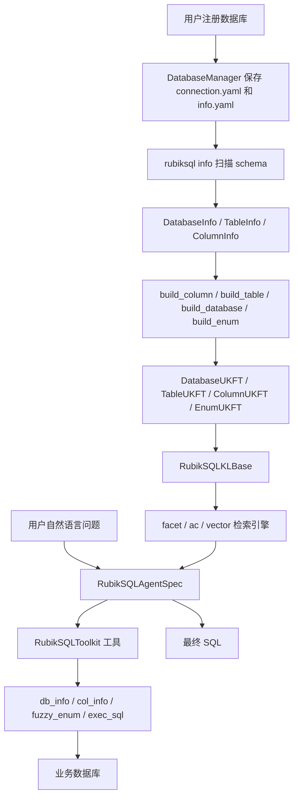
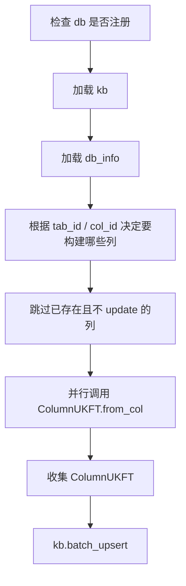
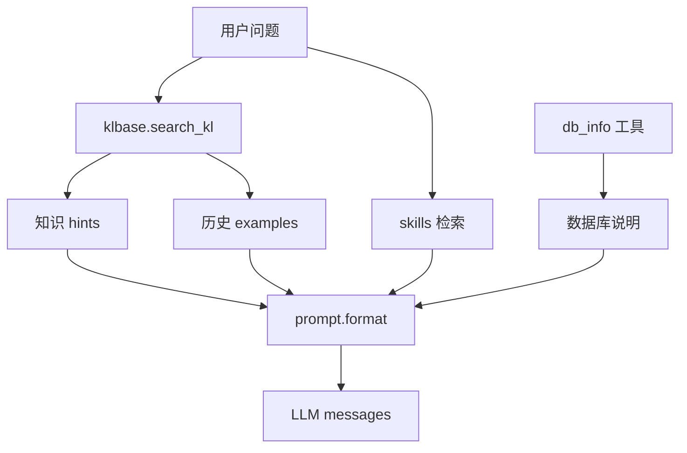
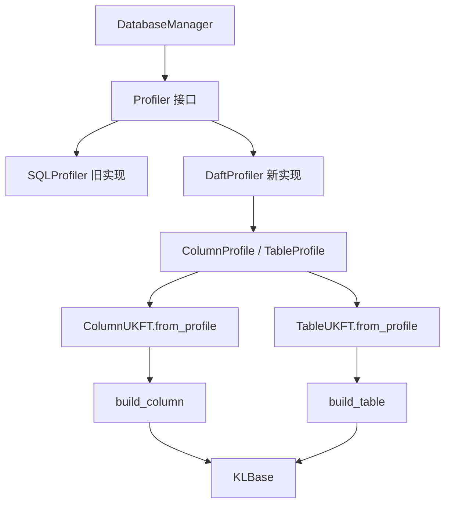

# RubikSQL 代码讲解中文指南

> 面向没有知识库背景的读者。目标是先把这个项目讲明白，再帮助你判断后续如何用 Daft 改写其中的数据处理部分。

## 1. 先给一个总览

RubikSQL 是一个面向 NL2SQL 的系统。NL2SQL 的意思是：用户用自然语言问问题，系统生成 SQL 查询数据库。

普通 NL2SQL 系统经常这样做：

1. 把数据库 schema 放进 prompt。
2. 把用户问题放进 prompt。
3. 让大模型直接写 SQL。

RubikSQL 的思路更复杂，也更接近生产系统：

1. 先把数据库的结构、列统计、枚举值、业务描述、同义词、历史问答经验等整理成一个“知识库”。
2. 用户提问时，不把全库信息都塞给模型，而是先从知识库里检索相关内容。
3. Agent 根据检索结果、工具查询结果和 SQL 执行反馈逐步生成 SQL。
4. 成功和失败的经验还可以继续沉淀回知识库。

可以把它理解成：

```text
数据库本身 = 原始数据仓库
RubikSQL 知识库 = 给大模型看的数据库说明书、索引卡片和经验笔记
Agent = 会查说明书、会试 SQL、会修错的 SQL 助手
```

这份仓库目前处在重构状态。很多核心思路已经落在代码里，但也能看到旧接口残留、文档滞后、部分 CLI 指向未迁移模块。阅读时要抓住“新版主线”，不要被历史代码带偏。

## 2. 你需要先懂的知识库概念

### 2.1 什么是知识库

这里的知识库不是神秘的东西。它就是把“对数据库有帮助的信息”用统一格式保存起来，方便检索和喂给大模型。

比如一张表：

```text
orders
```

人看数据库时可能知道：

```text
orders 表记录订单。
user_id 是用户 ID。
status 可能是 paid、cancelled、pending。
created_at 是下单时间。
```

这些信息如果只存在人的脑子里，大模型不会知道。RubikSQL 会把它们变成知识项：

```text
TableUKFT: orders 表信息
ColumnUKFT: orders.user_id 列信息
ColumnUKFT: orders.status 列信息
EnumUKFT: orders.status = paid
EnumUKFT: orders.status = cancelled
```

当用户问“取消订单有多少”时，系统可以检索到 `cancelled` 这个枚举值和 `orders.status` 这个列，再帮助模型写出更可靠的 SQL。

### 2.2 为什么不能只靠数据库 schema

数据库 schema 通常只告诉你：

```sql
CREATE TABLE orders (
    id INTEGER,
    user_id INTEGER,
    status TEXT,
    created_at TEXT
)
```

但真实问题还需要很多隐含知识：

- `status = 'C'` 可能代表 cancelled。
- `created_at` 可能是字符串，但实际格式是 `%Y-%m-%d %H:%M:%S`。
- `user_id` 是外键，应该关联 `users.id`。
- 某些列虽然存在，但不该暴露给模型。
- 某些业务指标需要固定 SQL 谓词。

RubikSQL 的知识库就是为了解决这些信息缺口。

### 2.3 UKF 和 UKFT 是什么

代码里大量出现 `UKF`、`UKFT`。

可以先这样理解：

```text
UKF  = Unified Knowledge Format，统一知识格式
UKFT = Unified Knowledge Format Template，某一类知识的模板
```

如果说 UKF 是“知识卡片的标准格式”，那 UKFT 就是不同类型卡片的模板：

```text
DatabaseUKFT  = 数据库卡片模板
TableUKFT     = 表卡片模板
ColumnUKFT    = 列卡片模板
EnumUKFT      = 枚举值卡片模板
PredicateUKFT = SQL 条件/业务谓词卡片模板
ExpUKFT       = 历史 NL2SQL 经验卡片模板
```

一张知识卡片通常包含：

| 字段 | 通俗解释 |
| --- | --- |
| `name` | 这张卡片叫什么 |
| `type` | 这是什么类型的知识 |
| `description` | 给人和模型看的描述 |
| `content_resources` | 结构化内容，比如表名、列名、统计值 |
| `content_composers` | 如何把结构化内容渲染成文字 |
| `tags` | 检索过滤标签，比如 DATABASE、TABLE、COLUMN |
| `synonyms` | 同义词，帮助字符串检索 |
| `owner` | 谁创建的知识，系统、管理员或用户 |
| `priority` | 多条知识冲突时谁优先 |

### 2.4 检索引擎是什么

RubikSQL 的知识库不是只用一种搜索。

在 [default_config.yaml](../src/rubiksql/resources/configs/default_config.yaml) 里可以看到几类引擎：

| 引擎 | 用途 | 通俗解释 |
| --- | --- | --- |
| `facet` | 按类型和标签过滤 | 像数据库 WHERE 条件 |
| `ac` / `ac-enums` | 字符串匹配 | 找用户问题里出现过的表名、列名、同义词 |
| `vec-enums` | 向量检索枚举值 | 找语义相近的实际取值 |
| `vec-queries-*` | 检索历史问题 | 找相似 NL2SQL 样例 |
| `skills` | 检索技能 | 找可用工具或任务技能 |

可以简单理解为：

```text
facet = 精准查标签
ac    = 查关键词
vector = 查语义相似
```

## 3. 仓库结构

仓库主体在 `RubikSQL-dev/` 下。

```text
RubikSQL-dev/
├── README.md
├── pyproject.toml
├── requirements.txt
├── demo.py
├── docs/
├── data/
│   └── unicom.db
└── src/rubiksql/
    ├── api.py
    ├── agent.py
    ├── api/
    ├── agents/
    ├── cli/
    ├── db/
    ├── klbase/
    ├── resources/
    ├── tools/
    ├── ukfs/
    └── utils/
```

重点目录如下：

| 路径 | 作用 |
| --- | --- |
| [src/rubiksql/db/](../src/rubiksql/db/) | 管理业务数据库连接和 schema 元信息 |
| [src/rubiksql/ukfs/](../src/rubiksql/ukfs/) | 定义各种知识卡片模板 |
| [src/rubiksql/klbase/](../src/rubiksql/klbase/) | 初始化知识库存储和检索引擎 |
| [src/rubiksql/api/](../src/rubiksql/api/) | 面向代码调用的 API，尤其是知识构建 |
| [src/rubiksql/cli/](../src/rubiksql/cli/) | 命令行入口 |
| [src/rubiksql/tools/](../src/rubiksql/tools/) | Agent 可以调用的工具 |
| [src/rubiksql/resources/](../src/rubiksql/resources/) | 配置、prompt、示例 |
| [src/rubiksql/agent.py](../src/rubiksql/agent.py) | NL2SQL Agent 主逻辑 |

## 4. 一条完整数据流

下面这张图是理解整个仓库最重要的图。



更口语化地说：

1. 先告诉 RubikSQL 你的数据库在哪里。
2. RubikSQL 扫描数据库结构，生成基础元信息。
3. RubikSQL 根据元信息和实际数据生成知识卡片。
4. 知识卡片进入知识库，并被建立不同索引。
5. 用户提问。
6. Agent 先检索相关知识，再必要时调用工具查列、找枚举、执行 SQL。
7. Agent 输出 SQL。

## 5. 配置系统

### 5.1 配置文件在哪里

核心默认配置在：

[src/rubiksql/resources/configs/default_config.yaml](../src/rubiksql/resources/configs/default_config.yaml)

这里决定了：

- 数据库配置存在哪里。
- 知识库存储用什么后端。
- 检索引擎有哪些。
- 构建时开多少线程。
- 列类型推断规则。
- Agent 默认用哪个 preset。
- 工具返回多少行。

### 5.2 配置管理代码

配置管理在：

[src/rubiksql/utils/config_utils.py](../src/rubiksql/utils/config_utils.py)

关键对象：

```python
RUBIK_CM = RubikSQLConfigManager(name="rubiksql", package="rubiksql")
```

这个对象相当于全局配置中心。

常见用法：

```python
RUBIK_CM.get("klbase.build.num_threads", -1)
RUBIK_CM.get("core.dbs_path", "~/.rubiksql/databases")
```

`rpj()` 是资源路径工具，用来定位包内资源，比如 prompt 和配置：

```python
rpj("& prompts/db/")
rpj("& configs/default_config.yaml", abs=True)
```

### 5.3 知识库配置最重要

`default_config.yaml` 里的 `klbase` 是重中之重。

它定义了三个 storage：

```yaml
storages:
  anchor:
  main:
  ac:
```

可以理解为：

| storage | 作用 |
| --- | --- |
| `main` | 主知识库存储，保存普通知识 |
| `anchor` | 人工锚定知识，带 `ANCHOR=true` 标签 |
| `ac` | 给字符串检索用的知识子集 |

它还定义了多个 engine：

```yaml
engines:
  anchor:
  facet:
  ac:
  ac-enums:
  vec-enums:
  vec-queries-by-name:
  vec-queries-by-mask:
  skills:
```

这表示同一批知识可以建不同索引，服务不同搜索场景。

## 6. 数据库管理模块

数据库管理主要在：

- [src/rubiksql/db/manager.py](../src/rubiksql/db/manager.py)
- [src/rubiksql/db/info.py](../src/rubiksql/db/info.py)
- [src/rubiksql/api/database.py](../src/rubiksql/api/database.py)

### 6.1 DatabaseConfig

位置：

[src/rubiksql/db/manager.py](../src/rubiksql/db/manager.py)

`DatabaseConfig` 描述一个已注册数据库：

```python
@dataclass
class DatabaseConfig:
    name: str
    created_at: Optional[str] = None
    connection: Dict[str, Any] = field(default_factory=dict)
```

通俗解释：

```text
name       = RubikSQL 里给这个数据库起的名字
created_at = 注册时间
connection = 真正连接数据库需要的参数
```

比如 SQLite 数据库可能保存成：

```yaml
provider: sqlite
database: C:/path/to/data.db
```

PostgreSQL 可能保存成：

```yaml
provider: pg
host: localhost
port: 5432
database: mydb
username: admin
password: secret
```

### 6.2 DatabaseManager

`DatabaseManager` 是数据库配置管理器。全局单例是：

```python
RUBIK_DBM = DatabaseManager()
```

它负责：

- 注册数据库。
- 删除数据库配置。
- 测试连接。
- 连接数据库。
- 保存和加载数据库元信息。
- 设置当前 active database。
- 设置表/列描述。
- 启用或禁用表/列。
- 维护外键信息。

### 6.3 数据库配置落在哪里

默认根目录来自配置：

```yaml
core:
  dbs_path: "~/.rubiksql/databases"
```

一个数据库注册后大概会是：

```text
~/.rubiksql/databases/mydb/
├── info.yaml
├── connection.yaml
└── kb/
```

其中：

| 文件 | 作用 |
| --- | --- |
| `connection.yaml` | 连接数据库的参数 |
| `info.yaml` | 数据库元信息和用户标注 |
| `kb/` | 这个数据库对应的知识库目录 |

### 6.4 DatabaseInfo / TableInfo / ColumnInfo

位置：

[src/rubiksql/db/info.py](../src/rubiksql/db/info.py)

这三个 dataclass 是数据库 schema 的轻量描述。

```python
DatabaseInfo
└── tables: Dict[str, TableInfo]
    └── columns: Dict[str, ColumnInfo]
```

`ColumnInfo` 保存：

| 字段 | 含义 |
| --- | --- |
| `col_id` | 列名 |
| `datatype_orig` | 数据库原始类型 |
| `datatype_anno` | 用户或系统标注后的类型 |
| `desc` | 用户写的列描述 |
| `enum_index_enabled` | 是否为这列建立枚举值索引 |
| `is_pk` | 是否主键 |
| `disabled` | 是否禁用 |

`TableInfo` 保存：

| 字段 | 含义 |
| --- | --- |
| `tab_id` | 表名 |
| `n_rows` | 行数 |
| `n_cols` | 列数 |
| `n_cols_enabled` | 启用列数量 |
| `desc` | 表描述 |
| `pks` | 主键列表 |
| `fks` | 外键列表 |
| `columns` | 列信息 |

`DatabaseInfo` 保存：

| 字段 | 含义 |
| --- | --- |
| `name` | 数据库名 |
| `desc` | 数据库描述 |
| `n_tabs` | 表数量 |
| `n_cols` | 列数量 |
| `n_tabs_enabled` | 启用表数量 |
| `n_cols_enabled` | 启用列数量 |
| `tables` | 表信息 |

### 6.5 update_db_info 做什么

`DatabaseManager.update_db_info()` 是扫描 schema 的主函数。

它支持三级范围：

```text
update_db_info("mydb")                         扫整个数据库
update_db_info("mydb", tab_id="users")         扫一张表
update_db_info("mydb", tab_id="users", col_id="name") 扫一列
```

它的核心工作：

1. 连接数据库。
2. 读取表列表。
3. 读取列列表。
4. 读取行数。
5. 读取数据库原始列类型。
6. 读取主键和外键。
7. 合并已有用户描述、禁用标记、类型标注。
8. 保存回 `info.yaml`。

这里需要注意：

```text
reset=True  会清掉用户编辑，重新抽取。
reset=False 会尽量保留已有 desc、disabled、datatype_anno 等用户信息。
```

这对生产系统很重要，因为用户人工补过的解释不能随便丢。

## 7. 知识卡片模板模块 ukfs

目录：

[src/rubiksql/ukfs/](../src/rubiksql/ukfs/)

这里定义 RubikSQL 自己的知识类型。

### 7.1 DatabaseUKFT

位置：

[src/rubiksql/ukfs/db_ukft.py](../src/rubiksql/ukfs/db_ukft.py)

它表示“一个数据库”。

核心构造函数：

```python
DatabaseUKFT.from_db(db_id=...)
```

它会：

1. 连接数据库。
2. 读取全部表。
3. 根据 `DatabaseInfo` 过滤禁用表。
4. 生成一张数据库知识卡片。

卡片里的重要字段：

```python
content_resources={
    "db_id": db_id,
    "tabs": enabled_tabs,
    "# tabs": len(enabled_tabs),
}
```

通俗解释：

```text
这张卡片告诉模型：这个数据库叫什么，里面有哪些启用的表。
```

### 7.2 TableUKFT

位置：

[src/rubiksql/ukfs/tab_ukft.py](../src/rubiksql/ukfs/tab_ukft.py)

它表示“一张表”。

核心构造函数：

```python
TableUKFT.from_tab(db_id=..., tab_id=...)
```

它会：

1. 连接数据库。
2. 读取表的所有列。
3. 根据 `DatabaseInfo` 过滤禁用列。
4. 读取行数、主键、外键。
5. 生成表知识卡片。

重要字段：

```python
content_resources={
    "db_id": db_id,
    "tab_id": tab_id,
    "# rows": row_count,
    "# cols": len(enabled_cols),
    "pks": db.tab_pks(tab_id),
    "fks": db.tab_fks(tab_id),
    "cols": enabled_cols,
}
```

通俗解释：

```text
这张卡片告诉模型：这张表有多少行、有哪些列、主键和外键是什么。
```

### 7.3 ColumnUKFT

位置：

[src/rubiksql/ukfs/col_ukft.py](../src/rubiksql/ukfs/col_ukft.py)

这是目前最重要、也最适合后续用 Daft 改写的类。

核心构造函数：

```python
ColumnUKFT.from_col(db_id=..., tab_id=..., col_id=...)
```

它会：

1. 连接数据库。
2. 读取表总行数。
3. 读取列的原始类型。
4. 调用 `db.col_freqs(tab_id, col_id)` 统计每个值出现次数。
5. 识别 null-like 值。
6. 计算非空 distinct 数量。
7. 保存 top/bottom 枚举样本。
8. 保存频率分布。
9. 记录主键、外键、类型标注、是否建枚举索引。

重要字段：

```python
content_resources={
    "db_id": db_id,
    "tab_id": tab_id,
    "col_id": col_id,
    "datatype_orig": datatype_orig,
    "datatype_anno": datatype_anno,
    "datatype": datatype,
    "enum_index": enum_index,
    "# rows": row_count,
    "# distincts": len(non_null_freqs),
    "# null": null_count,
    "top_enums": ...,
    "bot_enums": ...,
    "freq_dists": ...,
    "is_pk": is_pk,
    "fks": fks,
}
```

这就是一张“列画像”。

比如 `users.age` 可能生成：

```text
列名：users.age
类型：INTEGER
总行数：100000
空值数量：10
distinct 数量：85
范围：18 到 90
平均值：37.2
```

### 7.4 列类型推断

列类型定义在：

[src/rubiksql/utils/db_utils.py](../src/rubiksql/utils/db_utils.py)

```python
class ColumnType(Enum):
    LongText = "LONGTEXT"
    DateTime = "DATETIME"
    Identifier = "IDENTIFIER"
    Categorical = "CATEGORICAL"
    Integer = "INTEGER"
    Float = "FLOAT"
    Text = "TEXT"
    Unknown = "UNKNOWN"
```

`ColumnUKFT.type_deduction()` 会根据实际值推断类型。

大致规则：

| 情况 | 推断类型 |
| --- | --- |
| 字符串很长 | `LONGTEXT` |
| 能被统一时间格式解析 | `DATETIME` |
| 几乎每行都不同，并且不是数字 | `IDENTIFIER` |
| 全部符合整数格式 | `INTEGER` |
| 全部符合浮点格式 | `FLOAT` |
| distinct 少且占比低 | `CATEGORICAL` |
| 都是字符串 | `TEXT` |
| 其他 | `UNKNOWN` |

时间格式比较特别。代码会调用一个 LLM 小任务生成 Python `strptime` 格式，然后再用 `datetime.strptime()` 验证所有样本是否可解析。

这意味着列类型推断不是纯规则，有一小部分会走 LLM。

### 7.5 content_composer 是什么

每个 UKFT 都会注册 `content_composers`。

比如 ColumnUKFT：

```python
content_composers={
    "default": col_info_brief_composer,
    "detail": col_info_detail_composer,
    "brief": col_info_brief_composer,
    "ac": col_ac_searched_composer,
}
```

这表示同一张知识卡片可以用不同方式渲染成文字：

| composer | 用途 |
| --- | --- |
| `brief` | 简短说明，适合表列表或检索提示 |
| `detail` | 详细说明，适合工具查询列详情 |
| `ac` | 字符串检索命中后，告诉模型是哪个关键词命中的 |

这很重要，因为知识库里保存的是结构化数据，但大模型最终吃的是文本。composer 就是“结构化知识到 prompt 文本”的翻译器。

### 7.6 EnumUKFT

位置：

[src/rubiksql/ukfs/enum_ukft.py](../src/rubiksql/ukfs/enum_ukft.py)

它表示“某列的一个实际取值”。

比如：

```text
orders.status = cancelled
schools.County = Riverside
```

构造函数：

```python
EnumUKFT.from_enum(db_id, tab_id, col_id, enum_val)
```

重要字段：

```python
content_resources={
    "db_id": db_id,
    "tab_id": tab_id,
    "col_id": col_id,
    "enum": enum_val,
    "predicate": {"tab": tab_id, "col": col_id, "==": enum_val},
}
```

为什么要把枚举值单独建成知识？

因为用户问题里常常包含数据库里的实际取值，但不一定完全一致。

例如用户问：

```text
Riverside county 有多少学校？
```

数据库里可能是：

```text
County = "Riverside"
```

`fuzzy_enum` 工具可以通过向量检索找到这个枚举值，帮助模型写出正确 WHERE 条件。

### 7.7 PredicateUKFT

位置：

[src/rubiksql/ukfs/pred_ukft.py](../src/rubiksql/ukfs/pred_ukft.py)

它表示一个 SQL 条件或业务谓词。

例子：

```python
{"FIELD:users.status": {"==": "active"}}
```

可以转成：

```sql
users.status = 'active'
```

适合保存类似：

```text
有效用户 = status = 'active'
高价值客户 = total_spent > 10000
```

### 7.8 RubikSQLExpUKFT

位置：

[src/rubiksql/ukfs/exp_ukft.py](../src/rubiksql/ukfs/exp_ukft.py)

它表示历史 NL2SQL 经验，也就是一条自然语言问题和对应 SQL。

重要内容：

```text
question
context
hints
output sql
expected sql
metadata
```

这些经验可以用于：

- few-shot 示例。
- 检索相似问题。
- 后续训练数据。
- 分析模型常犯错误。

## 8. 知识库 klbase 模块

目录：

[src/rubiksql/klbase/](../src/rubiksql/klbase/)

### 8.1 RubikSQLKLBase

位置：

[src/rubiksql/klbase/base.py](../src/rubiksql/klbase/base.py)

新版构造函数很简单：

```python
RubikSQLKLBase(db_id: str)
```

它做三件事：

```python
self.init()
self.build_storages()
self.build_engines()
```

通俗解释：

```text
init           = 找到这个数据库自己的 kb 目录
build_storages = 建立知识存储后端
build_engines  = 建立搜索索引
```

### 8.2 知识库目录

每个数据库都有自己的知识库目录：

```text
~/.rubiksql/databases/<db_id>/kb/
├── kb_config.yaml
├── .cache/
├── ac/
├── ac-enums/
└── vec/
```

第一次初始化时，如果没有 `kb_config.yaml`，会从全局配置复制一份快照。

这很重要：

```text
每个数据库的知识库配置可以独立存在。
以后改全局 default_config.yaml，不一定自动影响已有数据库。
```

### 8.3 build_storages

`build_storages()` 会读取配置里的 `storages`：

```yaml
storages:
  anchor:
  main:
  ac:
```

然后创建 `DatabaseKLStore`。

这个类来自 AgentHeaven，不是 RubikSQL 自己写的。

配置里可以指定：

- provider，比如 sqlite、duckdb。
- database 文件路径。
- condition，用来过滤哪些知识进入这个 storage。

例如 `main` 排除 `ANCHOR=true` 的知识，`anchor` 只包含 anchor 知识。

### 8.4 build_engines

`build_engines()` 会读取配置里的 `engines`，并创建不同检索引擎。

支持的 engine 类型：

```python
engine_types = {
    "scan": ScanKLEngine,
    "facet": FacetKLEngine,
    "daac": DAACKLEngine,
    "vector": VectorKLEngine,
    "mongo": MongoKLEngine,
}
```

这些也来自 AgentHeaven。

RubikSQL 自己做的是：

1. 读取配置。
2. 替换路径。
3. 构造 condition。
4. 构造 encoder。
5. 把 storage 和 engine 组装起来。

### 8.5 get_entity

`get_entity()` 是按层级精准取知识项的函数。

调用方式：

```python
kb.get_entity()                         # 数据库知识
kb.get_entity(tab_id="users")           # 表知识
kb.get_entity(tab_id="users", col_id="name") # 列知识
kb.get_entity(tab_id="users", col_id="status", enum_val="active") # 枚举知识
```

它内部用 facet engine 根据标签查。

标签类似：

```text
DATABASE=mydb
TABLE=users
COLUMN=name
ENUM=active
```

### 8.6 search_kl

`search_kl(query=...)` 是用户问题到知识检索的入口。

默认模式下，它会调用：

```python
search_by_default_strategy()
```

策略来自配置：

```yaml
retrieval:
  type_strategies:
    db-column:
      engines:
        - name: ac
    db-enum:
      engines:
        - name: ac-enums
        - name: vec-enums
```

意思是：

```text
搜列知识，用 ac 字符串索引。
搜枚举知识，用 ac-enums 字符串索引和 vec-enums 向量索引。
搜历史问题，用两个 query vector 索引。
```

### 8.7 关系检索的当前状态

配置里有 `related-search-trigger`，比如：

```yaml
db-column:
  related-search-trigger:
    - in_table
```

理论上，搜到列以后可以顺着关系找到表。

但新版构建代码里目前没有明显看到完整的 `link(...)` 关系写入逻辑。旧版文件 [base__legacy.py](../src/rubiksql/klbase/base__legacy.py) 里有类似：

```python
db_kl.link(rel="has_table", kl=tab_kl)
tab_kl.link(rel="has_column", kl=col_kl)
```

新版 [api/knowledge.py](../src/rubiksql/api/knowledge.py) 主要是在构建和 upsert 知识项，关系迁移可能尚未完成。

这会影响：

- `db_info` 工具里通过 `obj_ids(rel="has_table")` 找表。
- `tab_info` 工具里通过 `obj_ids(rel="has_column")` 找列。
- `related_search` 扩展检索。

后续重构要优先确认这一点。

## 9. API 模块

这个仓库有两个 API 层：

```text
src/rubiksql/api.py
src/rubiksql/api/
```

### 9.1 顶层 api.py

位置：

[src/rubiksql/api.py](../src/rubiksql/api.py)

当前这个文件只有基础数据库 API：

- `list_dbs`
- `add_db`
- `remove_db`
- `load_db`
- `get_db_config`
- `db_exists`
- `get_kb_path`

但它的 docstring 还提到：

```python
load_kb
build_kb
```

当前文件里并没有这些函数。这是重构残留。

### 9.2 api/database.py

位置：

[src/rubiksql/api/database.py](../src/rubiksql/api/database.py)

这是数据库管理 API 的新版主线。它基本是 `RUBIK_DBM` 的薄封装。

常用函数：

| 函数 | 作用 |
| --- | --- |
| `list_dbs()` | 列出已注册数据库 |
| `add_db()` | 注册数据库 |
| `load_db()` | 连接数据库 |
| `init_db_info()` | 初始化元信息 |
| `load_db_info()` | 读取元信息 |
| `update_db_info()` | 更新元信息 |
| `set_description()` | 设置描述 |
| `set_disabled()` | 启用或禁用表/列 |
| `set_datatype_anno()` | 设置列类型标注 |
| `set_enum_index_enabled()` | 设置是否建立枚举索引 |

### 9.3 api/knowledge.py

位置：

[src/rubiksql/api/knowledge.py](../src/rubiksql/api/knowledge.py)

这是知识构建的核心文件。

主要函数：

| 函数 | 作用 |
| --- | --- |
| `load_kb()` | 加载或缓存知识库 |
| `purge_kb()` | 清理缓存的知识库实例 |
| `build_column()` | 构建列知识 |
| `build_table()` | 构建表知识 |
| `build_database()` | 构建数据库知识 |
| `build_column_type()` | 推断并更新列类型 |
| `build_database_desc()` | 生成数据库描述 |
| `build_table_desc()` | 生成表描述 |
| `build_column_desc()` | 生成列描述 |
| `build_table_synonyms()` | 生成表同义词 |
| `build_column_synonyms()` | 生成列同义词 |
| `build_enum()` | 构建枚举值知识 |
| `search_knowledge()` | 按层级查知识 |
| `upsert_skill()` | 添加技能知识 |
| `remove_skill()` | 删除技能 |
| `enable_skill()` | 启用技能 |
| `disable_skill()` | 禁用技能 |
| `list_skills()` | 列出技能 |

### 9.4 build_column 详解

`build_column()` 的执行流程：



这个函数有三个设计点：

1. 支持全库、单表、单列三级范围。
2. 支持 `update`，已有知识可以跳过或重建。
3. 用 `Parallelized` 并行构建，最后批量 upsert。

### 9.5 build_column_type 详解

`build_column_type()` 依赖已经建好的 `ColumnUKFT`。

它会：

1. 找到要处理的列。
2. 从知识库取 ColumnUKFT。
3. 如果用户在 `info.yaml` 里人工标注了类型，优先用人工类型。
4. 否则调用 `ColumnUKFT.type_deduced()`。
5. 删除旧列知识。
6. 写入新列知识。
7. 同步更新 `db_info` 里的 `datatype_anno`。

### 9.6 build_enum 详解

`build_enum()` 用来把某些列的所有 distinct 值建成 `EnumUKFT`。

不是所有列都建枚举，因为有些列 distinct 太多，比如用户 ID、订单号，全部建索引会很浪费。

判断逻辑：

```text
enum_index_enabled = True   一定建
enum_index_enabled = False  一定不建
enum_index_enabled = None   只有 TEXT 或 CATEGORICAL 默认建
```

注意一个细节：

当前代码判断默认是否建枚举时读取的是 `column.datatype_anno`。如果类型推断结果没有正确同步到 `db_info`，可能导致枚举构建被跳过。

### 9.7 api/nl2sql.py 和 api/experience.py

这两个文件目前更像旧接口残留：

- [src/rubiksql/api/nl2sql.py](../src/rubiksql/api/nl2sql.py)
- [src/rubiksql/api/experience.py](../src/rubiksql/api/experience.py)

它们引用：

```python
from ..db import DB_MANAGER
```

但新版全局对象叫：

```python
RUBIK_DBM
```

它们还使用旧版 `RubikSQLKLBase(db, db_info, kb_path, db_name=...)` 构造方式，而新版构造函数是：

```python
RubikSQLKLBase(db_id)
```

所以这两个文件不能当作当前主线参考。

## 10. CLI 模块

目录：

[src/rubiksql/cli/](../src/rubiksql/cli/)

CLI 主入口：

[src/rubiksql/cli/rubiksql.py](../src/rubiksql/cli/rubiksql.py)

`pyproject.toml` 里声明：

```toml
[project.scripts]
rubiksql = "rubiksql.cli:main"
```

### 10.1 CLI 注册结构

`rubiksql.py` 里先定义主 group：

```python
@click.group(...)
def cli(ctx, verbose):
    ...
```

然后注册子命令：

```python
register_config_commands(cli)
register_db_commands(cli)
register_build_commands(cli)
register_search_commands(cli)
register_ask_commands(cli)
register_tool_commands(cli)
register_skill_commands(cli)
```

### 10.2 数据库相关 CLI

数据库管理命令在：

[src/rubiksql/cli/db_cli.py](../src/rubiksql/cli/db_cli.py)

主要命令：

```text
rubiksql add
rubiksql list
rubiksql remove
rubiksql test
rubiksql activate
rubiksql deactivate
```

根级别 `info` 命令在 `rubiksql.py` 里。

常见用法：

```bash
rubiksql add -n mydb -p sqlite -db ./data.db
rubiksql info -n mydb --update
rubiksql update desc -n mydb -t users "用户表"
rubiksql update disable -n mydb -t users -c password
```

### 10.3 build CLI

构建命令在：

[src/rubiksql/cli/build_cli.py](../src/rubiksql/cli/build_cli.py)

它把 CLI 参数转发到 `api/knowledge.py`。

主要命令：

```text
rubiksql build column
rubiksql build column-type
rubiksql build table
rubiksql build database
rubiksql build enum
rubiksql build database-desc
rubiksql build table-desc
rubiksql build column-desc
rubiksql build table-syn
rubiksql build column-syn
```

推荐理解顺序：

```bash
rubiksql build column -n mydb
rubiksql build column-type -n mydb
rubiksql build table -n mydb
rubiksql build database -n mydb
rubiksql build enum -n mydb
```

### 10.4 search CLI

位置：

[src/rubiksql/cli/search_cli.py](../src/rubiksql/cli/search_cli.py)

它走 `search_knowledge()`，按层级查知识：

```bash
rubiksql search -n mydb
rubiksql search -n mydb -t users
rubiksql search -n mydb -t users -c name
rubiksql search -n mydb -t users -c status -e active
```

### 10.5 ask CLI 的当前问题

位置：

[src/rubiksql/cli/ask_cli.py](../src/rubiksql/cli/ask_cli.py)

这个文件引用了当前仓库里没有看到的模块：

```python
from rubiksql.services.agent_service import ask_agent, get_default_agent
from rubiksql.klbase.kb_status import kb_is_built
```

所以 CLI 的 `rubiksql ask` 这条路目前可能不可用，或者依赖未提交代码。

如果要看当前可理解的 Agent 调用，建议先看 [demo.py](../demo.py) 和 [agent.py](../src/rubiksql/agent.py)。

## 11. Agent 模块

核心文件：

[src/rubiksql/agent.py](../src/rubiksql/agent.py)

核心类：

```python
class RubikSQLAgentSpec(BasePromptAgentSpec):
```

它继承自 AgentHeaven 的 `BasePromptAgentSpec`。

### 11.1 Agent 初始化

初始化需要：

```python
RubikSQLAgentSpec(
    prompt=...,
    klbase=...,
    db_id=...,
    toolkit=...,
    llm_args=...,
    dialect=...,
    max_steps=...,
)
```

它默认给 Agent 的工具是：

```python
tools = toolkit.get_tools(["col_info", "fuzzy_enum", "exec_sql"])
```

也就是说，模型一开始主要能做三件事：

| 工具 | 作用 |
| --- | --- |
| `col_info` | 查某列详情 |
| `fuzzy_enum` | 模糊找数据库里的实际取值 |
| `exec_sql` | 执行 SQL 看结果 |

### 11.2 encode：把用户问题变成模型输入

`encode()` 是最重要的方法之一。

流程：

1. 获取 retrieval mode。
2. 调用 `self.klbase.search_kl(query=query)` 检索相关知识。
3. 把检索结果分成 hints 和 examples。
4. 调用 `db_info` 工具拿数据库说明。
5. 检索相关 skills。
6. 构造 `CacheEntry` 形式的 instance。
7. 用 prompt 模板渲染成 messages。

简化图：



### 11.3 _build_hints_examples

这个函数把检索结果转换成两类内容：

```text
hints   = 给模型看的相关知识提示
examples = 历史 NL2SQL 样例
```

如果知识类型是 `nl2sql-query`，它会当作 example。

其他知识，比如表、列、枚举、谓词，会当作 hint。

### 11.4 process：看模型输出是否完成

`process()` 会在每轮模型输出后运行。

它做几件事：

1. 如果技能里引用了新工具，把工具加载进来。
2. 检查输出里有没有 `[END]`。
3. 检查输出里有没有 SQL 代码块。
4. 如果找到 SQL，调用 `submit_sql` 验证。
5. 如果 SQL 执行出错，给模型追加一条“你刚才 SQL 报错了，请修正”的用户消息。
6. 如果 SQL 可执行，标记任务完成。

这就是 Agent 比普通一次性生成更可靠的地方：

```text
不是写完就结束，而是尝试执行，错了再让模型修。
```

### 11.5 decode：取最终 SQL

`decode()` 从 state 中取：

```python
metadata.final_sql
```

然后调用 `prettify_sql()` 做格式化。

## 12. Tools 模块

目录：

[src/rubiksql/tools/](../src/rubiksql/tools/)

工具是 Agent 可以调用的函数。RubikSQL 把它们包装成 `ToolSpec`。

### 12.1 RubikSQLToolkit

位置：

[src/rubiksql/tools/__init__.py](../src/rubiksql/tools/__init__.py)

`RubikSQLToolkit` 负责把所有工具组装起来：

```python
self.tools = {
    "exec_sql": ...,
    "db_info": ...,
    "tab_info": ...,
    "col_info": ...,
    "fuzzy_enum": ...,
    "submit_sql": ...,
    "fd_check": ...,
    "add_knowledge": ...,
    "submit_kls": ...,
    "extract_synonyms": ...,
    "magic_number": ...,
}
```

### 12.2 db_info / tab_info / col_info

位置：

[src/rubiksql/tools/db_info.py](../src/rubiksql/tools/db_info.py)

三个工具分别返回：

| 工具 | 返回内容 |
| --- | --- |
| `db_info` | 数据库整体 schema 信息 |
| `tab_info` | 单表 schema 信息 |
| `col_info` | 单列详细统计信息 |

这些工具的目的是：

```text
当模型不确定某个表或列时，可以主动查，而不是凭空猜。
```

`col_info` 特别重要，因为它会返回列类型、空值、枚举样本、统计信息等。

### 12.3 fuzzy_enum

位置：

[src/rubiksql/tools/fuzzy_enum.py](../src/rubiksql/tools/fuzzy_enum.py)

这个工具根据关键词查枚举值。

例子：

```text
用户问：Riverside county 有多少学校？
工具查：County = Riverside
```

它内部调用：

```python
kb.search(engine="vec-enums", query=keyword, topk=fetchk)
```

然后按相似度阈值和表过滤结果。

### 12.4 exec_sql 和 submit_sql

位置：

- [src/rubiksql/tools/exec_sql.py](../src/rubiksql/tools/exec_sql.py)
- [src/rubiksql/tools/submit.py](../src/rubiksql/tools/submit.py)

`exec_sql` 是普通执行工具，返回表格结果。

`submit_sql` 更像验证工具，Agent 用它判断 SQL 是否可执行、是否能作为最终结果。

### 12.5 fd_check

位置：

[src/rubiksql/tools/fd_check.py](../src/rubiksql/tools/fd_check.py)

FD 是 functional dependency，函数依赖。

通俗解释：

```text
如果 X 能唯一决定 Y，那么 Y 依赖 X。
```

例如：

```text
school_id -> school_name
```

表示一个学校 ID 应该只对应一个学校名。

这类工具可以帮助模型判断 group by、join 或去重逻辑。

## 13. resources 模块

目录：

[src/rubiksql/resources/](../src/rubiksql/resources/)

### 13.1 configs

配置文件：

```text
resources/configs/default_config.yaml
resources/configs/ahvn_config.yaml
```

前者是 RubikSQL 默认配置，后者是 AgentHeaven 相关默认配置。

### 13.2 prompts

Prompt 模板在：

```text
resources/prompts/
```

其中 `db/` 下的 prompt 用于渲染数据库、表、列、枚举等知识。

例如：

```text
col_info_detail.jinja
col_info_brief.jinja
tab_info_brief.jinja
db_info.jinja
enum_ac_searched.jinja
```

UKFT 的 composer 会加载这些 jinja 模板，把结构化知识渲染成模型可读文本。

### 13.3 rubik_kb.py

位置：

[src/rubiksql/resources/rubik_kb.py](../src/rubiksql/resources/rubik_kb.py)

这里定义了 RubikSQL 内置 prompt 和示例资源的知识库入口。

可以理解成：

```text
业务数据库有自己的知识库。
RubikSQL 框架本身也有一份资源知识库，用来找 prompt、例子、内置任务。
```

## 14. 构建知识库的推荐顺序

当前代码是分阶段构建，不是一个完整 `build_kb()` 一键入口。

比较稳的理解顺序是：

```bash
rubiksql add -n mydb -p sqlite -db ./data.db
rubiksql info -n mydb --update

rubiksql build column -n mydb
rubiksql build column-type -n mydb
rubiksql build table -n mydb
rubiksql build database -n mydb
rubiksql build enum -n mydb
```

可选增强：

```bash
rubiksql build database-desc -n mydb
rubiksql build table-desc -n mydb
rubiksql build column-desc -n mydb
rubiksql build table-syn -n mydb
rubiksql build column-syn -n mydb
```

这些描述和同义词生成通常会调用 LLM，成本更高，也更依赖模型配置。

## 15. 当前代码中的重构痕迹和风险点

这一节很重要，因为你后续要改写项目。

### 15.1 `api.py` 和 `api/knowledge.py` 暴露不一致

顶层 [api.py](../src/rubiksql/api.py) 的 docstring 提到 `load_kb`、`build_kb`，但文件实际没有实现这些函数。

真正的知识构建函数在：

[src/rubiksql/api/knowledge.py](../src/rubiksql/api/knowledge.py)

### 15.2 `api/__init__.py` 文档可能过期

`src/rubiksql/api/__init__.py` 里有关于 `build_kb`、`kb_status` 的文字，但当前仓库里对应实现并不完整。

阅读时以实际函数定义为准。

### 15.3 `api/nl2sql.py` 和 `api/experience.py` 仍使用旧接口

它们引用 `DB_MANAGER`，但新版是 `RUBIK_DBM`。

它们也使用旧版 `RubikSQLKLBase` 构造方式。

所以它们目前更像历史代码，不能作为 Daft 改写主线。

### 15.4 `ask_cli.py` 指向缺失模块

`ask_cli.py` 引用：

```python
rubiksql.services.agent_service
rubiksql.klbase.kb_status
```

当前文件树里没有这些模块。

如果你要跑 CLI 问答，可能会失败。

### 15.5 新版构建流程可能没有完整写关系

旧版 `base__legacy.py` 有显式关系写入。

新版 `api/knowledge.py` 构建 `DatabaseUKFT`、`TableUKFT`、`ColumnUKFT` 时，没有明显看到等价的 `link(...)`。

但工具里又有依赖：

```python
db_kl.obj_ids(rel="has_table")
tab_kl.obj_ids(rel="has_column")
```

这需要后续验证。

### 15.6 当前环境未安装 AgentHeaven

`requirements.txt` 只有：

```text
agent-heaven
sqlalchemy
```

本地检查时，当前 Python 环境没有 `ahvn` 包，所以无法直接运行项目代码。

这不影响静态阅读，但影响测试和验证。

## 16. 后续用 Daft 改写时应该看哪里

你说后续要通过 Daft 改写这个项目。最适合改的地方不是 Agent，也不是 UKF 格式，而是数据库 profiling 和知识构建的数据处理层。

### 16.1 为什么不是先改 Agent

Agent 部分依赖：

- prompt 模板。
- AgentHeaven 的 agent 框架。
- ToolSpec。
- LLM 调用。
- SQL 验证循环。

这些和 Daft 的关系不大。

Daft 更适合做大规模数据读取、转换、聚合、统计。RubikSQL 里最匹配的是：

```text
扫描表
统计列
计算 distinct
计算 null
计算 top/bottom 枚举值
批量生成 profile
批量构造 UKFT
```

### 16.2 首要改写目标：ColumnUKFT.from_col

当前 `ColumnUKFT.from_col()` 内部直接连接数据库并统计：

```python
row_count = db.row_count(tab_id)
datatype_orig = str(db.col_type(tab_id, col_id))
freqs = {record["col_enums"]: record["freq"] for record in db.col_freqs(tab_id, col_id)}
```

这意味着每构建一列，就发起一组数据库操作。

如果表很多、列很多、数据很大，会很慢。

Daft 更适合把这些变成批量作业。

### 16.3 建议先拆出 Profile 层

不要直接把 Daft 写进 `ColumnUKFT`。

建议先抽象：

```python
ColumnProfile
TableProfile
DatabaseProfile
```

例如：

```python
@dataclass
class ColumnProfile:
    db_id: str
    tab_id: str
    col_id: str
    datatype_orig: str
    row_count: int
    null_count: int
    distinct_count: int
    value_freqs: Dict[Any, int]
    top_enums: Dict[str, int]
    bot_enums: Dict[str, int]
```

然后改成：

```python
profile = profiler.profile_column(db_id, tab_id, col_id)
col_ukft = ColumnUKFT.from_profile(profile, ...)
```

这样：

```text
UKFT 仍然负责知识卡片格式。
Profiler 负责怎么统计数据。
```

未来你可以有：

```text
SQLProfiler   = 现在的 ahvn Database 实现
DaftProfiler  = 新的 Daft 实现
```

### 16.4 Daft 可以改哪些函数

优先级从高到低：

| 优先级 | 目标 | 原因 |
| --- | --- | --- |
| 高 | `ColumnUKFT.from_col` 的频率统计 | 这是最重的数据扫描 |
| 高 | `build_column()` 的批量列 profile | 当前是逐列并行，Daft 可按表批处理 |
| 高 | `build_enum()` 的 distinct 值提取 | 枚举构建本质是 group by |
| 中 | `build_column_type()` 的规则推断 | 部分可批量化，但 datetime LLM 仍要单独处理 |
| 中 | `fd_check` | 函数依赖检查可用 group by 优化 |
| 低 | Agent / prompt / tools 包装 | 和 Daft 关系较弱 |

### 16.5 一个更合理的 Daft 改写架构



这个结构的好处：

1. 不破坏 UKFT 和知识库接口。
2. 可以逐步迁移。
3. 可以保留旧实现作为 fallback。
4. 容易写测试。

### 16.6 你应该避免的改法

不建议一上来这样改：

```text
在 ColumnUKFT.from_col 里面直接 import daft，然后写一大段 Daft 逻辑。
```

原因：

- UKFT 会和具体执行引擎耦合。
- 单元测试困难。
- 以后换回 SQL 或 DuckDB 会很麻烦。
- Agent 逻辑和数据 profiling 逻辑混在一起。

更稳的方式是：

```text
先拆接口，再迁移实现。
```

## 17. 建议你阅读代码的顺序

如果你是第一次读，建议按这个顺序：

1. [README.md](../README.md)
2. [src/rubiksql/resources/configs/default_config.yaml](../src/rubiksql/resources/configs/default_config.yaml)
3. [src/rubiksql/db/info.py](../src/rubiksql/db/info.py)
4. [src/rubiksql/db/manager.py](../src/rubiksql/db/manager.py)
5. [src/rubiksql/ukfs/col_ukft.py](../src/rubiksql/ukfs/col_ukft.py)
6. [src/rubiksql/ukfs/tab_ukft.py](../src/rubiksql/ukfs/tab_ukft.py)
7. [src/rubiksql/ukfs/db_ukft.py](../src/rubiksql/ukfs/db_ukft.py)
8. [src/rubiksql/ukfs/enum_ukft.py](../src/rubiksql/ukfs/enum_ukft.py)
9. [src/rubiksql/klbase/base.py](../src/rubiksql/klbase/base.py)
10. [src/rubiksql/api/knowledge.py](../src/rubiksql/api/knowledge.py)
11. [src/rubiksql/tools/__init__.py](../src/rubiksql/tools/__init__.py)
12. [src/rubiksql/tools/db_info.py](../src/rubiksql/tools/db_info.py)
13. [src/rubiksql/tools/fuzzy_enum.py](../src/rubiksql/tools/fuzzy_enum.py)
14. [src/rubiksql/agent.py](../src/rubiksql/agent.py)
15. [demo.py](../demo.py)

## 18. 用一句话总结每个核心模块

| 模块 | 一句话 |
| --- | --- |
| `db/manager.py` | 管数据库连接和 schema 元信息 |
| `db/info.py` | 定义数据库、表、列的元信息数据结构 |
| `ukfs/*.py` | 把数据库相关信息包装成知识卡片 |
| `klbase/base.py` | 给每个数据库创建知识库存储和检索引擎 |
| `api/knowledge.py` | 批量构建知识卡片并写入知识库 |
| `tools/*.py` | 给 Agent 使用的数据库查询和知识查询工具 |
| `agent.py` | 检索知识、构造 prompt、验证 SQL 的 NL2SQL Agent |
| `cli/*.py` | 把 API 包装成命令行 |
| `resources/prompts/` | 渲染知识和 Agent prompt 的模板 |
| `resources/configs/` | 控制构建、存储、检索、工具和 Agent 的配置 |

## 19. 常见问题

### 19.1 RubikSQL 的知识库是不是向量数据库

不是。它可以使用向量索引，但知识库本身不是简单的向量库。

它是：

```text
结构化知识对象 + 多种存储 + 多种索引 + prompt 渲染 + 生命周期管理
```

向量检索只是其中一种索引方式。

### 19.2 为什么知识项要有 tags

因为很多时候需要精准过滤。

例如查 `users.name` 这列，不能只靠向量相似度。应该用：

```text
DATABASE=mydb
TABLE=users
COLUMN=name
```

这就是 facet search 的作用。

### 19.3 为什么还要 synonyms

用户不会总是说数据库里的原始列名。

比如列名叫：

```text
cust_nm
```

用户会说：

```text
客户名称
customer name
client name
```

同义词能让字符串检索更容易命中。

### 19.4 为什么枚举值要单独建知识

因为 WHERE 条件经常依赖实际值，而实际值不一定在 schema 里。

比如 schema 只告诉你：

```text
status TEXT
```

但真正写 SQL 要知道：

```text
status = 'cancelled'
```

### 19.5 为什么要区分 info.yaml 和知识库

`info.yaml` 更像数据库元信息和人工编辑缓存。

知识库是给 Agent 检索和 prompt 使用的正式知识对象集合。

可以理解成：

```text
info.yaml = 原材料和人工标注
KLBase    = 加工后的知识库成品
```

## 20. 下一步改写建议

如果接下来真的要做 Daft 改写，建议按这个任务顺序推进：

1. 先补一个小测试数据库，确保 `rubiksql info`、`build column`、`build table` 能跑。
2. 补齐或确认 `ahvn` / `agent-heaven` 依赖环境。
3. 明确新版 API 主线，暂时绕开 `api/nl2sql.py`、`api/experience.py`、`ask_cli.py` 的旧接口。
4. 验证新版构建是否写入关系，如果没有，先补 `has_table`、`has_column`、`in_table`、`in_database`。
5. 抽象 profile 数据结构。
6. 把 `ColumnUKFT.from_col()` 拆成 `profile_column()` 加 `from_profile()`。
7. 先用旧 SQL 实现跑通 `Profiler` 接口。
8. 再新增 `DaftProfiler`。
9. 用同一个小数据库对比旧 profile 和 Daft profile 输出是否一致。
10. 最后再优化性能和并行构建。

这样改风险最低。

## 21. 最短心智模型

如果你只记住一句话：

```text
RubikSQL 先把数据库加工成一堆可检索的知识卡片，再让 Agent 查这些卡片、调用工具、执行 SQL、修正 SQL。
```

如果你要用 Daft 改写：

```text
优先改“数据库扫描和列统计”这一层，不要先动 Agent 和知识卡片格式。
```

