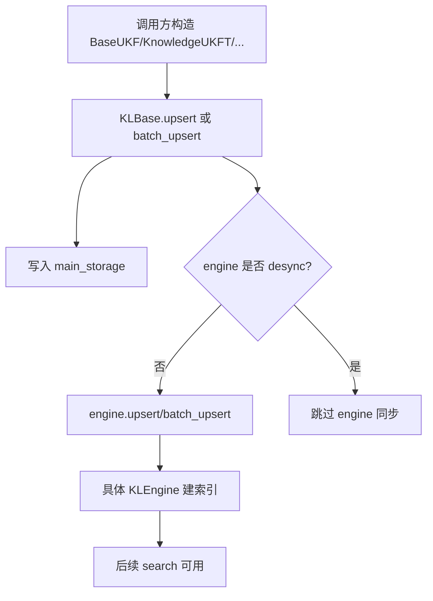
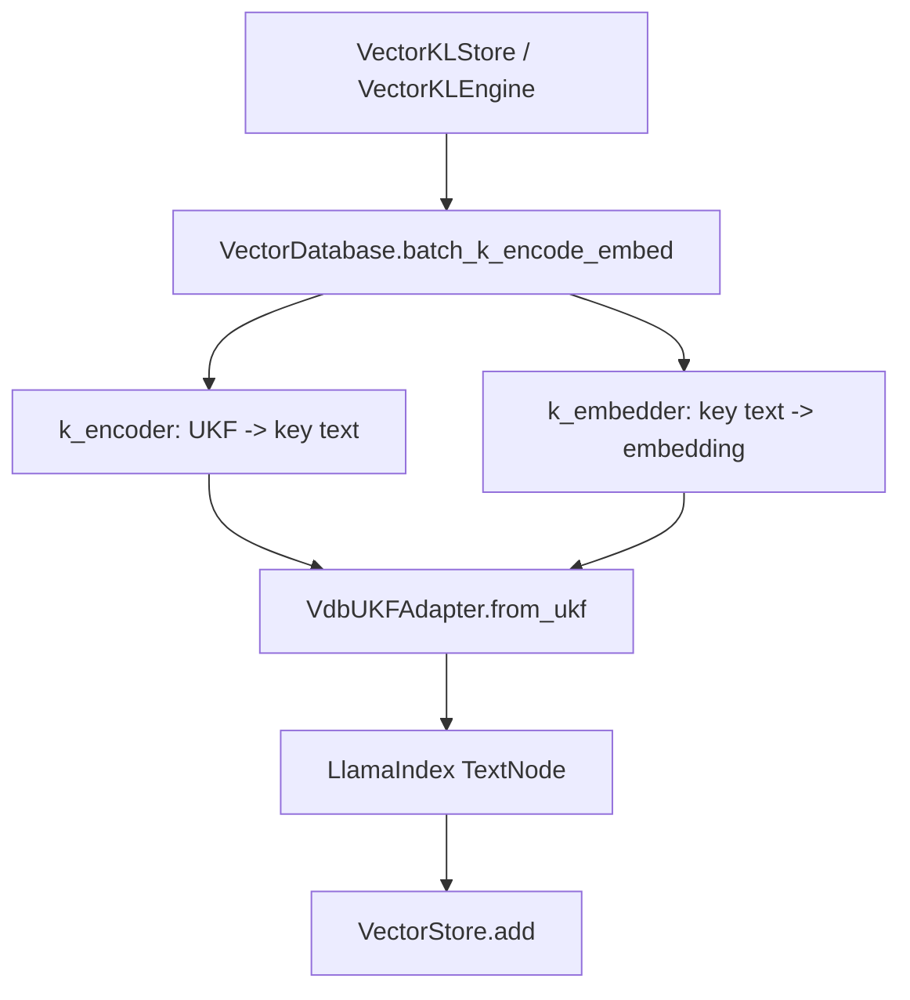
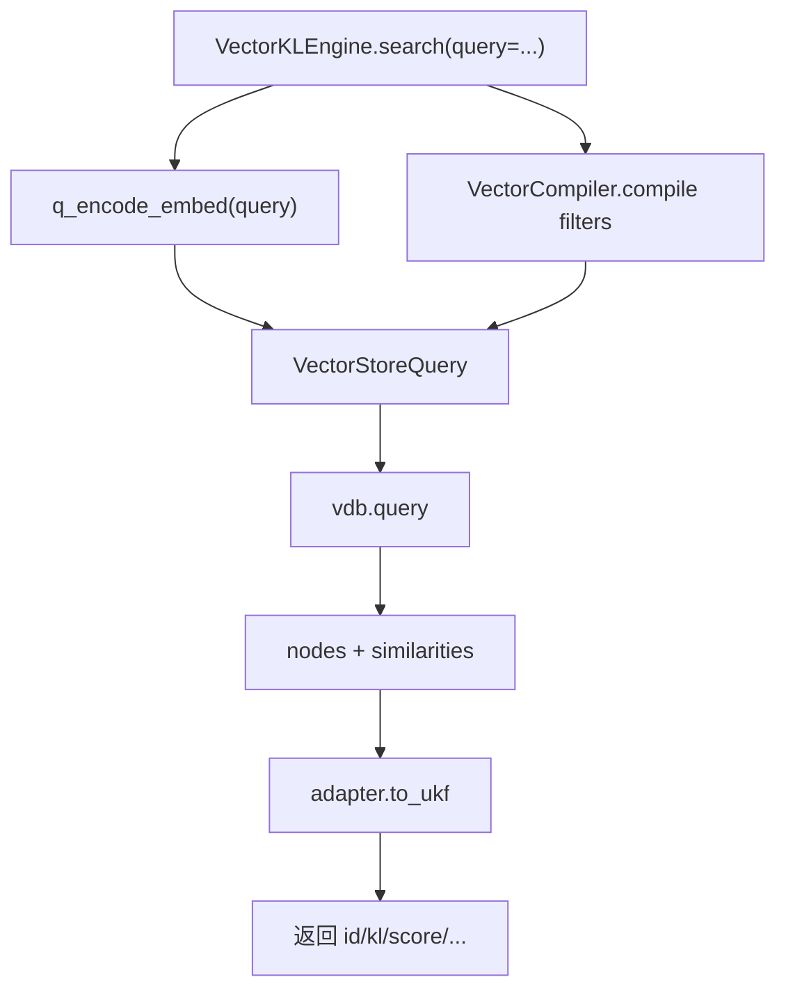

# AgentHeaven-dev-master 项目详细解析

本文基于本地目录 `AgentHeaven-dev-master/AgentHeaven-dev-master` 的源码整理，目标是帮助后续阅读、改造或接入 RubikSQL/Daft 时，能快速把 AgentHeaven 的核心抽象、模块边界和调用链串起来。

## 1. 项目一句话定位

AgentHeaven 是一个面向 LLM Agent 的 Python 基础设施库。它不是单纯的聊天封装，也不是单纯的向量库封装，而是把下面几类能力放到同一个体系里：

- 用 UKF 描述知识、经验、工具、技能、文档等 Agent 可消费资产。
- 用 KLStore 管理知识的持久化存储。
- 用 KLEngine 管理知识的搜索、过滤、向量检索、Mongo 检索等利用方式。
- 用 KLBase 把多个 storage 和 engine 编排成一个可增删改查、可同步、可 desync 的知识库。
- 用 LLM 封装 LiteLLM，统一聊天、流式输出、工具调用、结构化输出和 embedding。
- 用 ToolSpec/Toolkit/Capsule 把 Python 函数、MCP 工具、远程工具和可移植工具包统一起来。
- 用 BaseAgentSpec/BasePromptAgentSpec 把 Agent 抽象成 `encode -> step -> decode` 的可观测运行循环。

从 RubikSQL 的角度看，AgentHeaven 提供的是“知识对象格式 + 存储/检索引擎 + LLM/工具运行时”的底座。

## 2. 仓库结构总览

```text
AgentHeaven-dev-master/
  README.en.md / README.zh.md
  pyproject.toml
  requirements*.txt
  src/ahvn/
    adapter/      UKF 与 DB/VDB/Mongo 后端之间的适配层
    agent/        Agent 抽象、Prompt Agent 运行循环
    cache/        内存、磁盘、JSON、DB、Mongo 等缓存
    cli/          ahvn 命令行入口与子命令
    klbase/       知识库编排层
    klengine/     搜索/检索/索引引擎层
    klstore/      存储层
    resources/    默认配置、内置 SQL、内置知识资源
    tool/         ToolSpec、Toolkit、MCP、Capsule 工具体系
    ukf/          Universal Knowledge Format
    utils/        LLM、DB、VDB、Prompt、配置、序列化等基础工具
  tests/
    unit/         各模块单元测试
    fixtures/     mock embedder、config loader 等测试夹具
```

顶层 `pyproject.toml` 将包名定义为 `agent-heaven`，Python 版本要求为 `>=3.10,<3.14`，CLI 入口为：

```toml
[project.scripts]
ahvn = "ahvn.cli.ahvn:cli"
```

核心运行依赖包括 `litellm`、`openai`、`fastmcp`、`pydantic`、`sqlalchemy`、`pandas`、`omegaconf`、`diskcache`、`Jinja2` 等。实验依赖里包含 `lancedb`、`chromadb`、`llama-index-*`、`pymilvus`、`pymongo`、`duckdb`、`sqlglot`、`ollama` 等，说明 VDB/DB/Mongo 相关能力属于可选增强能力。

## 3. 对外 API 入口

`src/ahvn/__init__.py` 采用 lazy import 方式对外暴露常用类型。典型导出包括：

- UKF: `BaseUKF`, `KnowledgeUKFT`, `ExperienceUKFT`, `DocumentUKFT`, `ResourceUKFT`, `PromptUKFT`, `ToolUKFT`
- 存储: `BaseKLStore`, `CacheKLStore`, `DatabaseKLStore`, `MongoKLStore`, `VectorKLStore`
- 引擎: `BaseKLEngine`, `ScanKLEngine`, `FacetKLEngine`, `DAACKLEngine`, `VectorKLEngine`, `MongoKLEngine`
- 知识库: `KLBase`
- 工具: `ToolSpec`
- LLM: `LLM`, `LLMSpec`, `LLMConfigEngine`, `gather_stream`, `format_messages`
- VDB: `VectorDatabase`, `VectorCompiler`, `parse_encoder_embedder`
- DB: `Database`, `SQLResponse`, `DatabaseConfigEngine`, `DatabaseEngineRegistry`
- Agent: `BaseAgentSpec`, `BasePromptAgentSpec`

这说明使用者可以写：

```python
from ahvn import KLBase, VectorKLStore, VectorKLEngine, KnowledgeUKFT, LLM
```

而不需要直接知道内部文件路径。

## 4. 核心抽象关系

### 4.1 UKF: 知识对象的统一格式

核心文件：

- `src/ahvn/ukf/base.py`
- `src/ahvn/ukf/templates/basic/*.py`
- `src/ahvn/ukf/registry.py`

`BaseUKF` 是 Pydantic 模型，用来表示一个知识单元。它的字段非常丰富，按职责可以分成几组：

| 组 | 典型字段 | 作用 |
| --- | --- | --- |
| 元信息 | `name`, `type`, `version`, `variant` | 标识知识对象 |
| 内容 | `content`, `content_resources`, `content_composers` | 存放正文、结构化资源、文本组合器 |
| 来源 | `source`, `parents`, `creator`, `owner`, `workspace`, `collection` | 追踪来源和归属 |
| 检索 | `tags`, `synonyms`, `normalized_synonyms`, `priority` | 支持过滤、搜索、排序 |
| 关系 | `related`, `auths` | 表示对象关系和权限 |
| 生命周期 | `timefluid`, `timestamp`, `last_verified`, `expiration`, `inactive_mark`, `processing_status` | 控制活跃状态和处理状态 |
| 扩展 | `metadata`, `profile` | 存放应用侧扩展数据 |

`BaseUKF.id` 是根据 `identity_hash_fields` 计算的确定性 hash，`content_hash` 根据 `content` 和 `content_resources` 计算。也就是说，UKF 的“身份”和“内容变化”被分开建模。

`BaseUKF.text()` 是 embedding 和 LLM 消费时非常关键的方法。默认情况下，它通过 `default_composer` 把知识对象组合成文本；如果对象自带 `content_composers`，也可以选择不同 composer 生成不同语义文本。

常见模板类：

- `KnowledgeUKFT`: 通用知识。
- `ExperienceUKFT`: 函数输入/输出经验，可从 `CacheEntry` 转换。
- `DocumentUKFT`: 文档或文本 chunk。
- `ResourceUKFT`: 文件/目录资源，可序列化目录并生成目录图。
- `PromptUKFT`: Prompt 资源。
- `ToolUKFT`: 工具的 UKF 表达，可从 `ToolSpec`/MCP/Capsule 恢复。
- `SkillUKFT`: 技能包的 UKF 表达，支持 `SKILL.md` 解析和加载。

### 4.2 Adapter: UKF 与后端记录的转换层

核心文件：

- `src/ahvn/adapter/base.py`
- `src/ahvn/adapter/db.py`
- `src/ahvn/adapter/vdb.py`
- `src/ahvn/adapter/mdb.py`

`BaseUKFAdapter` 定义两个方向：

```text
BaseUKF -> backend entity
backend entity -> BaseUKF
```

`parse_ukf_include()` 根据 `include/exclude` 决定哪些 UKF 字段进入后端。如果字段足够完整，adapter 的 `recoverable=True`，可以从后端记录恢复完整 `BaseUKF`；否则只能作为索引使用，不能完整还原。

三个主要实现：

- `ORMUKFAdapter`: 面向关系数据库，负责主表和多值维表。
- `VdbUKFAdapter`: 面向向量数据库，把 UKF 转成 LlamaIndex `TextNode`。
- `MongoUKFAdapter`: 面向 MongoDB，同时保留 Mongo vector index 的字段约定。

### 4.3 KLStore: 存储层

核心文件：

- `src/ahvn/klstore/base.py`
- `src/ahvn/klstore/cache_store.py`
- `src/ahvn/klstore/db_store.py`
- `src/ahvn/klstore/mdb_store.py`
- `src/ahvn/klstore/vdb_store.py`
- `src/ahvn/klstore/cascade_store.py`

`BaseKLStore` 是知识对象 CRUD 协议，提供：

- `get`, `batch_get`
- `insert`, `batch_insert`
- `upsert`, `batch_upsert`
- `remove`, `batch_remove`
- `clear`, `flush`, `close`
- `__iter__`, `batch_iter`

每个 store 都有一个 `condition`，只有满足条件的 KL 才会被写入。这让同一个主知识库可以派生多个子存储或索引。

常见实现：

- `CacheKLStore`: 用 cache 存 UKF。
- `DatabaseKLStore`: 用关系数据库存 UKF。
- `MongoKLStore`: 用 MongoDB 存 UKF。
- `VectorKLStore`: 用向量数据库存 UKF 和 embedding。
- `CascadeKLStore`: 多个 store 串联读取。

### 4.4 KLEngine: 知识利用与检索层

核心文件：

- `src/ahvn/klengine/base.py`
- `src/ahvn/klengine/scan_engine.py`
- `src/ahvn/klengine/facet_engine.py`
- `src/ahvn/klengine/gram_engine.py`
- `src/ahvn/klengine/daac_engine.py`
- `src/ahvn/klengine/vector_engine.py`
- `src/ahvn/klengine/mongo_engine.py`

`BaseKLEngine` 是“索引/检索能力”的协议。它支持和 `KLStore` 附着在一起，也支持自己持有索引数据。

重点设计：

- `inplace=False`: engine 自己持有数据或索引，`upsert` 会实际写入 engine。
- `inplace=True`: engine 不单独持有数据，只在已有 storage 上提供检索能力。
- `condition`: engine 只索引满足条件的 KL。
- `sync()`: 从附着的 storage 全量同步到 engine。
- `search(mode=...)`: 根据 `_search` 或 `_search_xxx` 路由到不同检索方法。

主要实现可粗略理解为：

| Engine | 作用 |
| --- | --- |
| `ScanKLEngine` | 线性扫描过滤 |
| `FacetKLEngine` | 基于结构化属性/facet 检索 |
| `GramKLEngine` | 字符 n-gram/模糊匹配 |
| `DAACKLEngine` | 基于双数组/AC 自动机一类结构做匹配 |
| `VectorKLEngine` | 基于 embedding 的向量语义检索 |
| `MongoKLEngine` | MongoDB 检索和向量检索 |

### 4.5 KLBase: 知识库编排层

核心文件：

- `src/ahvn/klbase/base.py`

`KLBase` 把多个 storage 和 engine 组合起来。它本身不决定“怎么存”或“怎么搜”，而是负责协调：

```text
upsert/insert/remove/batch_upsert/batch_insert/batch_remove
    -> 写入目标 storages
    -> 同步目标 engines
```

它有几个非常重要的机制：

- `main_storage`: 主存储，通常包含全量 KL。
- `engines`: 各种检索索引。
- `desync`: 被标记为 desync 的 engine 不会在主写入流程里同步更新。
- `resync_engine(name)`: 把 desync engine 重新同步。

写入时，`KLBase` 会先对主存储写入一个 `processing_status`，再同步其他 store/engine，最后再清理状态。这给外部观察或恢复提供了基本状态标记。

### 4.6 LLM: LiteLLM 封装层

核心文件：

- `src/ahvn/utils/llm/base.py`
- `src/ahvn/utils/llm/spec.py`
- `src/ahvn/utils/llm/llm_utils.py`

`LLM` 封装了：

- 配置解析: preset/model/provider/backend。
- 聊天: `stream`, `oracle`, `astream`, `aoracle`。
- 工具调用: OpenAI-style tool schema、工具执行、tool call 修复。
- 结构化输出: `response_format` 相关处理。
- embedding: `embed`, `aembed`。
- 重试: tenacity + LiteLLM retryable exceptions。
- 缓存: `DiskCache`/`NoCache`/自定义 cache。
- 代理: `NetworkProxy`。
- usage 统计: token、耗时、tool elapsed、embedding count 等。

配置通过 `LLMConfigEngine` 解析，优先级大致是：

```text
全局 default_args
  -> model default_args
  -> provider args
  -> preset default_args
  -> 用户调用 kwargs
```

### 4.7 VectorDatabase: 向量数据库统一适配层

核心文件：

- `src/ahvn/utils/vdb/base.py`
- `src/ahvn/utils/vdb/vdb_utils.py`
- `src/ahvn/utils/vdb/compiler.py`
- `src/ahvn/utils/vdb/types.py`

`VectorDatabase` 是对 LlamaIndex VectorStore 的包装。它支持：

- `simple`
- `lancedb`
- `chroma`
- `milvus`
- `pgvector`

它负责：

- 从配置解析 provider/backend/collection。
- 解析 encoder/embedder。
- 创建具体 LlamaIndex vector store。
- 提供 `k_encode/q_encode`、`k_embed/q_embed`、`batch_k_encode_embed/batch_q_encode_embed`。
- 构造 `VectorStoreQuery`。
- 执行通用 `insert/delete/batch_insert/clear/flush`。

`VectorCompiler` 把 AgentHeaven 的 KLOp JSON IR 编译成 LlamaIndex `MetadataFilters`，因此向量检索可以叠加结构化 metadata 过滤。

### 4.8 Agent: 可观测运行循环

核心文件：

- `src/ahvn/agent/base.py`

`BaseAgentSpec` 把 Agent 抽象为：

```text
encode(**inputs) -> messages, state
step(messages, state)
  -> inference
  -> process
  -> compact
decode(messages, state) -> output
```

运行时通过 `stream()` 暴露细粒度事件：

- `messages`
- `state`
- `start/end`
- `chunk`
- `delta_messages`
- `usage`
- `output`
- `err/err_msg`

这套设计非常适合 UI、调试、回放和复杂 Agent 编排。

`BasePromptAgentSpec` 是 prompt 驱动的实现，特点是：

- 使用 `PromptUKFT` 生成初始 messages。
- 支持 tools。
- 支持 skills，并通过 `SkillToolSpec` 动态加载 skill 中的工具。
- 当 assistant 输出里包含 `<output>` 时，解析并标记完成。

### 4.9 Tool、Toolkit 与 Capsule

核心文件：

- `src/ahvn/tool/base.py`
- `src/ahvn/tool/toolkit.py`
- `src/ahvn/tool/store.py`
- `src/ahvn/tool/manager.py`
- `src/ahvn/utils/capsule/*.py`
- `src/ahvn/ukf/templates/basic/tool.py`

`ToolSpec` 是函数/MCP tool 的统一包装。它可以：

- 从 Python 函数生成工具 schema。
- 从 MCP/FastMCP 工具生成工具。
- 执行同步/异步调用。
- 生成 OpenAI-style JSON schema。
- 转成 MCP/FastMCP。
- 转成 ToolUKFT 或 Capsule。

`Toolkit` 是一组 `ToolSpec` 的集合，支持：

- list/get/add/remove/run。
- 创建 runtime。
- 转成 FastMCP server。
- 生成 MCP client config。
- serve HTTP/stdin/stdout。
- 导出为 Skill 包。
- 从 Capsule/MCP config/URL 恢复。

这部分让 AgentHeaven 不只是“会调用工具”，而是把工具的描述、运行、注册、持久化、分发都统一起来。

### 4.10 Cache: 通用缓存层

核心文件：

- `src/ahvn/cache/base.py`
- `src/ahvn/cache/disk_cache.py`
- `src/ahvn/cache/json_cache.py`
- `src/ahvn/cache/in_mem_cache.py`
- `src/ahvn/cache/db_cache.py`
- `src/ahvn/cache/mongo_cache.py`

`BaseCache` 以 `CacheEntry` 为核心，支持：

- 函数调用输入输出缓存。
- `memoize` 装饰器。
- `batch_memoize` 批量缓存。
- 同步/异步、stream/non-stream 缓存包装。
- 标注 expected output，形成 Experience。

这和 `ExperienceUKFT` 关系很紧：经验可以从 cache entry 来，也可以回写成 cache entry。

### 4.11 CLI 与配置

核心文件：

- `src/ahvn/cli/ahvn.py`
- `src/ahvn/cli/config_cli.py`
- `src/ahvn/cli/chat_cli.py`
- `src/ahvn/cli/mcp_cli.py`
- `src/ahvn/cli/capsule_cli.py`
- `src/ahvn/cli/tr_cli.py`
- `src/ahvn/resources/configs/default_config.yaml`
- `src/ahvn/resources/configs/entry_config.yaml`

CLI 顶层命令是 `ahvn`，目前注册了：

- config/setup/history/diff/reset/edit/open 等配置命令。
- chat/embed/session。
- mcp/toolkit 相关命令。
- capsule 注册、运行、导入导出。
- tr 翻译注册表。

配置系统通过 `CM_AHVN` 管理，默认配置在 `default_config.yaml`，入口配置数据库在 `entry_config.yaml` 中声明。配置本身可使用 SQLite/DuckDB/Postgres/MySQL 等存储。

## 5. 三条关键调用链

### 5.1 知识写入链路



这条链路说明：AgentHeaven 把“主存储”和“索引构建”分开了。`desync` 是后续做离线索引、异步索引、Daft/Ray 批量 embedding 的天然插入点。

### 5.2 向量索引写入链路



`VdbUKFAdapter.from_ukf()` 是 schema 兼容的关键，它把 UKF 字段、`_key`、embedding、metadata、node id 都放进 `TextNode`。

### 5.3 向量查询链路



查询端和入库端有两套 encoder/embedder：`k_*` 处理知识对象，`q_*` 处理查询文本。默认情况下它们相同，但也可以传入不同函数。

## 6. 模块职责地图

| 模块 | 主要职责 | 重点类/函数 |
| --- | --- | --- |
| `ukf` | 统一知识格式、模板、注册表 | `BaseUKF`, `KnowledgeUKFT`, `ExperienceUKFT`, `HEAVEN_UR` |
| `adapter` | UKF 与后端记录互转 | `BaseUKFAdapter`, `ORMUKFAdapter`, `VdbUKFAdapter`, `MongoUKFAdapter` |
| `klstore` | 存储 CRUD | `BaseKLStore`, `DatabaseKLStore`, `VectorKLStore`, `MongoKLStore` |
| `klengine` | 搜索、索引、检索 | `BaseKLEngine`, `VectorKLEngine`, `FacetKLEngine`, `DAACKLEngine` |
| `klbase` | 多 storage/engine 编排 | `KLBase` |
| `utils/llm` | LLM/embedding/tool-call 封装 | `LLM`, `LLMConfigEngine` |
| `utils/vdb` | 向量库统一接入 | `VectorDatabase`, `VectorCompiler` |
| `utils/db` | 关系数据库统一接入 | `Database`, `SQLResponse`, `DatabaseEngineRegistry` |
| `agent` | Agent 运行循环 | `BaseAgentSpec`, `BasePromptAgentSpec` |
| `tool` | 工具、工具包、MCP | `ToolSpec`, `Toolkit`, `ToolkitRuntime` |
| `cache` | 函数调用/批量缓存 | `BaseCache`, `CacheEntry`, `DiskCache` |
| `cli` | 命令行 | `ahvn`, `ConfigCLI`, `ChatCLI`, `McpCLI` |
| `resources` | 默认配置和内置资源 | `default_config.yaml`, SQL resources |

## 7. 扩展点

### 7.1 新增一种知识类型

继承 `BaseUKF`，设置 `type_default`，并用 `@register_ukft` 注册：

```python
@register_ukft
class MyUKFT(BaseUKF):
    type_default = "my-type"
```

如果需要更好的 embedding 或 prompt 表达，给 `content_composers` 配默认 composer，让 `kl.text()` 输出更适合检索的文本。

### 7.2 新增一种存储后端

继承 `BaseKLStore`，实现：

- `_get`
- `_has`
- `_upsert`
- `_remove`
- `_clear`
- `_itervalues`

如果后端有批量能力，重写 `_batch_upsert/_batch_insert/_batch_remove`。

### 7.3 新增一种检索引擎

继承 `BaseKLEngine`，实现：

- `_search`
- `_upsert`
- `_remove`
- `_clear`

如果它依赖一个 storage，可以使用 `storage` 和 `inplace` 模式。如果它是派生索引，建议实现 `sync()` 或复用父类 `sync()`。

### 7.4 新增一种向量后端

在 `VectorDatabase.connect()` 里增加 backend 分支，同时在 `default_config.yaml` 的 `vdb.providers` 里提供配置。通常还要处理：

- collection 名称映射。
- embedding 维度参数名。
- flush/clear/get_nodes 能力差异。
- LlamaIndex VectorStore 是否支持 metadata filters。

### 7.5 新增工具或工具包

单个函数用 `ToolSpec.from_func()`；一组工具用 `Toolkit`；需要持久化/分发时转成 Capsule 或导出 Skill。

## 8. 测试覆盖与项目成熟度

`tests/unit` 覆盖面很广，包含：

- cache
- db/sql processor
- klbase
- klstore
- klengine
- llm
- tool/toolkit/capsule
- ukf
- utils
- vdb

向量相关测试重点在：

- `tests/unit/vdb/test_vdb.py`
- `tests/unit/klengine/test_vector_klengine.py`
- `tests/fixtures/mock_embedder.py`

`mock_embedder.py` 使用稳定随机向量模拟 embedding，避免测试依赖真实 LLM 服务。这说明项目作者已经把“向量库行为”和“真实 embedding provider”解耦，这对后续性能改造非常友好。

不过 README 也明确提示项目仍处于实验开发阶段，不适合假设所有 API 都长期稳定。后续改造时应尽量复用公开类和 adapter，而不是依赖过深的内部字段。

## 9. 关键风险与注意点

### 9.1 可选依赖多，运行环境差异大

VDB、Mongo、DB、LLM provider 都有可选依赖。只安装 core 依赖时，不一定能跑向量库或 Mongo 相关测试。

### 9.2 向量后端能力不完全一致

`simple/lancedb/chroma/milvus/pgvector` 的能力和限制不同。例如 `get_nodes(node_ids=None)` 不一定被所有后端支持，`VectorDatabase._get_all_nodes()` 已经写了 fallback。这类差异会影响 clear、len、遍历、同步。

### 9.3 recoverable 取决于 include/exclude

如果 vector engine 只索引部分 UKF 字段，`adapter.recoverable=False`，查询结果就不能直接恢复完整 `kl`。这时 `BaseKLEngine.search()` 会尝试从 attached storage 取回完整 KL。

### 9.4 embedding 模型/encoder 变化会污染索引

向量空间由模型和输入文本共同决定。换模型、换 provider、换 encoder 后，旧向量和新向量通常不能混用。

### 9.5 desync 能提高构建弹性，但会引入一致性状态

一旦 engine desync，上层必须知道“主存储已更新，但索引可能未更新”。这需要 CLI/API 或 metadata 明确记录同步状态。

## 10. 推荐阅读顺序

如果目标是理解整个项目，建议：

1. `README.en.md`
2. `src/ahvn/__init__.py`
3. `src/ahvn/ukf/base.py`
4. `src/ahvn/ukf/templates/basic/knowledge.py`
5. `src/ahvn/klstore/base.py`
6. `src/ahvn/klengine/base.py`
7. `src/ahvn/klbase/base.py`
8. `src/ahvn/utils/llm/base.py`
9. `src/ahvn/utils/vdb/base.py`
10. `src/ahvn/adapter/vdb.py`
11. `src/ahvn/klengine/vector_engine.py`
12. `src/ahvn/agent/base.py`
13. `src/ahvn/tool/base.py`
14. `src/ahvn/tool/toolkit.py`
15. `src/ahvn/cli/ahvn.py`

如果目标是改 embedding 或向量索引，直接看第二份文档 `AGENTHEAVEN_EMBEDDING_PROCESS_CN.md` 更快。

## 11. 源码参考

- [README.en.md](../../AgentHeaven-dev-master/AgentHeaven-dev-master/README.en.md)
- [pyproject.toml](../../AgentHeaven-dev-master/AgentHeaven-dev-master/pyproject.toml)
- [ahvn/__init__.py](../../AgentHeaven-dev-master/AgentHeaven-dev-master/src/ahvn/__init__.py)
- [ukf/base.py](../../AgentHeaven-dev-master/AgentHeaven-dev-master/src/ahvn/ukf/base.py)
- [klbase/base.py](../../AgentHeaven-dev-master/AgentHeaven-dev-master/src/ahvn/klbase/base.py)
- [klstore/base.py](../../AgentHeaven-dev-master/AgentHeaven-dev-master/src/ahvn/klstore/base.py)
- [klengine/base.py](../../AgentHeaven-dev-master/AgentHeaven-dev-master/src/ahvn/klengine/base.py)
- [klengine/vector_engine.py](../../AgentHeaven-dev-master/AgentHeaven-dev-master/src/ahvn/klengine/vector_engine.py)
- [adapter/vdb.py](../../AgentHeaven-dev-master/AgentHeaven-dev-master/src/ahvn/adapter/vdb.py)
- [utils/vdb/base.py](../../AgentHeaven-dev-master/AgentHeaven-dev-master/src/ahvn/utils/vdb/base.py)
- [utils/llm/base.py](../../AgentHeaven-dev-master/AgentHeaven-dev-master/src/ahvn/utils/llm/base.py)
- [agent/base.py](../../AgentHeaven-dev-master/AgentHeaven-dev-master/src/ahvn/agent/base.py)
- [tool/base.py](../../AgentHeaven-dev-master/AgentHeaven-dev-master/src/ahvn/tool/base.py)
- [tool/toolkit.py](../../AgentHeaven-dev-master/AgentHeaven-dev-master/src/ahvn/tool/toolkit.py)
- [default_config.yaml](../../AgentHeaven-dev-master/AgentHeaven-dev-master/src/ahvn/resources/configs/default_config.yaml)
