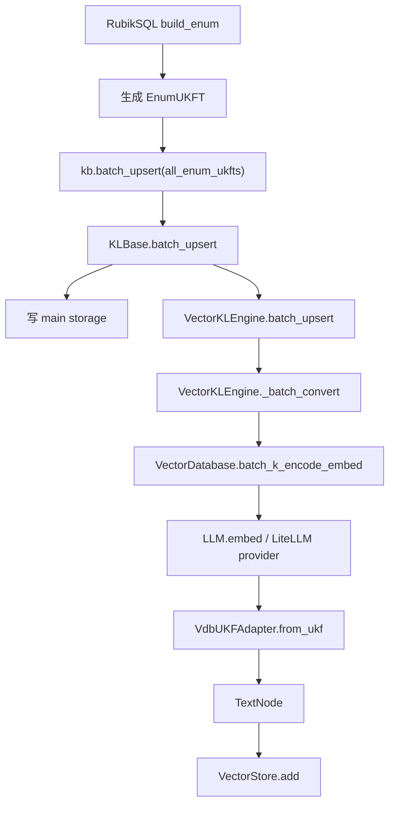
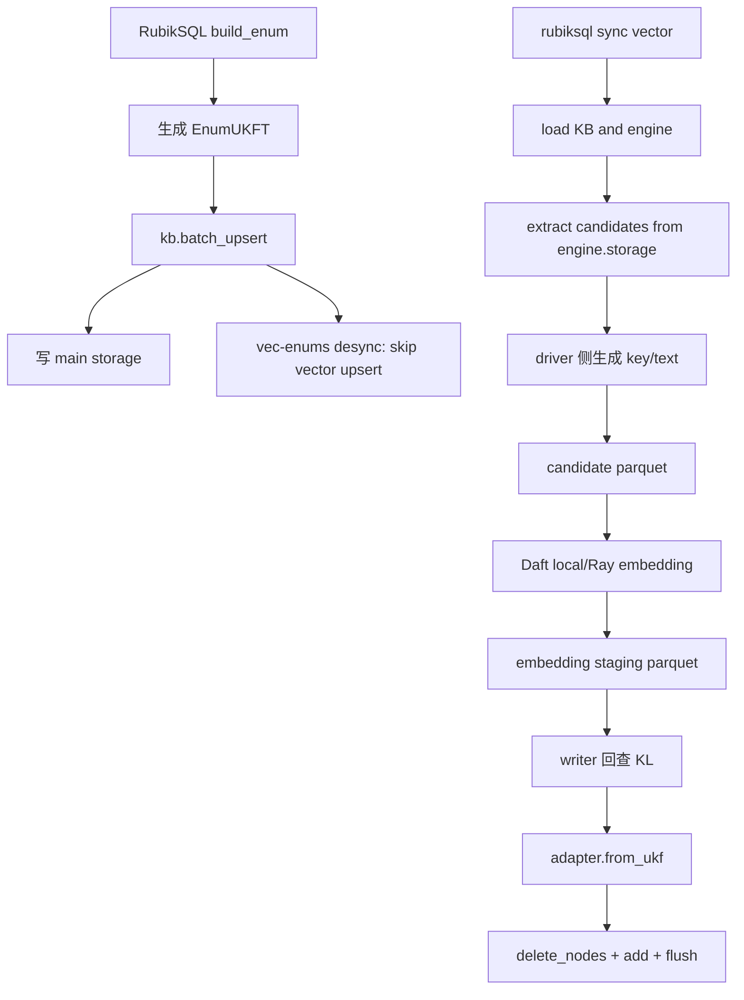
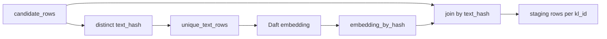
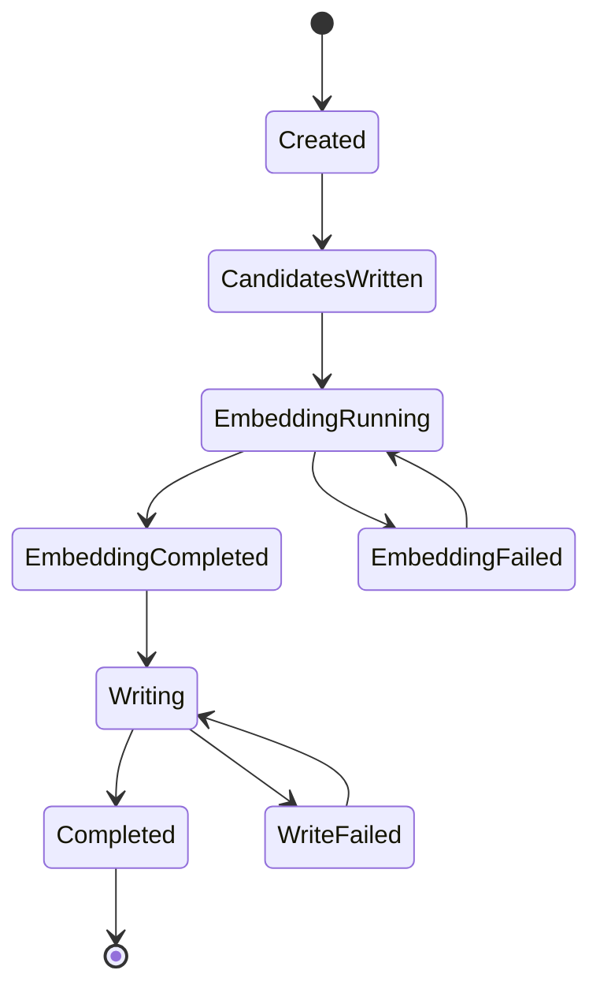
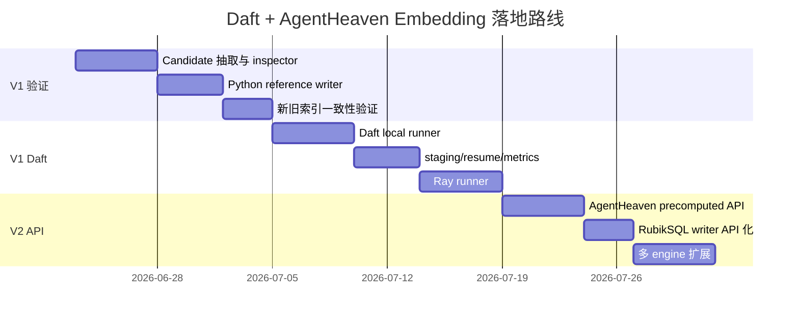

# Daft + AgentHeaven Embedding 技术路线细节

本文是 [DAFT_AGENTHEAVEN_TECHNICAL_ROUTE_OVERVIEW_CN.md](./DAFT_AGENTHEAVEN_TECHNICAL_ROUTE_OVERVIEW_CN.md) 的详细落地版，目标是把“desync + Daft 外部 vector sync job”和“外部预计算 embedding 安全写入 AgentHeaven”合并成一条可实施路线。

## 1. 总体设计判断

推荐路线不是“Daft 替代 AgentHeaven”，而是“Daft 编排 embedding，AgentHeaven 保持语义边界”。

系统边界如下：

| 系统 | 负责内容 | 第一版是否改动 |
| --- | --- | --- |
| RubikSQL | 构建 UKF、管理 KB、触发 sync、提供 CLI/API | 是 |
| Daft | candidate/staging 数据管线、批量 embedding、Ray 调度 | 是 |
| AgentHeaven | encoder/embedder 语义、adapter、TextNode、vector store、search | 第一版尽量不改 |
| LanceDB/LlamaIndex | 向量存储和检索后端 | 不直接改 schema |

第一版采用方案 A：

```text
desync + Daft 外部 vector sync job
```

第二版吸收 AgentHeaven embedding 过程文档中的安全边界：

```text
外部系统只负责 kl_id/key/embedding
AgentHeaven 负责回查 KL、adapter.from_ukf、delete + add + flush
```

## 2. 当前链路与目标链路

### 2.1 当前同步链路



问题在于 `build_enum()` 的知识构建和 `VectorKLEngine.batch_upsert()` 的 embedding/写入处于同步路径内。候选量大时，构建阶段会被 embedding provider、缓存、写入吞吐共同拖慢。

### 2.2 目标离线链路



核心变化是把 embedding 从知识写入路径拆出来，并给 Daft 一个足够大的数据批次来调度。

## 3. V1 实施范围

### 3.1 只支持 `vec-enums`

第一版聚焦 `vec-enums`，原因是：

- `build_enum()` 可能生成大量 `EnumUKFT`。
- enum embedding 是最容易暴露性能瓶颈的场景。
- `vec-enums` 对上层 `fuzzy_enum` 和 `kb.search` 有明确验证路径。
- 不需要同时处理 query、skill 等不同知识类型的差异。

### 3.2 不改查询侧

保持以下接口不变：

```python
kb.search(engine="vec-enums", ...)
```

不改：

- `VectorKLEngine._search_vector()`
- `VectorDatabase.q_encode_embed()`
- metadata filter 编译逻辑
- `adapter.to_ukf()` 恢复逻辑

这样可以把风险限制在 build-time vector index 构建阶段。

### 3.3 不直接写 LanceDB schema

第一版禁止 Daft 直接写 LanceDB 表。写入必须通过：

```python
engine.adapter.from_ukf(kl=kl, key=key, embedding=embedding)
engine.vdb.vdb.delete_nodes(node_ids)
engine.vdb.vdb.add(nodes)
engine.vdb.flush()
```

等 V2 做完后，RubikSQL 侧改为调用：

```python
engine.batch_upsert_precomputed(rows)
```

## 4. 模块设计

### 4.1 RubikSQL 新增模块

| 模块 | 职责 |
| --- | --- |
| `src/rubiksql/api/vector_sync.py` | 对外 Python API，编排完整 sync |
| `src/rubiksql/pipelines/vector_candidates.py` | 从 engine.storage 抽取 candidate |
| `src/rubiksql/pipelines/daft_embedding.py` | Daft local/Ray embedding 管线 |
| `src/rubiksql/pipelines/vector_index_writer.py` | 读取 staging 并写回 AgentHeaven vector store |
| `src/rubiksql/cli/vector_cli.py` | `rubiksql sync vector` 命令 |
| `src/rubiksql/pipelines/vector_metrics.py` | 指标、run summary、耗时记录 |

如果不想马上新增 CLI 文件，也可以先挂到现有 build CLI 中，但长期建议单独命令：

```bash
rubiksql sync vector -n mydb --engine vec-enums --backend daft
```

### 4.2 AgentHeaven V2 新增 API

建议在 `VectorKLEngine` 或其下属 writer 层增加：

```python
def batch_upsert_precomputed(
    self,
    rows,
    batch_size: int = 4096,
    progress=None,
):
    ...
```

`rows` 可以是 iterable of dict：

```python
{
    "kl_id": "...",
    "key": "...",
    "embedding": [...],
}
```

也可以是结构化 dataclass：

```python
@dataclass
class PrecomputedEmbeddingRow:
    kl_id: str
    key: str
    embedding: list[float]
    text_hash: str | None = None
```

V2 API 内部必须保持和 `VectorKLStore._batch_upsert()` 一致的写入语义。

## 5. 配置设计

### 5.1 engine desync 配置

推荐在 `vec-enums` 上支持：

```yaml
vec-enums:
  type: vector
  storage: main
  inplace: false
  provider: lancedb
  uri_suffix: "vec/"
  embedder: "embedder"
  desync: true
```

如果不希望默认行为变化，可以提供 CLI 开关：

```bash
rubiksql build enum -n mydb --skip-vector
rubiksql sync vector -n mydb --engine vec-enums --backend daft
```

长期建议让 vector build 成为显式阶段，避免大型构建任务在同步 upsert 阶段不可控地变慢。

### 5.2 sync 参数

建议 API：

```python
sync_vector_index(
    db_id: str,
    engine: str = "vec-enums",
    backend: str = "daft",
    runner: str = "local",
    batch_size: int = 1024,
    embedding_batch_size: int = 256,
    write_batch_size: int = 4096,
    rebuild: bool = False,
    resume: bool = True,
    run_id: str | None = None,
)
```

建议 CLI：

```bash
rubiksql sync vector -n mydb --engine vec-enums --backend daft
rubiksql sync vector -n mydb --engine vec-enums --backend daft --runner ray
rubiksql sync vector -n mydb --engine vec-enums --backend daft --rebuild
rubiksql sync vector -n mydb --engine vec-enums --backend daft --run-id 20260623-vec-enums
```

## 6. 数据模型

### 6.1 Candidate 表

Candidate 表只放 embedding 阶段真正需要的数据，不放完整 UKF 对象。

| 字段 | 类型 | 必填 | 说明 |
| --- | --- | --- | --- |
| `run_id` | string | 是 | 本次 sync 运行 ID |
| `db_id` | string | 是 | RubikSQL 数据库 ID |
| `engine_name` | string | 是 | 例如 `vec-enums` |
| `kl_id` | string | 是 | UKF id |
| `kl_type` | string | 是 | 例如 `db-enum` |
| `key` | string | 是 | AgentHeaven encoder 输出 |
| `text_hash` | string | 是 | embedding cache key |
| `provider` | string | 是 | embedding provider |
| `model` | string | 是 | embedding model |
| `dim` | int | 是 | embedding 维度 |
| `encoder_hash` | string | 是 | encoder 规则或配置 hash |
| `created_at` | string | 是 | candidate 生成时间 |

`text_hash` 推荐包含：

```text
engine_name
key
provider
model
dim
encoder_hash
embedding_normalization_version
```

不要只用 `key` 做缓存键，否则换模型或换 encoder 后会复用错误向量。

### 6.2 Staging 表

| 字段 | 类型 | 必填 | 说明 |
| --- | --- | --- | --- |
| `run_id` | string | 是 | 本次 sync 运行 ID |
| `db_id` | string | 是 | 数据库 ID |
| `engine_name` | string | 是 | engine |
| `kl_id` | string | 是 | UKF id |
| `key` | string | 是 | 入库文本 |
| `text_hash` | string | 是 | cache key |
| `embedding` | list[float] | 成功时必填 | embedding 向量 |
| `status` | string | 是 | `success` / `failed` / `skipped` |
| `error` | string | 否 | 失败原因 |
| `elapsed_ms` | int | 否 | 单条或批次耗时 |

推荐目录：

```text
<kb_path>/vector-staging/<engine_name>/<run_id>/
  candidates/
  embeddings/
  failures/
  metrics.json
  summary.json
```

## 7. Candidate 抽取流程

### 7.1 抽取规则

抽取时必须复用 engine 的条件判断和 encoder：

```python
engine = kb.engines[engine_name]

for kl in engine.storage:
    if not engine.full_condition(kl):
        continue
    key = engine.k_encode(kl)
```

不要重新解析 RubikSQL YAML 里的 encoder，也不要让 Daft/Ray worker 直接处理 UKF 对象和动态 lambda。

### 7.2 伪代码

```python
def iter_vector_candidates(kb, engine_name, batch_size=1024):
    engine = kb.engines[engine_name]
    fingerprint = model_fingerprint(engine)

    for kl_batch in iter_storage_batches(engine.storage, batch_size=batch_size):
        for kl in kl_batch:
            if not engine.full_condition(kl):
                continue

            key = engine.k_encode(kl)
            yield {
                "db_id": kb.name,
                "engine_name": engine_name,
                "kl_id": str(kl.id),
                "kl_type": getattr(kl, "type", type(kl).__name__),
                "key": key,
                "text_hash": hash_text(engine_name, key, fingerprint),
                **fingerprint,
            }
```

### 7.3 为什么不把 UKF 放入 Daft DataFrame

原因：

- UKF 对象可能不容易跨 Ray worker 序列化。
- 动态 encoder/lambda 在 worker 中不稳定。
- 大对象会放大网络和内存开销。
- embedding 阶段只需要 `key`。
- 写入阶段可以按 `kl_id` 回查主存储。

## 8. Daft embedding 流程

### 8.1 第一版优先使用 AgentHeaven LLM.embed

第一版建议 Daft UDF 内继续调用 AgentHeaven `LLM.embed()`，而不是马上切 Daft 原生 `embed_text`。

原因：

- 复用现有 `embedder` preset。
- 复用 LiteLLM/Ollama provider 参数。
- 复用 AgentHeaven 的 batch、去重、缓存、重试。
- 更容易保证新旧索引处于同一个 embedding 空间。

### 8.2 Daft local runner 伪代码

```python
def run_daft_embedding(
    candidate_path: str,
    staging_path: str,
    runner: str = "local",
):
    import daft

    if runner == "ray":
        daft.set_runner_ray()

    df = daft.read_parquet(candidate_path)

    df = df.where(daft.col("key").not_null())
    df = df.distinct("text_hash")

    df = df.with_column(
        "embedding",
        ahvn_embed_udf(
            daft.col("key"),
            daft.col("provider"),
            daft.col("model"),
        ),
    )

    df.write_parquet(staging_path)
```

实际实现要保留 `kl_id` 到 `text_hash` 的映射。一个 key 对应多个 KL 时，embedding 可以去重计算，但写入时要展开回所有 KL。

### 8.3 去重策略

推荐拆成两张中间表：

```text
candidate_rows:
  kl_id, key, text_hash

unique_text_rows:
  text_hash, key, provider, model, dim, encoder_hash
```

Daft 只对 `unique_text_rows` 计算 embedding，再通过 `text_hash` join 回 candidate。



## 9. Writer 写回流程

### 9.1 V1 writer

V1 writer 可以先在 RubikSQL 侧实现，但必须严格复用 AgentHeaven adapter。

```python
def write_precomputed_embeddings(kb, engine_name, rows, write_batch_size=4096):
    engine = kb.engines[engine_name]

    for batch in batched(rows, write_batch_size):
        nodes = []
        node_ids = []

        for row in batch:
            if row["status"] != "success":
                continue

            kl = engine.storage.get(row["kl_id"], default=None)
            if kl is None:
                continue

            node_id = engine.adapter.parse_id(kl.id)
            node = engine.adapter.from_ukf(
                kl=kl,
                key=row["key"],
                embedding=row["embedding"],
            )
            node_ids.append(node_id)
            nodes.append(node)

        if node_ids:
            engine.vdb.vdb.delete_nodes(node_ids)
        if nodes:
            engine.vdb.vdb.add(nodes)

    engine.vdb.flush()
```

### 9.2 V2 writer

V2 应迁移为 AgentHeaven 内部方法：

```python
engine.batch_upsert_precomputed(rows, batch_size=write_batch_size)
```

RubikSQL 不再直接访问：

```python
engine.adapter
engine.vdb.vdb
```

这样 AgentHeaven 后续如果调整 LlamaIndex、LanceDB 或 metadata schema，RubikSQL 侧不用跟着改。

### 9.3 写入幂等

写入语义必须是幂等的：

```text
同一个 kl_id 重复写入同一个 key/embedding
  -> 最终 vector store 中只有一条对应节点
```

实现方式：

- 每批先通过 `adapter.parse_id(kl.id)` 得到 node id。
- 先 `delete_nodes(node_ids)`。
- 再 `add(nodes)`。
- 最后 `flush()`。

中断后重跑时，只要 staging 保留成功行，writer 可以重复执行。

## 10. 状态机与断点续跑

### 10.1 run 状态



### 10.2 resume 规则

`resume=True` 时：

- 如果 candidate parquet 已存在，默认复用。
- 如果 staging 中已有 `success` 的 `text_hash`，跳过 embedding。
- 如果 failures 中存在失败行，按重试策略重新处理。
- writer 可以对所有成功 staging 行重放，因为 delete + add 是幂等的。

### 10.3 rebuild 规则

`rebuild=True` 时：

- 重新生成 candidate。
- 重新计算 `text_hash`。
- 可选择清理旧 staging。
- writer 写入前可选择清空该 engine 对应旧 vector index，或仍按 node id 覆盖。

如果 provider/model/encoder_hash 发生变化，必须视作 rebuild。

## 11. 缓存策略

### 11.1 AgentHeaven 内置缓存

`LLM.embed()` 已经有 `batch_memoize`。第一版可以先复用它。

注意：

- 单机 local runner 下收益直接。
- Ray runner 下每个 worker 可能有独立本地缓存。
- 如果要共享缓存，需要统一 cache path 或引入外部缓存。

### 11.2 Daft 侧 staging cache

Staging 本身就是一层可重用缓存：

```text
text_hash -> embedding
```

重跑时可以先读取已有 staging，过滤出缺失的 `text_hash` 再 embedding。

### 11.3 cache key 设计

必须包含：

```text
provider
model
dim
encoder_hash
key
normalization_version
```

建议 hash：

```python
sha256(json.dumps(payload, sort_keys=True).encode("utf-8")).hexdigest()
```

## 12. 并发与资源策略

### 12.1 Daft worker 负责 embedding

worker 只处理：

```text
key -> embedding
```

worker 不处理：

- UKF 对象。
- 动态 encoder。
- vector store 写入。
- LanceDB delete/add。

### 12.2 driver 负责写入

第一版 writer 放在 driver：

```text
read staging
  -> group by write batch
  -> get KL
  -> adapter.from_ukf
  -> delete + add
```

这样可以避开 LanceDB/LlamaIndex 并发写语义不确定的问题。

### 12.3 何时考虑并行 writer

只有在以下条件满足后再考虑：

- LanceDB 同表并发写已通过专项测试。
- delete + add 顺序可控。
- 多 writer 不会互相覆盖。
- flush 行为可预测。
- 有写入失败后的恢复策略。

## 13. 错误处理

### 13.1 embedding 错误

每个失败 row 写入 failures：

```json
{
  "run_id": "...",
  "text_hash": "...",
  "key": "...",
  "status": "failed",
  "error": "provider timeout",
  "attempt": 2
}
```

失败策略：

- provider 超时：指数退避重试。
- 维度不一致：立即失败，不应写入。
- 空文本：使用 AgentHeaven `embed_empty` 语义，或在 writer 前标记 skipped。

### 13.2 writer 错误

常见错误：

- `kl_id` 在主存储中找不到。
- embedding 维度和 engine 维度不一致。
- vector store add 失败。
- metadata 序列化失败。

处理方式：

- batch 级失败要能定位 batch id。
- 单条 KL 失败要记录 `kl_id`。
- 维度错误直接停止整个 run，避免混入错误空间。

## 14. 指标与日志

### 14.1 必备指标

| 指标 | 说明 |
| --- | --- |
| `candidate_count` | 原始候选数 |
| `unique_text_count` | 去重后的 embedding 文本数 |
| `empty_count` | 空文本数 |
| `cached_count` | 缓存命中数 |
| `embedding_success_count` | embedding 成功数 |
| `embedding_failed_count` | embedding 失败数 |
| `write_success_count` | 写入成功 KL 数 |
| `write_failed_count` | 写入失败 KL 数 |
| `embedding_elapsed_ms` | embedding 总耗时 |
| `write_elapsed_ms` | 写入总耗时 |
| `embedding_qps` | 每秒 embedding 文本数 |
| `write_qps` | 每秒写入节点数 |
| `provider` | provider |
| `model` | model |
| `dim` | 向量维度 |
| `encoder_hash` | encoder 标识 |

### 14.2 summary.json

推荐输出：

```json
{
  "run_id": "20260623-vec-enums",
  "db_id": "mydb",
  "engine_name": "vec-enums",
  "runner": "local",
  "provider": "ollama",
  "model": "embeddinggemma",
  "dim": 768,
  "candidate_count": 123456,
  "unique_text_count": 98765,
  "embedding_elapsed_ms": 120000,
  "write_elapsed_ms": 30000,
  "status": "completed"
}
```

## 15. 测试计划

### 15.1 单元测试

候选抽取：

- 只抽取满足 `engine.full_condition(kl)` 的 KL。
- `key` 与 `engine.k_encode(kl)` 一致。
- `text_hash` 在 provider/model/encoder 改变时变化。

writer：

- 复用 `adapter.from_ukf()`。
- 重复写同一批 rows 不产生重复节点。
- 缺失 `kl_id` 被记录，不影响其他行。
- embedding 维度不一致时失败。

Daft pipeline：

- 多个 KL 共享同一个 key 时只 embedding 一次。
- staging 能 join 回所有 `kl_id`。
- failed rows 可重试。

### 15.2 集成测试

小数据集：

```text
旧流程构建 vec-enums
新流程构建 vec-enums
同一批 query 搜索
对比 top-k kl_id
```

要求：

- top-k 集合基本一致。
- metadata filter 仍可用。
- `include=["kl"]` 仍能恢复 UKF。

### 15.3 性能测试

至少对比：

- 原生 AgentHeaven 同步构建。
- Python reference sync。
- Daft local sync。
- Daft Ray sync。

记录：

- candidate 数量。
- unique key 数量。
- embedding 耗时。
- 写入耗时。
- provider 吞吐。
- cache 命中率。

## 16. 发布计划

### 16.1 第一周

目标：不接 Daft，先验证外部预计算写入可行。

交付：

- `vector_candidates.py`
- `vector_index_writer.py`
- `inspect vector` 或等价调试 API
- Python reference sync
- 小数据集新旧索引一致性报告

### 16.2 第二周

目标：接入 Daft local runner。

交付：

- candidate parquet
- staging parquet
- Daft local embedding UDF
- resume/rebuild 基础能力
- summary metrics

### 16.3 第三周

目标：接入 Ray runner 并验证大数据量。

交付：

- `--runner ray`
- worker 环境检查
- provider 并发参数
- 大 enum 数据集性能报告
- 失败重试与 failures 输出

### 16.4 第四周

目标：V2 AgentHeaven API 化。

交付：

- `batch_upsert_precomputed()` 或等价 API
- RubikSQL writer 改为调用正式 API
- AgentHeaven 侧单元测试
- RubikSQL 侧集成测试更新

## 17. 风险矩阵

| 风险 | 概率 | 影响 | 应对 |
| --- | --- | --- | --- |
| 单个 Ollama 仍是瓶颈 | 高 | 高 | 多实例、远程 provider、调 batch、共享缓存 |
| Ray worker 环境不一致 | 中 | 高 | worker 启动前做 import/config/provider 检查 |
| embedding 维度变化 | 中 | 高 | fingerprint 校验，不允许混写 |
| 直接访问 AgentHeaven 内部字段不稳定 | 中 | 中 | V1 暂时接受，V2 API 化 |
| LanceDB 写入成为瓶颈 | 中 | 中 | 第一版单 writer，后续验证分片或并发写 |
| cache key 不完整 | 中 | 高 | provider/model/dim/encoder_hash 必须入 hash |
| 新旧索引结果不一致 | 中 | 高 | 优先复用 AgentHeaven LLM.embed，不切 provider |

## 18. 验收标准

V1 验收：

- `vec-enums` 可在 desync 下完成知识构建。
- `rubiksql sync vector --engine vec-enums --backend daft` 可生成向量索引。
- 新旧索引对同一批 query 的 top-k `kl_id` 基本一致。
- 支持 staging 落盘、run id、summary metrics。
- 中断后可重跑，不产生重复节点。

V2 验收：

- AgentHeaven 暴露正式 precomputed embedding 写入 API。
- RubikSQL 不再直接调用 `engine.vdb.vdb.add`。
- API 内部保持 `delete_nodes + add + flush` 语义。
- 原 `VectorKLEngine.search()` 不需要修改。

## 19. 最终落地路线图



## 20. 最小可交付版本定义

如果只做一个最小可交付版本，范围应严格限制为：

```text
让 vec-enums 支持 desync 后用 Daft 离线构建 embedding，并保持 fuzzy_enum/kb.search 查询结果兼容。
```

这个版本不追求一次性解决所有 embedding 性能问题，但它可以回答最关键的问题：

- Daft 外部化 embedding 是否能在 RubikSQL/AgentHeaven 边界上跑通。
- 预计算 embedding 写回后，AgentHeaven 搜索语义是否仍然兼容。
- 真正瓶颈是在 embedding provider、Daft 调度、缓存，还是 vector store 写入。

验证完这三个问题，再进入 V2 API 化和多 engine 扩展，风险最低。
