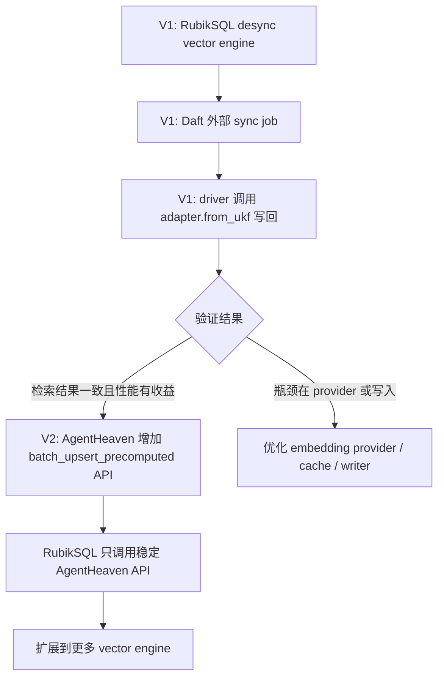
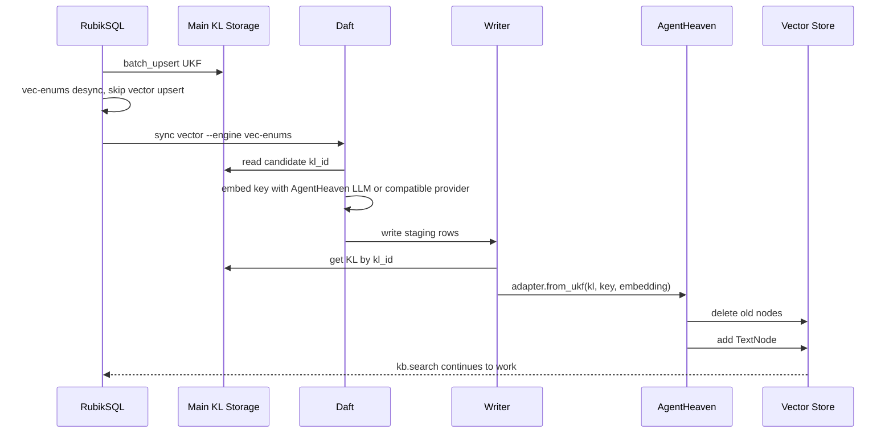

# Daft + AgentHeaven Embedding 技术路线概要

本文基于两份已有分析：

- [DAFT_AGENTHEAVEN_IMPLEMENTATION_POSSIBILITIES_CN.md](./DAFT_AGENTHEAVEN_IMPLEMENTATION_POSSIBILITIES_CN.md)
- [AGENTHEAVEN_EMBEDDING_PROCESS_CN.md](./AGENTHEAVEN_EMBEDDING_PROCESS_CN.md)

推荐选择一条“先外部解耦、再沉淀接口”的技术路线：

```text
V1: desync + Daft 外部 vector sync job
    只让 Daft 分发和编排 embedding 任务，embedding 语义和向量库写入仍复用 AgentHeaven。

V2: AgentHeaven 增加正式 precomputed embedding 写入 API
    外部 Daft 预计算 embedding 后，通过 AgentHeaven 的稳定 API 写回 vector store。
```

这不是两条互斥路线，而是一条递进路线。第一版用最小改动验证性能收益和检索兼容性；第二版把第一版中对 AgentHeaven 内部字段的访问收敛成正式接口，让方案更稳定、更容易产品化。

## 1. 路线结论

最终选择：

```text
RubikSQL 构建 UKF 知识对象
  -> 主存储先落盘
  -> vector engine 设置 desync
  -> Daft 外部任务抽取 candidate 并批量 embedding
  -> 预计算结果通过 AgentHeaven adapter 写回 vector store
  -> 原有 kb.search(engine="vec-enums") 查询接口不变
```

核心原则：

- Daft 负责数据管线、任务分发、批量调度、Ray 执行、staging 和重跑。
- AgentHeaven 负责 encoder/embedder 语义、`VdbUKFAdapter.from_ukf()`、`TextNode`、`VectorStore.add()` 和搜索兼容。
- RubikSQL 负责业务知识构建、engine 配置、CLI/API 编排。
- 第一版不直接写 LanceDB schema，不改查询侧，不重写 SQL Agent，不接管 enum 抽取。

## 2. 目标架构

```mermaid
flowchart LR
    A["RubikSQL build_enum/build_xxx"] --> B["UKF 主存储"]
    B --> C["vec-enums desync"]
    C --> D["Daft Vector Sync Job"]
    D --> E["Candidate Extractor"]
    E --> F["Candidate Parquet"]
    F --> G["Daft Local/Ray Embedding"]
    G --> H["Embedding Staging Parquet"]
    H --> I["AgentHeaven Precomputed Writer"]
    I --> J["VdbUKFAdapter.from_ukf"]
    J --> K["LlamaIndex TextNode"]
    K --> L["LanceDBVectorStore.add"]
    L --> M["Existing kb.search"]
```



## 3. V1 与 V2 的关系



V1 的目标是跑通和验证，不追求最完美的抽象。V2 的目标是把验证过的边界变成正式能力，减少 RubikSQL 对 `engine.vdb.vdb.add` 这类内部字段的依赖。

## 4. 为什么先做 V1

V1 对现有系统冲击最小：

- `KLBase.desync` 已经支持跳过某个 engine 的同步 upsert。
- `VectorKLEngine._batch_convert()` 已经暴露了 `UKF -> key -> embedding -> TextNode` 的边界。
- `VdbUKFAdapter.from_ukf()` 已经支持传入预计算 embedding。
- `VectorKLStore._batch_upsert()` 已经给出兼容写入语义：先 `delete_nodes`，再 `add(nodes)`。
- `LLM.embed()` 已经支持 batch、去重、缓存、重试和线程并发，Daft 可以在此基础上做更大规模的分布式编排。

因此第一版不需要重写 AgentHeaven vector engine，也不需要直接猜 LanceDB 表结构。

## 5. V1 交付边界

第一版只做：

```text
vec-enums 的离线 Daft embedding sync
```

第一版包含：

- `vec-enums` 支持 desync 配置。
- 新增 vector sync API/CLI。
- 抽取符合 engine condition 的 KL candidate。
- 在 driver 侧生成 key，避免把动态 encoder/lambda 分发给 Ray worker。
- Daft local runner 先跑通，之后支持 Ray runner。
- embedding 结果落 staging parquet。
- writer 读取 staging，回查 KL，调用 AgentHeaven adapter 写回 vector store。
- 对比旧索引和新索引的检索结果。

第一版暂不包含：

- 不改 SQL Agent。
- 不改 query/retrieval 逻辑。
- 不直接写自定义 LanceDB schema。
- 不把 enum distinct 抽取改成 Daft。
- 不一次支持所有 vector engine。
- 不让多个 Ray worker 同时写同一张 LanceDB 表。

## 6. V2 交付边界

第二版在 AgentHeaven 中沉淀正式 API：

```python
class VectorKLEngine:
    def batch_upsert_precomputed(
        self,
        items,
        progress=None,
    ):
        ...
```

`items` 中至少包含：

```text
kl_id / kl
key
embedding
```

AgentHeaven 负责：

- 根据 `kl_id` 回查 `BaseUKF`。
- 调用 `adapter.from_ukf(kl, key, embedding)`。
- 执行 `delete_nodes + add(nodes) + flush`。
- 保持 `VectorKLEngine.search()` 兼容。

RubikSQL/Daft 负责：

- 抽取 candidate。
- 生成 key。
- 预计算 embedding。
- 把 staging 结果交给 AgentHeaven API。

## 7. 数据流总览



## 8. 推荐实施阶段

| 阶段 | 目标 | 主要产物 |
| --- | --- | --- |
| 0 | 建基线 | inspector、候选数、unique key、旧链路耗时 |
| 1 | 外部预计算写入验证 | Python reference sync、检索一致性对比 |
| 2 | 接入 Daft local | candidate parquet、staging parquet、本地 Daft UDF |
| 3 | 接入 Ray | Ray runner、worker 环境验证、共享 staging |
| 4 | AgentHeaven API 化 | `batch_upsert_precomputed()` 或等价 writer API |
| 5 | 扩展 engine | `vec-queries-by-name`、`vec-queries-by-mask`、`skills` |

## 9. 成功标准

功能正确性：

- 同一批 `vec-enums` 数据分别用旧流程和 Daft sync 构建索引。
- 同一批查询的 top-k `kl_id` 基本一致。
- `kb.search(engine="vec-enums")`、`fuzzy_enum` 等上层调用不需要修改。

性能收益：

- 记录 candidate 数量、unique key 数量、embedding 耗时、写入耗时。
- Daft local 至少不明显劣化。
- Ray 或多 provider 场景下能体现吞吐提升。

运维可用性：

- staging 可落盘。
- 支持 run id。
- 支持中断后重跑。
- 支持跳过已成功 embedding 的 key。
- 写入失败能定位到具体 batch。

## 10. 关键风险

| 风险 | 影响 | 处理方式 |
| --- | --- | --- |
| 单个 Ollama 服务成为瓶颈 | Daft/Ray 只会更快排队，不会真正提速 | 多实例、远程 provider、worker 本地模型、调整 batch |
| embedding 空间混用 | 检索结果失真 | cache key 包含 provider/model/encoder hash |
| Ray worker 无法序列化 encoder | 分布式任务失败 | driver 侧先生成 key，worker 只处理字符串 |
| LanceDB 并发写语义不明 | 写入互相覆盖或不一致 | 第一版单 writer，后续专项验证并发写 |
| 直接写 LanceDB schema | 搜索侧读不回或 metadata 不兼容 | 始终复用 `VdbUKFAdapter.from_ukf()` |

## 11. 最终推荐

建议立项路线：

```text
第一版:
  desync + Daft 外部 vector sync job
  聚焦 vec-enums
  复用 AgentHeaven LLM.embed 和 VdbUKFAdapter

第二版:
  AgentHeaven 增加正式 precomputed embedding 写入 API
  RubikSQL/Daft 不再触碰深层内部字段

第三版:
  根据验证结果决定是否抽象 DaftVectorKLEngine
  或把 enum 抽取、embedding、写入统一成更完整的数据管线
```

这条路线能同时满足三件事：第一版快、风险低；第二版结构稳；长期还能继续演进到更完整的分布式知识构建管线。
