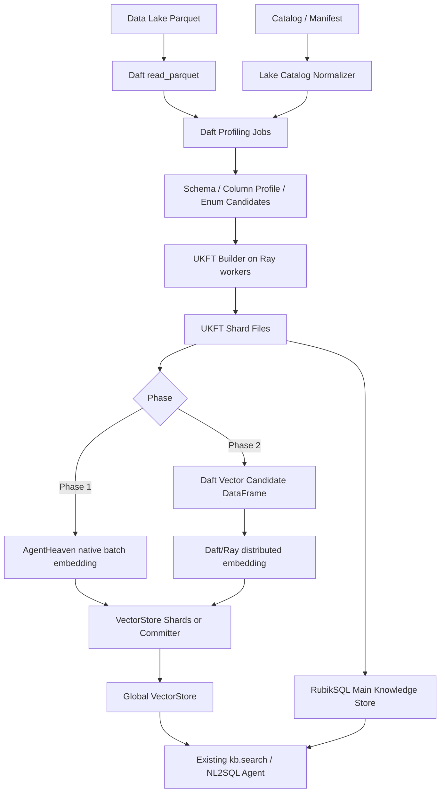
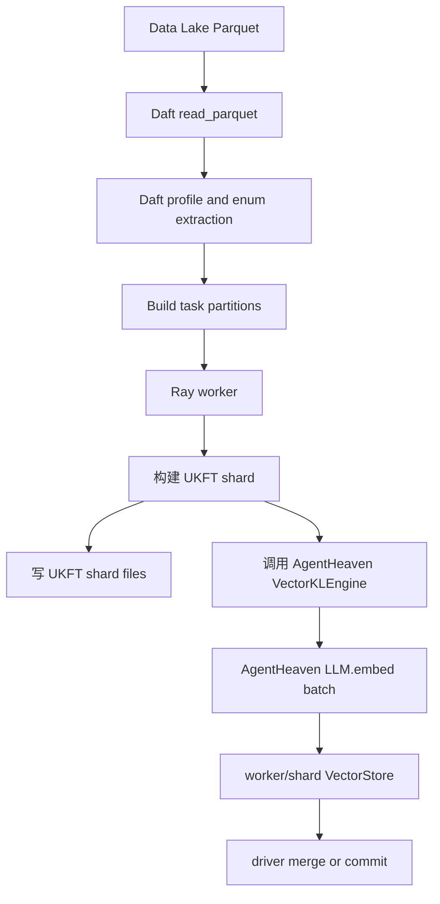
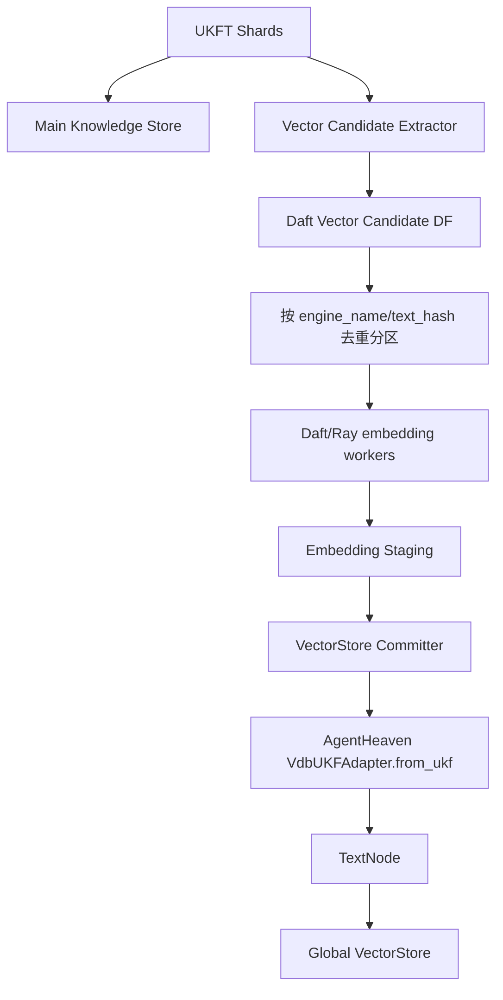

# 基于数据湖 + Daft + RayCluster 构建 RubikSQL 的全链路方案

本文用于完善一个新的整体目标：当前已经有 RayCluster 集群，希望基于数据湖中的 Parquet 文件构建 RubikSQL 知识库。目标不是只优化 embedding，而是让 Daft 接管从数据湖读取、切分、分发到 Ray worker、构建 UKFT、生成/写入知识文件、构建向量索引的整条离线数据管线。

整体分两阶段：

- 第一阶段：Daft 接管数据湖读取、切分、任务分发和 RubikSQL/AgentHeaven build 调度，但暂时不接管 embedding。每个 worker 仍调用 AgentHeaven 现有 `LLM.embed()` 和 `VectorKLEngine` 完成 embedding 与 VectorStore 写入。
- 第二阶段：Daft 进一步接管 embedding 阶段，把待向量化的文本显式变成 DataFrame，按分区分发到 Ray worker 批量 embedding，最后统一或分片写入 VectorStore。

这个方案和前面几份文档的关系：

- [RubikSQL 代码讲解](./RUBIKSQL_CODE_WALKTHROUGH_CN.md)：解释 RubikSQL 现有知识库和代码结构。
- [Daft 分布式 embedding 改造指南](./DAFT_DISTRIBUTED_EMBEDDING_REFACTOR_CN.md)：解释针对 embedding 阶段的改造点。
- [Daft 接入 AgentHeaven 可行性分析](./DAFT_AGENTHEAVEN_IMPLEMENTATION_POSSIBILITIES_CN.md)：解释 `VectorKLEngine`、`LLM.embed()`、`VdbUKFAdapter` 的内部接口。

## 1. 一句话总览

最终目标链路应该是：

```text
Data Lake Parquet
    -> Daft read_parquet
    -> Daft/Ray 按 db/table/column 分区
    -> worker 构建 RubikSQL UKFT shard
    -> UKFT shard 落盘
    -> Phase 1: worker 调 AgentHeaven 原生 embedding + VectorStore 写入
    -> Phase 2: Daft 统一抽取 vector candidates + 分布式 embedding + VectorStore commit
    -> RubikSQL 查询时继续使用原来的 kb.search / fuzzy_enum / NL2SQL Agent
```

核心原则：

1. Daft 负责大规模数据读取、切分、调度、批处理、容错和中间结果管理。
2. RubikSQL 负责业务语义：什么是数据库、表、列、枚举、样例、技能。
3. AgentHeaven 负责 UKF/UKFT 对象模型、encoder、VectorStore adapter 和现有查询接口。
4. 第一阶段保守复用 AgentHeaven embedding，第二阶段再把 embedding 明确交给 Daft。

## 2. 背景问题：为什么不是直接调用现有 `rubiksql build`

现有 RubikSQL build 链路偏向“已注册数据库连接”的模式。例如 `build_enum()` 会：

```text
RUBIK_DBM.connect(db_id)
    -> db.col_freqs(table, column)
    -> 生成 EnumUKFT
    -> kb.batch_upsert(...)
    -> VectorKLEngine embedding + LanceDB 写入
```

但现在的数据来源是数据湖 Parquet，不一定有一个传统数据库连接。因此，如果直接在每个 Ray worker 上跑现有 `rubiksql build enum`，会遇到几个问题：

- `db.col_freqs()` 依赖 RubikSQL 的 Database abstraction，不天然读取 Parquet。
- 主知识库存储和 LanceDB 如果所有 worker 同时写，容易出现并发写冲突。
- 现有 build 过程没有显式的 `candidate`、`staging`、`commit` 阶段，失败后不容易断点重跑。
- embedding 虽然在 AgentHeaven 中已经支持 batch，但批量边界藏在 `VectorKLEngine` 内部，不适合全局调度和观测。

因此，推荐新增一条 “data lake build pipeline”，不是简单把旧 CLI 放进 Ray worker 里循环跑。

## 3. 输入数据湖应该如何组织

为了让 Daft 能稳定地从数据湖构建 RubikSQL，需要先规范输入。推荐最少包含两类信息：

### 3.1 表数据 Parquet

每张业务表可以是一个目录：

```text
s3://lake/sales/orders/part-*.parquet
s3://lake/sales/customers/part-*.parquet
s3://lake/hr/employees/part-*.parquet
```

或者本地/共享文件系统：

```text
/lake/sales/orders/*.parquet
/lake/sales/customers/*.parquet
```

Daft 从这些路径读取真实数据，用来做：

- schema 推断。
- column profile。
- 枚举值统计。
- sample rows。
- 可能的主外键/数据类型辅助判断。

### 3.2 Catalog/Manifest

强烈建议额外提供一个 manifest 文件，不要完全依赖 Parquet 自动推断：

```yaml
databases:
  - db_id: sales
    description: "Sales analytics data lake"
    tables:
      - table_id: orders
        path: "s3://lake/sales/orders/*.parquet"
        description: "Order facts"
        primary_key: ["order_id"]
        columns:
          - col_id: order_status
            description: "Order lifecycle status"
            enum_index_enabled: true
          - col_id: total_amount
            datatype: number
            enum_index_enabled: false
      - table_id: customers
        path: "s3://lake/sales/customers/*.parquet"
```

这个 manifest 后续会决定：

- `db_id` / `tab_id` / `col_id` 如何命名。
- 哪些列需要枚举索引。
- 哪些列需要跳过。
- 人工描述如何进入 `TableUKFT` / `ColumnUKFT`。
- 如何把数据湖路径映射成 RubikSQL DatabaseInfo。

如果没有 manifest，第一阶段也可以自动生成一个 `inferred_catalog.parquet`，但最好允许人工修正后再进入正式 build。

## 4. 总体架构



## 5. 核心数据分层

整条链路不要只靠内存对象传递，建议明确几个落盘层。

### 5.1 Lake Catalog Layer

描述有哪些库、表、列、路径、人工元数据。

建议输出：

```text
build_runs/{run_id}/catalog/catalog.parquet
build_runs/{run_id}/catalog/tables.parquet
build_runs/{run_id}/catalog/columns.parquet
```

### 5.2 Profile Layer

Daft 从 Parquet 读取真实数据后，产出 profile：

```text
build_runs/{run_id}/profile/table_profile.parquet
build_runs/{run_id}/profile/column_profile.parquet
build_runs/{run_id}/profile/enum_candidates.parquet
build_runs/{run_id}/profile/samples.parquet
```

典型字段：

| 文件 | 关键字段 |
| --- | --- |
| `table_profile.parquet` | `db_id`, `table_id`, `row_count`, `file_count`, `schema_json` |
| `column_profile.parquet` | `db_id`, `table_id`, `column_id`, `dtype`, `null_count`, `distinct_count`, `sample_values` |
| `enum_candidates.parquet` | `db_id`, `table_id`, `column_id`, `enum_value`, `freq` |
| `samples.parquet` | `db_id`, `table_id`, `sample_json` |

### 5.3 UKFT Shard Layer

每个 worker 输出自己负责的一批 UKFT：

```text
build_runs/{run_id}/ukft_shards/shard_id=00001/ukfts.jsonl
build_runs/{run_id}/ukft_shards/shard_id=00002/ukfts.jsonl
```

每条记录建议包含：

| 字段 | 说明 |
| --- | --- |
| `ukft_id` | UKF/UKFT id |
| `ukft_type` | `db-database`, `db-table`, `db-column`, `db-enum`, `nl2sql-query`, `skill` |
| `db_id` | 数据库 id |
| `table_id` | 表 id |
| `column_id` | 列 id |
| `payload_json` | 可反序列化回 UKFT 的完整内容 |
| `source_snapshot` | 输入数据快照 |
| `build_run_id` | 当前构建 run id |

是否用 JSONL、Parquet 或 pickle，需要看 AgentHeaven UKF 的序列化能力。建议第一版用 JSONL 或 Parquet，减少跨版本 pickle 风险。

### 5.4 Vector Candidate Layer

第二阶段需要显式产出：

```text
build_runs/{run_id}/vector_candidates/engine=vec-enums/*.parquet
```

字段：

| 字段 | 说明 |
| --- | --- |
| `engine_name` | `vec-enums` 等 |
| `ukft_id` | UKFT id |
| `ukft_type` | UKFT 类型 |
| `key` | AgentHeaven encoder 生成的 embedding 文本 |
| `text_hash` | 文本 hash |
| `model_provider` | embedding provider |
| `model_name` | embedding model |
| `encoder_hash` | encoder 配置 hash |

### 5.5 Embedding Staging Layer

第二阶段 Daft embedding 的输出：

```text
build_runs/{run_id}/embedding_staging/engine=vec-enums/*.parquet
```

字段：

| 字段 | 说明 |
| --- | --- |
| `engine_name` | engine |
| `ukft_id` | UKFT id |
| `key` | embedding 文本 |
| `text_hash` | cache key |
| `embedding` | list[float] |
| `status` | success / failed / skipped |
| `error` | 失败信息 |

## 6. RayCluster 上的执行模型

Daft 在这里不是简单 Python 多线程，而是整个数据处理 DAG 的调度层。

### 6.1 环境要求

Ray worker 环境需要一致安装：

- Python 版本一致。
- `daft`，并支持 Ray runner。
- `ray`。
- RubikSQL 本地包。
- AgentHeaven/ahvn 本地包。
- `lancedb`、`llama-index-vector-stores-lancedb` 等向量库依赖。
- 访问数据湖所需依赖，例如 S3/MinIO 凭证。
- 访问 embedding provider 所需配置，例如 Ollama/OpenAI/LiteLLM。

### 6.2 存储要求

所有 worker 都必须能访问同一套中间结果路径：

```text
s3://rubiksql-build-runs/{run_id}/...
```

或者一个共享文件系统：

```text
/mnt/shared/rubiksql-build-runs/{run_id}/...
```

不要让 worker 把 UKFT shard 写到自己的本地临时目录，否则 driver 后续收不到。

### 6.3 Daft Runner

第二阶段或大规模第一阶段可以使用：

```python
import daft

daft.set_runner_ray()
```

如果 RayCluster 是远程集群，实际工程里还要把 Ray address、runtime env、依赖包路径、环境变量传进去。具体接法取决于你的集群部署方式。

### 6.4 分区策略

推荐两套分区策略：

| 阶段 | 分区键 | 原因 |
| --- | --- | --- |
| profile/build | `db_id`, `table_id` | schema/profile/enum 构建天然按表分区 |
| enum candidate | `db_id`, `table_id`, `column_id` | 每列枚举统计独立 |
| vector candidate | `engine_name`, `text_hash` | embedding 去重和缓存更自然 |
| vector write | `engine_name`, `shard_id` | 控制写入粒度和并发 |

## 7. 第一阶段设计：Daft 接管数据管线，但不接管 embedding

第一阶段目标：让 Daft/Ray 负责读数据湖、切分任务、分发 worker、生成 UKFT 文件，并调用 AgentHeaven 原生 build/embedding/write 逻辑。此阶段不改变 embedding 实现，降低风险。

### 7.1 第一阶段链路



### 7.2 第一阶段最小可行方案

第一阶段建议不要让多个 worker 直接写同一个全局 LanceDB 表。更稳的是：

```text
每个 worker:
    1. 处理一个或多个 table/column shard
    2. 生成 UKFT shard 文件
    3. 建立 shard-local KB / vectorstore
    4. 使用 AgentHeaven 原生 embedding 写入 shard vectorstore

driver:
    1. 收集所有 UKFT shard
    2. 合并 main knowledge store
    3. 合并或重建 global vectorstore
```

为什么要 shard-local：

- SQLite/main store 并发写容易出问题。
- LanceDB 同表并发 delete + add 语义需要验证。
- worker 失败时可以只重跑对应 shard。
- 中间结果可审计。

### 7.3 第一阶段 worker 内部做什么

每个 worker 的输入不是原始全量数据，而是 Daft 分配好的任务包：

```json
{
  "run_id": "2026-06-23-001",
  "db_id": "sales",
  "table_id": "orders",
  "column_ids": ["order_status", "payment_status"],
  "profile_path": "s3://.../profile/table=orders/*.parquet",
  "enum_candidates_path": "s3://.../enum_candidates/table=orders/*.parquet",
  "output_shard_path": "s3://.../ukft_shards/shard_id=0001/"
}
```

worker 做：

1. 读取 profile 和 enum candidates。
2. 构造 `DatabaseUKFT`、`TableUKFT`、`ColumnUKFT`、`EnumUKFT`。
3. 写 `ukfts.jsonl`。
4. 调用现有 AgentHeaven/RubikSQL `kb.batch_upsert(kls)`。
5. 由 AgentHeaven 自己完成 batch embedding 和 VectorStore 写入。

### 7.4 第一阶段是否等于“Daft 没接管 embedding”

是的。第一阶段 embedding 仍然由 AgentHeaven 做：

```text
VectorKLEngine._batch_convert
    -> VectorDatabase.batch_k_encode_embed
    -> LLM.embed(list[str])
```

Daft 的职责只是：

- 从数据湖读数据。
- 切分构建任务。
- 把任务分发到 Ray worker。
- 管理中间结果和重试。

这一步已经能解决很多问题：旧流程只能围绕一个数据库连接串行/半并行 build，而新流程可以按数据湖分区和表/列分布式构建。

### 7.5 第一阶段需要新增的模块

建议新增：

```text
src/rubiksql/lake/spec.py
src/rubiksql/lake/catalog.py
src/rubiksql/lake/profiling.py
src/rubiksql/lake/ukft_builder.py
src/rubiksql/lake/shard_writer.py
src/rubiksql/lake/phase1_pipeline.py
src/rubiksql/cli/lake_cli.py
```

职责：

| 文件 | 职责 |
| --- | --- |
| `spec.py` | 读取 lake manifest |
| `catalog.py` | 标准化 db/table/column metadata |
| `profiling.py` | Daft 读取 Parquet，生成 profile 和 enum candidates |
| `ukft_builder.py` | 从 profile/candidates 构造 UKFT |
| `shard_writer.py` | 写 UKFT shard 文件 |
| `phase1_pipeline.py` | 编排 Daft/Ray 第一阶段 |
| `lake_cli.py` | 提供 CLI |

### 7.6 第一阶段 CLI 草案

```bash
rubiksql lake profile \
  --spec lake.yaml \
  --run-id 20260623_001 \
  --output s3://rubiksql-build-runs/20260623_001/

rubiksql lake build \
  --spec lake.yaml \
  --run-id 20260623_001 \
  --phase 1 \
  --runner ray \
  --output s3://rubiksql-build-runs/20260623_001/
```

如果暂时不拆命令：

```bash
rubiksql lake build --spec lake.yaml --phase 1 --runner ray
```

### 7.7 第一阶段成功标准

功能：

- 能从 Parquet 数据湖生成 UKFT shard。
- 能使用 AgentHeaven 原生 embedding 生成 vectorstore。
- 查询侧仍可用 `kb.search(engine="vec-enums")`。

性能：

- 多表/多列 enum 构建能在 RayCluster 上并行。
- 单个 worker 内 embedding 仍使用 AgentHeaven 批量能力。

稳定性：

- 一个 worker 失败，只重跑对应 shard。
- UKFT shard 文件可检查、可复现。
- 不出现多个 worker 同时写坏同一个全局 VectorStore 的情况。

## 8. 第二阶段设计：Daft 接管 embedding

第二阶段目标：让 Daft/Ray 不仅接管数据湖读取和 build 调度，还接管 embedding 候选集生成、去重、缓存、分布式 embedding 和 VectorStore commit。

### 8.1 第二阶段链路



### 8.2 第二阶段和第一阶段的关键差异

第一阶段：

```text
worker 构建 UKFT
    -> AgentHeaven 立即 embedding
    -> worker 写 VectorStore
```

第二阶段：

```text
worker 构建 UKFT
    -> 只写 UKFT / main store
    -> vector engine desync
    -> Daft 抽取所有 vector candidates
    -> Daft 分布式 embedding
    -> committer 写 VectorStore
```

第二阶段里，构建 UKFT 和构建向量索引要解耦。建议将 vector engine 设置为 `desync`，避免 `kb.batch_upsert()` 时自动触发 embedding。

### 8.3 Vector Candidate 如何生成

不要让 Daft worker 直接处理复杂 UKFT 对象和 YAML lambda。建议在 driver 或专门的 candidate extraction job 中：

```python
for kl in main_storage.batch_iter(...):
    if engine.full_condition(kl):
        key = engine.k_encode(kl)
        yield {
            "engine_name": engine_name,
            "ukft_id": kl.id,
            "ukft_type": kl.type,
            "key": key,
            "text_hash": hash(engine_name, key, model, encoder_hash),
        }
```

这样 Daft/Ray worker 只处理普通字符串 `key`，避免序列化问题。

### 8.4 Embedding 调用方式

第二阶段有两种模式。

#### 模式 A：Daft UDF 调用 AgentHeaven `LLM.embed`

第一版第二阶段建议先用这个。

优点：

- 与当前 RubikSQL/AgentHeaven embedder 配置一致。
- 复用 LiteLLM、Ollama/OpenAI provider、缓存、重试。
- 结果更容易和旧索引对齐。

伪代码：

```python
def embed_with_ahvn(batch: list[str], preset: str = "embedder"):
    from ahvn.utils.llm import LLM
    llm = LLM(preset=preset)
    return llm.embed(batch)
```

#### 模式 B：Daft 原生 `embed_text`

后续可以考虑：

```python
from daft.functions.ai import embed_text

df = df.with_column(
    "embedding",
    embed_text(daft.col("key"), provider=provider, model=model),
)
```

优点是更 Daft-native；缺点是需要确保 provider/model 参数和 AgentHeaven 完全一致，否则新旧向量空间不能混用。

### 8.5 VectorStore Committer

第二阶段不要让所有 Ray worker 直接写全局 VectorStore。推荐：

```text
Daft workers:
    写 embedding_staging parquet

Committer:
    读取 embedding_staging
    按 write_batch_size 分批
    回查 UKFT
    调用 VdbUKFAdapter.from_ukf(kl, key, embedding)
    delete old nodes
    add TextNode
    flush
```

后续验证 LanceDB 并发写安全后，可以再支持多 committer 分片写。

## 9. 两阶段对比

| 项目 | 第一阶段 | 第二阶段 |
| --- | --- | --- |
| Daft 读取数据湖 | 是 | 是 |
| Daft 切分 Ray 任务 | 是 | 是 |
| Daft 生成 UKFT | 间接调度 worker 生成 | 是，或者继续调度 worker 生成 |
| embedding 执行者 | AgentHeaven `VectorKLEngine` | Daft/Ray pipeline |
| embedding 是否显式落盘 | 否 | 是，落 `embedding_staging` |
| vector engine 是否建议 desync | 可选 | 强烈建议 |
| VectorStore 写入 | worker/shard 或 driver merge | committer 统一/分片写 |
| 风险 | 低 | 中 |
| 收益 | 数据湖构建并行化 | 数据湖 + embedding 全链路分布式 |

## 10. 推荐实现顺序

### Step 1：定义 LakeSpec

先定义数据湖输入规范，不要一上来写 Ray job。

```yaml
run:
  run_id: "20260623_001"
  output: "s3://rubiksql-build-runs/20260623_001/"

ray:
  address: "ray://ray-head:10001"

rubiksql:
  kb_root: "s3://rubiksql-kb/"
  default_vector_backend: "lancedb"

databases:
  - db_id: sales
    tables:
      - table_id: orders
        path: "s3://lake/sales/orders/*.parquet"
        columns:
          - col_id: order_status
            enum_index_enabled: true
```

### Step 2：Daft profile 数据湖

目标输出：

```text
catalog/tables.parquet
catalog/columns.parquet
profile/column_profile.parquet
profile/enum_candidates.parquet
```

### Step 3：Phase 1 build UKFT shard

实现：

```text
profile/enum_candidates.parquet
    -> build tasks
    -> Ray worker
    -> UKFT shard files
    -> AgentHeaven native vectorstore shard
```

先只支持：

- `DatabaseUKFT`
- `TableUKFT`
- `ColumnUKFT`
- `EnumUKFT`

不要第一版就做 LLM 自动描述/同义词。

### Step 4：合并或发布 KB

先定义清楚“全局知识库”怎么生成：

```text
ukft_shards
    -> global main storage
    -> global vectorstore
```

第一阶段可以使用 driver merge，避免并发写。

### Step 5：Phase 2 vector candidate

从 UKFT shard 或 main storage 中提取：

```text
vector_candidates/engine=vec-enums/*.parquet
```

### Step 6：Phase 2 Daft embedding

按 `engine_name + text_hash` 去重后，Daft/Ray embedding：

```text
vector_candidates
    -> distinct text_hash
    -> embedding
    -> embedding_staging
```

### Step 7：VectorStore commit

使用 AgentHeaven adapter 生成兼容 `TextNode`，写入 LanceDB。

## 11. 第一阶段详细伪代码

### 11.1 读取 Parquet

```python
import daft

def read_table(table_spec):
    return daft.read_parquet(table_spec.path)
```

### 11.2 生成 enum candidates

伪代码：

```python
def build_enum_candidates(df, db_id, table_id, column_id):
    return (
        df
        .where(daft.col(column_id).not_null())
        .groupby(daft.col(column_id))
        .agg(daft.col(column_id).count().alias("freq"))
        .with_column("db_id", daft.lit(db_id))
        .with_column("table_id", daft.lit(table_id))
        .with_column("column_id", daft.lit(column_id))
        .with_column("enum_value", daft.col(column_id).cast(str))
    )
```

真实实现需要处理：

- 超高基数列跳过。
- 数值列跳过。
- 日期列跳过。
- `enum_index_enabled` 控制。
- top-k 或频率阈值。

### 11.3 构建任务

```python
tasks = enum_candidates.groupby("db_id", "table_id", "column_id").agg(...)
```

每个任务对应一个 column 或 table shard。

### 11.4 Ray worker 构建 UKFT

```python
def build_ukft_shard(task):
    enum_rows = read_enum_candidates(task)

    ukfts = []
    ukfts.append(DatabaseUKFT.from_db(...))
    ukfts.append(TableUKFT.from_tab(...))
    ukfts.append(ColumnUKFT.from_col(...))

    for row in enum_rows:
        ukfts.append(
            EnumUKFT.from_enum(
                db_id=row.db_id,
                tab_id=row.table_id,
                col_id=row.column_id,
                enum_val=row.enum_value,
            ).signed(system=True, verified=True)
        )

    write_ukfts_jsonl(ukfts, task.output_path)

    # Phase 1: embedding 仍由 AgentHeaven 接管
    kb = load_or_create_shard_kb(task)
    kb.batch_upsert(ukfts)
```

## 12. 第二阶段详细伪代码

### 12.1 生成 vector candidates

```python
def extract_vector_candidates(kb, engine_name):
    engine = kb.engines[engine_name]

    for batch in engine.storage.batch_iter(batch_size=4096):
        for kl in batch:
            if not engine.full_condition(kl):
                continue

            key = engine.k_encode(kl)
            yield {
                "engine_name": engine_name,
                "ukft_id": kl.id,
                "ukft_type": kl.type,
                "key": key,
                "text_hash": stable_hash(engine_name, key, model_fingerprint(engine)),
            }
```

### 12.2 Daft embedding

```python
import daft

def run_embedding(candidates_path, output_path, runner="ray"):
    if runner == "ray":
        daft.set_runner_ray()

    df = daft.read_parquet(candidates_path)

    unique_texts = df.select(
        "engine_name",
        "text_hash",
        "key",
    ).distinct()

    embedded = unique_texts.with_column(
        "embedding",
        ahvn_embed_udf(daft.col("key")),
    )

    df = df.join(embedded, on=["engine_name", "text_hash", "key"])
    df.write_parquet(output_path, write_mode="overwrite")
```

### 12.3 Commit VectorStore

```python
def commit_vectorstore(kb, engine_name, embedding_staging_path):
    engine = kb.engines[engine_name]
    rows = read_embedding_rows(embedding_staging_path)

    for batch in batched(rows, write_batch_size):
        nodes = []
        ukf_ids = []

        for row in batch:
            kl = engine.storage.get(row["ukft_id"])
            if kl is None:
                continue

            ukf_ids.append(engine.adapter.parse_id(kl.id))
            nodes.append(
                engine.adapter.from_ukf(
                    kl=kl,
                    key=row["key"],
                    embedding=row["embedding"],
                )
            )

        engine.vdb.vdb.delete_nodes(ukf_ids)
        engine.vdb.vdb.add(nodes)
        engine.vdb.flush()
```

## 13. 需要重点注意的工程问题

### 13.1 不要让所有 worker 同时写同一个 SQLite 或 LanceDB

RubikSQL/AgentHeaven 当前很多存储都更像单机写入模型。直接多 worker 并发写同一个 KB path 风险很高。

推荐策略：

```text
worker 写 shard
driver/committer merge
```

### 13.2 输入快照必须固定

数据湖构建必须有 snapshot 概念。否则构建过程中 Parquet 文件变化，会导致：

- profile 和 enum candidates 不一致。
- UKFT 和 embedding 不一致。
- 重跑结果不可复现。

建议每次 build 都记录：

```text
run_id
input_paths
file list
file etag/version
manifest hash
RubikSQL commit hash
AgentHeaven commit hash
embedding model fingerprint
```

### 13.3 Phase 1 不要追求最终性能

第一阶段的目标是把全链路跑通，不是一次性最优。它仍然让 AgentHeaven 负责 embedding，因此性能上可能还有瓶颈，但它能验证：

- Daft 是否能正确读取数据湖。
- Ray worker 是否能构建 UKFT。
- 中间文件是否可靠。
- shard merge 是否可行。

### 13.4 Phase 2 才是最终性能优化

第二阶段才真正解决：

- 全局去重 embedding。
- 跨 worker embedding 分发。
- embedding staging。
- 失败重试。
- cache 命中率统计。
- 大批量写 VectorStore。

### 13.5 高基数列要控制

不是所有文本列都适合建 enum。比如用户 ID、订单号、邮箱、地址，如果全量建 enum 会非常大。

建议规则：

```text
distinct_count <= threshold
且 distinct_count / row_count <= ratio_threshold
且 datatype in [text, categorical]
且 enum_index_enabled != false
```

对于用户显式配置 `enum_index_enabled: true` 的列，可以放宽限制，但仍建议记录警告。

## 14. 观测指标

每个 run 建议输出：

### 14.1 Data Lake/Profile 指标

- 读取文件数。
- 总行数。
- 表数量。
- 列数量。
- 每列 distinct count。
- enum candidate 数量。
- 被跳过的高基数列。

### 14.2 UKFT 指标

- `DatabaseUKFT` 数量。
- `TableUKFT` 数量。
- `ColumnUKFT` 数量。
- `EnumUKFT` 数量。
- 每个 shard 的 UKFT 数量。
- shard 失败/重试次数。

### 14.3 Embedding 指标

Phase 1：

- 每个 worker AgentHeaven embedding 耗时。
- 每个 worker 写 VectorStore 耗时。

Phase 2：

- vector candidate 数量。
- unique text 数量。
- cache hit ratio。
- embedding QPS。
- failed embedding 数量。
- VectorStore commit QPS。

## 15. 推荐目录结构

```text
build_runs/
  20260623_001/
    manifest.yaml
    run_meta.json
    catalog/
      tables.parquet
      columns.parquet
    profile/
      table_profile.parquet
      column_profile.parquet
      enum_candidates.parquet
    ukft_shards/
      shard_id=00001/
        ukfts.jsonl
        shard_meta.json
      shard_id=00002/
        ukfts.jsonl
        shard_meta.json
    vector_candidates/
      engine=vec-enums/
        part-*.parquet
    embedding_staging/
      engine=vec-enums/
        part-*.parquet
    vectorstore/
      vec-enums/
    logs/
      profile.log
      build.log
      embedding.log
      commit.log
```

## 16. 推荐配置草案

```yaml
run:
  run_id: "20260623_001"
  output_uri: "s3://rubiksql-build-runs/20260623_001/"

daft:
  runner: ray
  ray_address: "ray://ray-head:10001"
  target_partitions: 512

rubiksql:
  kb_name: sales
  kb_root_uri: "s3://rubiksql-kb/sales/"
  build_mode: data_lake

phase1:
  enabled: true
  agentheaven_embedding: true
  shard_vectorstore: true
  merge_after_build: true

phase2:
  enabled: false
  vector_engines:
    - vec-enums
  embedding_backend: ahvn_llm
  embedding_preset: embedder
  vector_engine_desync: true
  write_mode: driver_commit

enum_policy:
  default_enabled_for:
    - text
    - categorical
  max_distinct_count: 100000
  max_distinct_ratio: 0.2
  min_frequency: 1
```

第二阶段打开：

```yaml
phase1:
  agentheaven_embedding: false

phase2:
  enabled: true
  embedding_backend: ahvn_llm
```

## 17. 里程碑计划

### M0：数据湖输入规范

交付：

- `lake.yaml` spec。
- catalog normalizer。
- 数据湖路径和 schema 检查。

### M1：Daft profile

交付：

- Daft 读取 Parquet。
- 输出 table/column profile。
- 输出 enum candidates。

### M2：Phase 1 UKFT shard build

交付：

- Ray worker 构建 UKFT shard。
- UKFT shard 文件可落盘。
- worker 调 AgentHeaven 原生 embedding。
- 生成 shard vectorstore。

### M3：Phase 1 merge/publish

交付：

- 合并 UKFT shards 到 global main store。
- 合并或重建 global vectorstore。
- RubikSQL 查询可用。

### M4：Phase 2 vector candidates

交付：

- vector engine desync。
- 从 UKFT/main store 生成 vector_candidates。
- 支持 `vec-enums`。

### M5：Phase 2 Daft embedding

交付：

- Daft/Ray 分布式 embedding。
- embedding_staging。
- cache/重试/指标。

### M6：Phase 2 VectorStore commit

交付：

- 使用 AgentHeaven adapter 写入 global VectorStore。
- 与旧方式搜索结果对比。
- 性能报告。

## 18. 最终推荐

你的新需求可以这样落地：

```text
第一阶段：
    Daft/Ray 接管数据湖读取、切分、worker 调度、UKFT shard 构建。
    embedding 暂时仍由 AgentHeaven 在 worker 内完成。
    输出可查询的 RubikSQL KB + VectorStore。

第二阶段：
    vector engine 改为 desync。
    Daft 从 UKFT/main store 生成 vector candidates。
    Daft/Ray 分布式 embedding。
    AgentHeaven adapter 负责最终 VectorStore commit。
```

第一阶段解决“数据湖 + RayCluster 构建 RubikSQL”的主链路问题；第二阶段解决“embedding 成本和吞吐”的核心性能问题。这样拆分比较稳，既能尽快跑通端到端，又不会一开始就同时改数据读取、知识构建、embedding、VectorStore 写入四个高风险环节。

## 19. 参考资料

Daft 官方文档：

- [Daft Distributed / Ray Runner](https://docs.daft.ai/en/stable/distributed/)
- [Daft Batch Inference](https://docs.daft.ai/en/stable/use-case/batch-inference/)
- [Daft SQL Databases](https://docs.daft.ai/en/stable/connectors/sql/)
- [Daft Text Embeddings](https://docs.daft.ai/en/stable/ai-functions/embed/)
- [Daft UDFs](https://docs.daft.ai/en/stable/custom-code/udfs/)

本仓库已有相关分析：

- [RubikSQL 代码讲解](./RUBIKSQL_CODE_WALKTHROUGH_CN.md)
- [Daft 分布式 embedding 改造指南](./DAFT_DISTRIBUTED_EMBEDDING_REFACTOR_CN.md)
- [Daft 接入 AgentHeaven 的实现可能性分析](./DAFT_AGENTHEAVEN_IMPLEMENTATION_POSSIBILITIES_CN.md)
