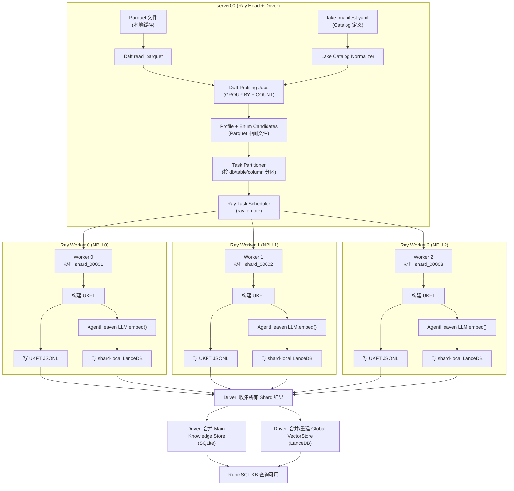

# RubikSQL 第一阶段：Daft + Ray 数据湖分布式构建 详细技术报告

> **版本**: v1.0
> **日期**: 2026-06-24
> **适用范围**: server00（Ray Head）+ 3× Ray Worker（华为 910B NPU）
> **目标**: Daft 接管数据湖 Parquet 读取、数据切分、任务分发和 RubikSQL/AgentHeaven build 调度；embedding 暂由 AgentHeaven 原生 `LLM.embed()` + `VectorKLEngine` 完成

---

## 目录

1. [总体架构全景图](#1-总体架构全景图)
2. [当前环境与基础设施](#2-当前环境与基础设施)
3. [输入数据规范](#3-输入数据规范)
4. [完整数据流分层设计](#4-完整数据流分层设计)
5. [任务分发模型：Daft → Ray 完整流程](#5-任务分发模型daft--ray-完整流程)
6. [Worker 内部执行详解](#6-worker-内部执行详解)
7. [结果收集与合并机制](#7-结果收集与合并机制)
8. [完整可执行代码](#8-完整可执行代码)
9. [部署与启动流程](#9-部署与启动流程)
10. [容错与重试机制](#10-容错与重试机制)
11. [监控与可观测性](#11-监控与可观测性)
12. [附录：关键数据结构参考](#12-附录关键数据结构参考)

---

## 1. 总体架构全景图

### 1.1 一句话概述

```
Parquet 数据湖 (server00 本地缓存)
  → Daft read_parquet (读取 + Schema 推断)
  → Daft Profiling (按列统计 distinct values / frequencies)
  → Daft 任务分区 (按 db_id / table_id / column_id 切分)
  → Ray 分发 Worker (每个 Worker 拿一个 shard)
  → Worker 构建 UKFT (DatabaseUKFT / TableUKFT / ColumnUKFT / EnumUKFT)
  → Worker 写 UKFT shard 文件 (JSONL)
  → Worker 调 AgentHeaven 原生 embedding (LLM.embed + VectorKLEngine)
  → Worker 写 shard-local VectorStore (LanceDB)
  → Driver 收集所有 shard → 合并主知识库 → 合并/重建全局 VectorStore
  → RubikSQL 查询可用
```

### 1.2 端到端架构图



### 1.3 核心设计原则

| 原则 | 说明 |
|------|------|
| **Daft 管数据，不管业务** | Daft 负责大规模数据读取、切分、调度、批处理。不处理 UKFT 语义。 |
| **Worker 管构建，不管协调** | 每个 Worker 独立完成 UKFT 构建 + embedding，不与其他 Worker 通信。 |
| **Driver 管合并，不管构建** | Driver 只负责收集结果、合并存储、重建索引。 |
| **Shard-local 写入** | 每个 Worker 写自己的 shard vectorstore，避免并发写冲突。 |
| **中间结果落盘** | 所有中间产物（profile、ukft shards、embedding staging）都落盘，支持断点续跑。 |

---

## 2. 当前环境与基础设施

### 2.1 硬件拓扑

```
┌─────────────────────────────────────────────────────────┐
│  server00 (Ray Head + Driver)                           │
│  - IP: <server00_ip>                                    │
│  - 角色: Ray Head, Daft Driver, 任务调度                │
│  - 存储: Parquet 文件缓存路径 /data/rubikbench/         │
│  - 共享存储: /mnt/shared/rubiksql-build-runs/ (NFS/SMB) │
│  - GPU: 可能有也可能无                                  │
├─────────────────────────────────────────────────────────┤
│  Worker 0                     Worker 1                  │
│  - 华为 910B NPU              - 华为 910B NPU           │
│  - Ray Worker                 - Ray Worker              │
│  - 挂载共享存储               - 挂载共享存储            │
│                                                         │
│  Worker 2                                               │
│  - 华为 910B NPU                                         │
│  - Ray Worker                                           │
│  - 挂载共享存储                                         │
└─────────────────────────────────────────────────────────┘
```

### 2.2 软件依赖清单

**所有节点（server00 + 3 workers）必须安装：**

```bash
# 核心依赖
pip install daft[ray]>=0.4.0          # Daft + Ray runner 支持
pip install ray[default]>=2.40.0      # Ray 分布式框架
pip install pyarrow>=15.0.0           # Parquet 读写

# AgentHeaven / RubikSQL 依赖
pip install lancedb                    # 向量数据库
pip install llama-index-vector-stores-lancedb
pip install litellm                    # LLM 调用抽象层
pip install sqlalchemy                 # 数据库抽象
pip install pydantic>=2.0              # 数据模型
pip install pyyaml                     # 配置文件解析
pip install click                      # CLI 框架
pip install jinja2                     # 模板渲染

# AgentHeaven 本地包（从源码安装）
cd AgentHeaven-dev-master && pip install -e .

# RubikSQL 本地包（从源码安装）
cd RubikSQL-dev && pip install -e .

# NPU 相关（华为 910B）
# 确保 torch 等支持 NPU 的版本已安装
pip install torch-npu  # 或根据华为文档安装
```

**验证安装：**

```bash
python -c "import daft; print('Daft:', daft.__version__)"
python -c "import ray; print('Ray:', ray.__version__)"
python -c "from ahvn.utils.llm.base import LLM; print('AgentHeaven LLM: OK')"
python -c "from rubiksql.ukfs.db_ukft import DatabaseUKFT; print('RubikSQL UKFT: OK')"
```

### 2.3 共享存储配置

**关键要求：所有节点必须能访问相同的路径。**

推荐方案：

```bash
# 方案 A: NFS 共享（推荐）
# server00 上:
mkdir -p /mnt/shared/rubiksql-build-runs
# 在 /etc/exports 中添加:
# /mnt/shared/rubiksql-build-runs *(rw,sync,no_subtree_check)

# 各 Worker 上:
mkdir -p /mnt/shared/rubiksql-build-runs
mount -t nfs server00:/mnt/shared/rubiksql-build-runs /mnt/shared/rubiksql-build-runs
```

```bash
# 方案 B: S3/MinIO 兼容存储（如果可用）
# 配置环境变量
export AWS_ACCESS_KEY_ID=xxx
export AWS_SECRET_ACCESS_KEY=xxx
export S3_ENDPOINT=http://minio:9000
```

### 2.4 Ray Cluster 启动

```bash
# === 在 server00 上启动 Ray Head ===
ray start --head \
    --port=6379 \
    --dashboard-host=0.0.0.0 \
    --dashboard-port=8265 \
    --num-cpus=4 \
    --resources='{"head": 1}'

# === 在每个 Worker 上启动 Ray Worker ===
# Worker 0
ray start --address='server00:6379' \
    --num-cpus=8 \
    --resources='{"worker": 1, "npu": 1}'

# Worker 1
ray start --address='server00:6379' \
    --num-cpus=8 \
    --resources='{"worker": 1, "npu": 1}'

# Worker 2
ray start --address='server00:6379' \
    --num-cpus=8 \
    --resources='{"worker": 1, "npu": 1}'

# 验证集群状态
ray status
# 预期输出: 1 head + 3 workers = 4 nodes, 28 CPUs
```

---

## 3. 输入数据规范

### 3.1 Parquet 文件组织（HuggingFace RubikBench）

根据 RubikBench 数据集，Parquet 文件预计按数据库/表组织：

```text
# server00 上的本地缓存路径
/data/rubikbench/
├── sales/
│   ├── orders/
│   │   ├── part-00000.parquet
│   │   └── part-00001.parquet
│   ├── customers/
│   │   └── part-00000.parquet
│   └── products/
│       └── part-00000.parquet
├── hr/
│   ├── employees/
│   │   └── part-00000.parquet
│   └── departments/
│       └── part-00000.parquet
└── finance/
    └── transactions/
        └── part-00000.parquet
```

### 3.2 Lake Manifest（构建配置文件）

**这是整个构建流程的"配置文件"，必须手动编写或从数据集元数据生成。**

```yaml
# lake_manifest.yaml
# 放置在 server00 上，或放在共享存储的 run 目录下

run:
  run_id: "20260624_001"                         # 本次构建的唯一 ID
  output_base: "/mnt/shared/rubiksql-build-runs" # 共享存储根路径

daft:
  runner: ray                                    # Daft 执行引擎
  # ray_address 由环境变量或 ray.init() 自动检测
  target_partitions: 256                         # 初始并行度

rubiksql:
  kb_name: rubikbench                            # 知识库名称
  kb_root: "/mnt/shared/rubiksql-kb"             # 知识库根路径

phase1:
  enabled: true
  agentheaven_embedding: true                     # Phase 1: 使用 AgentHeaven 原生 embedding
  shard_vectorstore: true                         # 每个 worker 写独立 shard vectorstore
  merge_after_build: true                         # Driver 收集所有 shard 后合并

enum_policy:
  default_enabled_for:
    - text
    - categorical
  max_distinct_count: 100000                      # 超过此值跳过枚举索引
  max_distinct_ratio: 0.2                         # distinct/row_count > 此值跳过
  min_frequency: 1                                # 最小频率阈值

databases:
  - db_id: sales
    description: "Sales analytics database"
    tables:
      - table_id: orders
        path: "/data/rubikbench/sales/orders/*.parquet"
        description: "Customer order records"
        primary_key: ["order_id"]
        columns:
          - col_id: order_status
            description: "Order lifecycle status"
            enum_index_enabled: true              # 强制启用枚举索引
          - col_id: payment_method
            description: "Payment method"
            enum_index_enabled: true
          - col_id: total_amount
            datatype: number
            enum_index_enabled: false             # 数值列不建枚举
          - col_id: customer_id
            datatype: identifier
            enum_index_enabled: false

      - table_id: customers
        path: "/data/rubikbench/sales/customers/*.parquet"
        description: "Customer information"
        primary_key: ["customer_id"]
        columns:
          - col_id: country
            enum_index_enabled: true
          - col_id: city
            enum_index_enabled: true
          - col_id: email
            enum_index_enabled: false

  - db_id: hr
    description: "Human resources database"
    tables:
      - table_id: employees
        path: "/data/rubikbench/hr/employees/*.parquet"
        description: "Employee records"
        primary_key: ["employee_id"]
        columns:
          - col_id: department
            enum_index_enabled: true
          - col_id: job_title
            enum_index_enabled: true
          - col_id: salary
            datatype: number
            enum_index_enabled: false
```

### 3.3 如果没有 Manifest（自动推断模式）

如果暂时没有 manifest，可以先用 Daft 自动推断 schema 并生成初始 catalog：

```python
# 自动推断 catalog
import daft
import yaml
from pathlib import Path

def auto_infer_catalog(parquet_root: str, output_path: str):
    """
    扫描 Parquet 目录结构，自动生成 lake manifest。
    假设目录结构为: {root}/{db_id}/{table_id}/*.parquet
    """
    root = Path(parquet_root)
    databases = []

    for db_dir in sorted(root.iterdir()):
        if not db_dir.is_dir():
            continue
        db_id = db_dir.name
        tables = []

        for tab_dir in sorted(db_dir.iterdir()):
            if not tab_dir.is_dir():
                continue
            tab_id = tab_dir.name
            parquet_files = list(tab_dir.glob("*.parquet"))
            if not parquet_files:
                continue

            # 用 Daft 读取第一个文件获取 schema
            df = daft.read_parquet(str(parquet_files[0]))
            schema = df.schema()

            columns = []
            for col_name in schema.column_names():
                col_type = schema[col_name].dtype
                # 自动判断哪些列适合建枚举索引
                is_text = str(col_type) in ('string', 'large_string', 'utf8')
                columns.append({
                    'col_id': col_name,
                    'datatype': str(col_type),
                    'enum_index_enabled': is_text,  # 文本列默认启用
                })

            tables.append({
                'table_id': tab_id,
                'path': str(tab_dir / "*.parquet"),
                'columns': columns,
            })

        databases.append({
            'db_id': db_id,
            'tables': tables,
        })

    manifest = {
        'run': {'run_id': 'auto_001', 'output_base': '/mnt/shared/rubiksql-build-runs'},
        'databases': databases,
    }

    with open(output_path, 'w') as f:
        yaml.dump(manifest, f, default_flow_style=False, allow_unicode=True)

    print(f"Auto-generated manifest saved to: {output_path}")
    return manifest
```

---

## 4. 完整数据流分层设计

整个构建过程分为 **6 个数据层**，每层产物落盘，可独立检查和复用。

### 4.1 数据层总览

```
build_runs/{run_id}/
├── manifest.yaml                    # Layer 0: 构建配置（输入）
├── run_meta.json                    # 构建元信息
│
├── catalog/                         # Layer 1: Catalog 层
│   ├── tables.parquet               #   db_id, table_id, path, description, row_count
│   └── columns.parquet              #   db_id, table_id, column_id, dtype, enum_enabled
│
├── profile/                         # Layer 2: Profile 层
│   ├── column_profile.parquet       #   db_id, table_id, column_id, dtype, null_count,
│   │                                #   distinct_count, sample_values
│   └── enum_candidates.parquet      #   db_id, table_id, column_id, enum_value, freq
│
├── ukft_shards/                     # Layer 3: UKFT Shard 层
│   ├── shard_id=00001/
│   │   ├── ukfts.jsonl              #   每条一个 UKFT 对象（JSON 序列化）
│   │   └── shard_meta.json          #   shard 元信息
│   ├── shard_id=00002/
│   │   ├── ukfts.jsonl
│   │   └── shard_meta.json
│   └── ...
│
├── shard_kb/                        # Layer 4: Shard-Local KB 层
│   ├── shard_id=00001/
│   │   ├── main.db                  #   SQLite 主知识库
│   │   └── vec/                     #   LanceDB 向量库
│   ├── shard_id=00002/
│   │   ├── main.db
│   │   └── vec/
│   └── ...
│
├── global_kb/                       # Layer 5: Global KB（合并后）
│   ├── main.db                      #   合并后的 SQLite 主知识库
│   └── vec/                         #   合并后的 LanceDB 向量库
│
└── logs/                            # 日志
    ├── profile.log
    ├── build_worker_0.log
    ├── build_worker_1.log
    ├── build_worker_2.log
    ├── merge.log
    └── embedding.log
```

### 4.2 各层详细 Schema

#### Layer 1: Catalog

**tables.parquet**:

| 字段 | 类型 | 说明 |
|------|------|------|
| `db_id` | string | 数据库标识 |
| `table_id` | string | 表标识 |
| `path` | string | Parquet 文件路径 |
| `description` | string | 人工/自动描述 |
| `primary_key` | list[string] | 主键列名列表 |
| `file_list` | list[string] | 实际匹配到的文件列表 |

**columns.parquet**:

| 字段 | 类型 | 说明 |
|------|------|------|
| `db_id` | string | 数据库标识 |
| `table_id` | string | 表标识 |
| `column_id` | string | 列标识 |
| `dtype` | string | Parquet 原始类型 |
| `dtype_anno` | string | 人工标注类型（可为 null） |
| `enum_index_enabled` | bool | 是否启用枚举索引 |
| `is_pk` | bool | 是否为主键 |
| `description` | string | 人工/自动描述 |

#### Layer 2: Profile

**column_profile.parquet**:

| 字段 | 类型 | 说明 |
|------|------|------|
| `db_id` | string | 数据库标识 |
| `table_id` | string | 表标识 |
| `column_id` | string | 列标识 |
| `dtype` | string | 数据类型 |
| `total_count` | int64 | 总行数 |
| `null_count` | int64 | 空值数 |
| `distinct_count` | int64 | 去重值数量 |
| `null_ratio` | float64 | 空值比例 |
| `distinct_ratio` | float64 | 去重比例 |
| `sample_values` | list[string] | 采样值（top 20 + bottom 20） |

**enum_candidates.parquet**:

| 字段 | 类型 | 说明 |
|------|------|------|
| `db_id` | string | 数据库标识 |
| `table_id` | string | 表标识 |
| `column_id` | string | 列标识 |
| `enum_value` | string | 枚举值 |
| `freq` | int64 | 出现频率 |

#### Layer 3: UKFT Shard (JSONL)

**ukfts.jsonl** 每行：

```json
{
  "ukft_type": "db-enum",
  "db_id": "sales",
  "table_id": "orders",
  "column_id": "order_status",
  "name": "orders.order_status=completed",
  "content": "",
  "content_resources": {
    "db_id": "sales",
    "tab_id": "orders",
    "col_id": "order_status",
    "enum": "completed",
    "predicate": {"tab": "orders", "col": "order_status", "==": "completed"}
  },
  "tags": ["[DATABASE:sales]", "[TABLE:orders]", "[COLUMN:order_status]", "[ENUM:completed]"],
  "type": "db-enum",
  "source": "system",
  "version": "v0.1.0",
  "variant": "default",
  "creator": "admin",
  "owner": "admin",
  "verified": true,
  "system": true
}
```

---

## 5. 任务分发模型：Daft → Ray 完整流程

### 5.1 核心概念

Phase 1 中，Daft 和 Ray 的分工如下：

| 组件 | 职责 | 运行位置 |
|------|------|----------|
| **Daft Driver** | 读取 Parquet、DataFrame 操作（filter/groupby/agg）、生成 enum candidates、写中间 Parquet | server00 |
| **Ray Task Scheduler** | 将构建任务分发到 worker、管理 worker 生命周期、收集返回值 | server00 (Ray Head) |
| **Ray Worker** | 读取自己的 shard 数据、构建 UKFT、调 AgentHeaven embedding、写 shard KB | 各 Worker 节点 |

### 5.2 任务切分策略

```
                           Parquet 文件
                                │
                    Daft read_parquet → DataFrame
                                │
                    ┌───────────┼───────────┐
                    │           │           │
              GROUP BY      GROUP BY    GROUP BY
              db + table    col + val   col stats
                    │           │           │
                    ▼           ▼           ▼
              table_profile  enum_candidates  column_profile
                    │           │
                    └─────┬─────┘
                          │
              按 (db_id, table_id) 分区
                          │
              ┌───────────┼───────────┐
              │           │           │
          Shard 0     Shard 1     Shard 2
         (tables A,B) (tables C,D) (tables E,F)
              │           │           │
              ▼           ▼           ▼
          Worker 0    Worker 1    Worker 2
```

**分区策略详解：**

```python
# 核心分区逻辑
# 1. 枚举候选按 (db_id, table_id) 分组
# 2. 使用 hash 分区确保每个 worker 负载均衡
# 3. 每个 shard 包含一个或多个完整的 table（不拆分 table 内部）

def partition_tasks(enum_candidates_df, num_workers=3):
    """
    将枚举候选数据分区为 num_workers 个 shard。
    每个 shard 包含一个或多个完整 table 的数据。
    """
    # 获取所有唯一的 (db_id, table_id) 组合
    tables = enum_candidates_df.select("db_id", "table_id").distinct()
    table_list = tables.to_pydict()  # 转为 Python list

    # 按 table_id 的 hash 分配到 worker
    shards = [[] for _ in range(num_workers)]
    for row in zip(table_list["db_id"], table_list["table_id"]):
        db_id, table_id = row
        shard_idx = hash(f"{db_id}.{table_id}") % num_workers
        shards[shard_idx].append((db_id, table_id))

    return shards
```

### 5.3 Ray Remote Task 定义

```python
import ray
import json
from pathlib import Path

@ray.remote(num_cpus=2, resources={"worker": 1})
def build_ukft_shard_worker(
    task_spec: dict,
    shared_base: str,
) -> dict:
    """
    Ray Remote Function: 单个 Worker 的完整构建任务。

    Args:
        task_spec: 任务描述，包含:
            - shard_id: shard 编号
            - tables: [(db_id, table_id), ...] 该 shard 负责的表列表
            - profile_base: profile 数据路径
            - enum_candidates_path: enum candidates 路径
        shared_base: 共享存储根路径

    Returns:
        {
            "shard_id": str,
            "status": "success" | "failed",
            "ukft_count": int,
            "embedding_count": int,
            "embedding_time_sec": float,
            "error": str | None,
            "output_paths": {
                "ukft_jsonl": str,
                "shard_kb": str,
                "shard_vec": str,
            }
        }
    """
    # Worker 内部实现见第 6 节
    ...
```

### 5.4 Driver 调度流程

```python
def run_phase1_pipeline(manifest_path: str):
    """
    Phase 1 完整调度流程（在 server00 上运行）。
    """
    # Step 0: 加载 manifest
    manifest = load_manifest(manifest_path)
    run_id = manifest["run"]["run_id"]
    output_base = Path(manifest["run"]["output_base"])
    run_dir = output_base / run_id

    # Step 1: Profiling（Daft 本地执行）
    print("=" * 60)
    print("Step 1: Profiling data lake...")
    print("=" * 60)
    profile_result = run_profiling(manifest, run_dir)
    print(f"  Tables profiled: {profile_result['table_count']}")
    print(f"  Enum candidates: {profile_result['enum_candidate_count']}")

    # Step 2: 任务分区
    print("=" * 60)
    print("Step 2: Partitioning build tasks...")
    print("=" * 60)
    shards = partition_build_tasks(
        profile_result["enum_candidates_path"],
        num_workers=3,
    )
    print(f"  Created {len(shards)} shards")

    # Step 3: 提交 Ray 任务
    print("=" * 60)
    print("Step 3: Dispatching to Ray workers...")
    print("=" * 60)

    # 初始化 Ray（如果尚未初始化）
    if not ray.is_initialized():
        ray.init(address="auto")  # 自动检测 Ray cluster

    # 构建每个 shard 的 task_spec
    futures = []
    for shard_idx, tables in enumerate(shards):
        task_spec = {
            "shard_id": f"shard_id={shard_idx:05d}",
            "tables": tables,
            "run_dir": str(run_dir),
            "profile_dir": str(run_dir / "profile"),
            "output_shard_dir": str(run_dir / "ukft_shards" / f"shard_id={shard_idx:05d}"),
            "output_kb_dir": str(run_dir / "shard_kb" / f"shard_id={shard_idx:05d}"),
        }
        future = build_ukft_shard_worker.remote(task_spec, str(run_dir))
        futures.append(future)

    # Step 4: 等待所有 Worker 完成
    print("  Waiting for workers to complete...")
    results = ray.get(futures)

    # Step 5: 检查结果
    success = all(r["status"] == "success" for r in results)
    if not success:
        failed = [r for r in results if r["status"] != "success"]
        print(f"  ERROR: {len(failed)} shards failed!")
        for f in failed:
            print(f"    {f['shard_id']}: {f['error']}")
        return {"status": "failed", "results": results}

    total_ukfts = sum(r["ukft_count"] for r in results)
    total_embeddings = sum(r["embedding_count"] for r in results)
    print(f"  All shards complete!")
    print(f"  Total UKFTs: {total_ukfts}")
    print(f"  Total embeddings: {total_embeddings}")

    # Step 6: Merge（Driver 本地执行）
    print("=" * 60)
    print("Step 6: Merging shards into global KB...")
    print("=" * 60)
    merge_result = merge_shards_to_global(
        run_dir=run_dir,
        shard_results=results,
        kb_name=manifest["rubiksql"]["kb_name"],
        kb_root=manifest["rubiksql"]["kb_root"],
    )
    print(f"  Merge complete: {merge_result}")

    # Step 7: 输出汇总
    print("=" * 60)
    print("Phase 1 Pipeline Complete!")
    print(f"  Run ID: {run_id}")
    print(f"  Output: {run_dir}")
    print(f"  UKFTs:  {total_ukfts}")
    print(f"  Embeds: {total_embeddings}")
    print("=" * 60)

    return {
        "status": "success",
        "run_id": run_id,
        "total_ukfts": total_ukfts,
        "total_embeddings": total_embeddings,
        "shard_results": results,
    }
```

---

## 6. Worker 内部执行详解

### 6.1 Worker 完整执行流程

```
Worker 启动
    │
    ▼
┌─────────────────────────────────────────────┐
│ 1. 读取 task_spec                           │
│    - 确定本 shard 负责的 tables              │
│    - 确定输入/输出路径                       │
└─────────────────────────────────────────────┘
    │
    ▼
┌─────────────────────────────────────────────┐
│ 2. 读取 Profile 数据                         │
│    - 从 column_profile.parquet 读表/列元数据  │
│    - 从 enum_candidates.parquet 读枚举候选    │
│    - 只读本 shard 负责的 (db_id, table_id)   │
└─────────────────────────────────────────────┘
    │
    ▼
┌─────────────────────────────────────────────┐
│ 3. 构建 UKFT 对象                            │
│    for each table:                          │
│      - DatabaseUKFT (如首次出现)             │
│      - TableUKFT                            │
│      for each column:                       │
│        - ColumnUKFT                         │
│        for each enum_value:                 │
│          - EnumUKFT                         │
└─────────────────────────────────────────────┘
    │
    ▼
┌─────────────────────────────────────────────┐
│ 4. 写 UKFT Shard 文件                        │
│    - 输出 JSONL 到 ukft_shards/              │
│    - 每条 UKFT 序列化为 JSON                 │
└─────────────────────────────────────────────┘
    │
    ▼
┌─────────────────────────────────────────────┐
│ 5. 初始化 Shard-Local KB                     │
│    - 创建 SQLite 主存储                      │
│    - 创建 LanceDB 向量存储                   │
│    - 创建 VectorKLEngine (inplace=False)     │
└─────────────────────────────────────────────┘
    │
    ▼
┌─────────────────────────────────────────────┐
│ 6. Batch Upsert + AgentHeaven Embedding      │
│    kb.batch_upsert(all_ukfts)               │
│      → VectorKLStore._batch_convert()       │
│        → batch_k_encode_embed()             │
│          → kl.text() (encoder)              │
│          → LLM.embed(texts) (embedder)      │
│        → VdbUKFAdapter.from_ukf()           │
│        → LanceDBVectorStore.add(nodes)      │
└─────────────────────────────────────────────┘
    │
    ▼
┌─────────────────────────────────────────────┐
│ 7. 返回结果给 Driver                          │
│    {                                         │
│      "shard_id": "shard_id=00001",           │
│      "status": "success",                    │
│      "ukft_count": 15234,                    │
│      "embedding_count": 15200,               │
│      "embedding_time_sec": 245.6,            │
│      "output_paths": {...}                   │
│    }                                         │
└─────────────────────────────────────────────┘
```

### 6.2 Worker 代码实现

```python
# worker.py - 在 Ray Worker 上执行的完整构建逻辑

import os
import sys
import json
import time
import yaml
from pathlib import Path
from typing import List, Dict, Any, Tuple
import daft
from loguru import logger

# === 导入 AgentHeaven 组件 ===
from ahvn.ukf.base import BaseUKF
from ahvn.klbase.base import KLBase
from ahvn.klstore.vdb_store import VectorKLStore
from ahvn.klstore.db_store import DatabaseKLStore
from ahvn.klengine.vector_engine import VectorKLEngine
from ahvn.klengine.facet_engine import FacetKLEngine
from ahvn.adapter.db import DbUKFAdapter
from ahvn.utils.vdb.base import VectorDatabase

# === 导入 RubikSQL UKFT 类型 ===
from rubiksql.ukfs.db_ukft import DatabaseUKFT
from rubiksql.ukfs.tab_ukft import TableUKFT
from rubiksql.ukfs.col_ukft import ColumnUKFT
from rubiksql.ukfs.enum_ukft import EnumUKFT


def build_ukft_shard(task_spec: Dict[str, Any]) -> Dict[str, Any]:
    """
    单个 Shard 的完整构建流程。在 Ray Worker 上执行。

    这个函数是整个 Phase 1 的核心：
    - 从 profile 数据构建 UKFT 对象
    - 通过 AgentHeaven 原生 pipeline 完成 embedding 和 VectorStore 写入
    - 不需要传统数据库连接（所有数据来自 Parquet profile）

    Args:
        task_spec: {
            "shard_id": "shard_id=00001",
            "tables": [("sales", "orders"), ("sales", "customers")],
            "run_dir": "/mnt/shared/.../20260624_001/",
            "profile_dir": "/mnt/shared/.../20260624_001/profile/",
            "output_shard_dir": "/mnt/shared/.../20260624_001/ukft_shards/shard_id=00001/",
            "output_kb_dir": "/mnt/shared/.../20260624_001/shard_kb/shard_id=00001/",
        }

    Returns:
        构建结果字典
    """
    shard_id = task_spec["shard_id"]
    tables = task_spec["tables"]
    profile_dir = Path(task_spec["profile_dir"])
    output_shard_dir = Path(task_spec["output_shard_dir"])
    output_kb_dir = Path(task_spec["output_kb_dir"])

    # 创建输出目录
    output_shard_dir.mkdir(parents=True, exist_ok=True)
    output_kb_dir.mkdir(parents=True, exist_ok=True)

    logger.info(f"[{shard_id}] Starting build for {len(tables)} tables")

    try:
        # ============================================================
        # Step 1: 读取 Profile 数据（只读本 shard 的部分）
        # ============================================================
        logger.info(f"[{shard_id}] Reading profile data...")

        # 读取 column_profile 并过滤到本 shard 的表
        column_profile_path = profile_dir / "column_profile.parquet"
        col_profile_df = daft.read_parquet(str(column_profile_path))

        # 构建过滤条件
        filter_expr = None
        for db_id, table_id in tables:
            cond = (daft.col("db_id") == db_id) & (daft.col("table_id") == table_id)
            if filter_expr is None:
                filter_expr = cond
            else:
                filter_expr = filter_expr | cond

        col_profile_df = col_profile_df.where(filter_expr)
        col_profiles = col_profile_df.to_pydict()  # 转为 Python 字典列表

        # 读取 enum_candidates 并过滤
        enum_candidates_path = profile_dir / "enum_candidates.parquet"
        enum_df = daft.read_parquet(str(enum_candidates_path)).where(filter_expr)
        enum_candidates = enum_df.to_pydict()

        logger.info(f"[{shard_id}] Loaded {len(col_profiles.get('db_id', []))} column profiles")
        logger.info(f"[{shard_id}] Loaded {len(enum_candidates.get('db_id', []))} enum candidates")

        # ============================================================
        # Step 2: 构建 UKFT 对象（不依赖数据库连接）
        # ============================================================
        logger.info(f"[{shard_id}] Building UKFT objects...")

        all_ukfts = []
        seen_dbs = set()
        seen_tables = set()

        # 组织数据结构
        # col_profiles 按 db_id -> table_id -> column_id 组织
        db_table_cols = {}
        for i in range(len(col_profiles.get("db_id", []))):
            db_id = col_profiles["db_id"][i]
            table_id = col_profiles["table_id"][i]
            col_id = col_profiles["column_id"][i]

            if db_id not in db_table_cols:
                db_table_cols[db_id] = {}
            if table_id not in db_table_cols[db_id]:
                db_table_cols[db_id][table_id] = []
            db_table_cols[db_id][table_id].append({
                "col_id": col_id,
                "dtype": col_profiles["dtype"][i],
                "total_count": col_profiles["total_count"][i],
                "null_count": col_profiles["null_count"][i],
                "distinct_count": col_profiles["distinct_count"][i],
                "sample_values": col_profiles["sample_values"][i],
            })

        # enum_candidates 按 db_id -> table_id -> column_id 组织
        db_table_enums = {}
        for i in range(len(enum_candidates.get("db_id", []))):
            db_id = enum_candidates["db_id"][i]
            table_id = enum_candidates["table_id"][i]
            col_id = enum_candidates["column_id"][i]
            enum_val = enum_candidates["enum_value"][i]
            freq = enum_candidates["freq"][i]

            key = (db_id, table_id, col_id)
            if key not in db_table_enums:
                db_table_enums[key] = []
            db_table_enums[key].append((enum_val, freq))

        # 遍历每个 db -> table -> column，构建 UKFT
        for db_id, tables_dict in db_table_cols.items():
            # 构建 DatabaseUKFT（每个 db 只构建一次）
            if db_id not in seen_dbs:
                db_ukft = _build_database_ukft_from_profile(db_id, tables_dict)
                all_ukfts.append(db_ukft)
                seen_dbs.add(db_id)

            for table_id, columns in tables_dict.items():
                # 构建 TableUKFT（每个 table 只构建一次）
                table_key = f"{db_id}.{table_id}"
                if table_key not in seen_tables:
                    tab_ukft = _build_table_ukft_from_profile(
                        db_id, table_id, columns
                    )
                    all_ukfts.append(tab_ukft)
                    seen_tables.add(table_key)

                for col_info in columns:
                    col_id = col_info["col_id"]

                    # 构建 ColumnUKFT
                    col_ukft = _build_column_ukft_from_profile(
                        db_id, table_id, col_info
                    )
                    all_ukfts.append(col_ukft)

                    # 构建 EnumUKFT（该列的每个枚举值）
                    enum_key = (db_id, table_id, col_id)
                    if enum_key in db_table_enums:
                        for enum_val, freq in db_table_enums[enum_key]:
                            enum_ukft = _build_enum_ukft_from_profile(
                                db_id, table_id, col_id, enum_val, freq
                            )
                            all_ukfts.append(enum_ukft)

        logger.info(f"[{shard_id}] Built {len(all_ukfts)} UKFT objects")

        # ============================================================
        # Step 3: 序列化 UKFT 到 JSONL 文件
        # ============================================================
        logger.info(f"[{shard_id}] Writing UKFT shard file...")

        ukft_jsonl_path = output_shard_dir / "ukfts.jsonl"
        with open(ukft_jsonl_path, "w", encoding="utf-8") as f:
            for ukft in all_ukfts:
                # 使用 BaseUKF 的 model_dump 序列化
                ukft_dict = ukft.model_dump(mode="json", exclude_none=True)
                f.write(json.dumps(ukft_dict, ensure_ascii=False) + "\n")

        ukft_count = len(all_ukfts)
        logger.info(f"[{shard_id}] Wrote {ukft_count} UKFTs to {ukft_jsonl_path}")

        # ============================================================
        # Step 4: 初始化 Shard-Local KB（SQLite + LanceDB）
        # ============================================================
        logger.info(f"[{shard_id}] Initializing shard-local KB...")

        # 4a. 创建 SQLite 主存储
        main_db_path = output_kb_dir / "main.db"
        main_storage = DatabaseKLStore(
            provider="sqlite",
            database=f"sqlite:///{main_db_path}",
            table="ukf_records",
            adapter=DbUKFAdapter(),  # 使用 AgentHeaven 默认 DB adapter
        )
        main_storage._init()  # 初始化表结构

        # 4b. 创建 LanceDB 向量存储（用于 vec-enums engine）
        vec_db_path = output_kb_dir / "vec"
        vec_db_path.mkdir(parents=True, exist_ok=True)

        vector_storage = VectorKLStore(
            provider="lancedb",
            uri=str(vec_db_path),
            table_name="vec_enums",
            encoder=None,       # 使用默认 encoder: kl.text()
            embedder="embedder", # 使用 AgentHeaven 配置的 embedder preset
        )

        # 4c. 创建 KLBase 并注册存储和引擎
        kb = KLBase(name=f"shard_{shard_id}")

        # 添加主存储
        kb.add_storage(main_storage, name="main", main=True)

        # 添加向量引擎 (inplace=False 表示独立 VDB)
        # 使用与 RubikSQL 默认配置一致的 encoder
        vec_engine = VectorKLEngine(
            storage=vector_storage,
            inplace=False,
            provider="lancedb",
            uri=str(vec_db_path),
            encoder=[
                "lambda kl: str(kl.enum).strip().lower()",  # 与 default_config.yaml 一致
                "lambda q: str(q).strip().lower()",
            ],
            embedder="embedder",
            condition=lambda kl: getattr(kl, 'type', None) == 'db-enum',
        )
        kb.add_engine(vec_engine, name="vec-enums")

        logger.info(f"[{shard_id}] KB initialized with main storage + vec-enums engine")

        # ============================================================
        # Step 5: Batch Upsert（触发 AgentHeaven 原生 embedding）
        # ============================================================
        logger.info(f"[{shard_id}] Starting batch upsert + AgentHeaven embedding...")
        embedding_start_time = time.time()

        # 批量 upsert 到 KB
        # 这会触发:
        #   1. 写入 SQLite 主存储
        #   2. VectorKLEngine._batch_convert() -> batch_k_encode_embed()
        #      -> kl.text() -> LLM.embed(texts) -> 写入 LanceDB
        batch_size = 256  # 与 default_config.yaml 一致
        kb.batch_upsert(all_ukfts, batch_size=batch_size)

        embedding_elapsed = time.time() - embedding_start_time

        # 统计 embedding 数量（只有 db-enum 类型的 UKFT 被 embedding）
        enum_ukft_count = sum(1 for u in all_ukfts if getattr(u, 'type', None) == 'db-enum')

        logger.info(f"[{shard_id}] Embedding complete in {embedding_elapsed:.1f}s")
        logger.info(f"[{shard_id}] Enum UKFTs embedded: {enum_ukft_count}")

        # ============================================================
        # Step 6: 写 Shard 元信息
        # ============================================================
        shard_meta = {
            "shard_id": shard_id,
            "tables": tables,
            "ukft_count": ukft_count,
            "enum_ukft_count": enum_ukft_count,
            "embedding_time_sec": embedding_elapsed,
            "timestamp": time.time(),
        }
        with open(output_shard_dir / "shard_meta.json", "w") as f:
            json.dump(shard_meta, f, indent=2, ensure_ascii=False)

        # ============================================================
        # Step 7: 返回结果
        # ============================================================
        return {
            "shard_id": shard_id,
            "status": "success",
            "ukft_count": ukft_count,
            "embedding_count": enum_ukft_count,
            "embedding_time_sec": embedding_elapsed,
            "error": None,
            "output_paths": {
                "ukft_jsonl": str(ukft_jsonl_path),
                "shard_meta": str(output_shard_dir / "shard_meta.json"),
                "shard_kb_main": str(main_db_path),
                "shard_kb_vec": str(vec_db_path),
            },
        }

    except Exception as e:
        logger.exception(f"[{shard_id}] Build failed!")
        return {
            "shard_id": shard_id,
            "status": "failed",
            "ukft_count": 0,
            "embedding_count": 0,
            "embedding_time_sec": 0,
            "error": str(e),
            "output_paths": {},
        }


# ================================================================
# UKFT 构建辅助函数（从 Profile 数据直接构建，不依赖数据库连接）
# ================================================================

def _build_database_ukft_from_profile(
    db_id: str,
    tables_dict: Dict[str, List[Dict]],
) -> DatabaseUKFT:
    """
    从 profile 数据构建 DatabaseUKFT。
    不依赖传统数据库连接，所有信息来自 Parquet profile。
    """
    table_names = list(tables_dict.keys())
    total_cols = sum(len(cols) for cols in tables_dict.values())

    # 直接构造 DatabaseUKFT 实例
    # content_resources 存储数据库元信息
    db_ukft = DatabaseUKFT(
        name=f"db:{db_id}",
        content=f"Database: {db_id}",
        content_resources={
            "db_id": db_id,
            "tabs": table_names,
            "# tabs": len(table_names),
            "# cols": total_cols,
        },
        tags={
            f"[UKF_TYPE:db-database]",
            f"[DATABASE:{db_id}]",
        },
        source="system",
        verified=True,
    )

    # 使用 signed() 设置系统签名
    db_ukft = db_ukft.signed(system=True, verified=True)
    return db_ukft


def _build_table_ukft_from_profile(
    db_id: str,
    table_id: str,
    columns: List[Dict],
) -> TableUKFT:
    """
    从 profile 数据构建 TableUKFT。
    """
    col_names = [c["col_id"] for c in columns]
    total_rows = columns[0]["total_count"] if columns else 0

    tab_ukft = TableUKFT(
        name=f"tab:{db_id}.{table_id}",
        content=f"Table: {db_id}.{table_id}",
        content_resources={
            "db_id": db_id,
            "tab_id": table_id,
            "# rows": total_rows,
            "# cols": len(columns),
            "cols": col_names,
            "pks": [],   # 可从 manifest 获取
            "fks": [],   # 可从 manifest 获取
        },
        tags={
            f"[UKF_TYPE:db-table]",
            f"[DATABASE:{db_id}]",
            f"[TABLE:{table_id}]",
        },
        source="system",
        verified=True,
    )

    tab_ukft = tab_ukft.signed(system=True, verified=True)
    return tab_ukft


def _build_column_ukft_from_profile(
    db_id: str,
    table_id: str,
    col_info: Dict,
) -> ColumnUKFT:
    """
    从 profile 数据构建 ColumnUKFT。
    """
    col_id = col_info["col_id"]
    dtype = col_info["dtype"]
    distinct_count = col_info["distinct_count"]
    null_count = col_info["null_count"]
    total_count = col_info["total_count"]
    sample_values = col_info.get("sample_values", [])

    # 计算频率分布
    if sample_values:
        top_enums = sample_values[:20]   # 前 20 个
        bot_enums = sample_values[-20:]  # 后 20 个（去重）
    else:
        top_enums = []
        bot_enums = []

    col_ukft = ColumnUKFT(
        name=f"col:{db_id}.{table_id}.{col_id}",
        content=f"Column: {db_id}.{table_id}.{col_id}",
        content_resources={
            "db_id": db_id,
            "tab_id": table_id,
            "col_id": col_id,
            "datatype_orig": dtype,
            "datatype_anno": None,
            "datatype": _deduce_datatype(dtype, distinct_count, total_count),
            "enum_index": True,
            "# rows": total_count,
            "# distincts": distinct_count,
            "# null": null_count,
            "top_enums": top_enums,
            "bot_enums": bot_enums,
            "freq_dists": _compute_freq_dists(distinct_count, total_count),
            "is_pk": False,
            "fks": [],
            "null_candidates": [],
        },
        tags={
            f"[UKF_TYPE:db-column]",
            f"[DATABASE:{db_id}]",
            f"[TABLE:{table_id}]",
            f"[COLUMN:{col_id}]",
            f"[DATATYPE:{dtype}]",
        },
        source="system",
        verified=True,
    )

    col_ukft = col_ukft.signed(system=True, verified=True)
    return col_ukft


def _build_enum_ukft_from_profile(
    db_id: str,
    table_id: str,
    column_id: str,
    enum_val: str,
    freq: int,
) -> EnumUKFT:
    """
    从 profile 数据构建 EnumUKFT。
    这是向量化的核心对象（vec-enums engine 处理 db-enum 类型）。
    """
    # 确保 enum_val 是字符串
    enum_str = str(enum_val)

    enum_ukft = EnumUKFT(
        name=f"{table_id}.{column_id}={enum_str}",
        content=f"Enum: {table_id}.{column_id} = {enum_str}",
        content_resources={
            "db_id": db_id,
            "tab_id": table_id,
            "col_id": column_id,
            "enum": enum_str,
            "freq": freq,
            "predicate": {
                "tab": table_id,
                "col": column_id,
                "==": enum_str,
            },
        },
        tags={
            f"[UKF_TYPE:db-enum]",
            f"[DATABASE:{db_id}]",
            f"[TABLE:{table_id}]",
            f"[COLUMN:{column_id}]",
            f"[ENUM:{enum_str}]",
        },
        source="system",
        verified=True,
    )

    enum_ukft = enum_ukft.signed(system=True, verified=True)
    return enum_ukft


def _deduce_datatype(dtype: str, distinct_count: int, total_count: int) -> str:
    """简单的类型推断逻辑"""
    dtype_lower = dtype.lower()

    if any(t in dtype_lower for t in ('int', 'float', 'double', 'decimal', 'number')):
        return 'INTEGER' if 'int' in dtype_lower else 'FLOAT'
    elif any(t in dtype_lower for t in ('timestamp', 'date', 'time')):
        return 'DATETIME'
    elif any(t in dtype_lower for t in ('bool', )):
        return 'CATEGORICAL'
    else:
        # 文本类型：根据 distinct 比例判断
        if total_count > 0:
            ratio = distinct_count / total_count
            if ratio > 0.99:
                return 'IDENTIFIER'
            elif distinct_count <= 64:
                return 'CATEGORICAL'
        return 'TEXT'


def _compute_freq_dists(distinct_count: int, total_count: int) -> List[float]:
    """计算频率分布的百分位数"""
    if total_count == 0:
        return [0.0] * 20
    ratio = distinct_count / total_count
    return [min(ratio * (i + 1) / 20, 1.0) for i in range(20)]
```

---

## 7. 结果收集与合并机制

### 7.1 收集策略

Phase 1 的收集分为三个层次：

```
层次 1: UKFT Shard 收集
  └─ Driver 读取每个 shard 的 ukfts.jsonl → 合并写入全局主知识库

层次 2: Shard KB 收集
  └─ Driver 复制/合并 SQLite 数据库和 LanceDB 向量库

层次 3: 元信息收集
  └─ Driver 汇总所有 shard_meta.json → 生成构建报告
```

### 7.2 合并实现

```python
# merge.py - Driver 侧的结果合并逻辑

import json
import shutil
import sqlite3
from pathlib import Path
from typing import List, Dict, Any
import daft
from loguru import logger

# AgentHeaven 组件
from ahvn.klbase.base import KLBase
from ahvn.klstore.db_store import DatabaseKLStore
from ahvn.klstore.vdb_store import VectorKLStore
from ahvn.klengine.vector_engine import VectorKLEngine
from ahvn.adapter.db import DbUKFAdapter


def merge_shards_to_global(
    run_dir: Path,
    shard_results: List[Dict[str, Any]],
    kb_name: str,
    kb_root: str,
) -> Dict[str, Any]:
    """
    将所有 shard 的结果合并为全局知识库。

    合并策略（Phase 1）：
    1. UKFT JSONL → 读取所有 shard → 批量写入全局 SQLite
    2. Shard LanceDB → 使用 LanceDB 的 add() 合并到全局 LanceDB
    3. 合并后重建向量引擎索引
    """
    global_kb_dir = Path(kb_root) / kb_name
    global_kb_dir.mkdir(parents=True, exist_ok=True)

    run_dir = Path(run_dir)
    ukft_shards_dir = run_dir / "ukft_shards"
    shard_kb_dir = run_dir / "shard_kb"

    # ================================================================
    # Step 1: 合并 UKFT JSONL → 全局 SQLite
    # ================================================================
    logger.info("Step 1: Merging UKFT shards → Global SQLite...")
    global_main_db = global_kb_dir / "main.db"

    # 创建全局主存储
    global_main = DatabaseKLStore(
        provider="sqlite",
        database=f"sqlite:///{global_main_db}",
        table="ukf_records",
        adapter=DbUKFAdapter(),
    )
    global_main._init()

    total_merged = 0
    for result in shard_results:
        if result["status"] != "success":
            continue

        shard_id = result["shard_id"]
        jsonl_path = ukft_shards_dir / shard_id / "ukfts.jsonl"

        if not jsonl_path.exists():
            logger.warning(f"  Missing UKFT file: {jsonl_path}")
            continue

        # 读取 JSONL，反序列化为 UKFT 对象
        ukfts = []
        with open(jsonl_path, "r", encoding="utf-8") as f:
            for line in f:
                line = line.strip()
                if not line:
                    continue
                ukft_dict = json.loads(line)
                # 使用 AgentHeaven 的多态反序列化
                ukft = BaseUKF.from_dict(ukft_dict)
                ukfts.append(ukft)

        # 批量写入全局存储
        if ukfts:
            global_main.batch_upsert(ukfts)
            total_merged += len(ukfts)
            logger.info(f"  Merged {len(ukfts)} UKFTs from {shard_id}")

    logger.info(f"  Total UKFTs merged: {total_merged}")

    # ================================================================
    # Step 2: 合并 Shard VectorStore → 全局 VectorStore
    # ================================================================
    logger.info("Step 2: Merging shard VectorStores → Global VectorStore...")

    global_vec_dir = global_kb_dir / "vec"
    global_vec_dir.mkdir(parents=True, exist_ok=True)

    # 创建全局向量存储
    global_vec_store = VectorKLStore(
        provider="lancedb",
        uri=str(global_vec_dir),
        table_name="vec_enums",
        encoder=None,
        embedder="embedder",
    )

    # 从每个 shard 的 LanceDB 读取已 embedding 的数据
    # 并写入全局 LanceDB
    # 注意：这里不重新做 embedding，直接复制向量数据
    total_vec_merged = 0
    for result in shard_results:
        if result["status"] != "success":
            continue

        shard_id = result["shard_id"]
        shard_vec_path = shard_kb_dir / shard_id / "vec"

        if not shard_vec_path.exists():
            logger.warning(f"  Missing shard vec: {shard_vec_path}")
            continue

        # 使用 LanceDB 的底层 API 读取 shard 数据
        import lancedb
        shard_db = lancedb.connect(str(shard_vec_path))
        if "vec_enums" not in shard_db.table_names():
            continue

        shard_table = shard_db.open_table("vec_enums")

        # 读取所有数据（已经是向量化的）
        shard_data = shard_table.to_arrow()

        # 写入全局 LanceDB
        global_db = lancedb.connect(str(global_vec_dir))
        if "vec_enums" in global_db.table_names():
            global_table = global_db.open_table("vec_enums")
            global_table.add(shard_data)
        else:
            global_table = global_db.create_table("vec_enums", shard_data)

        total_vec_merged += len(shard_data)
        logger.info(f"  Merged {len(shard_data)} vectors from {shard_id}")

    logger.info(f"  Total vectors merged: {total_vec_merged}")

    # ================================================================
    # Step 3: 创建全局 KB（可查询的）
    # ================================================================
    logger.info("Step 3: Creating global queryable KB...")

    global_kb = KLBase(name=kb_name)
    global_kb.add_storage(global_main, name="main", main=True)

    # 添加向量引擎
    vec_engine = VectorKLEngine(
        storage=global_vec_store,
        inplace=False,
        provider="lancedb",
        uri=str(global_vec_dir),
        encoder=[
            "lambda kl: str(kl.enum).strip().lower()",
            "lambda q: str(q).strip().lower()",
        ],
        embedder="embedder",
        condition=lambda kl: getattr(kl, 'type', None) == 'db-enum',
    )
    global_kb.add_engine(vec_engine, name="vec-enums")

    # 添加 facet 引擎（用于按 tag 搜索）
    from ahvn.klengine.facet_engine import FacetKLEngine
    facet_engine = FacetKLEngine(storage=global_main, inplace=True)
    global_kb.add_engine(facet_engine, name="facet")

    # ================================================================
    # Step 4: 验证 - 测试搜索
    # ================================================================
    logger.info("Step 4: Verifying global KB...")

    try:
        # 测试 facet 搜索
        db_results = global_kb.search("sales", engine="facet", mode="facet")
        logger.info(f"  Facet search 'sales': {len(db_results)} results")

        # 测试向量搜索
        vec_results = global_kb.search(
            "completed order",
            engine="vec-enums",
            mode="vector",
            topk=5,
        )
        logger.info(f"  Vector search 'completed order': {len(vec_results)} results")
        if vec_results:
            logger.info(f"    Top result: {vec_results[0]}")
    except Exception as e:
        logger.warning(f"  Verification search failed (non-critical): {e}")

    # ================================================================
    # Step 5: 保存合并元信息
    # ================================================================
    merge_meta = {
        "kb_name": kb_name,
        "kb_root": kb_root,
        "total_ukfts_merged": total_merged,
        "total_vectors_merged": total_vec_merged,
        "shard_count": len(shard_results),
        "timestamp": __import__('time').time(),
    }
    with open(global_kb_dir / "merge_meta.json", "w") as f:
        json.dump(merge_meta, f, indent=2, ensure_ascii=False)

    logger.info(f"Merge complete! KB at: {global_kb_dir}")
    return merge_meta
```

---

## 8. 完整可执行代码

### 8.1 项目文件结构

```
rubiksql-lake-pipeline/
├── lake_manifest.yaml              # 构建配置
├── requirements.txt                # Python 依赖
├── setup.py                        # 包安装
│
├── src/
│   └── rubiksql_lake/
│       ├── __init__.py
│       ├── spec.py                 # Manifest 加载与验证
│       ├── catalog.py              # Catalog 标准化
│       ├── profiling.py            # Daft Profiling
│       ├── ukft_builder.py         # UKFT 构建（从 Profile）
│       ├── worker.py               # Ray Worker 执行逻辑
│       ├── merge.py                # 结果合并逻辑
│       ├── pipeline.py             # 主 Pipeline 编排
│       └── cli.py                  # CLI 入口
│
├── scripts/
│   ├── start_ray_head.sh           # 启动 Ray Head
│   ├── start_ray_worker.sh         # 启动 Ray Worker
│   └── run_pipeline.sh             # 运行完整 Pipeline
│
└── configs/
    └── agentheaven_embedder.yaml   # AgentHeaven Embedder 配置
```

### 8.2 核心文件

#### `src/rubiksql_lake/spec.py` - Manifest 加载

```python
"""Lake manifest 加载与验证。"""
import yaml
from pathlib import Path
from typing import Dict, Any, List
from pydantic import BaseModel, Field, field_validator


class ColumnSpec(BaseModel):
    col_id: str
    description: str = ""
    datatype: str | None = None
    enum_index_enabled: bool | None = None  # None = 自动判断


class TableSpec(BaseModel):
    table_id: str
    path: str
    description: str = ""
    primary_key: List[str] = Field(default_factory=list)
    columns: List[ColumnSpec] = Field(default_factory=list)


class DatabaseSpec(BaseModel):
    db_id: str
    description: str = ""
    tables: List[TableSpec] = Field(default_factory=list)


class LakeManifest(BaseModel):
    run: Dict[str, Any] = Field(default_factory=dict)
    daft: Dict[str, Any] = Field(default_factory=dict)
    rubiksql: Dict[str, Any] = Field(default_factory=dict)
    phase1: Dict[str, Any] = Field(default_factory=dict)
    enum_policy: Dict[str, Any] = Field(default_factory=dict)
    databases: List[DatabaseSpec] = Field(default_factory=list)

    @field_validator("databases")
    @classmethod
    def check_not_empty(cls, v):
        if not v:
            raise ValueError("At least one database must be specified")
        return v


def load_manifest(path: str) -> LakeManifest:
    """加载并验证 lake manifest。"""
    with open(path, "r", encoding="utf-8") as f:
        data = yaml.safe_load(f)
    return LakeManifest(**data)
```

#### `src/rubiksql_lake/profiling.py` - Daft Profiling

```python
"""Daft Profiling: 从 Parquet 读取数据并生成 profile 和 enum candidates。"""
import daft
from pathlib import Path
from typing import Dict, Any, List
from loguru import logger

from .spec import LakeManifest, DatabaseSpec, TableSpec, ColumnSpec


def run_profiling(manifest: LakeManifest, run_dir: Path) -> Dict[str, Any]:
    """
    使用 Daft 读取所有 Parquet 文件，生成 profile 和 enum candidates。

    返回:
        {
            "table_count": int,
            "column_count": int,
            "enum_candidate_count": int,
            "column_profile_path": str,
            "enum_candidates_path": str,
        }
    """
    profile_dir = run_dir / "profile"
    profile_dir.mkdir(parents=True, exist_ok=True)

    all_column_profiles = []
    all_enum_candidates = []
    table_count = 0
    column_count = 0

    for db_spec in manifest.databases:
        db_id = db_spec.db_id

        for tab_spec in db_spec.tables:
            table_id = tab_spec.table_id
            parquet_path = tab_spec.path
            table_count += 1

            logger.info(f"Profiling: {db_id}.{table_id} from {parquet_path}")

            # 用 Daft 读取 Parquet
            df = daft.read_parquet(parquet_path)

            # 获取 schema
            schema = df.schema()
            total_rows = df.count().to_pandas().iloc[0, 0]

            # 获取列配置（优先使用 manifest 中的配置）
            col_specs = {c.col_id: c for c in tab_spec.columns} if tab_spec.columns else {}

            for col_name in schema.column_names():
                col_type = schema[col_name].dtype
                col_spec = col_specs.get(col_name)

                # 判断是否启用枚举索引
                enum_enabled = _should_enable_enum(
                    col_spec, col_name, str(col_type), manifest.enum_policy
                )

                # 计算列统计
                col_df = df.select(daft.col(col_name))

                # Null count
                null_count = col_df.where(
                    daft.col(col_name).is_null()
                ).count().to_pandas().iloc[0, 0]

                # Distinct count
                distinct_df = col_df.select(
                    daft.col(col_name).alias("val")
                ).distinct()
                distinct_count = distinct_df.count().to_pandas().iloc[0, 0]

                # Null ratio & distinct ratio
                null_ratio = null_count / total_rows if total_rows > 0 else 0
                distinct_ratio = distinct_count / total_rows if total_rows > 0 else 0

                # Sample values (top 20 + bottom 20)
                sample_values = _get_sample_values(df, col_name, distinct_count)

                column_profile = {
                    "db_id": db_id,
                    "table_id": table_id,
                    "column_id": col_name,
                    "dtype": str(col_type),
                    "total_count": total_rows,
                    "null_count": null_count,
                    "distinct_count": distinct_count,
                    "null_ratio": null_ratio,
                    "distinct_ratio": distinct_ratio,
                    "enum_enabled": enum_enabled,
                    "sample_values": sample_values,
                }
                all_column_profiles.append(column_profile)
                column_count += 1

                # 如果启用枚举索引，生成 enum candidates
                if enum_enabled and distinct_count > 0:
                    enum_ok = _check_enum_limits(
                        distinct_count, distinct_ratio, manifest.enum_policy
                    )
                    if enum_ok:
                        candidates = _build_enum_candidates(
                            df, db_id, table_id, col_name, distinct_count
                        )
                        all_enum_candidates.extend(candidates)
                        logger.info(
                            f"  {col_name}: {distinct_count} distincts → "
                            f"{len(candidates)} enum candidates"
                        )

    # 将结果写入 Parquet
    import pyarrow as pa
    import pyarrow.parquet as pq

    # Column Profile
    if all_column_profiles:
        col_profile_table = pa.Table.from_pylist(all_column_profiles)
        col_profile_path = profile_dir / "column_profile.parquet"
        pq.write_table(col_profile_table, str(col_profile_path))
    else:
        col_profile_path = None

    # Enum Candidates
    if all_enum_candidates:
        enum_table = pa.Table.from_pylist(all_enum_candidates)
        enum_path = profile_dir / "enum_candidates.parquet"
        pq.write_table(enum_table, str(enum_path))
    else:
        enum_path = None

    enum_count = len(all_enum_candidates)

    # 同时用 Daft 写入（为后续 Daft 读取优化）
    if all_enum_candidates:
        daft_df = daft.from_pydict({
            k: [d[k] for d in all_enum_candidates]
            for k in all_enum_candidates[0].keys()
        })
        daft_df.write_parquet(str(profile_dir / "enum_candidates_daft.parquet"))

    logger.info(
        f"Profiling complete: {table_count} tables, {column_count} columns, "
        f"{enum_count} enum candidates"
    )

    return {
        "table_count": table_count,
        "column_count": column_count,
        "enum_candidate_count": enum_count,
        "column_profile_path": str(col_profile_path) if col_profile_path else None,
        "enum_candidates_path": str(enum_path) if enum_path else None,
    }


def _should_enable_enum(
    col_spec: ColumnSpec | None,
    col_name: str,
    col_type: str,
    enum_policy: Dict,
) -> bool:
    """判断某列是否应启用枚举索引。"""
    # 如果 manifest 中明确指定，以 manifest 为准
    if col_spec and col_spec.enum_index_enabled is not None:
        return col_spec.enum_index_enabled

    # 自动判断
    dtype_lower = col_type.lower()
    default_types = enum_policy.get("default_enabled_for", ["text", "categorical"])

    if "text" in default_types and any(
        t in dtype_lower for t in ("string", "large_string", "utf8", "text")
    ):
        return True
    if "categorical" in default_types and any(
        t in dtype_lower for t in ("bool", "category", "enum")
    ):
        return True

    return False


def _check_enum_limits(
    distinct_count: int,
    distinct_ratio: float,
    enum_policy: Dict,
) -> bool:
    """检查是否超出枚举限制。"""
    max_count = enum_policy.get("max_distinct_count", 100000)
    max_ratio = enum_policy.get("max_distinct_ratio", 0.2)

    if distinct_count > max_count:
        return False
    if distinct_ratio > max_ratio:
        return False
    return True


def _build_enum_candidates(
    df,
    db_id: str,
    table_id: str,
    column_id: str,
    distinct_count: int,
    max_candidates: int = 100000,
) -> List[Dict]:
    """
    使用 Daft GROUP BY 生成枚举候选。
    对于超高基数列，截断到 max_candidates。
    """
    col_name = column_id

    # Daft GROUP BY + COUNT
    candidates_df = (
        df
        .where(daft.col(col_name).not_null())
        .select(daft.col(col_name).cast(daft.DataType.string()).alias("enum_value"))
        .groupby("enum_value")
        .agg(daft.col("enum_value").count().alias("freq"))
        .sort("freq", desc=True)
        .limit(max_candidates)
    )

    # 转为 Python list
    rows = candidates_df.to_pydict()

    result = []
    for i in range(len(rows.get("enum_value", []))):
        result.append({
            "db_id": db_id,
            "table_id": table_id,
            "column_id": column_id,
            "enum_value": rows["enum_value"][i],
            "freq": rows["freq"][i],
        })

    return result


def _get_sample_values(df, col_name: str, distinct_count: int) -> List[str]:
    """获取列的采样值（top + bottom）。"""
    if distinct_count == 0:
        return []

    col_df = df.select(
        daft.col(col_name).cast(daft.DataType.string()).alias("val")
    ).where(daft.col(col_name).not_null())

    # 取前 20 个 + 后 20 个不同的值
    try:
        # 按频率排序取 top
        top_df = (
            col_df
            .groupby("val")
            .agg(daft.col("val").count().alias("cnt"))
            .sort("cnt", desc=True)
            .limit(20)
        )
        top_vals = [row["val"] for row in top_df.to_pydict()["val"]]

        # 按频率排序取 bottom
        # Daft 不直接支持 ascending sort + limit，转为 Pandas
        if distinct_count > 20:
            freq_pd = (
                col_df.groupby("val")
                .agg(daft.col("val").count().alias("cnt"))
                .to_pandas()
                .sort_values("cnt", ascending=True)
                .head(20)
            )
            bot_vals = freq_pd["val"].tolist()
        else:
            bot_vals = []

        # 合并去重
        samples = top_vals + [v for v in bot_vals if v not in set(top_vals)]
        return samples[:40]

    except Exception:
        # 降级：直接取前 40 行
        try:
            sample_df = col_df.limit(40)
            return list(sample_df.to_pydict()["val"])
        except Exception:
            return []
```

#### `src/rubiksql_lake/pipeline.py` - 主 Pipeline 编排

```python
"""Phase 1 Pipeline 主编排逻辑。"""
import os
import sys
import json
import time
from pathlib import Path
from typing import Dict, Any
from loguru import logger

from .spec import load_manifest, LakeManifest
from .profiling import run_profiling
from .merge import merge_shards_to_global


def run_phase1_pipeline(manifest_path: str) -> Dict[str, Any]:
    """
    Phase 1 完整 Pipeline 入口。

    在 server00 上运行，协调整个构建流程：
    1. 加载 manifest
    2. Daft profiling（本地）
    3. 任务分区
    4. Ray 分发到 worker
    5. 收集结果
    6. 合并全局 KB
    """
    # Step 0: 加载 manifest
    logger.info("=" * 60)
    logger.info("Phase 1 Pipeline Starting")
    logger.info("=" * 60)

    manifest = load_manifest(manifest_path)
    run_id = manifest.run.get("run_id", time.strftime("%Y%m%d_%H%M%S"))
    output_base = manifest.run.get("output_base", "/mnt/shared/rubiksql-build-runs")
    run_dir = Path(output_base) / run_id
    run_dir.mkdir(parents=True, exist_ok=True)

    logger.info(f"Run ID: {run_id}")
    logger.info(f"Output: {run_dir}")

    # 复制 manifest 到 run 目录
    import shutil
    shutil.copy(manifest_path, run_dir / "manifest.yaml")

    # ================================================================
    # Step 1: Profiling（Daft 在 server00 本地执行）
    # ================================================================
    logger.info("=" * 60)
    logger.info("Step 1: Profiling data lake with Daft...")
    logger.info("=" * 60)

    t0 = time.time()
    profile_result = run_profiling(manifest, run_dir)
    t1 = time.time()

    logger.info(f"Profiling complete in {t1 - t0:.1f}s")
    logger.info(f"  Tables: {profile_result['table_count']}")
    logger.info(f"  Columns: {profile_result['column_count']}")
    logger.info(f"  Enum candidates: {profile_result['enum_candidate_count']}")

    if profile_result["enum_candidate_count"] == 0:
        logger.warning("No enum candidates found! Check manifest configuration.")
        return {"status": "no_data", "run_id": run_id}

    # ================================================================
    # Step 2: 任务分区
    # ================================================================
    logger.info("=" * 60)
    logger.info("Step 2: Partitioning build tasks...")
    logger.info("=" * 60)

    import daft

    # 读取 enum candidates 获取所有的 (db_id, table_id)
    candidates_path = profile_result["enum_candidates_path"]
    candidates_df = daft.read_parquet(candidates_path)
    tables_df = candidates_df.select("db_id", "table_id").distinct()
    tables_list = tables_df.to_pydict()

    # 按 hash 分配到 3 个 worker
    num_workers = 3
    shards = [[] for _ in range(num_workers)]
    for i in range(len(tables_list["db_id"])):
        db_id = tables_list["db_id"][i]
        table_id = tables_list["table_id"][i]
        shard_idx = abs(hash(f"{db_id}.{table_id}")) % num_workers
        shards[shard_idx].append((db_id, table_id))

    logger.info(f"Partitioned into {num_workers} shards:")
    for i, shard in enumerate(shards):
        logger.info(f"  Shard {i}: {len(shard)} tables - {shard}")

    # ================================================================
    # Step 3: Ray Dispatch
    # ================================================================
    logger.info("=" * 60)
    logger.info("Step 3: Dispatching to Ray workers...")
    logger.info("=" * 60)

    import ray

    if not ray.is_initialized():
        # 连接 Ray cluster（自动检测 ray:// 地址）
        ray.init(address="auto", ignore_reinit_error=True)

    logger.info(f"Ray cluster: {ray.cluster_resources()}")

    # 导入 worker 函数并声明为 Ray remote
    from .worker import build_ukft_shard

    # 注意：如果 Ray worker 节点上没有安装 rubiksql_lake 包，
    # 需要使用 runtime_env 指定依赖
    BuildWorker = ray.remote(
        num_cpus=2,
    )(build_ukft_shard)

    # 提交所有任务
    futures = []
    for shard_idx, tables in enumerate(shards):
        if not tables:
            continue

        task_spec = {
            "shard_id": f"shard_id={shard_idx:05d}",
            "tables": tables,
            "run_dir": str(run_dir),
            "profile_dir": str(run_dir / "profile"),
            "output_shard_dir": str(run_dir / "ukft_shards" / f"shard_id={shard_idx:05d}"),
            "output_kb_dir": str(run_dir / "shard_kb" / f"shard_id={shard_idx:05d}"),
        }

        future = BuildWorker.remote(task_spec)
        futures.append(future)

    logger.info(f"Submitted {len(futures)} Ray tasks")

    # ================================================================
    # Step 4: 等待完成 + 收集结果
    # ================================================================
    logger.info("Step 4: Waiting for workers...")
    t2 = time.time()

    results = ray.get(futures)
    t3 = time.time()
    logger.info(f"All workers completed in {t3 - t2:.1f}s")

    # 检查结果
    for result in results:
        status = result["status"]
        shard_id = result["shard_id"]
        if status == "success":
            logger.info(
                f"  {shard_id}: OK - {result['ukft_count']} UKFTs, "
                f"{result['embedding_count']} embeddings "
                f"({result['embedding_time_sec']:.1f}s)"
            )
        else:
            logger.error(f"  {shard_id}: FAILED - {result['error']}")

    success_count = sum(1 for r in results if r["status"] == "success")
    failed_count = len(results) - success_count

    if failed_count > 0:
        logger.error(f"{failed_count} shards failed! Check logs.")
        # 可以选择：中止构建，或继续使用成功的 shard
        if failed_count == len(results):
            return {"status": "failed", "run_id": run_id, "results": results}

    # ================================================================
    # Step 5: 合并全局 KB
    # ================================================================
    logger.info("=" * 60)
    logger.info("Step 5: Merging shards into global KB...")
    logger.info("=" * 60)

    kb_name = manifest.rubiksql.get("kb_name", "rubikbench")
    kb_root = manifest.rubiksql.get("kb_root", "/mnt/shared/rubiksql-kb")

    merge_result = merge_shards_to_global(
        run_dir=run_dir,
        shard_results=results,
        kb_name=kb_name,
        kb_root=kb_root,
    )

    # ================================================================
    # Step 6: 保存 Run 元信息
    # ================================================================
    run_meta = {
        "run_id": run_id,
        "manifest_path": manifest_path,
        "start_time": t0,
        "profiling_time_sec": t1 - t0,
        "build_time_sec": t3 - t2,
        "total_time_sec": time.time() - t0,
        "profile_result": profile_result,
        "shard_results": [
            {
                "shard_id": r["shard_id"],
                "status": r["status"],
                "ukft_count": r["ukft_count"],
                "embedding_count": r["embedding_count"],
                "error": r["error"],
            }
            for r in results
        ],
        "merge_result": merge_result,
        "success_count": success_count,
        "failed_count": failed_count,
    }

    with open(run_dir / "run_meta.json", "w") as f:
        json.dump(run_meta, f, indent=2, ensure_ascii=False, default=str)

    total_ukfts = sum(r["ukft_count"] for r in results)
    total_embeds = sum(r["embedding_count"] for r in results)

    # ================================================================
    # 最终汇总
    # ================================================================
    logger.info("=" * 60)
    logger.info("Phase 1 Pipeline Complete!")
    logger.info(f"  Run ID:    {run_id}")
    logger.info(f"  Output:    {run_dir}")
    logger.info(f"  Total time: {time.time() - t0:.1f}s")
    logger.info(f"  UKFTs:     {total_ukfts}")
    logger.info(f"  Embeddings:{total_embeds}")
    logger.info(f"  Success:   {success_count}/{len(results)} shards")
    logger.info(f"  Global KB: {kb_root}/{kb_name}")
    logger.info("=" * 60)

    return run_meta
```

#### `src/rubiksql_lake/cli.py` - CLI 入口

```python
"""CLI 入口：rubiksql-lake 命令行工具。"""
import click
import sys
from pathlib import Path
from loguru import logger


@click.group()
def cli():
    """RubikSQL Data Lake Build Pipeline CLI."""
    pass


@cli.command()
@click.option("--manifest", "-m", required=True, type=click.Path(exists=True),
              help="Path to lake_manifest.yaml")
@click.option("--verbose", "-v", is_flag=True, help="Verbose output")
def build(manifest: str, verbose: bool):
    """
    Run Phase 1 build pipeline.

    Example:
        rubiksql-lake build -m lake_manifest.yaml
    """
    # 配置日志
    logger.remove()
    log_level = "DEBUG" if verbose else "INFO"
    logger.add(sys.stderr, level=log_level, format="{time} | {level} | {message}")

    from .pipeline import run_phase1_pipeline

    result = run_phase1_pipeline(manifest)

    if result["status"] == "failed":
        click.echo(f"Pipeline failed: {result}")
        sys.exit(1)
    elif result["status"] == "no_data":
        click.echo("No data found. Check manifest configuration.")
        sys.exit(0)
    else:
        click.echo(f"Pipeline complete. Run ID: {result['run_id']}")


@cli.command()
@click.option("--manifest", "-m", required=True, type=click.Path(exists=True),
              help="Path to lake_manifest.yaml")
@click.option("--output", "-o", required=True, type=click.Path(),
              help="Output directory for profile results")
def profile(manifest: str, output: str):
    """
    Run only the profiling step (no build).

    Example:
        rubiksql-lake profile -m lake_manifest.yaml -o ./profile_output/
    """
    from .spec import load_manifest
    from .profiling import run_profiling

    manifest_obj = load_manifest(manifest)
    run_dir = Path(output)
    run_dir.mkdir(parents=True, exist_ok=True)

    result = run_profiling(manifest_obj, run_dir)
    click.echo(f"Profiling complete: {result}")


@cli.command()
def status():
    """Check Ray cluster status and worker availability."""
    try:
        import ray
        if not ray.is_initialized():
            ray.init(address="auto", ignore_reinit_error=True)

        resources = ray.cluster_resources()
        available = ray.available_resources()

        click.echo("Ray Cluster Resources:")
        for key, value in sorted(resources.items()):
            avail = available.get(key, 0)
            click.echo(f"  {key}: {avail:.0f} / {value:.0f} available")

        nodes = ray.nodes()
        click.echo(f"\nNodes: {len(nodes)}")
        for node in nodes:
            click.echo(f"  {node['NodeName']}: "
                       f"alive={node['Alive']}, "
                       f"resources={node.get('Resources', {})}")

    except Exception as e:
        click.echo(f"Error connecting to Ray: {e}")
        sys.exit(1)


if __name__ == "__main__":
    cli()
```

---

## 9. 部署与启动流程

### 9.1 完整启动步骤

```bash
# ================================================================
# 0. 前置准备（在所有节点上执行一次）
# ================================================================

# 0a. 安装依赖
pip install daft[ray]>=0.4.0 ray[default]>=2.40.0 pyarrow lancedb \
    llama-index-vector-stores-lancedb litellm sqlalchemy pydantic \
    pyyaml click jinja2 loguru

# 0b. 安装 AgentHeaven (从源码)
cd /path/to/AgentHeaven-dev-master
pip install -e .

# 0c. 安装 RubikSQL (从源码)
cd /path/to/RubikSQL-dev
pip install -e .

# 0d. 安装 rubiksql-lake-pipeline
cd /path/to/rubiksql-lake-pipeline
pip install -e .

# 0e. 验证安装
python -c "
import daft; print('Daft:', daft.__version__)
import ray; print('Ray:', ray.__version__)
from ahvn.utils.llm.base import LLM; print('AgentHeaven: OK')
from rubiksql.ukfs.db_ukft import DatabaseUKFT; print('RubikSQL UKFT: OK')
from rubiksql_lake.pipeline import run_phase1_pipeline; print('Lake Pipeline: OK')
"

# ================================================================
# 1. 启动 Ray Cluster
# ================================================================

# 1a. 在 server00 上启动 Ray Head
ray start --head \
    --port=6379 \
    --dashboard-host=0.0.0.0 \
    --dashboard-port=8265 \
    --num-cpus=4

# 1b. 在每个 Worker 上启动 Ray Worker
# Worker 0
ray start --address='server00:6379' --num-cpus=8
# Worker 1
ray start --address='server00:6379' --num-cpus=8
# Worker 2
ray start --address='server00:6379' --num-cpus=8

# 1c. 验证集群
ray status
# 预期输出: 4 nodes, 28 CPUs total

# ================================================================
# 2. 确认共享存储
# ================================================================

# 在所有节点上验证共享存储可访问
ls /mnt/shared/rubiksql-build-runs/
# 应该能看到相同的目录内容

# ================================================================
# 3. 确认 Parquet 数据
# ================================================================

# 在 server00 上确认 Parquet 文件路径
ls -la /data/rubikbench/
# 确认目录结构与 manifest 中一致

# ================================================================
# 4. 运行 Pipeline
# ================================================================

# 4a. 先做 profiling（可选，检查数据）
rubiksql-lake profile \
    -m lake_manifest.yaml \
    -o /mnt/shared/rubiksql-build-runs/test_profile/

# 4b. 运行完整 Phase 1 构建
rubiksql-lake build -m lake_manifest.yaml -v

# 或者直接使用 Python:
python -c "
from rubiksql_lake.pipeline import run_phase1_pipeline
result = run_phase1_pipeline('lake_manifest.yaml')
print(result)
"

# ================================================================
# 5. 验证结果
# ================================================================

# 5a. 检查输出目录
ls -la /mnt/shared/rubiksql-build-runs/20260624_001/
ls -la /mnt/shared/rubiksql-build-runs/20260624_001/ukft_shards/
ls -la /mnt/shared/rubiksql-kb/rubikbench/

# 5b. 检查 UKFT JSONL 内容
head -5 /mnt/shared/rubiksql-build-runs/20260624_001/ukft_shards/shard_id=00000/ukfts.jsonl

# 5c. 查询全局 KB
python -c "
from ahvn.klbase.base import KLBase
from ahvn.klstore.vdb_store import VectorKLStore
from ahvn.klengine.vector_engine import VectorKLEngine

# 加载合并后的全局 KB
# ... (根据实际存储配置)
"
```

### 9.2 环境变量配置

```bash
# 在 server00 和所有 Worker 上设置

# AgentHeaven 配置
export AHVN_HOME=/mnt/shared/ahvn

# Embedding Provider 配置（根据实际使用的服务调整）
export OLLAMA_HOST=http://ollama-server:11434    # 如果使用 Ollama
export OPENAI_API_KEY=sk-xxx                      # 如果使用 OpenAI
export LITELLM_LOG=ERROR                          # LiteLLM 日志级别

# Daft 配置
export DAFT_RUNNER=ray                            # 默认使用 Ray runner

# Ray 配置
export RAY_ADDRESS=auto                           # 自动检测 Ray cluster

# 华为 NPU 环境变量（如需要）
export ASCEND_RT_VISIBLE_DEVICES=0,1,2,3          # 可见的 NPU 设备
```

---

## 10. 容错与重试机制

### 10.1 错误分类与处理策略

| 错误类型 | 示例 | 处理策略 |
|----------|------|----------|
| **Shard 级失败** | Worker 崩溃、OOM | 仅重试失败 shard，不影响已完成 shard |
| **Table 级失败** | 某表 Parquet 损坏 | 跳过该表，记录日志，继续其他表 |
| **Embedding 失败** | LLM 服务超时 | 利用 AgentHeaven 内置重试（3次） |
| **写入失败** | 磁盘满 | 中止构建，清理后从断点重跑 |
| **Driver 失败** | server00 重启 | 从中间结果恢复（Profile 已保存） |

### 10.2 重试实现

```python
# 在 pipeline.py 中添加重试逻辑

import ray
from ray.exceptions import RayTaskError

def run_with_retry(
    task_spec: Dict,
    max_retries: int = 3,
    retry_delay: float = 10.0,
) -> Dict:
    """带重试的 shard 构建。"""
    from .worker import build_ukft_shard

    BuildWorker = ray.remote(num_cpus=2)(build_ukft_shard)

    for attempt in range(max_retries):
        try:
            future = BuildWorker.remote(task_spec)
            result = ray.get(future, timeout=3600)  # 1小时超时

            if result["status"] == "success":
                return result

            logger.warning(
                f"Shard {task_spec['shard_id']} attempt {attempt + 1} failed: "
                f"{result['error']}. Retrying in {retry_delay}s..."
            )
            time.sleep(retry_delay)

        except RayTaskError as e:
            logger.error(f"Ray task error (attempt {attempt + 1}): {e}")
            time.sleep(retry_delay)
        except Exception as e:
            logger.error(f"Unexpected error (attempt {attempt + 1}): {e}")
            time.sleep(retry_delay)

    return {
        "shard_id": task_spec["shard_id"],
        "status": "failed",
        "ukft_count": 0,
        "embedding_count": 0,
        "embedding_time_sec": 0,
        "error": f"Failed after {max_retries} attempts",
        "output_paths": {},
    }
```

### 10.3 断点续跑

```python
def resume_from_checkpoint(run_dir: Path, manifest: LakeManifest) -> Dict:
    """
    从已有中间结果恢复构建。
    检查哪些 shard 已完成，只重跑未完成的。
    """
    ukft_shards_dir = run_dir / "ukft_shards"

    # 检查已完成的 shard
    completed_shards = set()
    if ukft_shards_dir.exists():
        for shard_dir in ukft_shards_dir.iterdir():
            if not shard_dir.is_dir():
                continue
            meta_path = shard_dir / "shard_meta.json"
            if meta_path.exists():
                with open(meta_path) as f:
                    meta = json.load(f)
                if meta.get("ukft_count", 0) > 0:
                    completed_shards.add(shard_dir.name)

    logger.info(f"Resume: {len(completed_shards)} shards already complete")

    # 只构建未完成的 shard
    # ... (分区逻辑，跳过 completed_shards 中的 shard)
```

---

## 11. 监控与可观测性

### 11.1 关键指标

| 指标类别 | 指标名称 | 采集方式 |
|----------|----------|----------|
| **数据量** | 读取文件数、总行数、表/列数量 | Daft profiling 输出 |
| **构建** | UKFT 数量（按类型）、shard 构建时间 | Worker 返回值 |
| **Embedding** | Enum UKFT 数、embedding 耗时、embedding QPS | Worker 返回值 |
| **合并** | 合并 UKFT 数、合并向量数、合并耗时 | merge 函数日志 |
| **错误** | 失败 shard 数、失败 table 数、LLM 调用失败数 | 汇总统计 |

### 11.2 Ray Dashboard 监控

```bash
# Ray Dashboard 地址（在 server00 上）
http://server00:8265

# 可以查看:
# - 任务执行状态
# - Worker 资源使用
# - 任务日志
# - 任务时间线
```

### 11.3 日志聚合

```python
# 在 worker.py 中配置结构化日志
from loguru import logger
import sys

# 每个 worker 输出到独立的日志文件
def setup_worker_logging(shard_id: str, output_dir: Path):
    """配置 Worker 日志"""
    log_dir = output_dir / "logs"
    log_dir.mkdir(parents=True, exist_ok=True)

    logger.remove()
    logger.add(
        log_dir / f"worker_{shard_id}.log",
        format="{time:YYYY-MM-DD HH:mm:ss} | {level} | {message}",
        level="DEBUG",
        rotation="100 MB",
        retention="7 days",
    )
    logger.add(sys.stderr, level="INFO")
```

---

## 12. 附录：关键数据结构参考

### A. AgentHeaven Embedding 链路

```
build_ukft_shard() 调用 kb.batch_upsert(all_ukfts)
    │
    ▼
KLBase.batch_upsert(kls, storages=None, engines=None)
    │
    ├─► [Main Storage] DatabaseKLStore.batch_upsert(kls)
    │       └─► 写入 SQLite (ukf_records 表)
    │
    └─► [Engines] VectorKLEngine._batch_upsert(kls)
            │
            ▼
        VectorKLStore._batch_upsert(kls)
            │
            ▼
        VectorKLStore._batch_convert(kls)
            │
            ├─► VectorDatabase.batch_k_encode_embed(kls)
            │       │
            │       ├─► k_encoder(kl) → kl.text()
            │       │   (默认 encoder，返回 UKFT 的文本表示)
            │       │   (vec-enums 配置: lambda kl: str(kl.enum).strip().lower())
            │       │
            │       └─► k_embedder(texts) → LLM.embed(texts)
            │           (batch 调用，内置缓存和重试)
            │           (返回 List[List[float]])
            │
            └─► VdbUKFAdapter.from_ukf(kl, key=key, embedding=embedding)
                    │
                    ▼
                TextNode(
                    text=key,           # "_key": 编码后的文本
                    embedding=embedding, # "_vec": LLM 返回的向量
                    metadata={
                        "id": kl.id,    # UKF 的确定性 hash
                        "db_id": ...,   # 从 content_resources 映射
                        "table_id": ...,
                        "column_id": ...,
                        "enum": ...,    # 其他 UKF 字段
                        ...
                    },
                    id_=str(kl.id),     # LlamaIndex node id
                )
                    │
                    ▼
            LanceDBVectorStore.add([nodes])  # 写入 LanceDB
```

### B. Phase 1 vs Phase 2 关键差异

| 项目 | Phase 1（本报告） | Phase 2（未来） |
|------|-------------------|-----------------|
| **Daft 读取数据湖** | ✅ | ✅ |
| **Daft Profiling** | ✅ | ✅ |
| **UKFT 构建** | Ray Worker | Ray Worker（同） |
| **Embedding 执行者** | AgentHeaven `VectorKLEngine` | Daft/Ray pipeline |
| **Embedding 去重** | 无全局去重（每 worker 独立） | 全局 `text_hash` 去重 |
| **Embedding Cache** | AgentHeaven 内置 DiskCache | Daft embedding_staging 层 |
| **VectorStore 写入** | Worker shard → Driver merge | Committer 统一/分片写 |
| **向量引擎 desync** | 可选 | 强制 |
| **中间结果可观测** | UKFT JSONL + shard_meta | 所有中间层落盘 |
| **风险** | 低 | 中 |

### C. 常见问题排查

| 问题 | 可能原因 | 解决方案 |
|------|----------|----------|
| `ray.get()` 超时 | Worker 负载过高 | 增加 `timeout` 参数，检查 NPU 状态 |
| `LLM.embed()` 返回空 | Ollama 服务不可达 | 检查 `OLLAMA_HOST` 环境变量 |
| LanceDB 写入失败 | 路径权限问题 | 确保共享存储对所有节点可写 |
| Daft `read_parquet` 失败 | 文件路径不存在 | 检查 manifest 中的 path 是否正确 |
| Worker 内存溢出 | 单表过大 | 增大 Ray worker 的 `num_cpus` 或拆分表 |
| Embedding 向量维度不一致 | 模型版本变化 | 记录 `model_fingerprint`，检查 AgentHeaven embedder 配置 |

---

> **文档版本**: v1.0 | **作者**: Generated with Claude Code | **日期**: 2026-06-24
>
> 本报告基于以下源码分析：
> - RubikSQL-dev (src/rubiksql/) - 知识库构建框架
> - AgentHeaven-dev-master (src/ahvn/) - UKF/UKFT 体系、VectorKLEngine、LLM.embed、VdbUKFAdapter
> - docs/DATA_LAKE_DAFT_RAY_RUBIKSQL_PIPELINE_CN.md - 数据湖管线设计文档
> - docs/DAFT_DISTRIBUTED_EMBEDDING_REFACTOR_CN.md - Daft embedding 改造指南
> - docs/DAFT_AGENTHEAVEN_IMPLEMENTATION_POSSIBILITIES_CN.md - Daft 接入可行性分析
